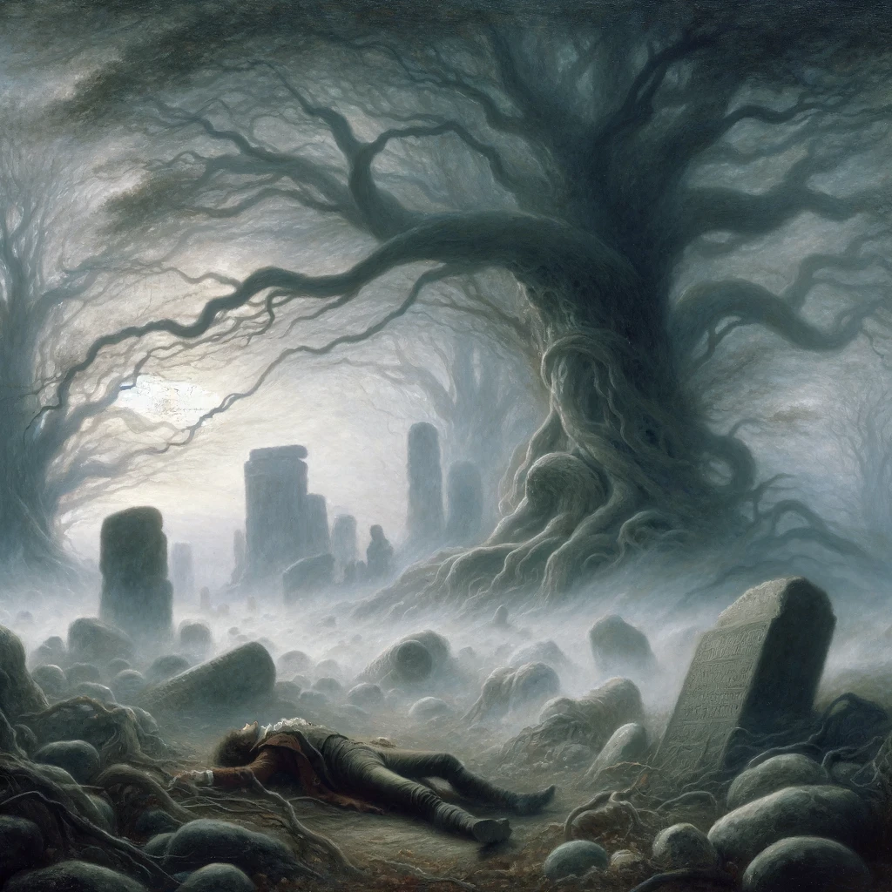
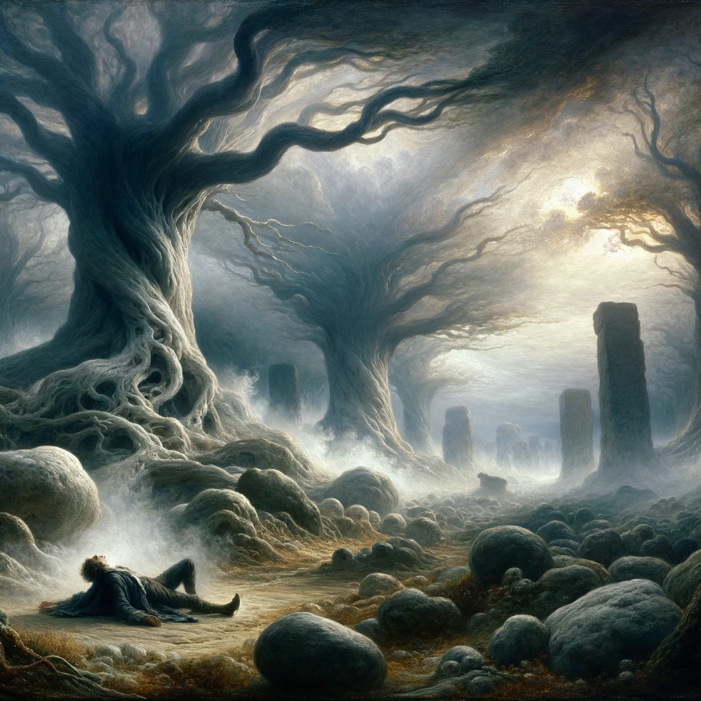
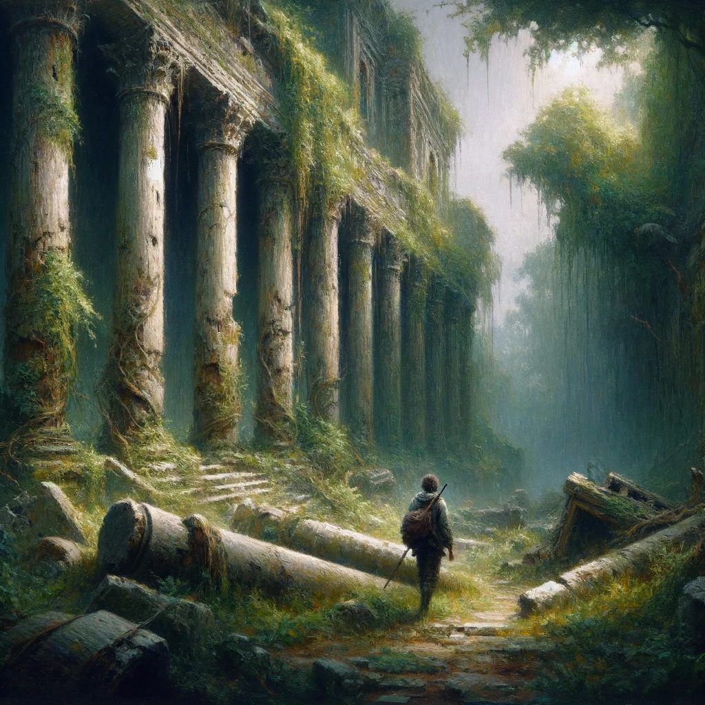
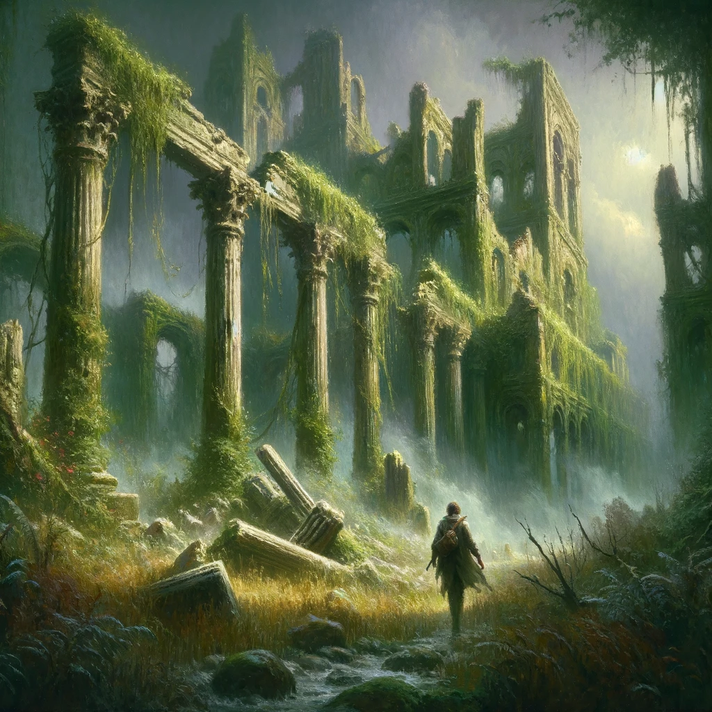
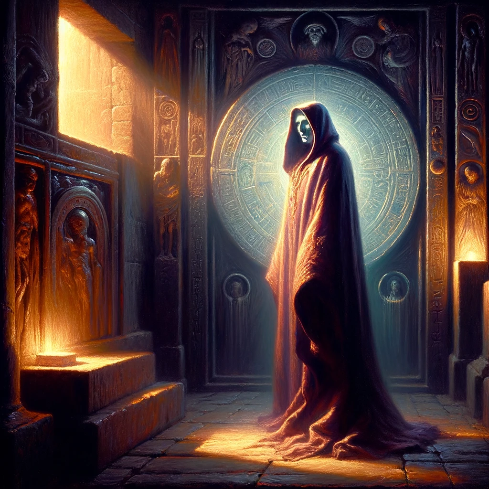
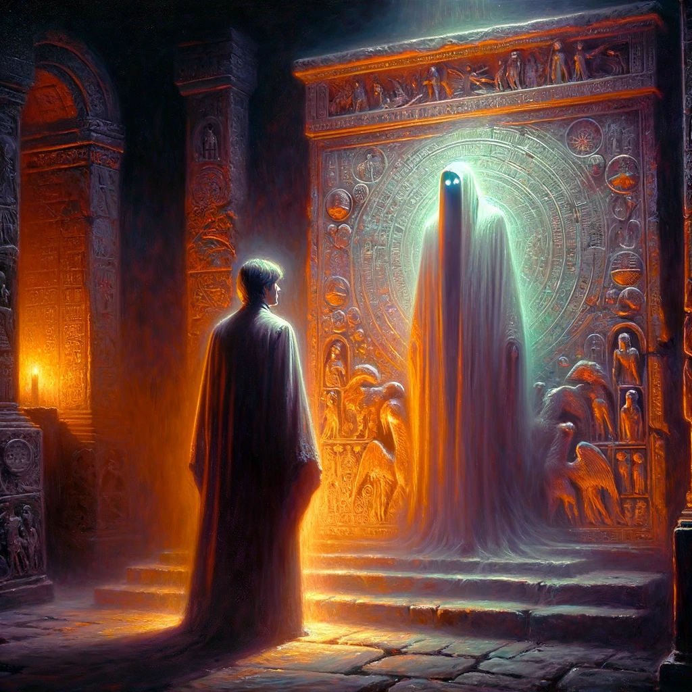
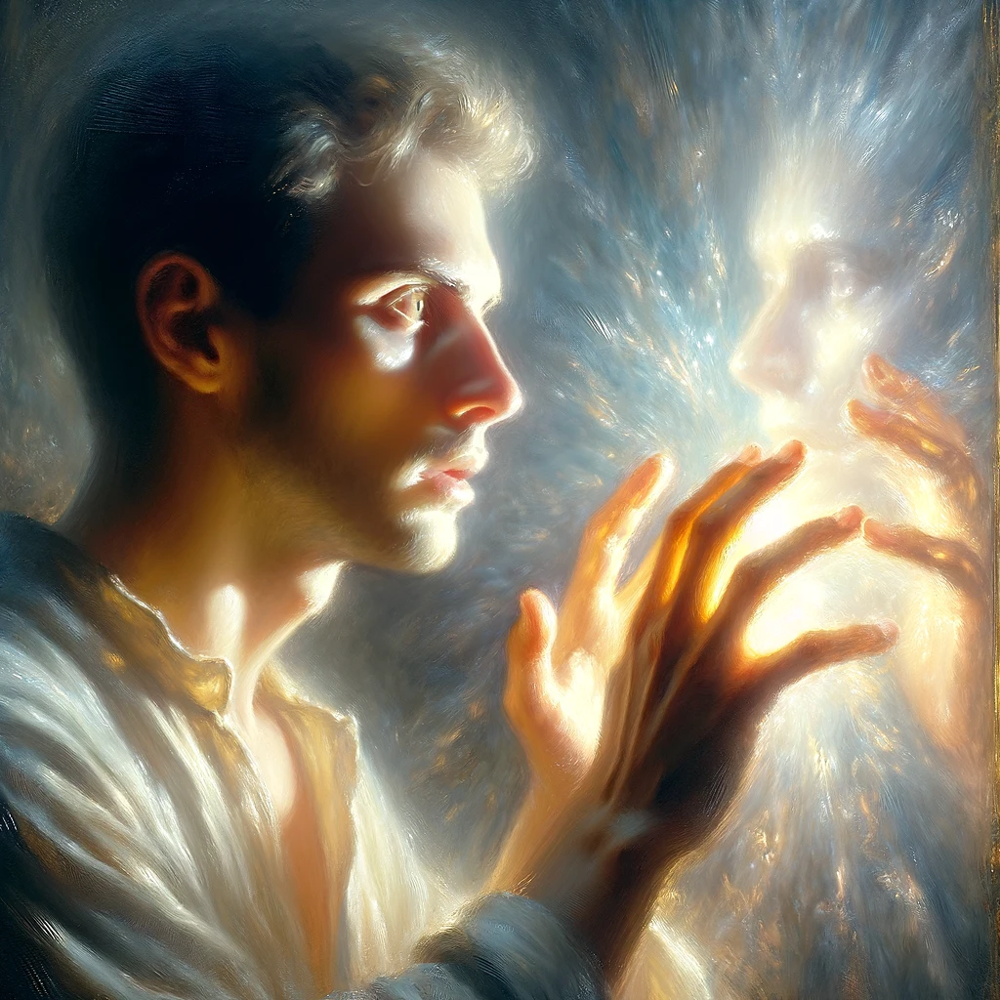
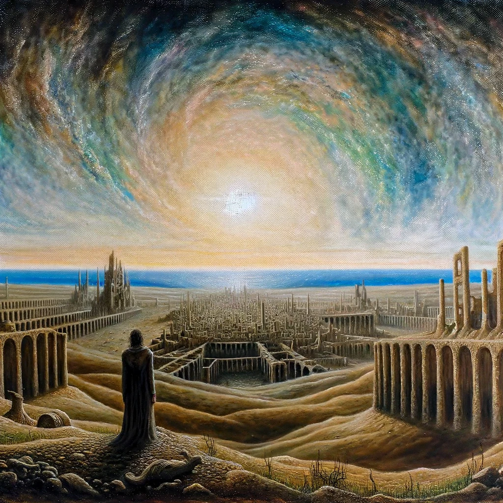

# An Inhabitant of Carcosa

## Story Synopsis

"An Inhabitant of Carcosa" by Ambrose Bierce is a haunting tale that explores themes of time, death, and the cyclical nature of existence through the lens of a mysterious, ancient city called Carcosa. The story unfolds with the protagonist awakening in an unfamiliar, desolate landscape, struggling to recall his identity and how he came to be there. As he wanders through the eerie ruins, marked by strange stones and inscriptions, he slowly realizes the truth of his circumstances—that he is, in fact, a spirit, disconnected from the physical world, pondering the remnants of his past life and the city of Carcosa itself. This realization is punctuated by a chilling encounter with a prophetic figure who speaks of Carcosa in terms that blur the lines between reality and myth, life and death. The narrative masterfully weaves a sense of foreboding and introspection, leaving the reader to ponder the mysteries of Carcosa, the inevitability of death, and the eternal recurrence of all things.

For the cover image that encapsulates the gestalt of "An Inhabitant of Carcosa," I envision a grand, atmospheric composition in the style of Romanticism, executed with oil on canvas to capture the story's ethereal and sublime essence. The image would be a sweeping view of the ancient ruins of Carcosa, shrouded in mist and entwined with the encroaching wilderness, symbolizing the intertwining of life, death, and the passage of time. In the foreground, the protagonist, rendered translucent, gazes upon the city, his form blending into the landscape to represent his spectral existence and the realization of his own mortality. Above the ruins, the sky transforms into a mesmerizing canvas of otherworldly hues, with stars and nebulous formations hinting at the cosmic vastness and the mystical nature of Carcosa. This celestial display illuminates the scene with a soft, ethereal light, casting dramatic shadows and highlighting the textures of stone and foliage. The overall effect is one of haunting beauty, mystery, and the eternal cycle of decay and rebirth, inviting the viewer to ponder the deeper themes of the narrative. This powerful image would stand out as a cover, promising the reader an immersive journey into Bierce's haunting tale.

## Scenes

### Awakening in a Strange Land

The protagonist awakens in an eerie, desolate landscape shrouded in mist. He finds himself lying on the ground, surrounded by unfamiliar, dense foliage and towering, ancient trees. The sky is overcast, casting a dim, surreal light over the scene. In the distance, half-buried stones and monuments hint at a once-great civilization. The protagonist sits up, confusion and fear evident on his face, as he tries to recall his identity and how he arrived in this mysterious place.

The protagonist is depicted lying on the ground, his body partially enshrouded by mist. The landscape around him is rendered with soft, swirling brushstrokes, creating a sense of disorientation and mystery. The ancient trees loom tall and shadowy, their branches twisting into the overcast sky, which is painted in muted grays and blues. The distant stones and monuments are subtly highlighted, suggesting their forgotten significance. The protagonist's expression is one of bewilderment and awe, inviting the viewer to share in his initial disquietude.

### Wandering Among Ruins

The protagonist wanders through the ruins of Carcosa, observing the remnants of its glory. Crumbled structures, broken columns, and faded inscriptions on stone tablets are scattered across the landscape. Vegetation has overtaken much of the city, suggesting it has been abandoned for ages. The protagonist looks around in awe and sorrow, touching the cold stone with a sense of reverence and loss, as if trying to connect with the past that he cannot fully remember.

This scene shows the protagonist meandering through the overgrown ruins of Carcosa. The crumbling architecture is detailed with fine, precise brushwork, contrasting with the wild, untamed vegetation depicted with loose, vibrant strokes of green and brown. The ruins are bathed in a dim, ethereal light, suggesting a connection between the past and the present. The protagonist's body language—hunched shoulders, a hand trailing along a broken column—conveys a profound sense of loss and yearning for understanding.

### Encounter with the Prophetic Figure

Amidst the ruins, the protagonist encounters a mysterious figure draped in tattered robes, their face obscured by a hood. The figure stands before an ancient altar, surrounded by symbols and carvings that seem to glow faintly in the dim light. The figure speaks in a cryptic, echoing voice about the inevitability of death and the eternal nature of Carcosa. The protagonist listens intently, a mix of fear and fascination on his face, as the reality of his own death begins to dawn on him.

The mysterious figure is central to this composition, standing before an ancient altar that glows with an otherworldly light. The figure's robes are painted with deep, saturated colors, hinting at their spectral nature. The surrounding carvings and symbols on the altar are rendered with meticulous attention to detail, glowing softly to draw the eye. The protagonist is positioned slightly off-center, leaning forward in rapt attention, his face a mixture of fear and curiosity. The overall lighting is dramatic, with chiaroscuro techniques emphasizing the contrast between light and shadow, heightening the scene's mysterious atmosphere.

### Realization of His Own Death

In a moment of profound revelation, the protagonist realizes he is no longer among the living. This scene is set in a small clearing, where the protagonist looks down to see his hands become translucent, the landscape visible through them. Around him, the air seems to shimmer with a ghostly light, emphasizing the threshold between the physical world and the realm of spirits. The realization is marked by a mix of terror and acceptance on the protagonist's face, as the ruins of Carcosa loom ominously in the background.

This scene is intimate, focusing closely on the protagonist as he gazes at his translucent hands. The background is blurred, with soft, ghostly hues suggesting the liminal space between life and death. The protagonist's expression captures the moment of realization, a complex blend of horror, acceptance, and transcendence. The use of light is crucial here, with a luminous quality that seems to emanate from within him, highlighting the ethereal nature of his existence.

### The Eternal City of Carcosa

The final scene zooms out to reveal the full, haunting majesty of Carcosa, seen from a high vantage point. The ruins stretch out into the distance, partially reclaimed by nature but still exuding a sense of timeless grandeur. The sky above is a kaleidoscope of eerie colors, suggesting otherworldly forces at play. The protagonist is seen from behind, looking out over the city, now fully accepting his place in the cycle of life, death, and rebirth that Carcosa symbolizes. The scene encapsulates the story's themes of the cyclical nature of existence and the thin veil between the physical world and the beyond.

The final scene is a panoramic view of Carcosa, rendered with a sense of vastness and sublime beauty. The ruins are depicted with a level of detail that invites the viewer to explore their depth and complexity, while the encroaching nature blends seamlessly into the structures, symbolizing the cycle of decay and regrowth. The sky is a tapestry of surreal colors, swirling in patterns that suggest cosmic forces beyond human comprehension. The protagonist is shown from behind, a solitary figure contemplating the eternal city, his posture reflecting resignation and a newfound peace. The scene is imbued with a sense of timelessness, capturing the essence of Carcosa as a place that transcends the mortal realm.

## References

* [An Inhabitant of Carcosa, Wikipedia](https://en.wikipedia.org/wiki/An_Inhabitant_of_Carcosa).
* [Can Such Things Be? by Ambrose Bierce, Project Gutenberg](https://www.gutenberg.org/ebooks/4366).
