# The Colour Out of Space, H. P. Lovecraft

## Summary

"The Colour Out of Space" by H.P. Lovecraft narrates the chilling tale of a rural area near Arkham, Massachusetts, blighted by a mysterious force after a meteorite crashes into the farm of the Gardner family. The meteorite, containing an alien entity or force manifesting as a color beyond the visible spectrum, begins to subtly influence the land, plants, animals, and the Gardners themselves. Initially, it brings a perverse, otherworldly vitality to the farm's flora and fauna, but soon this influence turns malevolent, leading to grotesque mutations, insanity, and death. The story unfolds through the investigation of an unnamed surveyor from Boston, revealing the fate of the Gardners and the spreading blight, culminating in the land's abandonment. The entity, after consuming everything on the farm, eventually returns to the cosmos, leaving behind a desolate, poisoned landscape haunted by its unnatural color, an enduring testament to the unknowable horrors that lie beyond our understanding.

* Style: Chiaroscuro digital painting, employing stark contrasts between light and dark to evoke the eerie and unsettling atmosphere of the story, with a vibrant yet unnatural palette to highlight the alien influence.

The cover image captures the moment of the alien vortex's climax over the devastated Gardner farm, embodying the story's essence of cosmic horror and earthly desolation. In the chiaroscuro digital painting style, the scene is dominated by the swirling, luminous vortex in the sky, its colors vibrant yet unnaturally eerie against the dark, stormy backdrop. Below, the silhouette of the surveyor stands on a rise, overlooking the scene, his posture reflecting despair and awe, serving as the human witness to the incomprehensible. The farmhouse ruins, twisted dead vegetation, and the sinister well are visible in the foreground, starkly lit by the unnatural light from above. This juxtaposition of light and shadow, the natural and the alien, evokes a deep emotional response, highlighting the story's themes of intrusion, transformation, and loss. The composition balances the grandeur of cosmic horror with the intimate tragedy of the Gardner family, making it a compelling visual representation of "The Colour Out of Space."

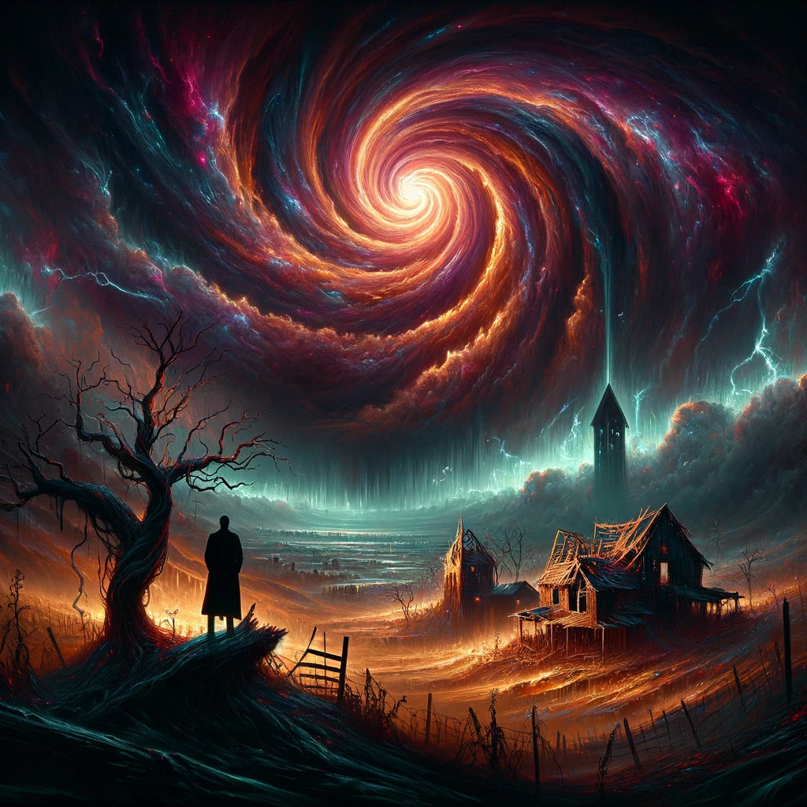

## Scenes

### The Meteorite's Arrival

On a tranquil night in the rural outskirts of Arkham, the Gardner family witnesses a chilling spectacle as a meteorite blazes across the sky, crashing into their farm with a thunderous impact. The crash site reveals an unearthly, smoldering stone embedded in the earth, emitting an eerie glow under the moonlight. The family, along with curious neighbors, gather around the site, their faces bathed in the strange light, mixing wonder and apprehension as they gaze upon the alien object, which seems to pulsate with an inner life.

A meteorite crashes into a farm, casting an eerie glow over the gathered family and neighbors. In chiaroscuro digital painting style, highlight the stark contrast between the dark night and the glowing meteorite impact site. The Gardner family and their neighbors should be depicted with expressions of awe and fear, their faces illuminated by the unnatural light. Objects in the scene include the smoldering meteorite, deeply embedded into the earth, with scattered debris around. The surrounding trees and farmhouse should loom in the background, half-hidden in shadow, emphasizing the intrusion of the unknown into this rural setting.

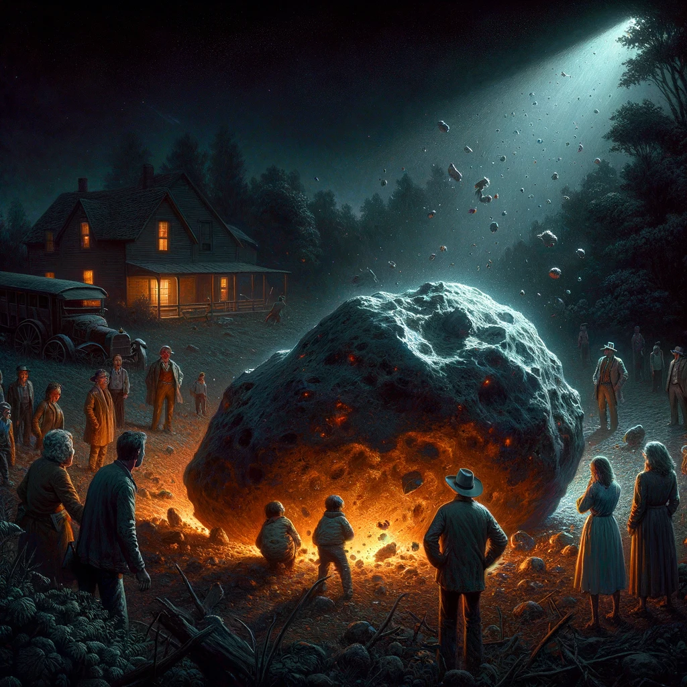
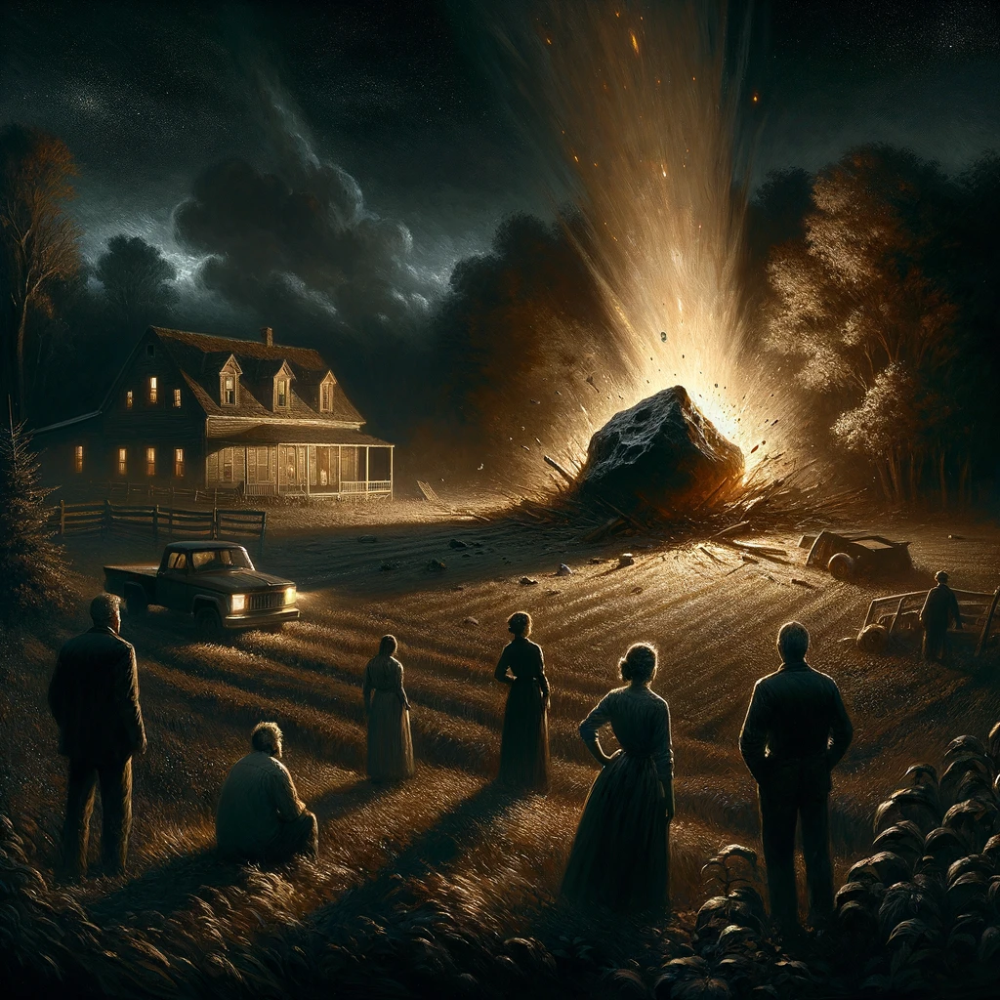

### The Influence Begins

The meteorite's mysterious properties become evident as the surrounding vegetation starts exhibiting bizarre growth patterns, with plants sprouting unnaturally vibrant colors and grotesque shapes, far removed from their natural appearances. The farm's water supply takes on a subtle glow, affecting the health and behavior of the Gardners' livestock, which begin to display unsettling mutations and signs of distress. This scene captures the gradual realization of horror as the family observes their farm transforming into a nightmarish landscape, a once-familiar place now turning against them.

Plants around the farm start showing unnatural growth, under the influence of the meteorite. Employ chiaroscuro digital painting to depict the scene at dusk, with long shadows and a luminous, unsettling hue cast over the farm. Focus on a variety of mutated plants, exhibiting vibrant and unnatural colors that stand out starkly against the darkening surroundings. The Gardners are observing their changing farm with growing concern, their body language reflecting confusion and distress. The farm's well, animals, and a section of the farmhouse should be subtly included to show the creeping spread of the alien influence.

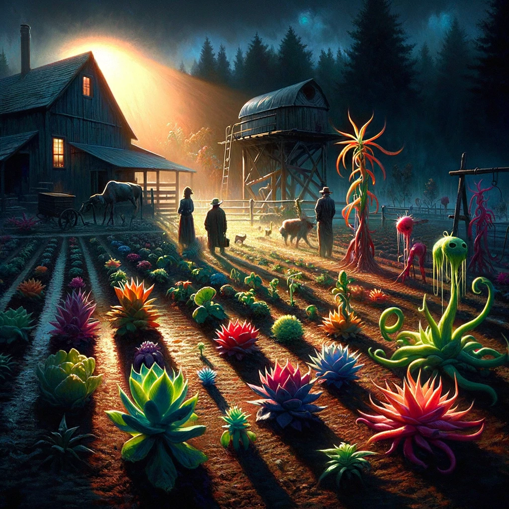
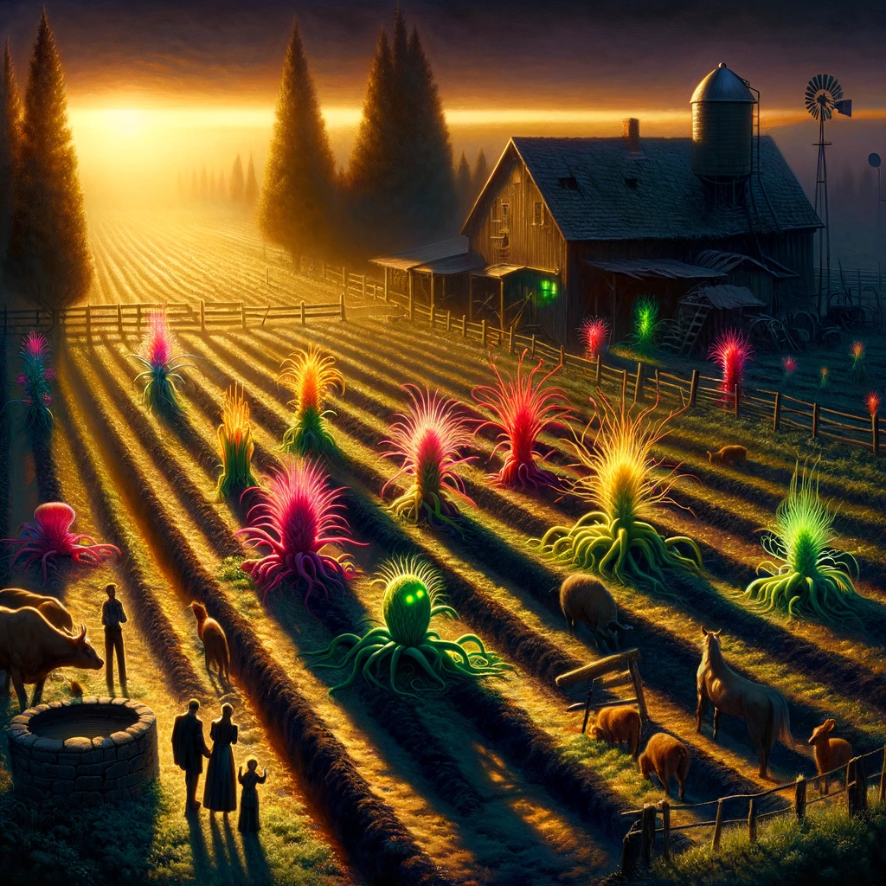

### The Descent into Madness

The influence of the alien presence intensifies, leading to the physical and psychological unraveling of the Gardner family. A scene depicting the interior of their farmhouse at night, with family members showing signs of extreme psychological strain, their faces twisted in terror or confusion as they grapple with the unseen force corrupting their home. The eerie glow permeates through windows, casting long, sinister shadows, while plants and animals outside exhibit further unnatural mutations, underscoring the alien intrusion into the fabric of their lives.

The Gardner family shows signs of psychological strain within their home, under the eerie glow permeating from outside. In the chiaroscuro digital painting style, illuminate the interior scene with harsh contrasts between the darkness of the farmhouse and the strange light filtering through windows, casting long, disturbing shadows. Depict the family members with expressions of horror, madness, and despair. The room should be cluttered with signs of their deteriorating life: neglected meals, overturned furniture, and perhaps a single, distorted plant growing unnaturally inside.

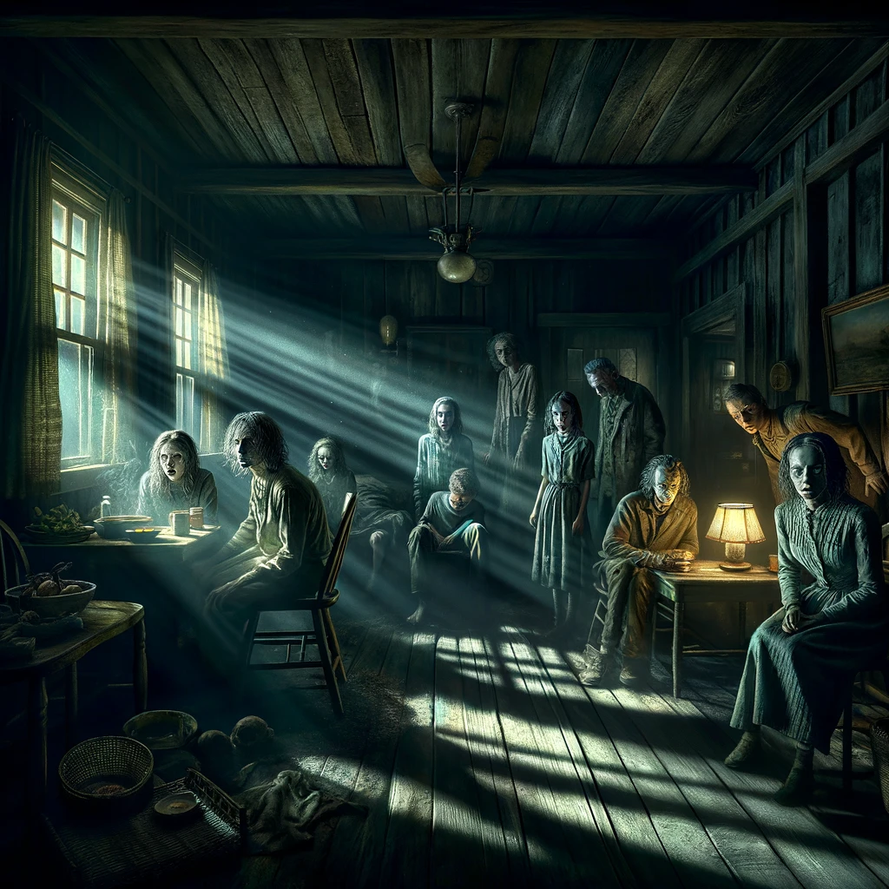
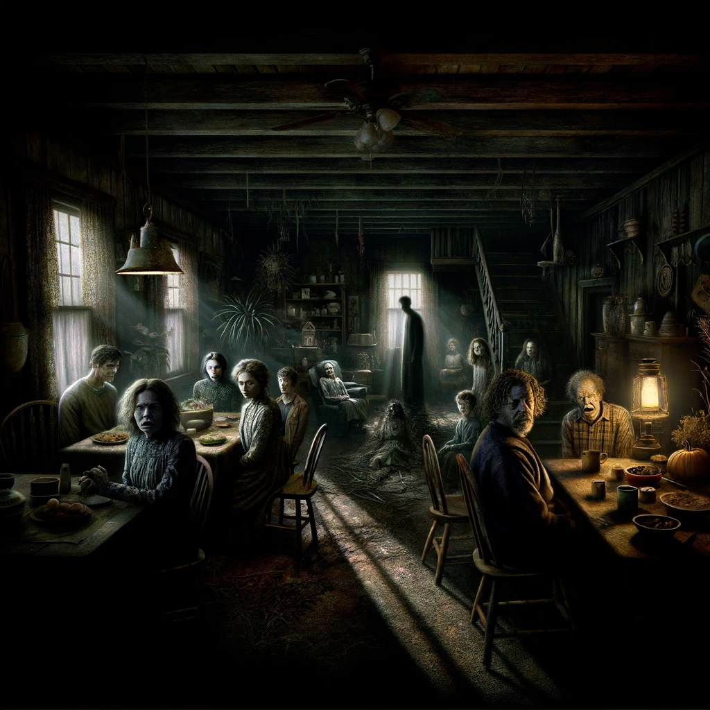

### The Well of Horror

The focal point of the alien entity's influence is the farm's well, now a source of unspeakable terror. A scene capturing one of the family members, lantern in hand, peering into the well's depths, only to recoil in horror at the sight of an indescribable, pulsating color emanating from below. This moment symbolizes the point of no return, as the well, once a life-giving source, becomes a conduit for the alien force, reflecting the inescapable grip it has on the Gardner family and their land.

A family member peers into the glowing well, recoiling in terror. Use chiaroscuro digital painting to emphasize the stark contrast between the pitch-black night and the luminous, otherworldly color emanating from the well. The character's face should be lit with a mix of fascination and horror, highlighting the moment of dreadful realization. Surrounding this scene, the farm should appear neglected and eerie, with deformed plants and shadows that seem to creep towards the well, suggesting it as the source of the corruption.

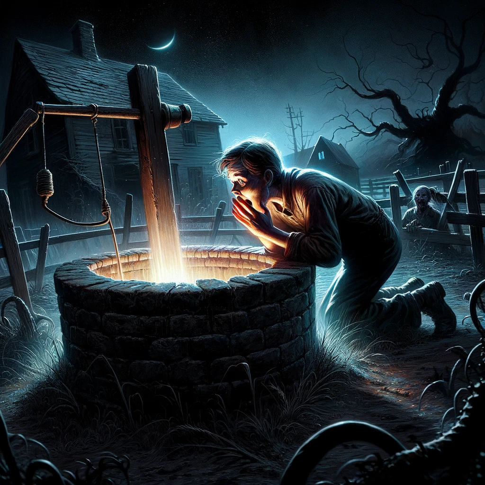
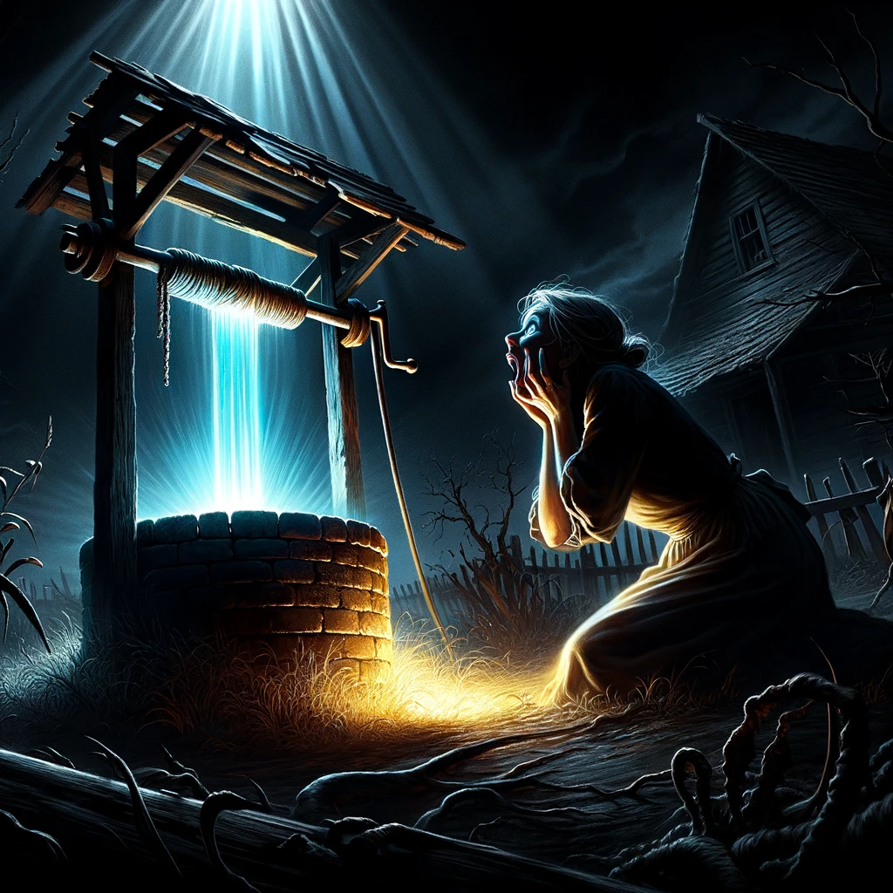

### The Return to the Cosmos

The climax of the story unfolds on a fateful night when the alien presence, having drained the life and sanity from the Gardner family and their surroundings, prepares to depart. A scene depicting a chaotic, swirling vortex of the otherworldly color above the farm, as if the sky itself were being torn open. The remaining members of the Gardner family, along with the devastated landscape around them, are drawn into this cosmic maelstrom, symbolizing the entity's departure and the erasure of their existence. The farm is left a barren, blighted wasteland, with only the surveyor, a distant observer, left to bear witness to the aftermath.

A swirling vortex of unnatural color forms above the farm, drawing in the remnants of the Gardner family and their blighted land. In chiaroscuro digital painting, create a dramatic scene with the vortex as the bright focal point against a dark, tumultuous sky. The Gardner family, what remains of them, should be depicted in the process of being drawn into the vortex, their forms distorted and fading into the color. The devastated farm below contrasts sharply with the vibrant, otherworldly energy of the vortex, underscoring the catastrophic conclusion of the alien influence.

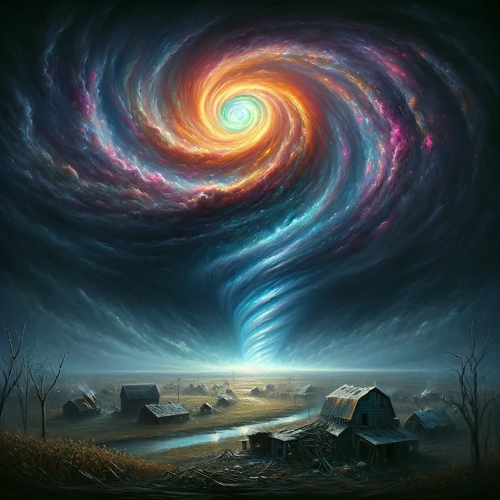
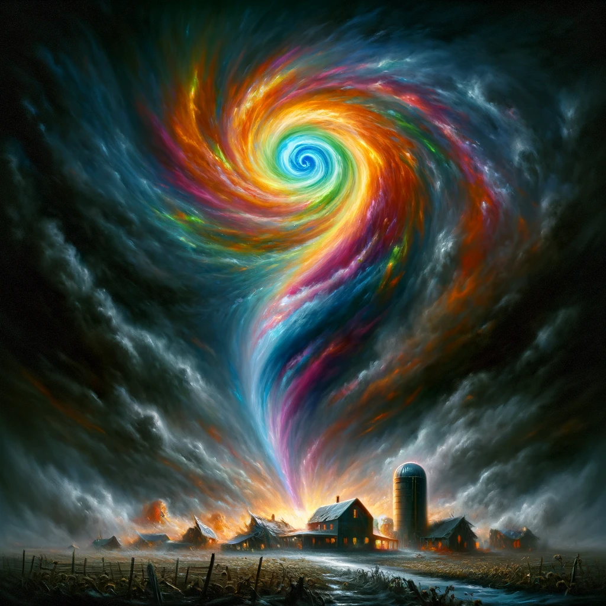

### The Aftermath

The final scene portrays the desolate aftermath, with the surveyor standing on the now-cursed land, overlooking the remnants of the Gardner farm. The landscape is devoid of life, with twisted, color-drained vegetation and the ruins of the farmhouse under a heavy, oppressive sky. The surveyor's expression, a mix of horror and fascination, captures the haunting impact of the tale, as he contemplates the incomprehensible horrors that lie beyond human understanding, leaving the land forever scarred by the alien visitation.

The surveyor stands on the now-desolate land, overlooking the remnants of the Gardner farm under a heavy sky. Utilize chiaroscuro digital painting to depict this scene in muted colors, emphasizing the contrast between the dark, lifeless land and the few bright spots of residual unnatural colors. The surveyor, consistent in appearance with earlier scenes if present, should have an expression of haunted contemplation. The background should include the ruined farmhouse, dead plants, and the ominous well, all contributing to a landscape marked by an inescapable sense of loss and desolation.

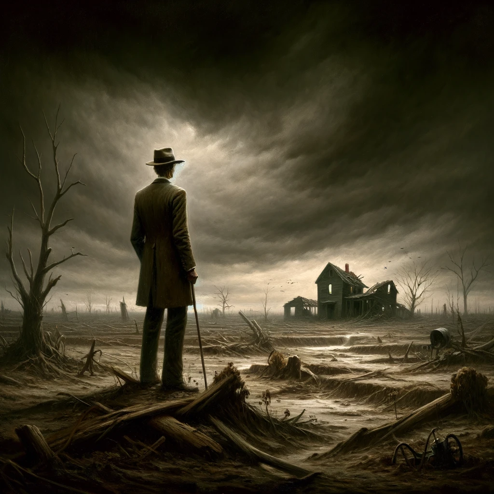
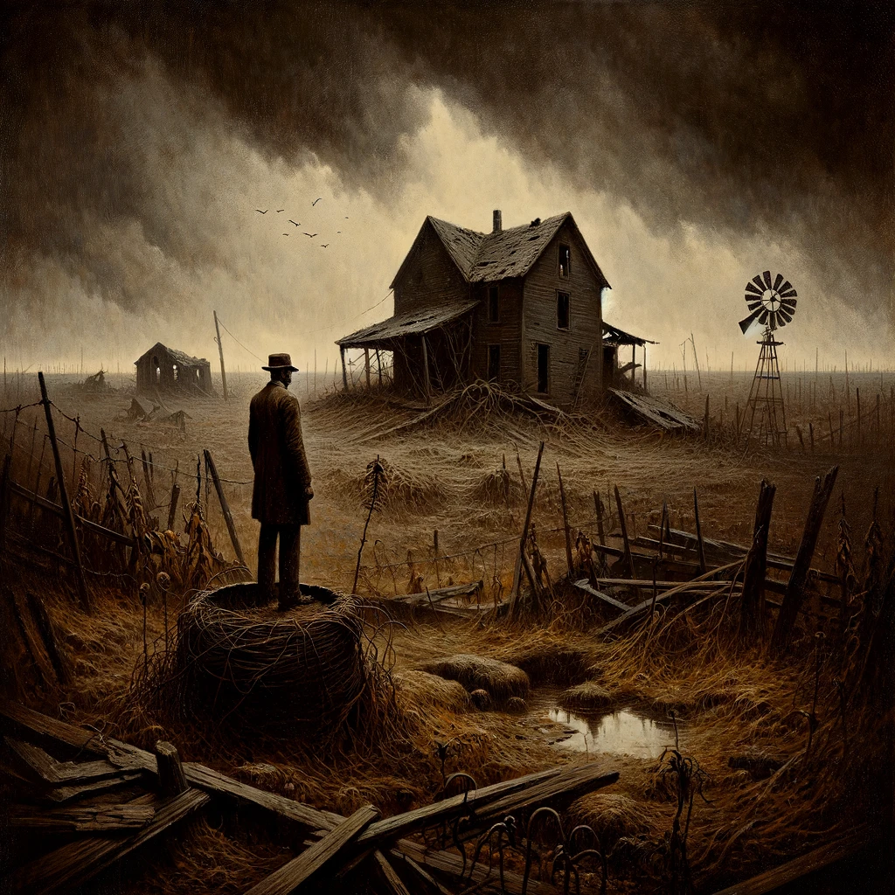

