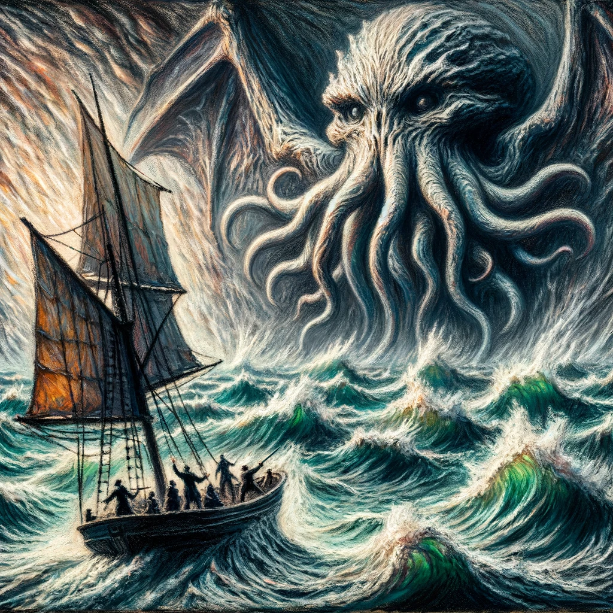

# The Call of Cthulhu, H. P. Lovecraft

## Summary

"The Call of Cthulhu" is a seminal tale of cosmic horror by H. P. Lovecraft, unfolding through the fragmented investigations of Francis Wayland Thurston. The narrative, a chilling patchwork of diary entries, manuscripts, and testimonies, uncovers the reemergence of an ancient, malevolent entity known as Cthulhu. Dwelling in the sunken city of R'lyeh, this monstrous being telepathically haunts the dreams of sensitive individuals worldwide, inciting madness and cultish worship. Thurston's inquiry leads him to a horrifying encounter with the relics of the Cthulhu cult and ultimately to the sunken city itself, where the boundaries between reality and unspeakable terror blur. As Thurston pieces together the puzzle, he realizes the precariousness of humanity's place in the universe, overshadowed by beings far beyond human comprehension, awaiting their moment to reclaim the Earth. The story masterfully intertwines themes of forbidden knowledge, the insignificance of mankind, and the lurking dread of the unknown, leaving readers with a lingering sense of unease about the unfathomable mysteries lying dormant in the dark corners of the world.

* Style: Expressive Symbolism in Oil Pastels

A towering Cthulhu emerges from the swirling chaos of R'lyeh amidst a tumultuous sea, with Francis Wayland Thurston standing defiantly before it, a beacon of humanity's resilience and curiosity. Employing the style of Expressive Symbolism in Oil Pastels, this cover image should capture the epic clash of the human spirit against the incomprehensible might of ancient cosmic horror. Cthulhu, rendered in vibrant, unsettling colors, towers over the scene, its tentacles and alien form sprawling across the canvas, embodying the story's themes of otherworldliness and dread. The sunken city of R'lyeh rises from the sea in the background, its architecture a bizarre fusion of sharp angles and eldritch symbols, contrasting with the chaotic, wave-tossed ocean in dark, moody blues and greens. In the foreground, Thurston is depicted in bold relief, a small yet determined figure, his expression a mix of awe and defiance, highlighting the human element amidst the cosmic terror. His stance and the intensity in his eyes should convey the story's exploration of forbidden knowledge and the indomitable will to face the unknown, making this image a compelling representation of "The Call of Cthulhu."

## Scenes

### 1. The Discovery of Professor Angell’s Box

After the death of his great-uncle, Professor George Gammell Angell, Francis Wayland Thurston uncovers a mysterious locked box among the professor's possessions. Inside, he finds a series of bewildering documents and a bizarre bas-relief depicting a monstrous creature, which sets the stage for his investigation into the unknown. The scene is dimly lit, dominated by the shadowy figure of Thurston poring over the contents of the box in a study filled with ancient tomes and artifacts, the bas-relief casting an ominous shadow on the wall.

Thurston discovers a box containing mysterious artifacts and documents, heralding the start of his investigation. In the style of Expressive Symbolism using Oil Pastels, this scene should feature Thurston in his late 30s, with a look of intense curiosity and slight apprehension. He's surrounded by a richly detailed, dimly lit study, the colors vibrant yet shadowy to create a mood of foreboding. The box, slightly open, glows subtly, illuminating parts of Thurston's face and the surrounding ancient tomes and artifacts with an eerie light. The bas-relief should appear almost alive, its depiction of Cthulhu rendered in unsettling, swirling patterns that contrast with the sharp, angular lines of the box and room.

### 2. The Tale of the Cthulhu Cult

Thurston reads about Inspector Legrasse's encounter with a sinister cult in the swamps of Louisiana in 1908. This scene is set in a fog-enshrouded, moonlit swamp where hooded figures surround a grotesque statue of Cthulhu, engaged in unholy rites. Legrasse and his men, depicted with expressions of horror and disbelief, are on the verge of interrupting this macabre ceremony. The atmosphere is charged with tension, the air filled with the eerie chants of the cultists.

In a moonlit swamp, hooded figures surround a grotesque statue of Cthulhu in a sinister ritual. This scene, rendered in Expressive Symbolism with Oil Pastels, should be charged with a vibrant, unsettling energy. The moon casts a surreal, luminous glow over the scene, making the swamp water glisten and the shadows deeper. The cultists, depicted with exaggerated, elongated forms, should appear almost part of the swamp itself—melding into the twisted vegetation. The statue should be a focal point, its texture rough and imposing, standing in stark contrast to the soft, fluid shapes of the surrounding fog and mist.

### 3. The Nightmare Manuscript

The narrative shifts to the account of Henry Anthony Wilcox, a young artist who becomes tormented by visions of R'lyeh and Cthulhu while in a feverish state. The scene is Wilcox's cluttered studio, where he frantically sculpts a likeness of the creature from his nightmares under the influence of a sinister, unseen force. The room is chaotic, with sketches and sculptures of otherworldly landscapes and creatures strewn about, and Wilcox's face is a mask of fevered inspiration mixed with terror.

Wilcox, tormented by visions, creates a sculpture of Cthulhu. This scene requires a chaotic studio setting, with Wilcox in the center, his expression a mix of inspiration and horror. Using Expressive Symbolism in Oil Pastels, the artist should emphasize the clash between the ordinary elements of the studio (easel, art supplies) and the extraordinary, otherworldly nature of Wilcox's sculpture and sketches. Vibrant, discordant colors can highlight the surreal nature of his work, with the sculpture of Cthulhu rendered in disturbingly vivid detail, contrasting sharply against the more muted, uneasy colors of the surrounding room.

### 4. The Sinking of the Emma

A vivid recounting of the sailors aboard the Emma encountering a risen R'lyeh after a violent storm, culminating in their disastrous encounter with Cthulhu itself. The scene is a tumultuous ocean with the cyclopean ruins of R'lyeh emerging from the sea, shrouded in mist and strange lights. The sailors, faces etched with fear, gaze upon the awakening Cthulhu, a towering, tentacled monstrosity, as their ship is drawn inexorably toward the nightmare city.

Sailors encounter the risen R'lyeh and Cthulhu amidst a tumultuous ocean. Depict this scene with a focus on the monumental scale of R'lyeh and Cthulhu against the tiny, fragile Emma. In the style of Expressive Symbolism with Oil Pastels, use swirling, dynamic strokes to convey the chaos of the ocean and the alien geometry of R'lyeh. Cthulhu should emerge from the depths with a menacing presence, its tentacles and form depicted with a mixture of sharp angles and flowing curves to signify its otherworldliness. The sailors’ faces should be marked by fear and awe, their forms rendered in stark contrast to the enormity of the scene.

### 5. The Escape from R'lyeh

The sole survivor of the Emma, Gustaf Johansen, describes his and a shipmate's harrowing escape from Cthulhu and the sinking city. The moment of escape is depicted with their small boat frantically maneuvering through chaotic waters, dwarfed by the immense figure of Cthulhu reaching out from the whirlpool that engulfs R'lyeh. The sky above is a maelstrom of unnatural colors, reflecting the pandemonium of their escape.

The survivors' desperate escape from Cthulhu and the sinking city. This scene should capture the frenetic energy of their escape, with the small boat caught in a whirlpool-like sea, dwarfed by the massive figure of Cthulhu reaching out. Employing Expressive Symbolism in Oil Pastels, the composition should contrast the violent, chaotic movements of the water and sky with the desperate, focused efforts of the survivors. The colors should be intense and dramatic, highlighting the otherworldly storm and the dark, menacing form of Cthulhu, with the survivors depicted in vivid detail to emphasize their humanity amidst the chaos.

### 6. Thurston’s Realization and Warning

The final scene captures Thurston's dawning realization of the horror that lies in wait and his decision to continue his great-uncle's work despite the danger. This is conveyed through Thurston, looking weary yet determined, sitting at his desk surrounded by his research into the Cthulhu mythos. The room is dark, save for the lamp illuminating his work, casting long shadows that seem to whisper of the unspeakable truths he has uncovered. Outside the window, a storm brews, symbolizing the impending doom that may be unleashed upon the world.

Thurston, determined yet weary, realizes the horror that may be unleashed upon the world. Portray Thurston seated at his desk, surrounded by his research into the Cthulhu mythos, in a room that is both a sanctuary and a prison. Using Expressive Symbolism in Oil Pastels, the scene should be imbued with a mix of dark, ominous colors and patches of intense light from the lamp and storm outside. The shadows in the room could subtly echo the forms of the creatures and symbols Thurston has been studying, suggesting their pervasive influence. Thurston's face should convey a complex mix of resolve, fear, and weariness, with the same consistent features as previously described, making him a beacon of humanity amidst the encroaching darkness.

