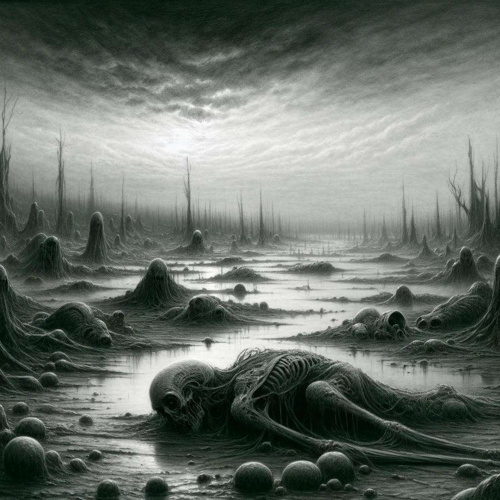
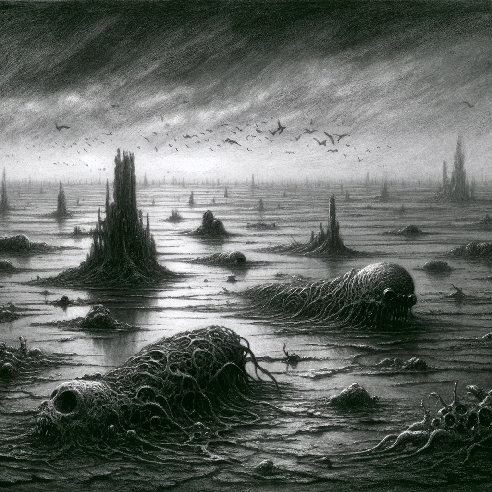
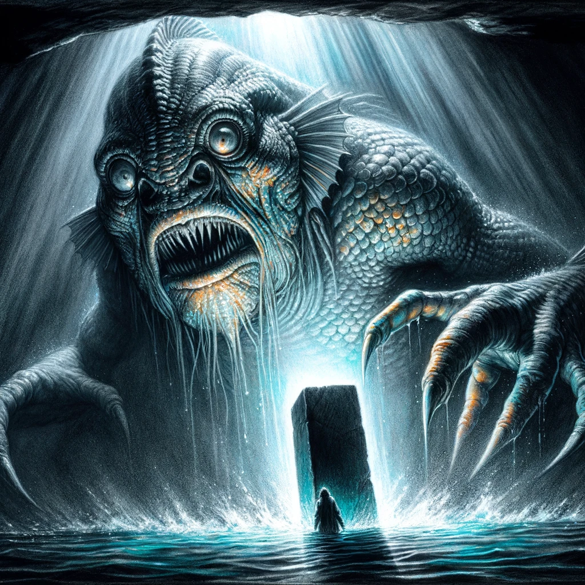

# Dagon

## Story Synopsis

In "Dagon," H.P. Lovecraft crafts a harrowing narrative of a World War I veteran's encounter with the incomprehensible after drifting at sea and finding himself on a grotesque and barren island. Emerging from the depths of a vast and inexplicable oceanic pit, this island, more a nightmare landscape of mud and decay, is scattered with the remains of monstrous sea creatures beyond the realm of known biology. The protagonist, driven by an insatiable curiosity and an impending sense of doom, discovers an ancient monolith adorned with cryptic hieroglyphs that hint at a civilization worshipping the titular deity, Dagon, a god of the deep. His encounter with a colossal, fish-like creature, presumably Dagon itself, at the monolith plunges him into the depths of terror and madness. Upon his escape and return to civilization, the protagonist is haunted by his memories and a paralyzing fear of the sea, suggesting that the horrors he witnessed are but a glimpse of the ancient and unfathomable forces lurking beneath the surface of our world, leading him to a chilling and desperate conclusion.

For the cover image of H.P. Lovecraft's "Dagon," envision a hauntingly divided scene that captures the essence of cosmic horror and human insignificance. The top half showcases a tumultuous sea under a stormy sky, where a small, fragile lifeboat struggles against the vast, dark expanse of the ocean, rendered in deep blues, grays, and swirling charcoals. This stark depiction of isolation and vulnerability sets the stage, with the protagonist visible in the boat, a tiny figure engulfed by the enormity of the sea, symbolizing his initial helplessness and the story's bleak outset.

Beneath this turbulent surface, the scene transforms into a chilling underwater realm where the ancient monolith stands amidst dark depths, surrounded by shadowy, monstrous sea creatures and dominated by the imposing figure of Dagon. The monolith, highlighted with ominous reds and blacks, draws the viewer's eye, symbolizing the protagonist's descent into madness and the allure of the unknown. This underwater half, with its surreal depiction of Dagon and the hieroglyph-covered monolith, contrasts with the storm above, capturing the story's themes of discovery, horror, and the profound depth of the unknown that lies beyond the edge of human understanding.

## Scenes

To visually depict the main beats of H.P. Lovecraft's "Dagon" in a series of scenes, here are detailed descriptions for each scene, suitable for an illustrator to use as a guide:

### Adrift at Sea

The protagonist, a World War I veteran, is adrift in a small, rickety lifeboat, surrounded by an endless expanse of ominous, grey ocean under a cloud-covered sky. His face is haggard, showing signs of distress and fatigue, as he peers into the distance, searching for any sign of salvation. The vastness of the sea and his isolation are palpable.

Utilize deep, swirling charcoals to create a tumultuous sea under a heavy, oppressive sky, conveying a sense of endless desolation. The protagonist's lifeboat, a fragile speck in the vastness, is detailed with fine ink lines, highlighting its insignificance. The man's expression, sketched with sharp, angular lines, reveals his despair and isolation. The mood is one of foreboding, with dark grays and muted blues dominating, punctuated by the stark whiteness of the boat and figure to draw the eye.

### Awakening on the Island

The scene shows the protagonist waking up on a strange, desolate landscape that stretches to the horizon, a flat expanse of black, mire-like mud littered with the decaying corpses of bizarre, unidentifiable sea creatures under a bleak sky. He stands up, disoriented, looking around in horror and fascination at the alien environment.

This scene is rendered in stark contrast, with the black mud and decaying sea creatures almost blending into one morass, against which the protagonist stands out in sharp relief. The landscape is barren, with exaggerated, elongated shadows cast by the low, ominous sky, colored in subdued watercolor washes of gray and pale green, suggesting decay and desolation. The creatures are depicted with a surreal, almost grotesque level of detail, emphasizing their alien nature.

### Discovery of the Monolith

In the distance, a massive stone monolith rises starkly against the desolate backdrop. The protagonist approaches it, a look of awe and fear on his face. The monolith is covered in strange hieroglyphs and bas-reliefs depicting monstrous, fish-like creatures bowing to an immense figure, presumably Dagon. The scene captures his realization of stumbling upon something ancient and unnatural.

The monolith towers over the scene, its surface etched with deep, dark lines to depict the cryptic hieroglyphs and monstrous bas-reliefs. The protagonist is smaller in scale, his body language a mix of awe and fear, detailed with precise, sharp lines. The background is minimalistic, focusing the viewer's attention on the interaction between man and monolith. A subtle, ominous red, achieved through watercolor, highlights the monolith and the hieroglyphs, suggesting a malevolent presence.

### The Encounter

A terrifying moment as the protagonist hides and witnesses the appearance of a gigantic, fish-like deity emerging from the sea to worship at the monolith. The creature is colossal, with scales, bulging eyes, and webbed feet, embodying the essence of an ancient, underwater god. The protagonist's face is a mask of sheer terror, peeking from his hiding spot.

Dramatic lighting is key, with the creature emerging from a backdrop of deep, dark blues and blacks, illuminated by a sinister, pale light that seems to emanate from the monolith itself. The creature's scales glisten with touches of iridescent watercolor, adding a lifelike quality. The protagonist's hidden position and terror-stricken face are detailed in the foreground, with sharp contrasts between light and shadow accentuating his fear.

### Mad Dash for Escape

A frenetic scene of the protagonist running back to his lifeboat, glancing fearfully over his shoulder. The landscape seems even more alien and menacing as he flees, with the sky turning darker, adding a sense of urgency and desperation to his escape from the nightmare island.

Capture the protagonist's frantic movement with blurred lines and a dynamic, unstable perspective, emphasizing his desperate flight. The environment around him is rendered with swirling, chaotic strokes, mirroring his mental state. The sky above turns a darker shade, with stormy watercolors enhancing the sense of impending doom.

### Return to Civilization

The protagonist, now safe but irreparably changed, sits in a dimly lit room, his face gaunt and eyes haunted as he writes down his account. The room is filled with nautical maps and a few personal belongings, suggesting a retreat from the world. His expression is one of deep trauma, hinting at the mental scars left by his experience.

The room is cloaked in shadows, with the only light source highlighting the protagonist's face and the manuscript before him. The mood is somber, with deep shadows carved in charcoal to create a sense of confinement and isolation. The maps and personal items are rendered with meticulous detail, suggesting a life forever altered by unseen horrors.

### Haunted by Visions

A dark, psychological scene where the protagonist is tormented by visions of the sea deity and the monolith, perhaps in dreams or hallucinations. Shadowy figures and symbols from the monolith seem to merge with the fabric of his reality, blurring the lines between madness and the monstrous truth he uncovered.

This scene blends the real with the surreal, using distorted perspectives and shadowy figures that merge with the room's architecture. The protagonist's haunted expression is the focal point, surrounded by ethereal, watery forms of the monolith and sea creatures that seem to invade the space, rendered in a ghostly palette of watercolors, blurring the lines between his madness and reality.

### The Final Desperation

The protagonist, overwhelmed by his memories and fearing the pull of the sea, makes a grim decision. The scene is intensely personal, with the protagonist alone, perhaps with a pen in hand and a final note on the table, as he contemplates ending his torment. The room's window shows a glimpse of the sea or a storm, symbolizing the inescapable nature of his dread.

The composition is intimate, with the protagonist portrayed in a tight, close-up frame, the weight of his decision etched into his features. The window shows a tumultuous sea or storm, rendered with expressive, sweeping strokes. The mood is one of tragic finality, with a palette limited to somber tones, except for a faint, unsettling red hinting at the protagonist's impending action.

## Reference

* [Dagon (short story), Wikipedia](https://en.wikipedia.org/wiki/Dagon_(short_story)).
* [Dagon Complete Text, The H. P. Lovecraft Archive](https://www.hplovecraft.com/writings/texts/fiction/d.aspx)

