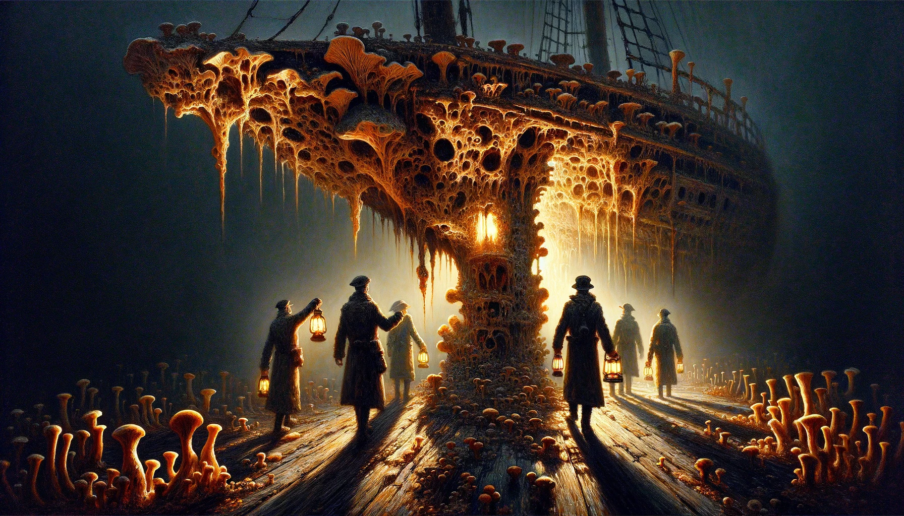
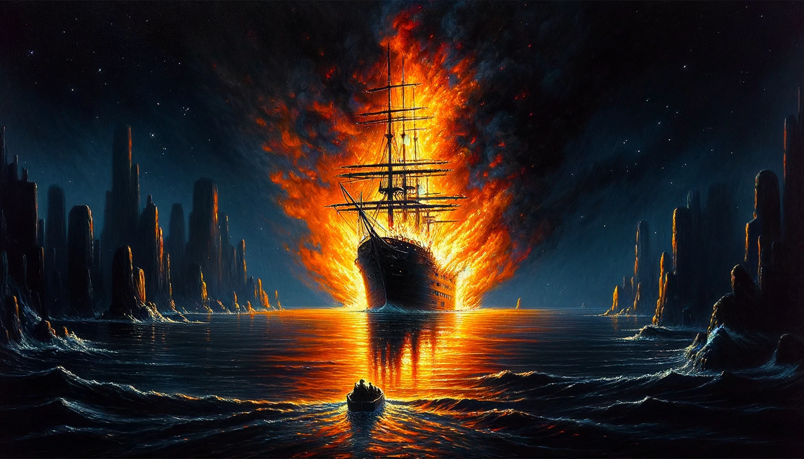

# The Derelict, William Hope Hodgson

## Summary

"The Derelict," penned by William Hope Hodgson, unfurls the eerie tale of a forsaken ship discovered adrift by the crew of the Mortzestus. As they embark on a quest to explore the abandoned vessel, they are ensnared in an atmosphere thick with uncanny dread and mystery. The narrative masterfully weaves a chilling account of how the derelict, once a vessel brimming with life, became a breeding ground for a malevolent, life-like fungus that consumes anything in its path, including the ship's former crew. Through gripping descriptions and a suspenseful plot, Hodgson delves into themes of isolation, the unfathomable forces of nature, and the thin line between the animate and inanimate, leaving readers to ponder the terrifying possibilities that lie in the uncharted waters of the natural world.

* Style: Expressive chiaroscuro in oil paints, blending the vivid contrasts of light and shadow to amplify the eerie, foreboding atmosphere of the narrative.

A haunting depiction of the derelict ship engulfed in flames against a dark, tumultuous sea, as shadowy figures on the Mortzestus watch in horror and relief. In the expressive chiaroscuro style with oil paints, the cover image should capture the dramatic contrast between the fiery inferno of the derelict and the dark, foreboding sea and sky. The flames should be painted with vibrant hues of orange, red, and yellow, casting a sinister glow that illuminates the Mortzestus and its crew in the foreground, their faces a mix of horror, fascination, and relief as they witness the destruction of the unspeakable horror they've escaped. The sea should be depicted as tumultuous and reflective, mirroring the flames and the dark silhouette of the Mortzestus, adding a sense of movement and escape. The sky, filled with swirling clouds, should blend into the darkness of the sea, framing the scene with a sense of impending doom and the unknown, making this image a powerful, emotional representation of the story's themes of horror, mystery, and survival against unfathomable odds.

## Scenes

### The Discovery of the Derelict

The crew of the Mortzestus stumbles upon a mysterious, abandoned ship adrift in the calm sea under a foggy, ominous sky. The scene is set in the early hours of the morning, with the sun barely piercing the thick fog, casting an eerie light over the derelict ship. The Mortzestus looms in the foreground, its crew peering curiously and anxiously at the ghostly vessel that bears no signs of life, its sails tattered and the hull covered in a strange, thick growth.

A ghostly ship emerges from the fog, observed by a curious and anxious crew. In expressive chiaroscuro with oil paints, capture the contrast between the dimly lit derelict and the slightly brighter Mortzestus, using the play of light and shadow to highlight the eerie calm of the sea and the ominous fog enveloping both ships. The derelict should appear as a spectral silhouette, with its sails tattered and hull ominously enveloped in shadow, hinting at the thick, unnatural growth covering it. The crew of the Mortzestus should be depicted with faces reflecting a mix of curiosity and fear, their bodies leaning forward from their ship's deck, straining to pierce the fog's veil.

### Boarding the Derelict

A small party from the Mortzestus, equipped with lanterns and tools, boards the derelict ship. The deck is eerily quiet, covered in a dense, sponge-like fungus that squelches underfoot. The explorers move cautiously, their lights casting long shadows as they inspect the abandoned wheel and scattered remnants of the ship's once bustling life. The air is thick with a musty, unsettling odor, and the ship creaks ominously under the weight of its uninvited guests.

The exploration party cautiously steps onto the fungus-covered deck of the derelict. Utilize expressive chiaroscuro in oil paints to dramatize the stark contrast of their lantern light against the all-consuming darkness of the ship. The fungal growth should appear almost luminous in the lantern light, with intricate textures that suggest a sinister, almost sentient presence. The explorers, consistent in appearance from the first scene, should be portrayed with heightened expressions of caution and horror, their bodies tensed and lanterns held high, casting long, dramatic shadows that merge with the ship's own.

### The Growth-Encased Interior

Venturing below deck, the party discovers the ship's interior overwhelmed by the grotesque fungal growth, which has consumed furniture, tools, and any trace of the crew. The fungus appears almost sentient, pulsing and reacting to the intruders' presence. The lantern light reveals a claustrophobic, labyrinthine network of fungal walls, with personal belongings and skeletal remains entombed within, hinting at the crew's desperate, final moments.

Inside the ship, the explorers find a world overtaken by fungus. Applying expressive chiaroscuro in oil paints, focus on creating a suffocating, claustrophobic atmosphere with the fungal growths pulsing in the periphery of the lantern's glow. The interior should be a labyrinth of fungal walls, with personal belongings and skeletal remains partially visible, entombed within the growth. The explorers' faces, illuminated harshly by their lanterns, should register horror and fascination, as they navigate the grotesque, living maze, their shadows intermingling with the textures of the fungus.

### The Realization of the Fungus' Nature

Amidst the decaying chaos, the explorers find the ship's log and piece together the horrifying truth: the fungus is not only consuming the ship but was able to animate and hunt the crew, growing from their remains. This revelation occurs in the ship's dimly lit cabin, where the party, surrounded by encroaching fungal growths, reads the log entries, their faces illuminated by lantern light, horror and realization dawning on them.

In the ship's cabin, the horror of the fungus' capabilities is revealed. The scene, rendered in expressive chiaroscuro with oil paints, should focus on the explorers gathered around the ship's log, their faces a mix of terror and disbelief in the glow of their lantern. The cabin around them is encroached upon by the fungal growth, which seems to lean inwards, accentuating the moment of dreadful realization. The log, prominent in the composition, acts as the focal point, with the explorers' shadowed faces and the encroaching, almost sentient fungus enveloping them in darkness, emphasizing the claustrophobic terror.

### The Escape and the Derelict's Demise

The final scene depicts the frantic escape of the Mortzestus crew back to their ship, as the realization that the fungus could pose a threat to them as well takes hold. The Mortzestus is seen sailing away at full speed from the derelict, which is now fully engulfed in flames - a desperate measure taken by the crew to ensure the fungus does not spread. The burning ship is a lone inferno on the open sea, under a dark, starless sky, symbolizing the obliteration of an unspeakable horror that was never meant to reach the shores of mankind.

The final scene is a dramatic escape from the burning derelict. In expressive chiaroscuro with oil paints, depict the Mortzestus sailing away under a dark, starless sky, the sea reflecting the fire consuming the derelict ship. The flames should be rendered with vibrant oranges and reds, stark against the surrounding darkness, illuminating the faces of the escaping crew with a mix of relief and horror. The burning ship, a lone inferno on the water, symbolizes a final, desperate measure against the unspeakable horror, its reflection in the water a path the Mortzestus must navigate away from, into the safety of darkness.

