# The Thing on the Doorstep, H. P. Lovecraft

## Summary

"The Thing on the Doorstep" by H.P. Lovecraft is a chilling narrative that intertwines themes of forbidden knowledge, occult practices, and the dissolution of self. It tells the story of Daniel Upton, who recounts his experiences with his friend Edward Derby, a man fascinated by the arcane and macabre. Edward's life takes a dark turn following his marriage to Asenath Waite, a mysterious woman deeply involved in the occult and rumored to possess the ability to transfer her consciousness into others' bodies. As Edward's personality begins to change in alarming ways, Daniel grows increasingly concerned about the influence Asenath has over him. The story culminates in a horrifying revelation when Daniel, driven to the brink by the unnatural events surrounding Edward and Asenath, takes drastic action to end the cycle of possession and identity theft. However, even as he believes he has put an end to the terror, Daniel is haunted by a final, dreadful encounter that suggests the horror is far from over. The narrative masterfully explores the terror of losing one's identity and the lengths to which one might go to reclaim it, all while delving into the dark corners of the human psyche and the unseen world beyond.

* Style: Employing the intricate and shadowy allure of Chiaroscuro in oil, accentuated with unsettling hues of desaturated greens and purples, to evoke a sense of creeping dread and otherworldly mystery.

The cover image embodies the essence of "The Thing on the Doorstep," featuring Daniel standing at the threshold of a foreboding, ancient door that opens into darkness, with the twisted silhouette of the true form of Asenath looming behind him, all under a tempestuous sky. Employing Chiaroscuro in oil with desaturated greens and purples, this composition captures Daniel at the moment of confrontation, his figure illuminated by a lantern he holds, casting long shadows that merge with the darkness beyond the door. The ancient door, detailed with eldritch carvings and symbols, stands slightly ajar, suggesting the unknown horror that lies beyond. The silhouette behind Daniel, a blend of human and otherworldly features, represents the story's central horror, its form almost merging with the stormy sky above, where lightning streaks illuminate the scene. The emotional power of the image is heightened by the stark contrast between the small beacon of light in Daniel's hand and the overwhelming darkness that surrounds him, encapsulating the themes of forbidden knowledge, the supernatural, and the fight against an unseen horror.

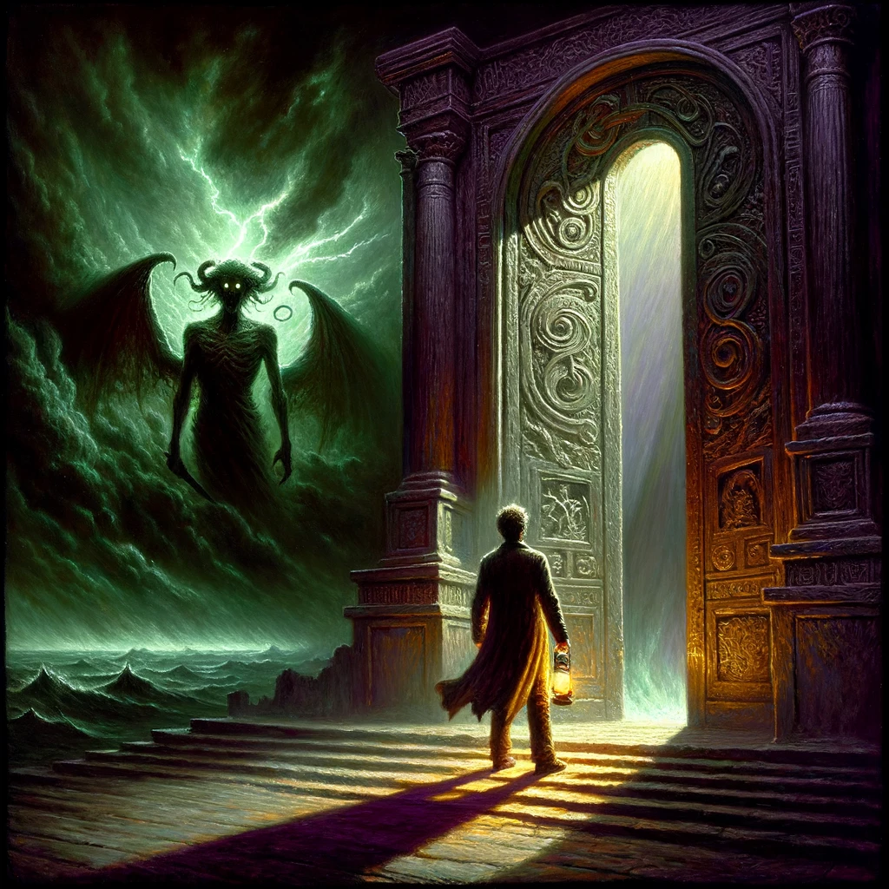
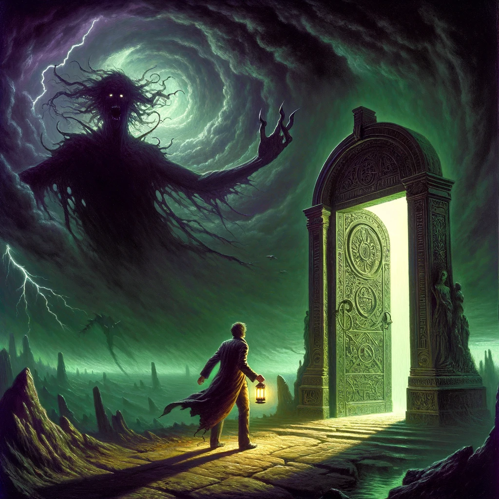

## Scenes

### Introduction to Edward and Asenath

In a dimly lit, cluttered study filled with ancient tomes and arcane symbols, Edward Derby, a young, scholarly man with an air of nervous excitement, introduces his friend, Daniel Upton, to his new wife, Asenath Waite. Asenath, with her unnervingly penetrating gaze and an aura of power, stands amidst the shadows, her face half-illuminated by candlelight, suggesting a sinister connection to the occult. The room's atmosphere is thick with unspoken secrets, and the tension is palpable as Daniel observes the couple, feeling an instinctual dread about Asenath's influence over Edward.

Edward Derby introduces Daniel Upton to his wife, Asenath, among ancient occult artifacts. The composition focuses on a dimly lit study filled with shadowy corners and illuminated primarily by the flickering light of candles, creating a strong contrast between light and dark using Chiaroscuro in oil. Edward, a young man with a look of naive enthusiasm, stands slightly in the shadow, whereas Asenath, cloaked in dark, flowing garments, is partially lit, her eyes capturing a sinister gleam. Objects such as ancient tomes, arcane symbols etched into objects, and a palpable tension between the characters should be emphasized, with desaturated greens and purples adding a sense of unease and otherworldliness. Daniel, depicted with a look of cautious intrigue, serves as the observer and is consistent in appearance across scenes, embodying the role of the narrator.

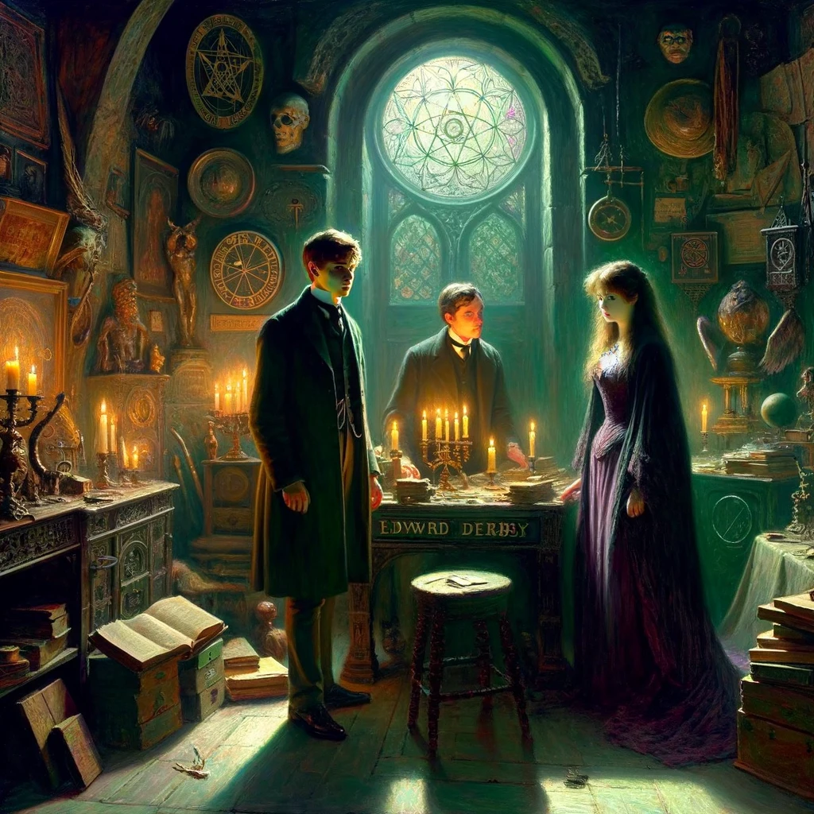
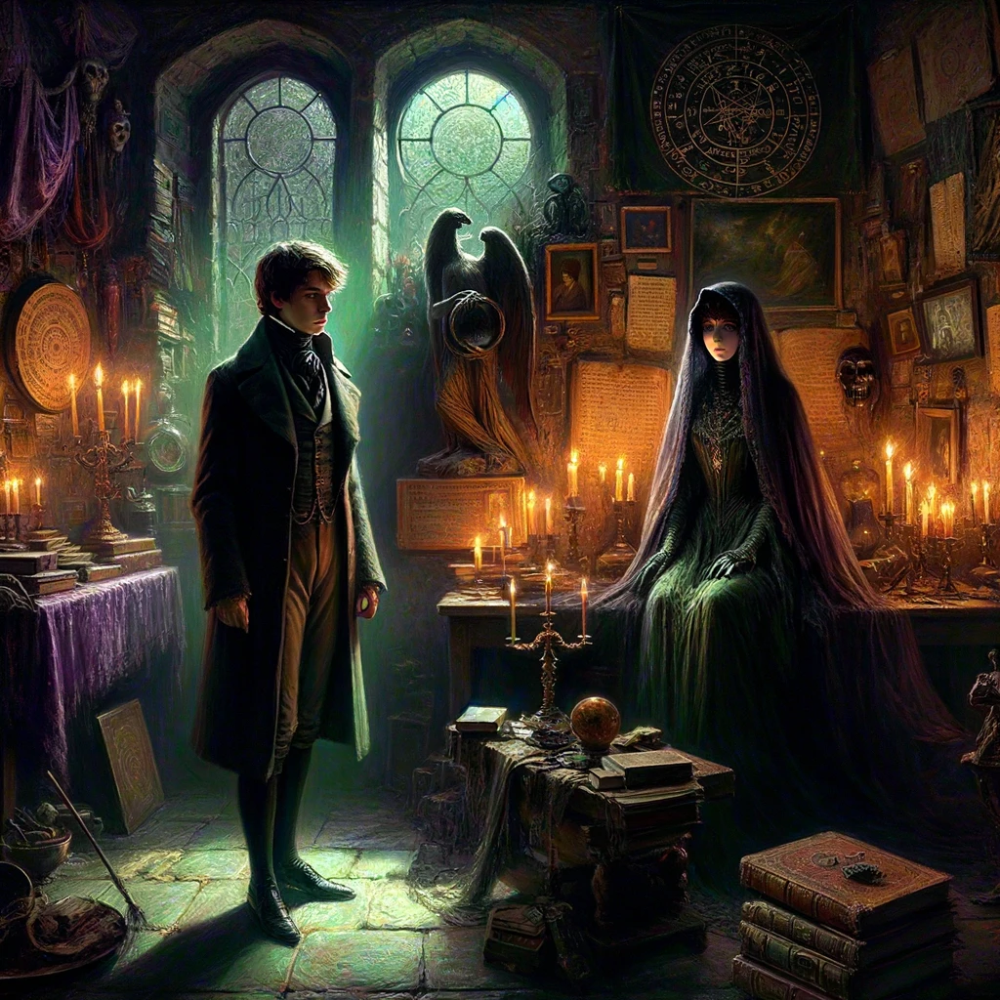

### Asenath's Control Over Edward

In a vivid nightmare or vision, we see Edward Derby, now looking worn and visibly aged beyond his years, trapped in his own body, screaming silently for help. Asenath's figure looms over him, her eyes glowing with an unnatural light as she performs a ritualistic dance, surrounded by arcane symbols and chanting in an ancient language. This scene symbolizes Asenath's control over Edward, her spirit and consciousness dominating his, showcasing her dark powers and the horror of being imprisoned within one's own flesh.

Edward is shown trapped within himself, under Asenath's control during a ritual. The scene is rendered with Edward in the foreground, his expression one of horror and helplessness, contrasting sharply with the dominating figure of Asenath behind him. Her eyes glow with an otherworldly light, and she is surrounded by arcane symbols and dark, ethereal forms that suggest a dance or ritual movement. The use of Chiaroscuro in oil accentuates the play of light and shadow, highlighting Asenath's control and Edward's despair. The surroundings are filled with ominous shadows and sparse light, focusing on the emotional and psychological torment with a palette dominated by dark purples and greens, adding to the scene's nightmarish quality.

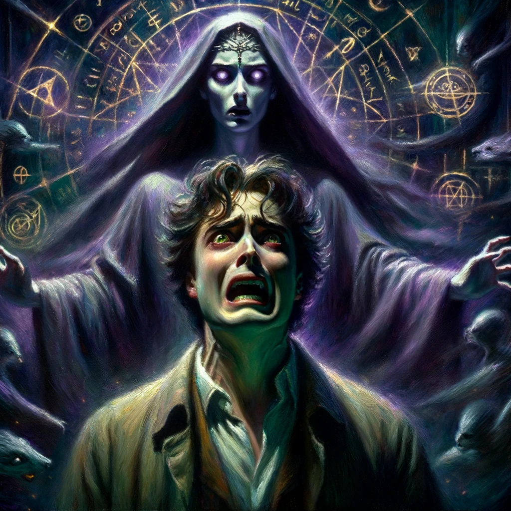
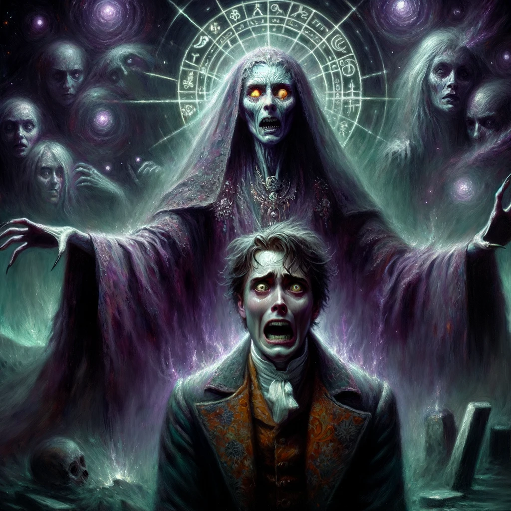

### Daniel's Discovery

A scene in a shadowy, neglected graveyard where Daniel Upton, flashlight in hand, uncovers evidence of body-swapping rituals and necromancy. The ground is freshly disturbed, with arcane symbols etched around the graves, suggesting recent, unholy ceremonies. Daniel's face reflects horror and determination as he pieces together the true nature of Asenath's hold over Edward and the depths of her dark arts, realizing the grave implications of his discoveries.

Daniel discovers evidence of necromancy in a graveyard. This scene is set in a neglected graveyard under the cloak of night, with Daniel holding a flashlight that casts harsh shadows and illuminates the freshly disturbed graves and arcane symbols. The use of Chiaroscuro in oil is key here, creating a dramatic contrast between the beam of light and the enveloping darkness, emphasizing the eerie atmosphere. Desaturated greens and purples paint the scene with an otherworldly glow, suggesting the supernatural elements at play. Details such as disturbed soil, ancient gravestones, and ominous symbols are depicted with precision, heightening the horror of the discovery.

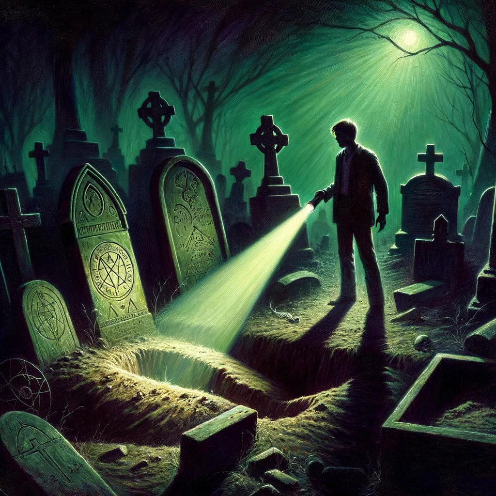
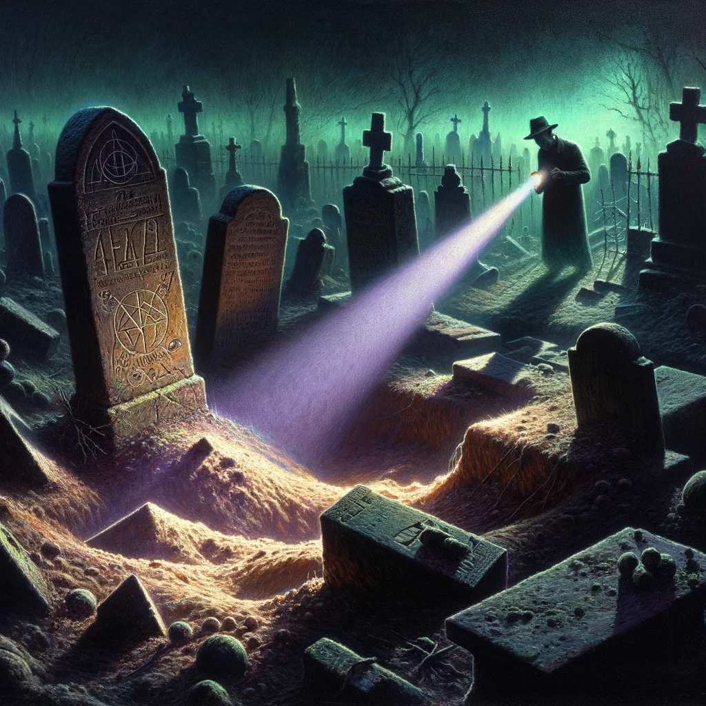

### The Confrontation

In a stark, moonlit room, Daniel confronts Asenath (who is now in control of Edward's body) about her nefarious practices. The tension is electric as Daniel, armed with knowledge and resolve, faces what looks like his friend Edward, whose expressions flicker between Asenath's cold malevolence and Edward's desperate pleas for help. The scene is charged with emotional turmoil and the horror of facing a loved one's body that no longer houses their soul, highlighting the theme of identity theft and the violation of one's self.

Daniel confronts Asenath, who is in control of Edward's body, in a moonlit room. The scene is set in a sparse, moonlit room where Daniel, armed with knowledge and resolve, faces Asenath in Edward's body. The composition uses Chiaroscuro in oil to create stark contrasts between the moonlight streaming through a window and the deep shadows within the room. Asenath/Edward is illuminated in such a way that their face is split between Edward's desperation and Asenath's malevolence, using desaturated green and purple to highlight their unnatural union. Daniel, consistent in appearance, stands resolute yet visibly shaken, holding a symbol of his resolve (perhaps a book or artifact). The emotional tension is palpable, with every shadow hinting at the unseen horror of identity theft.

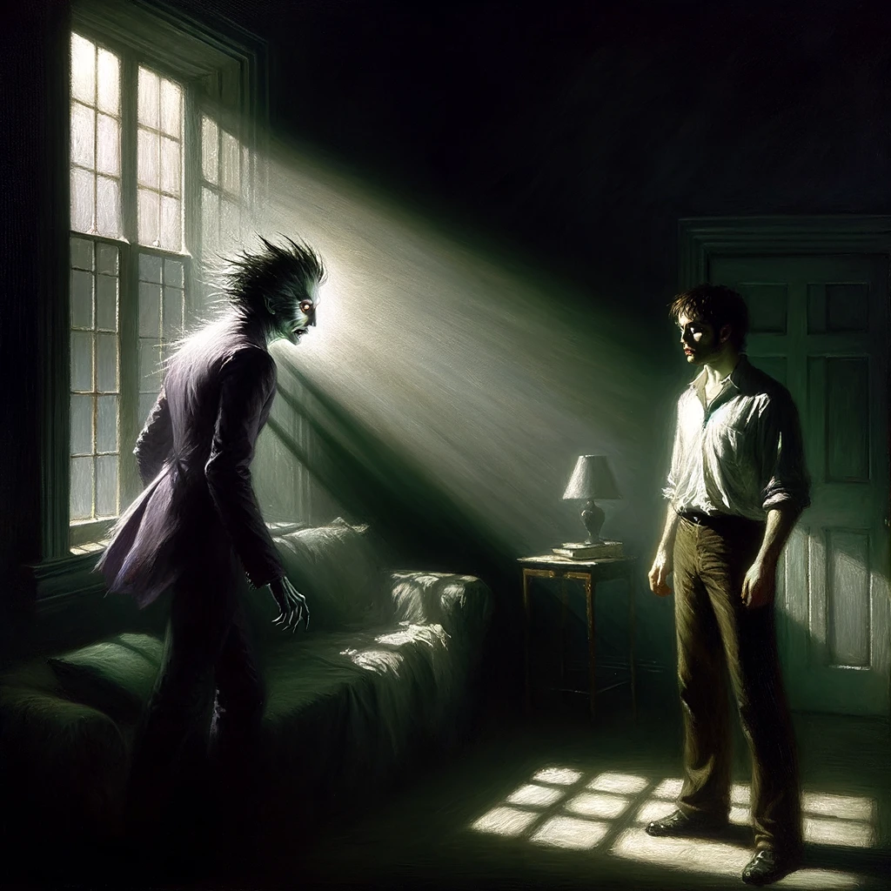
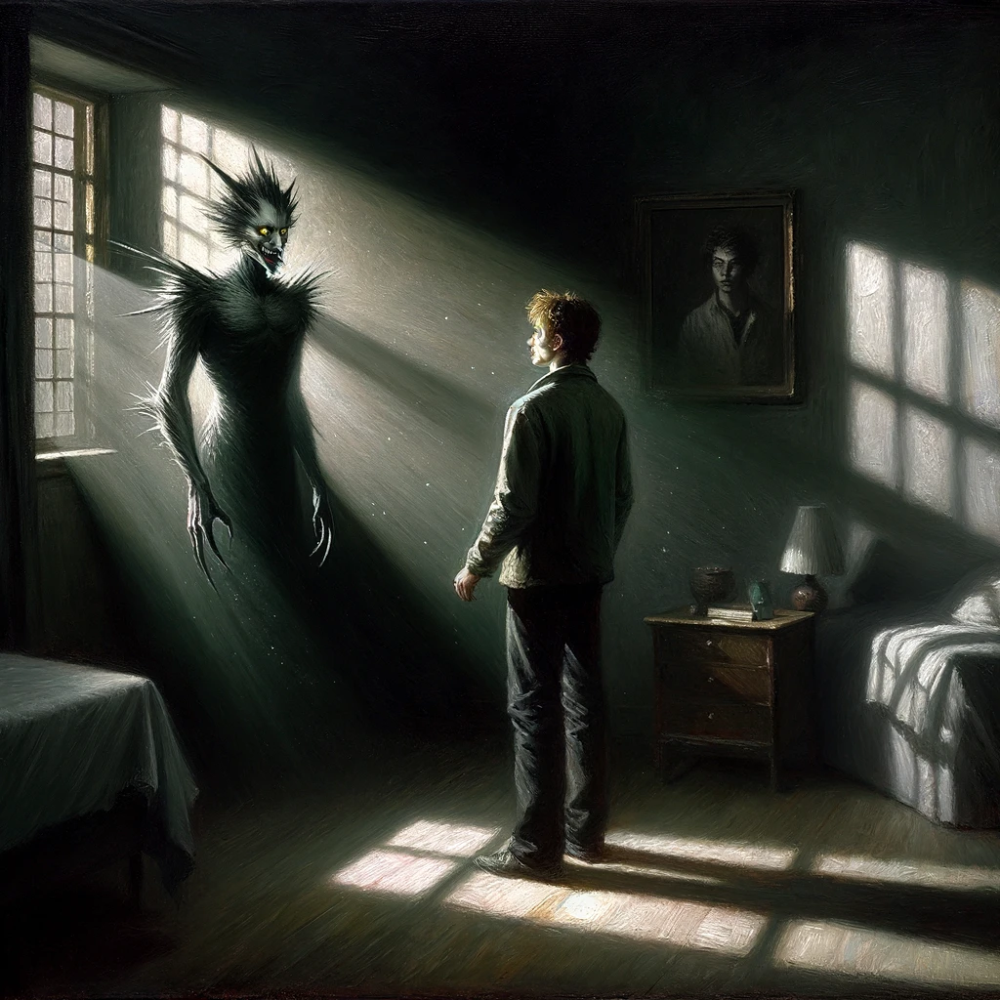

### The Final Act

On a stormy night, outside a decrepit, ancient house that once belonged to Asenath, Daniel, looking determined and haunted, prepares to end the cycle of possession and save Edward. Armed with a revolver and arcane knowledge, he approaches the house, lightning illuminating his path. The house seems alive, with windows like watching eyes and the wind howling through its cracks, as if protesting Daniel's intentions. This scene is the culmination of Daniel's resolve to confront the supernatural horror head-on, regardless of the personal cost.

Daniel prepares to confront the supernatural horror at Asenath's ancient house on a stormy night. The scene depicts Daniel, lantern in hand, approaching the decrepit house amid a raging storm, with lightning illuminating the scene in dramatic flashes. The Chiaroscuro technique is employed to emphasize the stark contrast between the fleeting light and the oppressive darkness of the night and the looming house. The house itself is characterized by windows that resemble watching eyes and architecture that seems to twist unnaturally, as if alive. Daniel's determination is visible in his posture and expression, set against a backdrop of desaturated greens and purples that add a sense of dread. The scene is charged with anticipation and the foreboding sense of a final showdown.

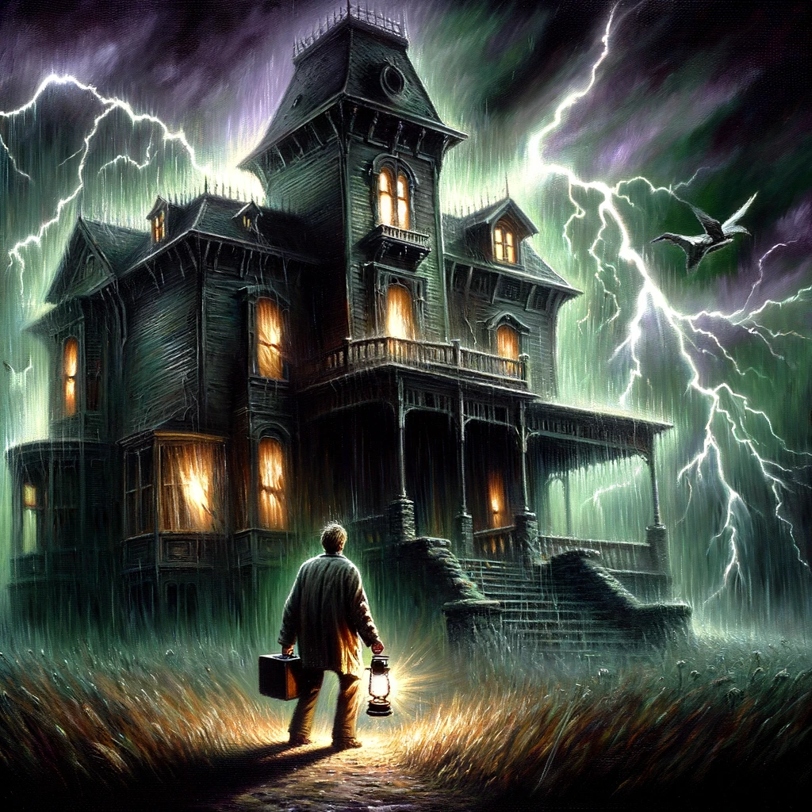
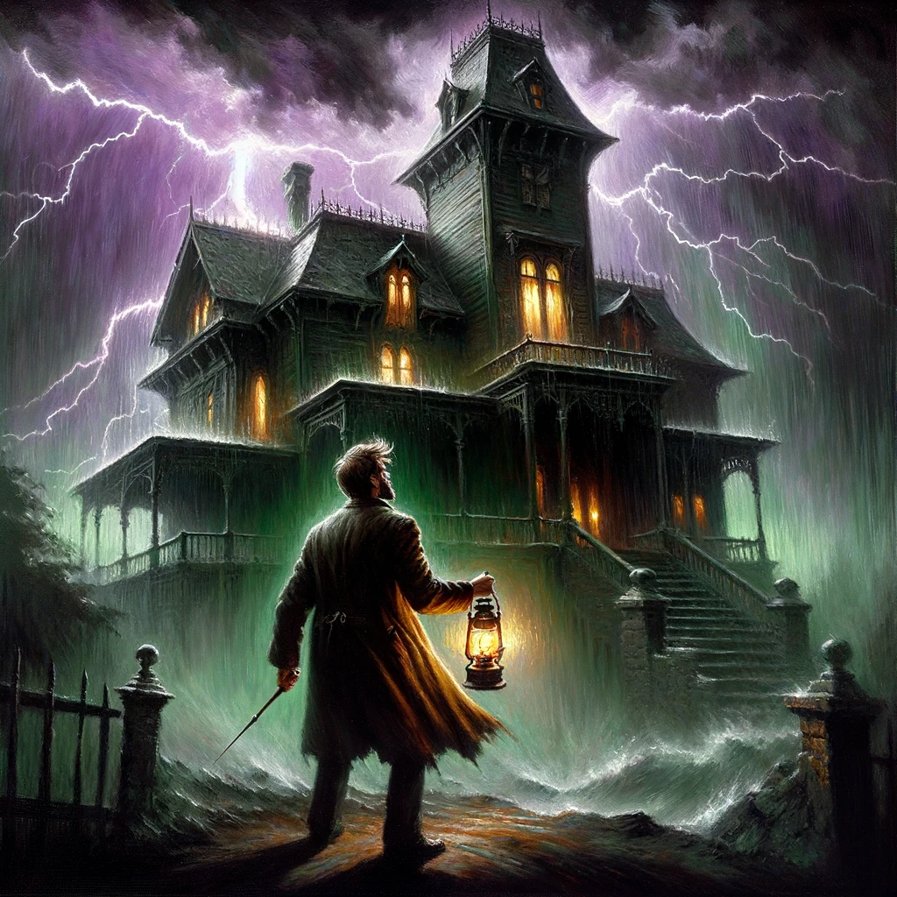

### The Horrific Revelation

The aftermath of the confrontation reveals a grotesque scene where Daniel, in shock, witnesses the true form of the entity that had been masquerading as Asenath, now lying defeated. The creature is a horrifying amalgamation of human and otherworldly features, its body twisted and malformed, suggesting it was never human to begin with. This revelation, under the flickering light of a lantern, showcases the horror of the unknown and the alien entities lurking beneath the façade of humanity, a chilling end to the cycle of horror that had ensnared Edward and Daniel.

Daniel witnesses the true form of the entity behind Asenath, defeated and grotesque. In this climactic scene, Daniel, illuminated by the flickering light of a lantern, stands aghast at the sight of the creature's true form. The creature, a horrifying blend of human and unearthly features, lies twisted and malformed, its defeat evident in its posture. Utilizing Chiaroscuro in oil, the artist should create a stark contrast between the light cast by Daniel's lantern and the surrounding darkness, emphasizing the grotesqueness of the creature and the horror of the revelation. The desaturated greens and purples serve to underscore the otherworldliness of the entity and the culmination of the supernatural horror, with every detail of the creature's form rendered to evoke revulsion and fear.

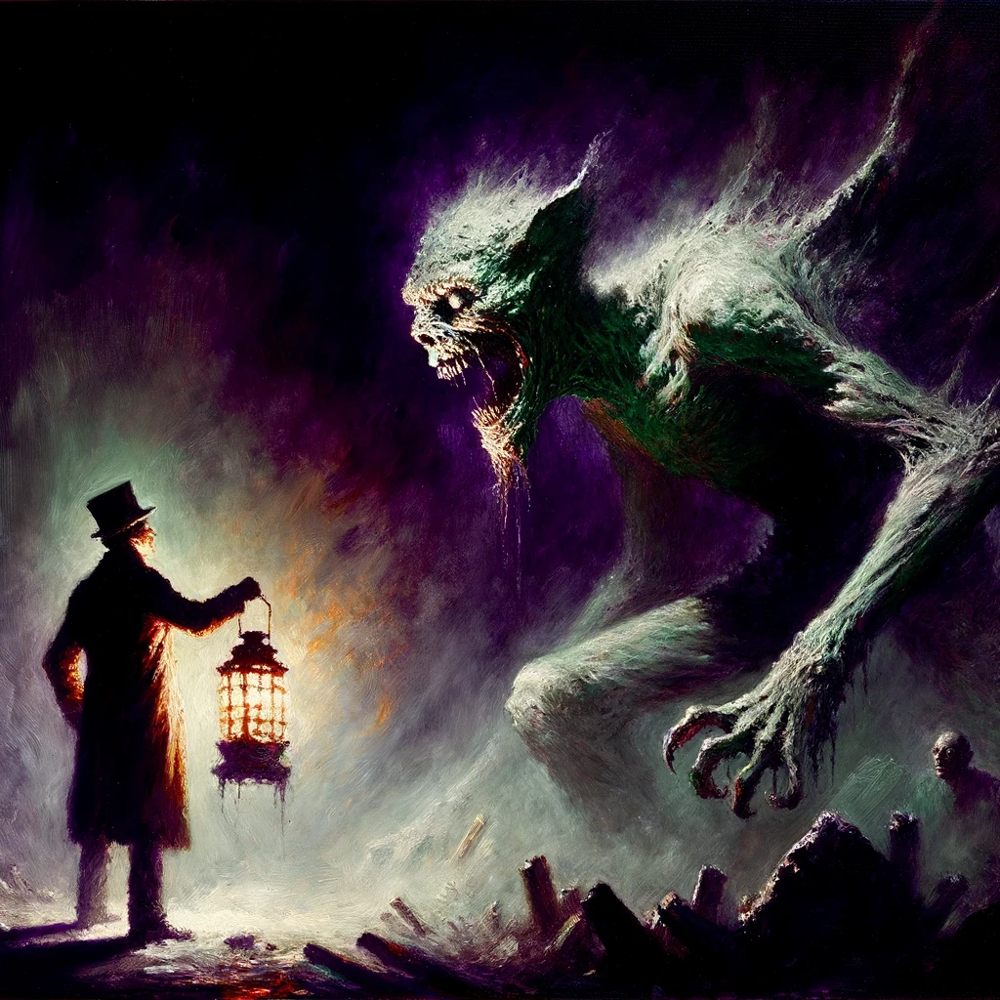
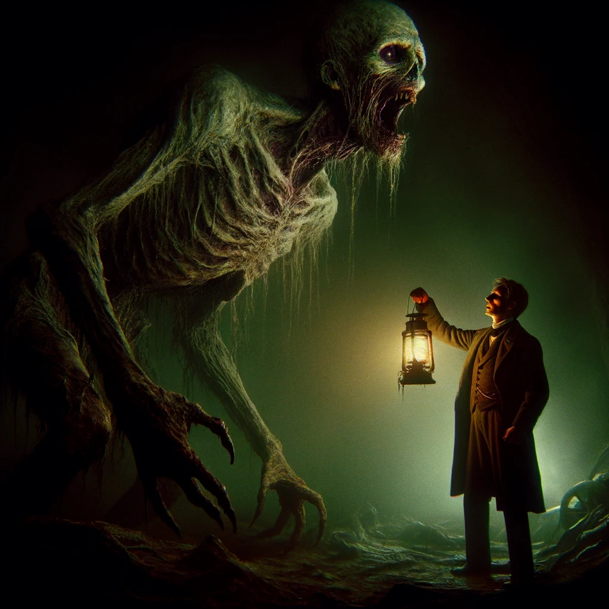

