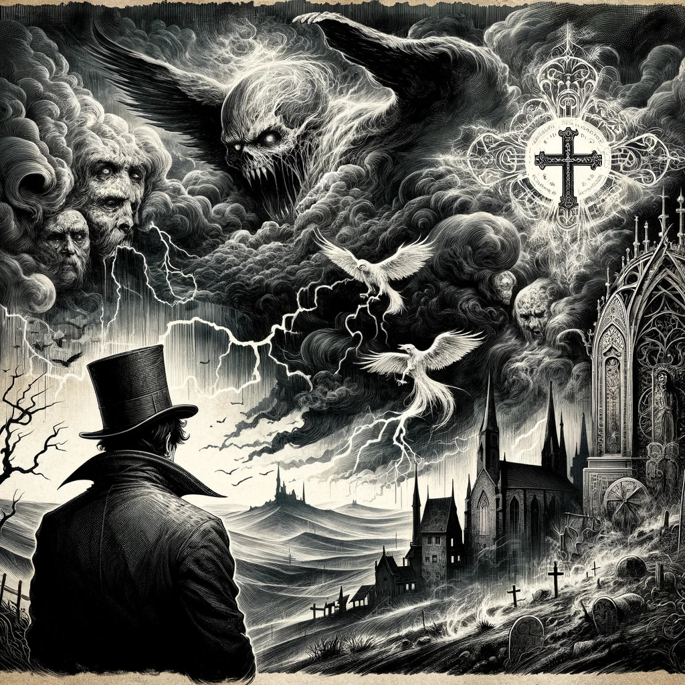
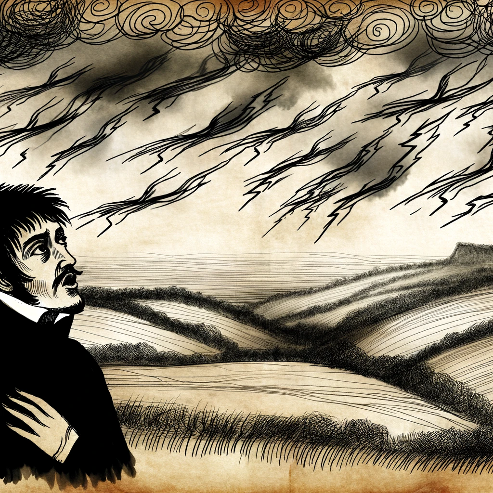
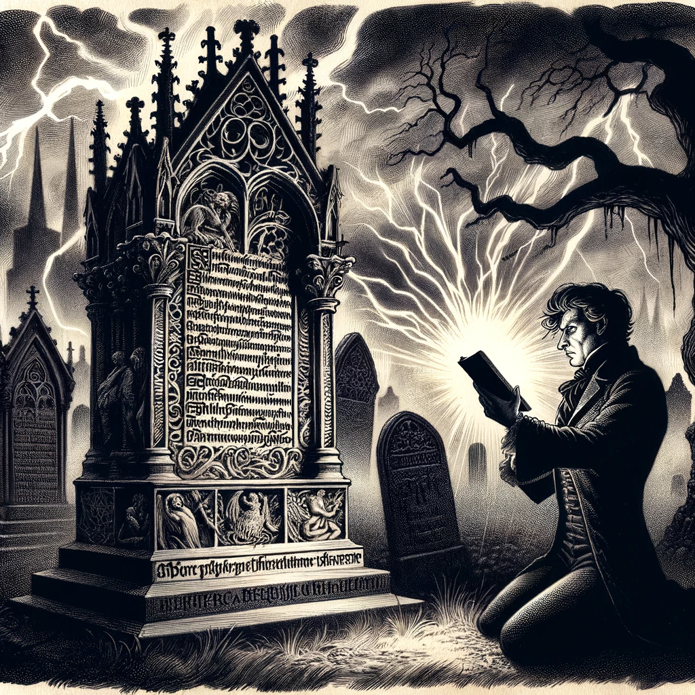

# Dracula's Guest

## Story Synopsis

"Dracula's Guest" follows the experiences of an unnamed Englishman who ventures out into the German countryside on Walpurgis Night, despite warnings from his hotelier and others. Ignoring their advice, he finds himself caught in a violent storm near a deserted village, where he discovers a tomb with the name 'Countess Dolingen of Gratz' inscribed on it, along with a mysterious warning. Seeking shelter, he encounters supernatural phenomena, including a phantom wolf that protects him from a potentially deadly encounter. Rescued by the Count's minions under mysterious orders, the Englishman later learns that his detour may have been orchestrated by Dracula himself, serving as a prelude to the main events of Bram Stoker's "Dracula". This story is often considered a deleted first chapter of the novel, providing insight into Dracula's reach and influence, and setting the stage for the horrors to come.

Style: Gothic-inspired ink illustrations on parchment, to capture the eerie and mysterious atmosphere of the story.

In this grand, gothic-inspired ink illustration for the cover image, we see the Englishman standing at the foreground, his back to us, gazing into a tempestuous landscape that merges all the pivotal elements of the story. Behind him, the stormy sky is a whirlwind of dark clouds and jagged lightning strikes, symbolizing the chaos and supernatural forces at play. The silhouette of the mysterious tomb, with its Gothic inscriptions, looms ominously on one side, while the phantom wolf, depicted with ethereal, ghostly lines, stands protectively close by. In the distance, the faint outlines of the German countryside and the deserted village are visible, enveloped in the storm's fury. The crucifix, detailed with intricate lines, hangs from the Englishman's hand, glowing faintly as if imbued with a mysterious light, providing a beacon of faith amidst the darkness. This image encapsulates the journey from curiosity to terror, the clash between the known and the unknown, and the thin veil between the natural and the supernatural, all under the shadow of Dracula's omnipresent influence, making it a powerful and evocative representation of the story's essence.

## Scenes

### Departure from Munich

The Englishman, ignoring warnings from his hotelier about traveling on Walpurgis Night, sets out from Munich into the countryside. The scene depicts him cheerfully departing on a horse-drawn carriage, waving off the concerns of locals, with the quaint streets of Munich fading in the background and ominous clouds gathering overhead.

In this gothic-inspired ink illustration, the Englishman is seen sitting in a horse-drawn carriage, his figure outlined sharply against the quaint buildings of Munich fading into the distance. Foreboding clouds are drawn with intricate linework above, suggesting an impending storm. The carriage and the Englishman's attire are detailed in a Victorian style, with the surrounding villagers depicted with expressions of concern and superstition, their gestures exaggerated to emphasize their warnings.

### Warnings Ignored

The Englishman encounters various locals who warn him against proceeding, including a peasant woman who crosses herself and mutters a prayer. This scene shows the Englishman, curious and undeterred, receiving a crucifix from the woman, which he pockets, against a backdrop of concerned and superstitious villagers.

The scene shows the Englishman standing, a figure of curiosity and determination, as a peasant woman hands him a crucifix. The intricate detailing of the crucifix contrasts with the simple, rustic clothes of the villagers, whose faces are etched with worry and fear. The background hints at the rural German landscape, with buildings rendered in fine lines and the environment beginning to darken, suggesting the approach of something ominous.

### Storm Approaches

As he ventures further, a violent storm begins. The scene captures the Englishman looking up at the darkening sky, lightning flashing, as the landscape around him grows increasingly wild and the path becomes more isolated.

The landscape becomes wilder, with the ink lines swirling to mimic the gathering storm clouds and the wind-swept fields. The Englishman looks up, his face a mix of awe and concern, as lightning strikes are depicted with stark, jagged lines cutting across the sky. The sense of isolation is emphasized by the absence of any other human figure, focusing solely on the Englishman's small form against the vast, tumultuous nature.

### Finding the Tomb

He discovers an old, forgotten cemetery with a particular tomb that stands out, marked for 'Countess Dolingen of Gratz'. The scene is eerie, with the tomb illuminated by a flash of lightning, revealing the inscription and a warning not to disturb her rest, while the Englishman reads it, intrigued and apprehensive.

In the foreground, the tomb of Countess Dolingen stands out with its elaborate Gothic inscriptions, drawn with careful attention to the gothic script and decorative elements, suggesting its age and mystery. The Englishman, illuminated by a sudden lightning strike, is shown reading the inscription, his body language reflecting his fascination and fear. The surrounding cemetery is hinted at with shadowy tombstones and gnarled trees, enhancing the eerie atmosphere.

### Supernatural Encounter

Seeking shelter, the Englishman enters the mausoleum, where he experiences a chilling sensation and hears whispering voices. The illustration would show him inside the dark tomb, a look of fear on his face as ghostly apparitions begin to materialize around him.

The mausoleum interior is depicted with deep shadows and faint outlines of ghostly figures, creating a chilling ambiance. The Englishman stands in the center, his face illuminated by a sliver of light, showing his terror. The whispering voices are represented by wavy, ethereal lines emanating from the shadows, surrounding him in a spectral embrace.

### The Phantom Wolf

A giant wolf appears, seemingly guarding the Englishman during his unconscious state in the storm. This scene shows the majestic, protective wolf standing over him, with the storm raging in the background, offering a moment of calm in the tempest.

This scene centers on the majestic wolf, its fur detailed with fine ink lines to convey both its solidity and ghostly nature. It stands protectively over the unconscious Englishman, who is rendered in softer lines to emphasize his vulnerability. The stormy background is suggested with minimalistic, expressive strokes, focusing the viewer's attention on the connection between the wolf and the Englishman.

### Rescue

Soldiers, sent by Dracula, find and rescue the Englishman. The scene depicts the moment of rescue with the soldiers approaching, lanterns piercing the darkness, and the wolf disappearing into the night, leaving the Englishman bewildered but safe.

Soldiers are shown entering the scene with lanterns, their light cutting through the ink-drawn darkness, creating a stark contrast. The detailed uniforms of the soldiers suggest a military precision, while the Englishman is depicted lying on the ground, slowly awakening. The transition from danger to safety is conveyed through the gradual lightening of the scene from left to right.

### Return to Safety

The Englishman wakes up in his hotel room, with the storm passed and the crucifix lying on his chest. This scene contrasts the supernatural terror of the night with the mundane safety of the hotel room, sunlight streaming through the window, as he tries to make sense of his experiences.

The hotel room is drawn with warm, inviting lines, a stark departure from the previous scenes' darkness. The Englishman sits on the bed, bathed in sunlight streaming through a window, the crucifix on his chest detailed to reflect its significance. The room's Victorian furnishings are rendered with care, emphasizing the return to civilization and normalcy.

### Dracula's Letter

The final scene would be the Englishman reading a letter from Dracula, thanking him for his visit to the tomb and implying his manipulation of the events. The Englishman sits in a dimly lit room, the letter in his hands, as realization dawns on his face about the true nature of his journey and its connection to the larger narrative of "Dracula".

The final scene is intimate, with the Englishman holding the letter. The paper's texture and the script of the letter are meticulously detailed, suggesting the weight of its contents. The room is dimly lit, with shadows cast in intricate patterns, reflecting the lingering influence of the supernatural. The Englishman's expression captures his dawning realization, a mix of fear and intrigue, as he contemplates the implications of Dracula's words.

## References

* [Dracula's Guest, Wikipedia](https://en.wikipedia.org/wiki/Dracula%27s_Guest).
* [Dracula’s Guest, Project Gutenberg](https://www.gutenberg.org/ebooks/10150).

