# The Dunwich Horror, H. P. Lovecraft

## Summary

"The Dunwich Horror" by H. P. Lovecraft is a tale of unspeakable terror and ancient sorcery set in the secluded, decaying village of Dunwich, Massachusetts. It unfolds with the mysterious birth of Wilbur Whateley, a grotesque child born to a deformed, albino mother and an unknown father, rapidly growing into an unsettling figure obsessed with the occult. Behind the closed doors of the dilapidated Whateley farmhouse, Wilbur and his grandfather engage in sinister rituals, aiming to summon indescribable entities from other dimensions. The horror escalates when Wilbur attempts to steal an ancient, forbidden tome from Miskatonic University, leading to his untimely demise, which unleashes an invisible, monstrous entity upon Dunwich. The creature wreaks havoc, prompting a group of scholars to confront and dispel the menace using arcane knowledge, ultimately revealing the chilling legacy of the Whateley family's pact with otherworldly forces, and saving Dunwich from the brink of annihilation.

* Style: Expressionist woodcut prints with a vibrant yet dark color palette.

A towering, indistinct entity looms over the devastated landscape of Dunwich, with Dr. Armitage standing resolute in the foreground, ancient tome in hand, under a stormy, otherworldly sky. For this expressionist woodcut print, use a dramatic interplay of vibrant reds, deep purples, and stark blacks to create a mood of impending doom and courageous defiance. The entity should fill the upper portion of the image, its form a chaotic amalgamation of shapes and textures that suggest its monstrous nature without fully revealing it, blending into the tumultuous sky which itself seems alive with unnatural energy. Below, the ruined landscape of Dunwich stretches out, rendered in jagged lines and dark hues, suggesting desolation and chaos. Dr. Armitage, depicted in bold relief against this backdrop, stands prominently at the bottom center of the composition. He is shown as a figure of determination and hope, his stance firm and his face set against the darkness, the ancient tome clutched in his hands glowing with a faint, hopeful light. This light should be the only bright color in an otherwise dark palette, drawing the viewer's eye and symbolizing the thin thread of hope in the face of overwhelming darkness. The composition as a whole captures the essence of "The Dunwich Horror"—a tale of otherworldly terror, human courage, and the thin veil between our world and the unimaginable.

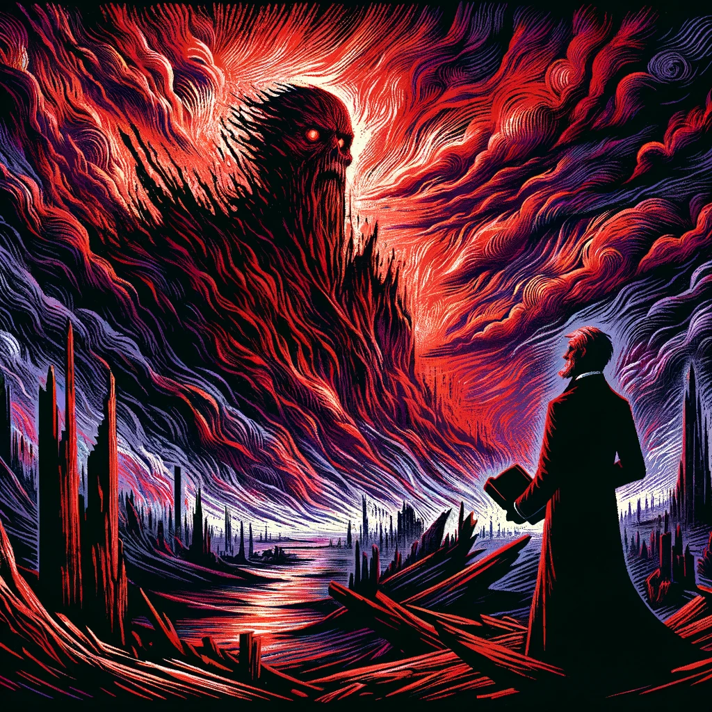

## Scenes

### The Birth of Wilbur Whateley

In the decrepit farmhouse of the Whateley family in Dunwich, amidst a stormy night, Lavinia Whateley gives birth to Wilbur, under circumstances shrouded in secrecy and dread. The scene is set in a poorly lit, cluttered room with ancient, occult symbols scrawled on the walls. Lavinia, a pale, gaunt albino woman, lies exhausted on the bed, while her father, Old Whateley, a sinister figure with keen, crazed eyes, looks on at the newborn with a mixture of awe and dark anticipation. Outside, the storm rages, casting fleeting, ominous shadows through the windows.

In a shadowy, decrepit farmhouse room, Lavinia Whateley gives birth to Wilbur, observed by Old Whateley amidst a stormy night. For this expressionist woodcut print, focus on the stark contrasts between the vibrant flashes of lightning illuminating the room and the deep shadows that dominate the space. Lavinia should appear exhausted yet ethereal on the bed, her albino features highlighted with a pale, almost luminous color against the dark room. Old Whateley, depicted with sharp, angular lines to emphasize his ominous presence, gazes towards Wilbur with an intense, foreboding look. The walls, adorned with occult symbols, should be rendered in a way that they seem to pulsate with a dark, unsettling energy, using a mix of deep purples and blacks.

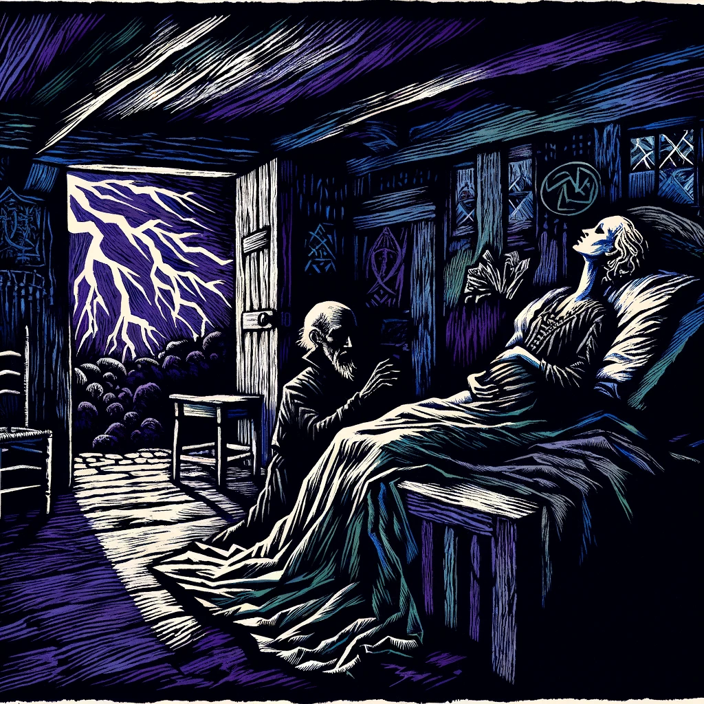
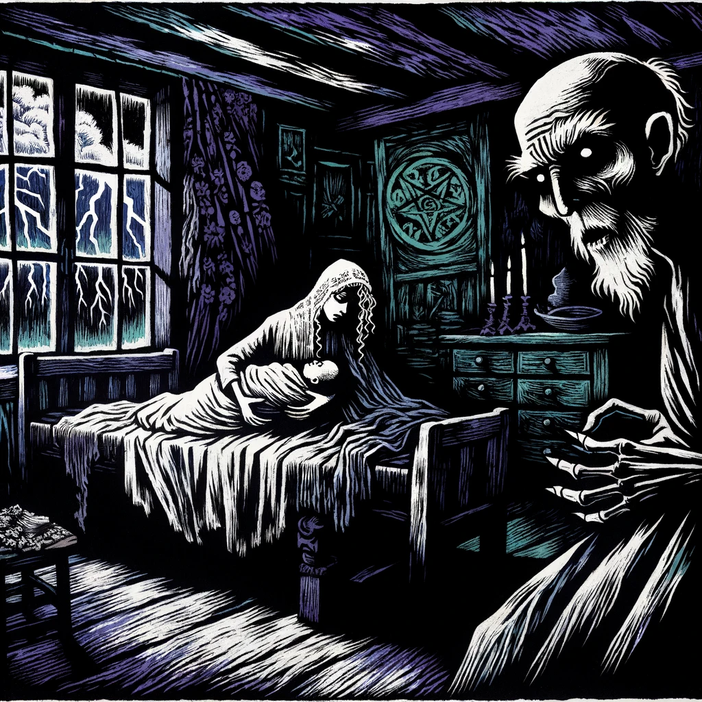

### Wilbur’s Growth and Studies

Wilbur grows at an unnatural pace, quickly becoming a source of fear and speculation among the townsfolk. This scene shows a teenage Wilbur in the dimly lit, book-filled study of the Whateley farmhouse, pouring over ancient tomes and scrolls, his features sharp and unnaturally mature for his age. The room is cluttered with esoteric artifacts, and through a window, the decrepit state of the Whateley property is visible, reinforcing the isolation and otherworldliness of the scene.

Teenage Wilbur studies ancient tomes in a book-filled study, surrounded by esoteric artifacts. This scene should capture Wilbur’s unnatural maturity and focus, using angular shadows and a palette of dark greens and blues to evoke a sense of forbidden knowledge and isolation. The room is cramped, filled with books and artifacts that seem to almost spill out of the print, creating a chaotic, yet structured composition that draws the viewer’s eye towards Wilbur at the center. His features should be sharp, with an intense concentration that sets him apart from his surroundings. The window view of the Whateley property should contrast the interior with a lighter, though no less unsettling, hue to suggest desolation.

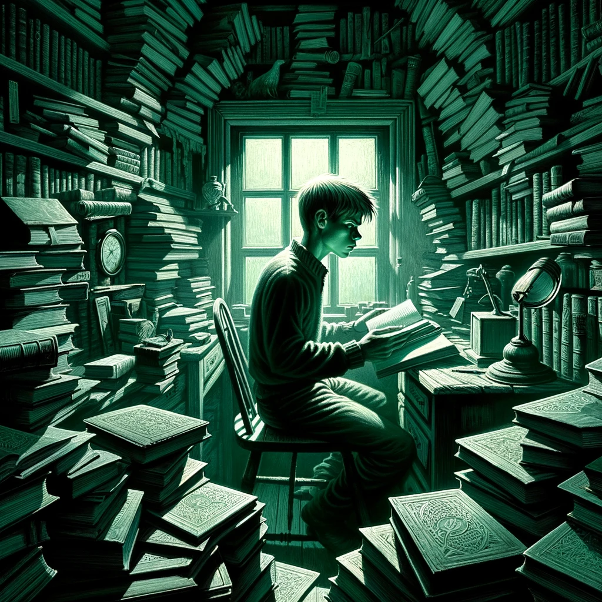
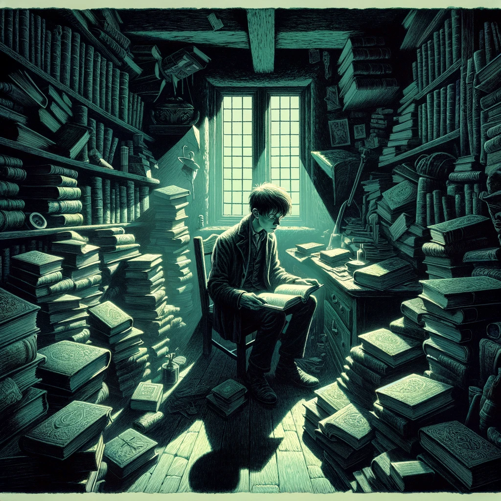

### The Disappearance of Cattle and Strange Occurrences

Dunwich is plagued by mysterious events, including the disappearance of livestock and unnatural sounds. An eerie night scene on a farm, where terrified townsfolk and a decimated herd of cattle are overshadowed by unseen, malevolent forces. The sky is unnaturally dark, with an oppressive atmosphere, and indistinct, monstrous shapes seem to loom at the edge of the farm, just beyond the reach of the farmhouse's flickering lights.

A farm under siege by unseen forces, with terrified townsfolk and decimated cattle. Capture this scene with swirling, turbulent lines and a contrast of dark, menacing shapes against a backdrop of eerie, muted yellows and oranges, suggesting an unnatural night. The expressions of the townsfolk should convey terror and confusion, their forms slightly exaggerated to enhance the emotional impact. The livestock should appear diminished and distressed, with the invisible presence suggested by distorted perspectives and unnatural bends in the landscape around the farm, making the air itself seem alive with threat.

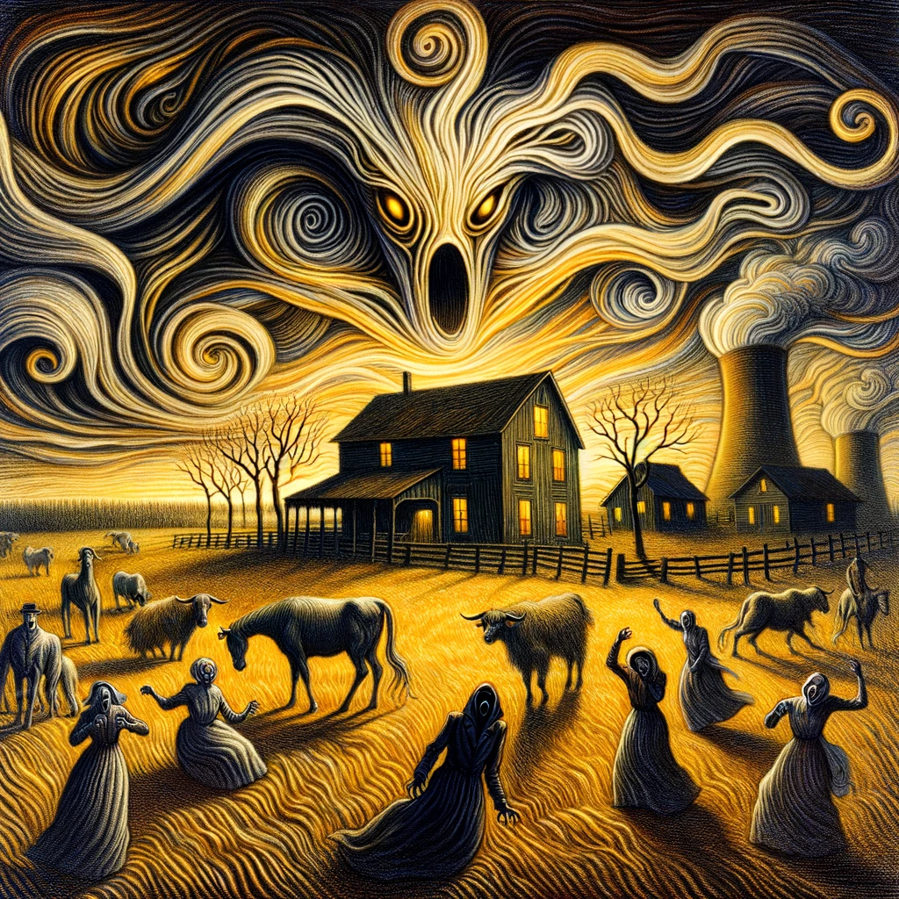
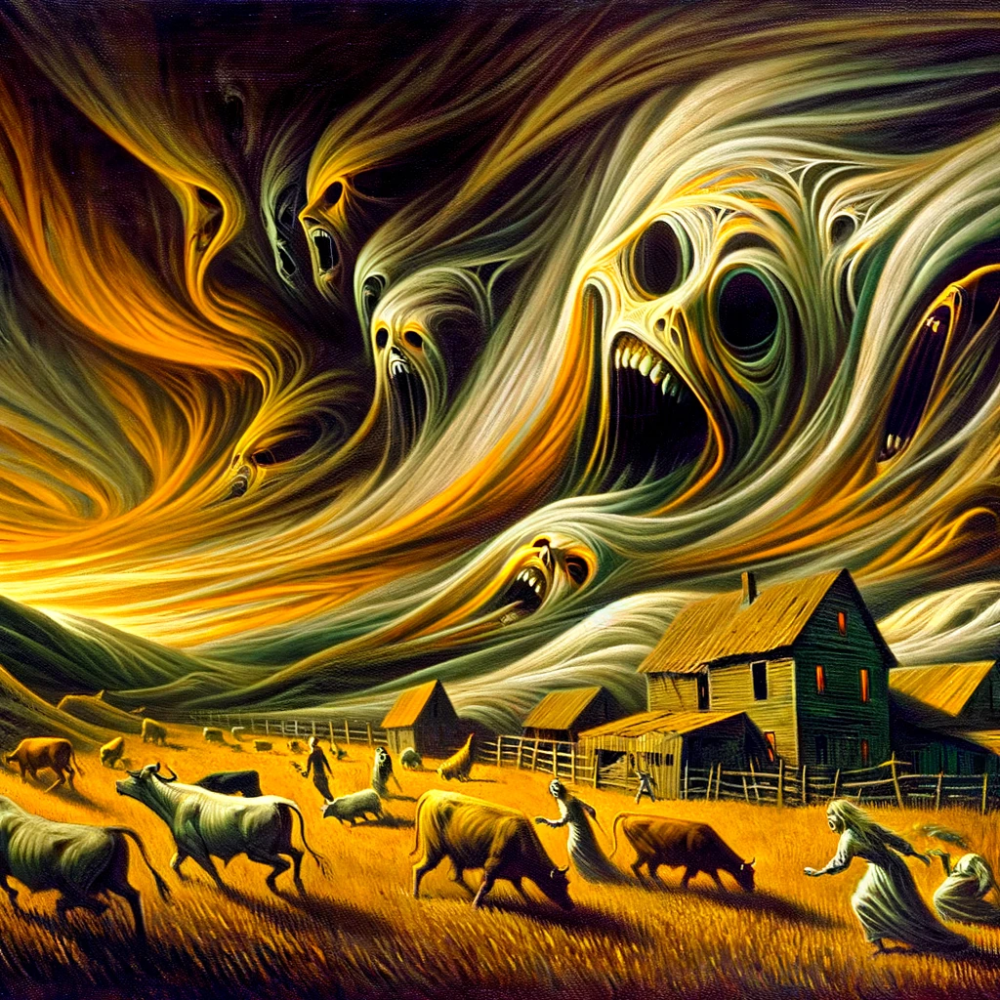

### Wilbur’s Attempt to Steal the Necronomicon

In the Miskatonic University Library, Wilbur attempts to steal the Necronomicon for its forbidden knowledge. The scene is tense, with Wilbur, his face anxious and determined, sneaking through the vast, shadow-filled library. The ancient book lies on a pedestal, bathed in a shaft of moonlight from a nearby window, suggesting its otherworldly power. Librarian Dr. Armitage watches from the shadows, unaware of the imminent confrontation.

Wilbur in the shadowy Miskatonic University Library, reaching for the Necronomicon as Dr. Armitage observes. This print should be dominated by the contrast between the moonlit tome on its pedestal and the enveloping shadows of the library. Use a limited palette with sharp bursts of light to draw attention to Wilbur, the Necronomicon, and the observing Dr. Armitage. Wilbur's determination and Dr. Armitage's suspicion should be evident in their postures and facial expressions, framed by towering bookshelves that lean and twist, adding a sense of unease and anticipation.

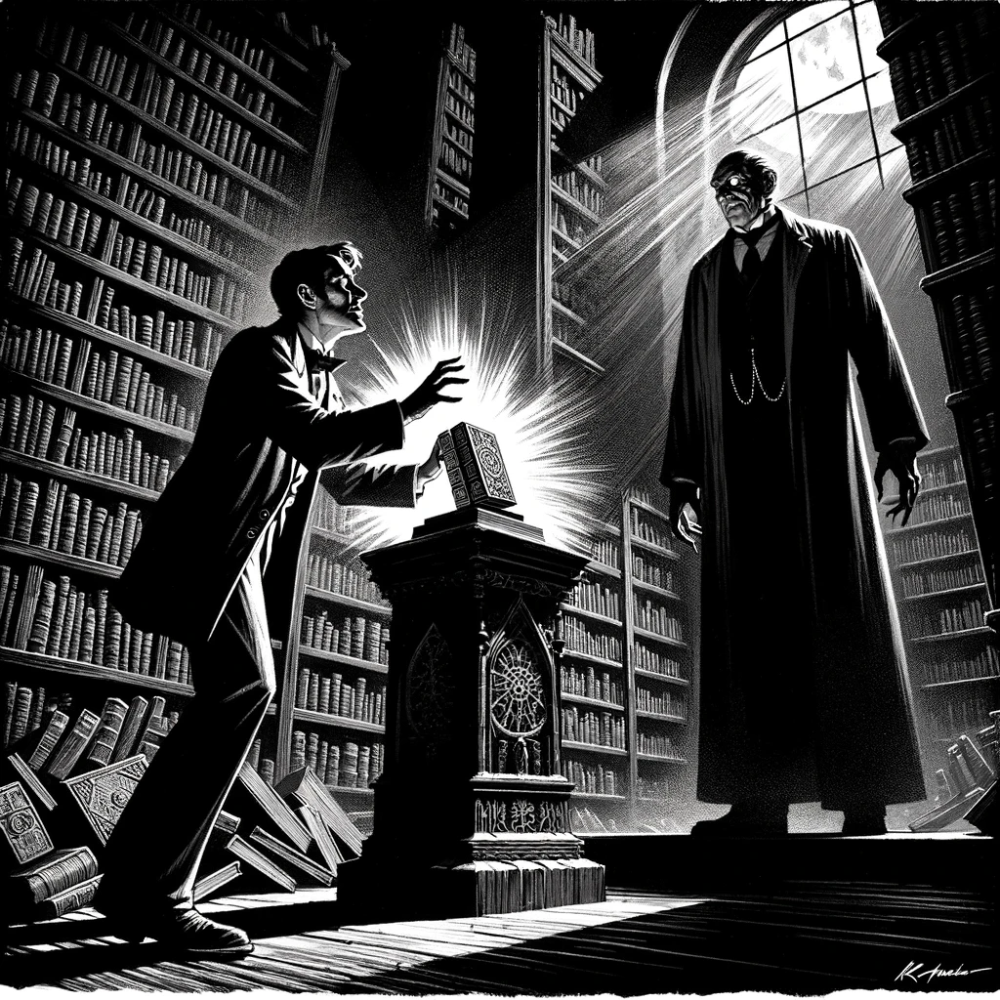
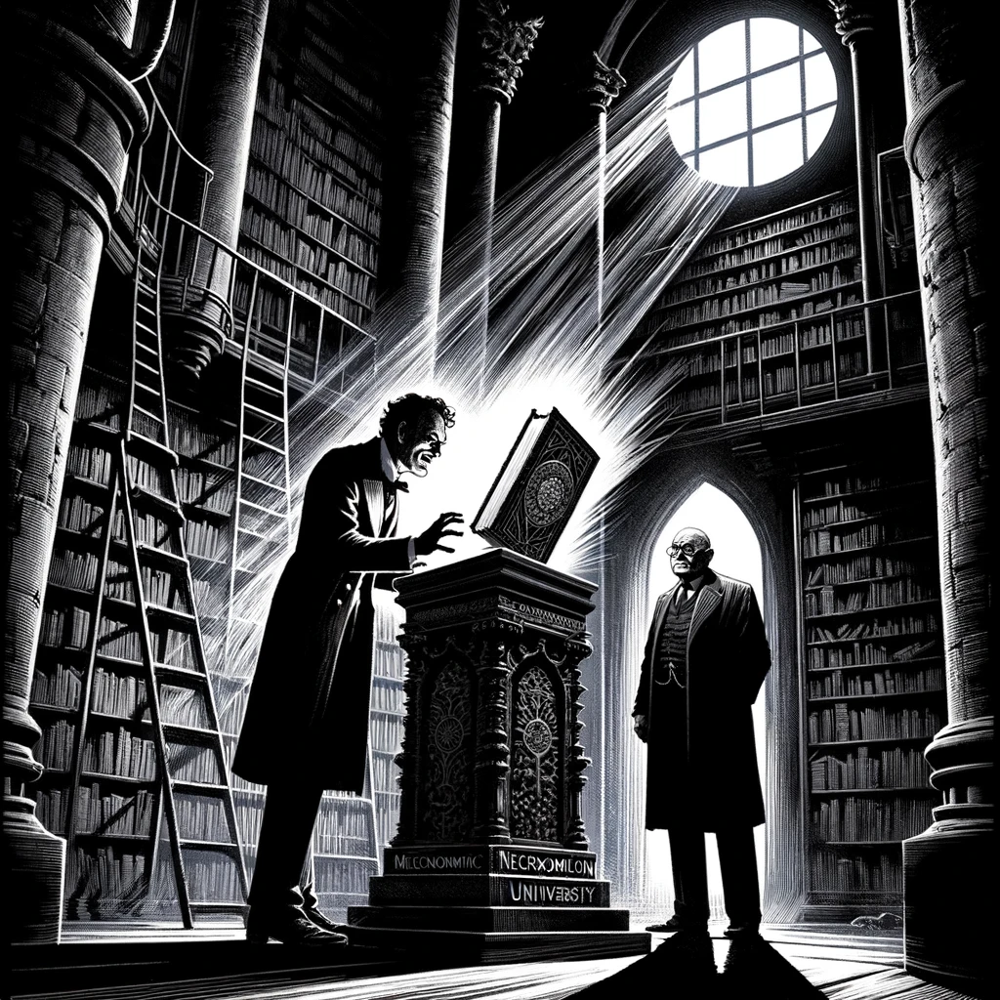

### The Unleashing of the Horror

Following Wilbur's death, an invisible entity wreaks havoc on Dunwich, leading to a climax where the creature becomes partially visible, revealing its monstrous form. The scene is set in a devastated part of Dunwich, where buildings are damaged, and the landscape is scarred. The monstrous entity, a massive, indescribable shape, partially materializes, its form blurred and shifting, surrounded by a halo of unnatural light. Terrified townspeople and a group of scholars, including Dr. Armitage, confront the creature, armed with ancient spells and a desperate plan to banish it.

The monstrous entity wreaks havoc on Dunwich, partially visible as it terrorizes the town. Illustrate this scene with dynamic, swirling lines and a chaotic interplay of light and shadow, using stark reds and blacks to signify destruction and fear. The entity should be represented as a mass of indistinct shapes and forms, partially materialized, so that it seems to blur the boundary between the physical and the ethereal. The terrified townspeople and the landscape should be distorted, as if the very earth is rebelling against the presence of the entity, creating a sense of overwhelming dread and power.

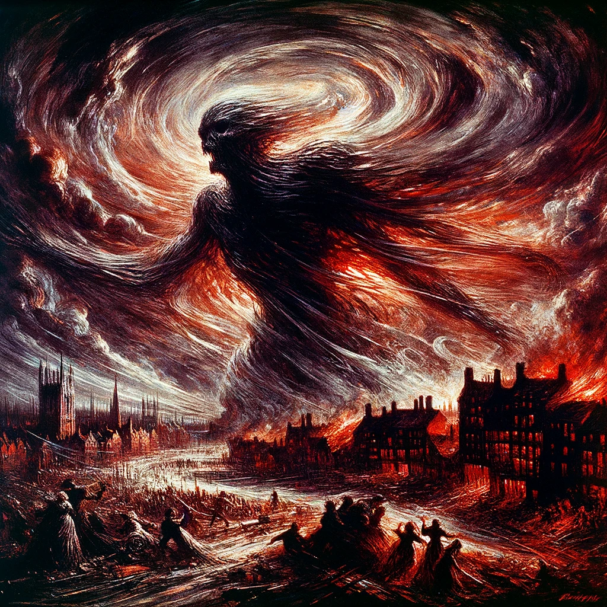
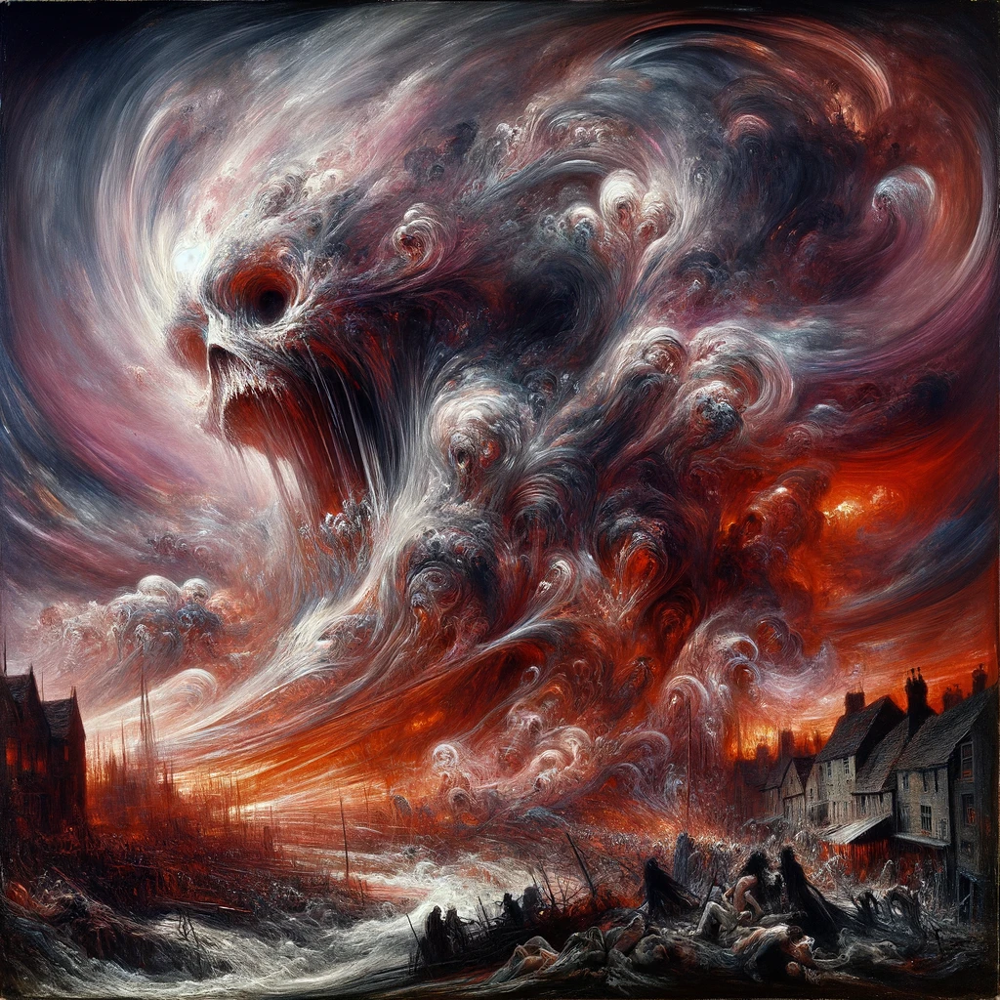

### The Banishment of the Horror

The culmination of the scholars' efforts to dispel the entity, set in the ruined landscape of Dunwich. Dr. Armitage stands at the forefront, reciting arcane incantations from a tattered scroll, his face set in grim determination. The monstrous entity, now fully visible, is a towering, eldritch horror, struggling against the power of the spell. The scene captures the moment of suspense and the epic struggle between human will and otherworldly malevolence, with the fate of Dunwich hanging in the balance.

Dr. Armitage confronts the fully visible entity with ancient spells in a devastated landscape. In this final scene, use bold, expressive lines and a dramatic clash of vibrant reds, oranges, and deep purples to depict the epic struggle. Dr. Armitage should be positioned prominently, his figure set against the monstrous entity in a way that emphasizes his bravery and determination. The entity, now fully revealed, should be a towering mass of horror, rendered in shapes and textures that suggest both solidity and otherworldliness. The surrounding devastation should be depicted with jagged lines and sharp contrasts, enhancing the sense of a final, desperate confrontation between human will and supernatural force.

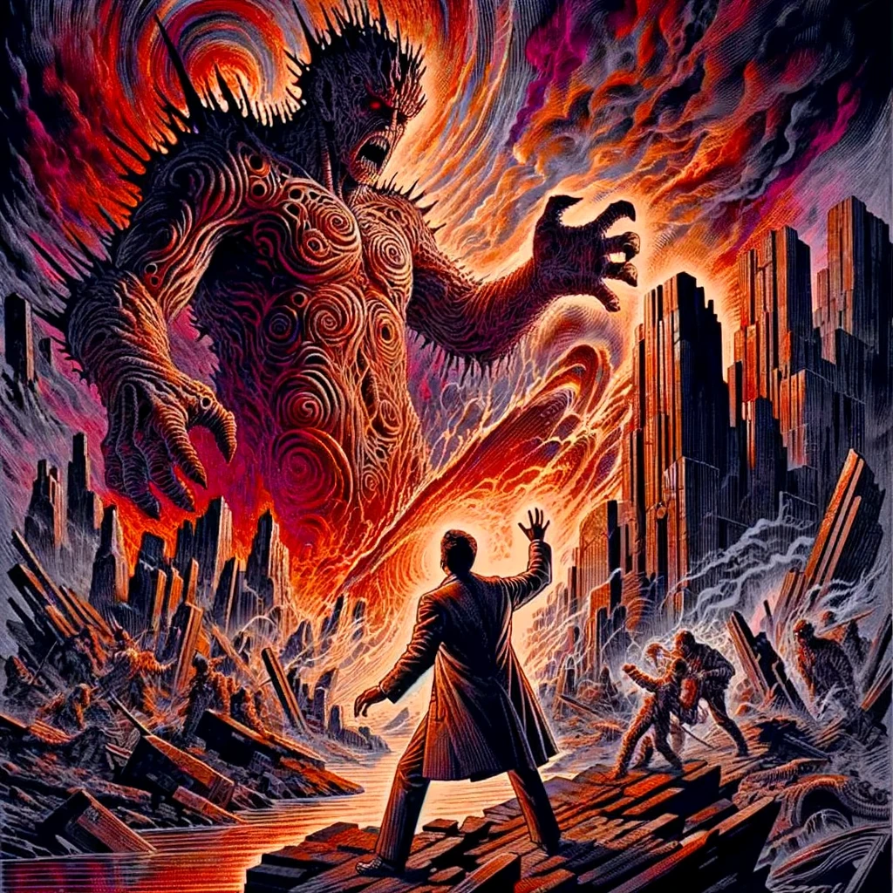
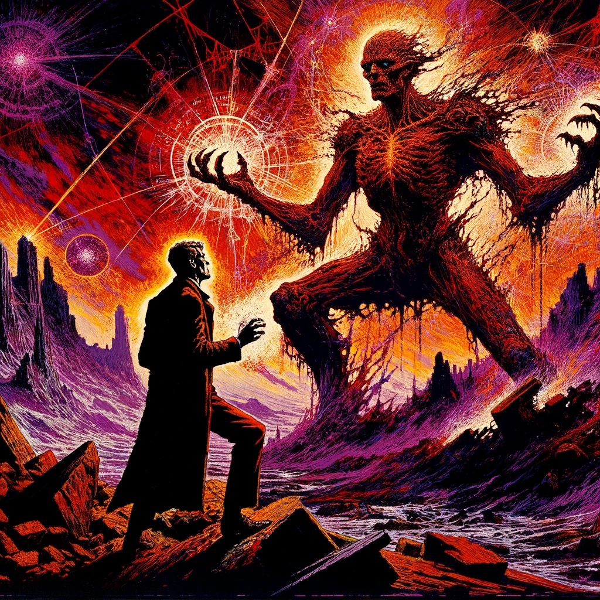

