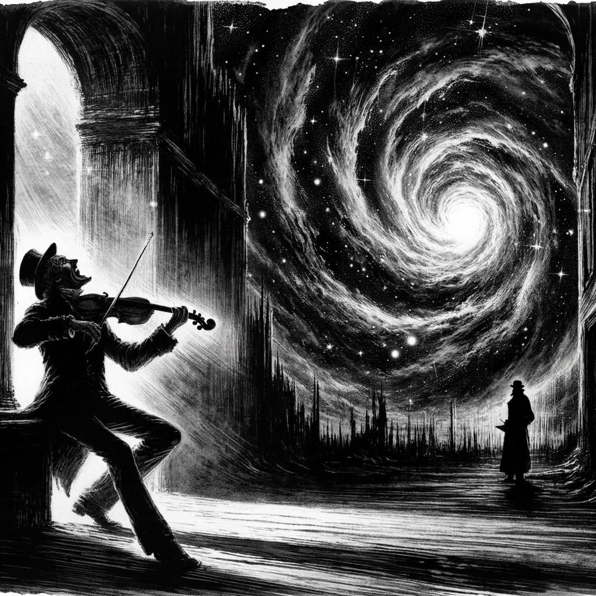
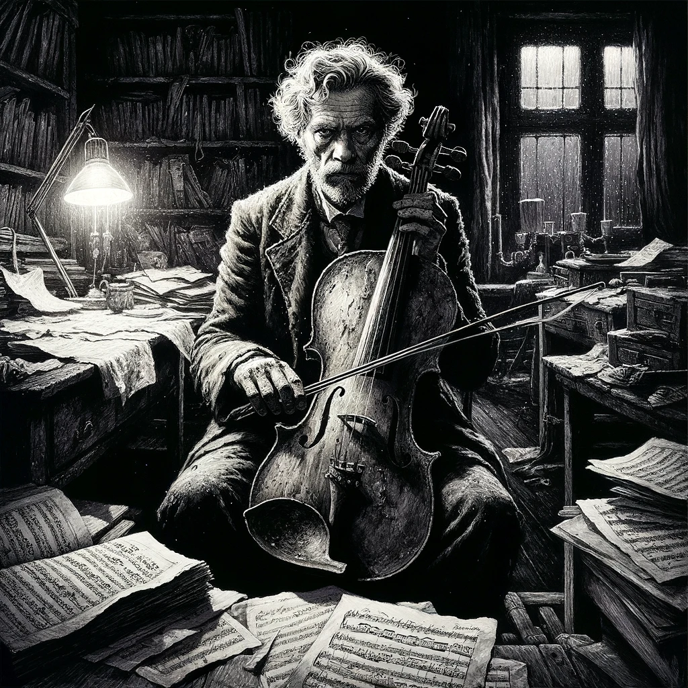
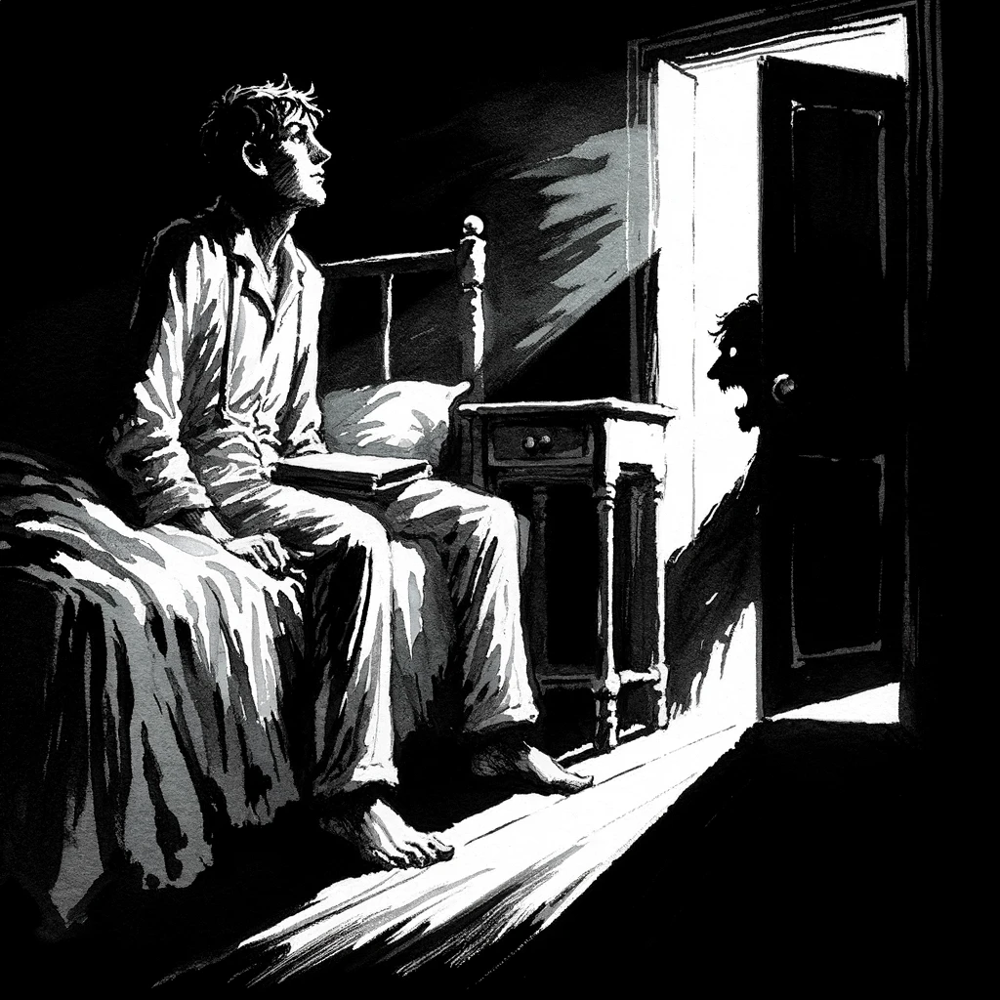
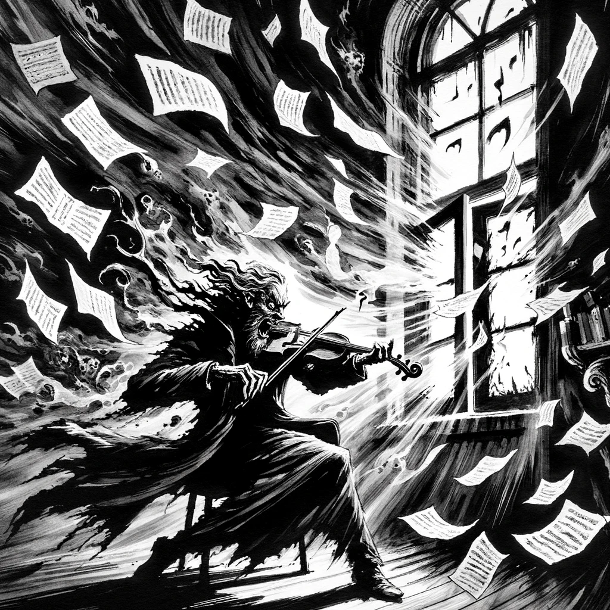

# The Music of Erich Zann, H. P. Lovecraft

## Story Synopsis

"The Music of Erich Zann" is a tale of eerie and unfathomable events, as recounted by an unnamed narrator who becomes intrigued by an old, mute viol player named Erich Zann. Residing in a decrepit building in a mysterious, unnamed city, the narrator is drawn to Zann's apartment by the otherworldly music he plays every night. This music, unlike anything the narrator has ever heard, seems to be a desperate attempt by Zann to keep at bay unseen, malevolent forces from another dimension that he can access through his attic window. As the story unfolds, the narrator's fascination turns to horror when he witnesses Zann's frantic and futile efforts to protect himself—and perhaps the world—from these entities with his haunting melodies. The climax reveals the incomprehensible vastness and terror of the cosmos, leaving the narrator to escape with his life but not with his sanity, as the experience and the city itself fade into an untraceable obscurity, leaving only the haunting memory of Erich Zann's music as a testament to the encounter.

Style: Expressive ink wash painting, blending Eastern techniques with Western gothic sensibilities to capture the story's haunting and ethereal mood.

Erich Zann, frenziedly playing his viol against the backdrop of a gaping, star-filled void, with the silhouette of the narrator watching in horror. Adopting the expressive ink wash painting style, the composition should be divided diagonally, with Zann and his viol on the lower left, intensely focused on his music, which flows into the swirling, chaotic darkness of the void that occupies the upper right portion of the image. The void should be depicted with a gradient of washes from dark to light, suggesting depth and the unknown, peppered with stars that add a haunting beauty. The narrator, positioned in the lower right corner, is smaller, his posture and expression capturing a blend of fascination and terror. This dynamic contrast between the human element and the cosmic unknown, framed by the ancient, shadowy architecture of the Rue d'Auseil, encapsulates the story's essence of confronting incomprehensible mysteries through the power of music and human emotion.

## Scenes

### The Mysterious Rue d'Auseil

The scene is set in a shadowy, fog-laden street in a nameless city, where the narrator describes his accidental discovery of the Rue d'Auseil. This narrow, steep street, bordered by high, ominous buildings that seem to lean towards each other, exudes an aura of ancient mystery and isolation from the rest of the city. The architecture is bizarre, with buildings that appear almost alive, suggesting a place not entirely of this world.

A narrow, steep street shrouded in fog and mystery, lined with leaning, ancient buildings. Using expressive ink wash painting, create a sense of depth and foreboding by emphasizing the exaggerated perspectives of the buildings that almost seem to converge above. The fog should be rendered with lighter washes to contrast the dark, detailed outlines of the buildings, creating an aura of mystery and isolation. The street should appear deserted, with the cobblestones and architectural details adding to the eerie atmosphere.

### The Narrator's Arrival at the Building

The narrator stands before a tall, decrepit building, its  facade marked by time and neglect, where he decides to take lodgings. The building's interior is dimly lit, with a narrow staircase winding upwards into shadow, creating a sense of foreboding and anticipation of the unknown.

The narrator stands before a tall, decrepit building, its facade a testament to neglect. In this scene, use expressive ink wash to highlight the texture of the building’s weathered surface and the dark shadows of its entryway, suggesting a threshold to the unknown. The narrator, a figure cloaked in modest attire, gazes upward with a mix of curiosity and trepidation. The composition should draw the viewer's eye from the narrator up to the imposing height of the building, emphasizing its daunting nature.

### First Encounter with Erich Zann

An illustration of the first meeting between the narrator and Erich Zann, an elderly, mute viol player with an air of sadness and mystery. Zann is depicted in his cluttered, dimly lit apartment, surrounded by sheets of strange music and his viol. His eyes convey a haunting depth, hinting at unseen burdens and secrets.

Inside a cluttered, dimly lit apartment, Erich Zann sits with his viol, surrounded by sheets of music. The expressive ink wash painting should focus on Zann’s intense expression and the intricate details of his viol, with shadows casting deep contrasts to highlight his isolation and the mysterious aura of his music. The room's clutter—books, music sheets, a small lamp—should be detailed enough to suggest a life dedicated to solitary pursuits. Zann's appearance is consistent with his age and mysterious aura, marked by deep, thoughtful eyes and a posture bent from years of playing.

### The Haunting Melodies of Erich Zann

Zann, alone in his room at night, fervently plays his viol. The scene captures the intensity and otherworldliness of his music, with notes swirling around him like visible spirits. The room is bathed in an eerie light, suggesting the music's power to touch the beyond.

Zann, intensely playing his viol, surrounded by a swirl of musical notes that seem almost alive. In this scene, the expressive ink wash should be used dynamically to represent the music’s movement and ethereal quality, with fluid, sweeping strokes that mimic the flow of sound and air. The room is barely lit, with the light source focused on Zann and his instrument, creating a spotlight effect that enhances the drama of the moment.

### The Narrator's Growing Obsession

The narrator, shown in his own room, is unable to sleep, haunted by the sounds of Zann's music. His face reflects a mix of fear, fascination, and an insatiable desire to understand the source and meaning of the music. The room around him is dark, with the only light coming from the hallway, emphasizing his isolation and obsession.

The narrator, unable to sleep, sits up in bed, haunted by the sounds of Zann’s music. The room is cast in shadows, with the expressive ink wash painting technique used to create a stark contrast between the dark interior and the sliver of light from under the door. The narrator's expression, a mix of fear and fascination, should be the focal point, with his features drawn to reflect an escalating obsession.

### Discovery of the Attic Window

A pivotal scene where the narrator, having secretly followed Zann, discovers the old musician staring out of a unique, high attic window that overlooks nothingness—an abyss or a void beyond normal perception. Zann's face is a mask of fear and determination, while the window opens onto an impossibly dark sky, filled with strange stars, suggesting a portal to another dimension.

Zann stands before an attic window that opens onto an abyss. The scene should use expressive ink wash to depict the stark contrast between the dark room and the incomprehensible void outside the window. The window itself is an element of mystery, its frame detailed against the formless dark beyond. Zann’s posture and expression convey fear and resolve, standing as a barrier between the known and the unknown.

### The Night of Revelation

The climax of the story, where Erich Zann plays as if in a frenzy, trying to hold back unseen forces with his music. The room is chaotic, with sheets of music flying, and the window wide open to the malevolent void. The scene is charged with a palpable sense of dread, desperation, and the supernatural.

A frenzied Zann plays against a backdrop of chaos, with the window flung open to a malevolent void. The expressive ink wash painting should capture the dynamic chaos of the room—sheets of music in the air, the frantic movement of Zann’s bow, and the open window revealing an otherworldly darkness. The composition should be dynamic, with lines and washes conveying the movement and intensity of the moment.

### The Desperate Escape

The narrator, in a state of terror, flees from Zann's apartment as the building and the street outside descend into chaos. The illustration captures his panicked run down the twisted staircase of the building, which now seems alive with sinister, shifting shadows, embodying the nightmare that the Rue d'Auseil has become.

The narrator flees down the building's twisting staircase, enveloped by shadows. Use expressive ink wash to emphasize the movement and urgency of the escape, with the staircase winding into the depths of the building. The shadows should seem almost alive, adding to the sense of fear and urgency. The narrator's expression and posture should convey panic and a desperate need to escape.

### Lost Rue d'Auseil

The final scene shows the narrator in the aftermath, searching in vain for the Rue d'Auseil under a gray, indifferent sky. The city around him is normal, mundane, with no sign of the street or the building he once knew. His expression is one of loss, confusion, and the haunting realization that he will never find Erich Zann or the eerie music again, leaving him forever changed by the experience.

The narrator searches for the Rue d'Auseil under a gray sky, the city around him mundane and indifferent. This scene should be depicted with a more subdued use of expressive ink wash, emphasizing the contrast between the narrator’s vivid memory of terror and the normalcy of his surroundings. The buildings should appear ordinary, with the narrator depicted in a consistent manner, his expression one of confusion and loss, underscoring the isolation and finality of his quest.

## References

* [The Music of Erich Zann, Wikipedia](https://en.wikipedia.org/wiki/The_Music_of_Erich_Zann)

