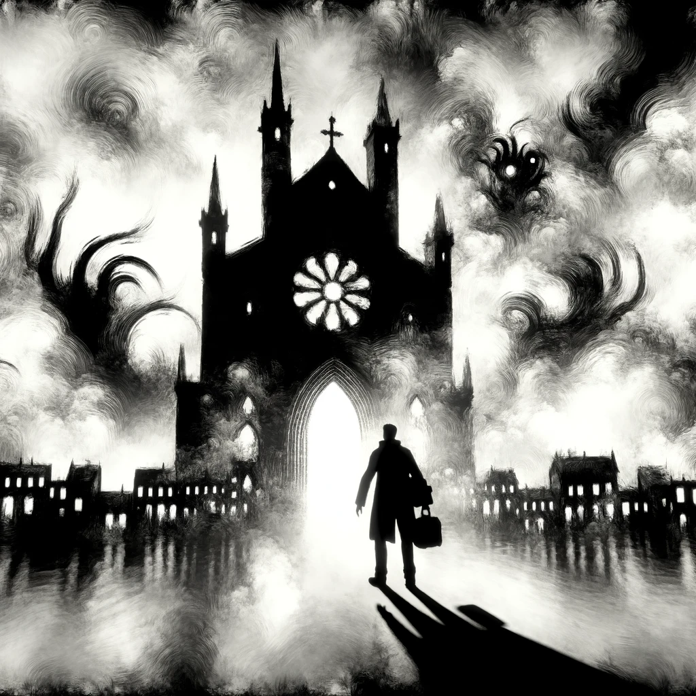
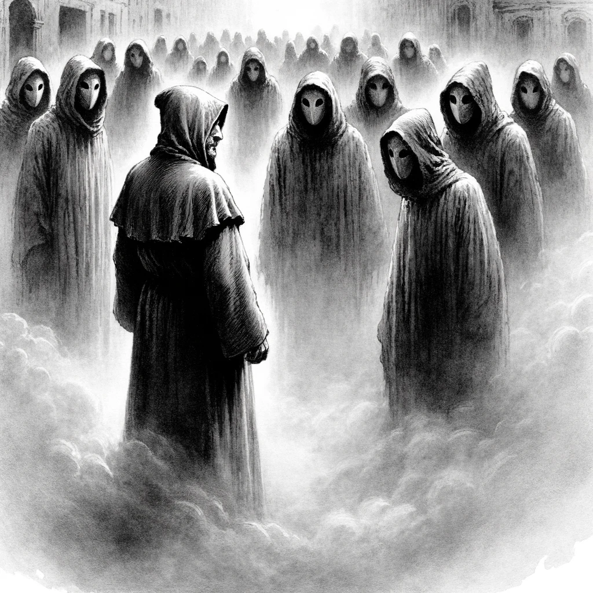
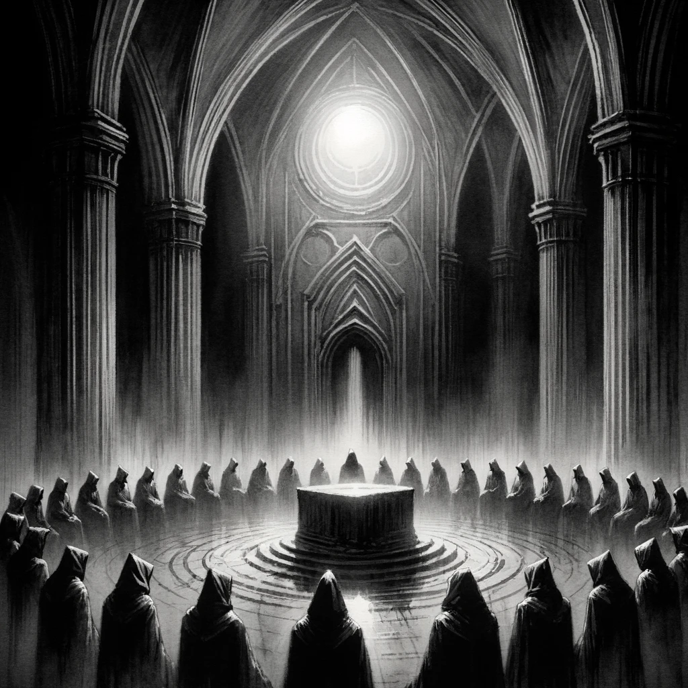
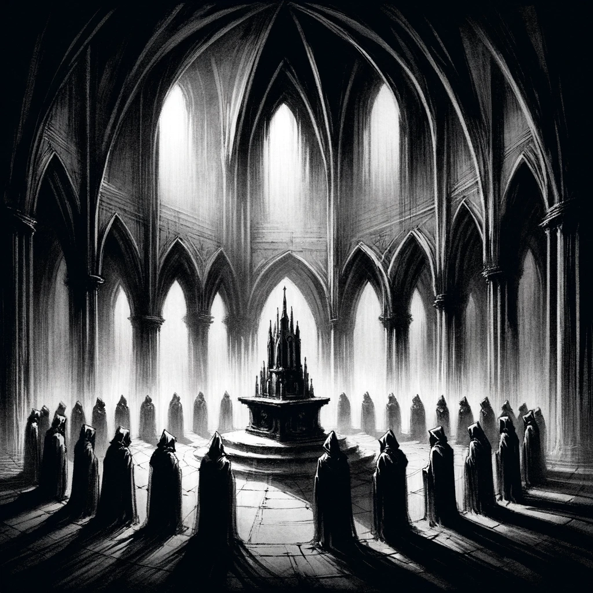

# The Festival

## Story Synopsis

"The Festival" by H.P. Lovecraft is a chilling tale set in the ancient, decaying town of Kingsport, where the narrator arrives to partake in a mysterious, age-old festival linked to his family's history. As he ventures through the eerie, fog-shrouded streets, he encounters grotesque, masked figures and unsettling signs of a town steeped in witchcraft and arcane rituals. Guided to an ancient church by these silent figures, he descends into a nightmarish underworld where he witnesses a horrifying ceremony that connects the living to the dead and the unearthly. The climax reveals the ghastly truth of his family's connection to these dark rituals, culminating in a desperate escape that leaves him questioning the reality of his experiences. Lovecraft masterfully weaves a tale of cosmic horror, exploring themes of ancestral legacy, forbidden knowledge, and the thin veil between the mundane and the monstrous.

Style: Gothic ink wash painting, capturing the story's haunting atmosphere and intricate details with deep contrasts and shadows.

In the evocative and grand cover image styled in gothic ink wash, the foreground features the narrator poised at the ancient church's entrance, back to the viewer, silhouetted against the eerie light spilling from within, his shadow stretching towards us, intertwining with the dark secrets beyond. This ancient edifice, detailed in stark contrasts of black ink, showcases Gothic architecture, its stone facade and decaying ornateness standing stark against a background of swirling mist and clouds. Within these clouds, vague, monstrous shapes hint at the cosmic horrors that lie beyond, seamlessly blending into the fog-enshrouded town of Kingsport, whose time-worn buildings and labyrinthine streets suggest isolation and timelessness. The cold, barely hinted sea merges with the mist at the town's edge, symbolizing the boundary between the known and the unknowable. This scene captures the essence of "The Festival," embodying themes of ancestral legacy, forbidden knowledge, and the veil between the mundane and the monstrous, drawing the viewer into a compelling narrative of horror and revelation.

## Scenes

### Arrival in Kingsport

The narrator arrives in the ancient, seaside town of Kingsport during the Yule season, shrouded in snow and mist. The scene depicts the narrator standing at the edge of the town, observing the old, gabled houses and deserted, cobblestone streets, feeling a sense of foreboding as he gazes upon the town that time forgot, with the cold, winter sea in the background.

Position the narrator at the lower right corner, facing left towards the town, creating a pathway for the viewer’s eye to follow into the scene. The town should fill the background, with detailed, gabled roofs and narrow streets fading into mist. Use deep blacks and grays for the buildings, contrasting with the white of the snow and the mist. The sea should be indicated by a few simple lines at the horizon, blending into the fog.

### Encounter with the Townsfolk

As the narrator ventures deeper into Kingsport, he encounters strangely dressed, silent townsfolk who watch him with unsettling intensity. This scene shows the narrator being observed by hooded figures wearing grotesque masks, emerging from the shadowy doorways of the ancient, decrepit buildings, underlining the sense of alienation and unease.

Center the narrator slightly to the right, making him the focal point with a group of hooded figures emerging from the left and right sides. These figures should be detailed closer to the foreground, with their masks more defined. The background should be less detailed, emphasizing the fog with lighter washes. Compositionally, lead the viewer’s eye in a circular motion from the narrator to the townsfolk and back, creating a sense of enclosure.

### The Ancient Manuscript

In his lodgings, the narrator examines an old, family manuscript that details the history of the festival and his ancestral connection to Kingsport. The scene shows him sitting by candlelight, the manuscript open in front of him, filled with arcane symbols and dark, foreboding illustrations, hinting at the eldritch secrets it contains.

Focus on the manuscript directly in the center, with the candle to its side casting light across it. The narrator’s hands should be shown interacting with the manuscript, drawing the viewer’s attention. The background should be minimal, with just hints of the room’s interior to keep the focus tight on the manuscript and the play of light and shadow, emphasizing the texture of the paper and the symbols.

### Journey to the Church

Led by the masked townsfolk, the narrator walks through the labyrinthine streets to an ancient, decrepit church on a hill. This scene captures the procession moving through the fog-enshrouded town, the church looming ominously ahead, silhouetted against the night sky, evoking a sense of dread and anticipation.

Create a diagonal composition, leading from the bottom left with the procession starting out, to the church at the top right, drawing the viewer’s eye through the scene. The church should be detailed with Gothic features, standing out against a dark sky. The procession should be depicted with varying degrees of detail to show depth, with the figures in front more defined.

### Entering the Church

The narrator enters the church, discovering a hidden, underground passage. The scene shows the interior of the church, with its strange symbols and flickering candlelight, as the narrator and the townsfolk descend into the darkness below, revealing the church's dual nature as a place of worship and a gateway to something ancient and terrifying.

Inside the church, use vertical lines to draw the viewer's eye upwards to the hidden passage entrance, then lead it down into the darkness. The contrast between the candlelit interior and the dark passage should be stark. The symbols and textures on the church walls should be detailed in the mid-ground, with the figures entering the passage outlined by the light from the church.

### The Underground Ceremony

Beneath the church, the narrator witnesses a blasphemous ceremony in a vast, subterranean chamber, where hooded figures congregate around an ancient, stone altar. This scene depicts the eerie ritual, with the robed figures chanting in an unknown language, and strange, otherworldly shapes moving in the shadows, highlighting the climax of the horror that connects the living to the dead.

Position the altar in the center with a circle of hooded figures around it, creating a focal point. The chamber should be depicted with high ceilings and vague, shadowy corners, using gradients of ink wash to suggest depth and darkness. The figures should have their backs to the viewer, focusing attention on the altar, with subtle hints of movement in the shadows to suggest unseen presences.

### The Revelation of the Ancestors

The narrator is confronted with the ghastly revelation of his own ancestral connection to the rites being performed. The scene shows him standing before the altar, horror-stricken, as the veil between him and the hooded figures begins to lift, revealing their true, monstrous forms and his inescapable link to them.

Illuminate the narrator’s face from below, showing his shock and horror, placing him in the foreground with his back partly to the viewer, looking towards the ancestors. These figures should emerge from the darkness around him, blending human and monstrous features with detailed textures and ambiguous forms, using shadows to merge them with the background and highlight their grotesque nature.

### The Escape

Realizing the peril he is in, the narrator flees the underground chamber, pursued by the indescribable horrors unleashed during the ceremony. This scene captures his frantic escape through the twisting tunnels, the shadows alive with the sounds of pursuit, as he races towards the surface and the safety of the night.

Capture the sense of motion with diagonal lines and dynamic poses, showing the narrator running towards the viewer from the background. The shadows should be elongated and distorted, suggesting pursuit. The tunnel should curve around, leading the viewer’s eye through the scene, with the emphasis on the narrator’s panicked expression and the darkness behind him.

### Return to the Surface

Emerging from the church into the cold, night air, the narrator looks back at Kingsport, now silent and seemingly deserted. The scene illustrates his moment of respite, panting and disheveled, as he stands at the threshold between the nightmare below and the deceptively calm town, under the uncaring gaze of the moon.

Use a low horizon line, showing the narrator emerging from the church, which should dominate the upper part of the composition, casting a long shadow over him. The moon should be visible in the sky, casting soft light and shadows, with the town visible in the distance as a series of simplified shapes, suggesting its eerie calm.

### Departure from Kingsport

The final scene shows the narrator leaving Kingsport as dawn breaks, casting the town in a new light but unable to dispel the darkness of his experiences. The image captures him casting one last, wary glance back at the town, the ancient buildings now silhouetted against the lightening sky, as he walks away, the horror of the festival lingering in his mind.

Place the narrator in the foreground, walking away from the viewer towards a path leading out of town, which should occupy the mid-ground. The town itself should be in the background, depicted in deep shadows with the dawn light starting to break over the horizon. Use a gradient from dark to light from bottom to top, symbolizing the narrator’s departure from darkness into light, but maintain a sense of unease with the lingering shadows of the town.

## References

* [The Festival (short story), Wikipedia](https://en.wikipedia.org/wiki/The_Festival_(short_story))
