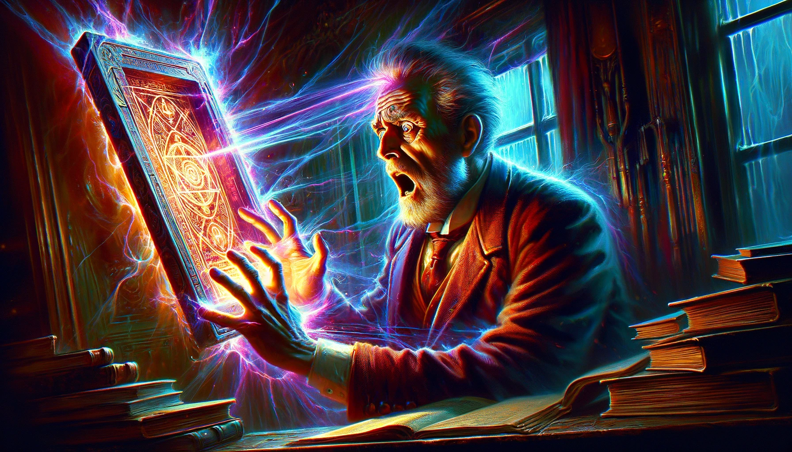

# The Man Who Found Out, Algernon Blackwood

## Summary

"The Man Who Found Out" by Algernon Blackwood is a chilling tale of discovery and existential dread. In the story, a renowned professor unearths ancient tablets that purportedly contain the ultimate knowledge and truth about the universe and human existence. Driven by insatiable curiosity, he deciphers these tablets, only to be confronted with horrifying revelations about life and the cosmos that lead him to despair. The knowledge proves too burdensome for the human psyche, driving the professor to a state of profound disillusionment and existential crisis. Ultimately, the story explores the perilous pursuit of forbidden knowledge and the profound impact such revelations can have on the human mind, culminating in a tragic conclusion that questions the very nature of enlightenment and the cost of uncovering the deepest truths of existence.

* Style: Gothic-inspired digital painting with a vibrant yet dark color palette to accentuate the story's mood of mystery, existential dread, and the supernatural.

A haunting portrayal of the professor standing at the threshold of an ancient, shadowy archway, holding the glowing tablets, with the chaotic vortex of knowledge and madness swirling around him. In this Gothic-inspired digital painting with a vibrant yet dark color palette, the archway serves as the gateway between the known world and the realm of forbidden knowledge. The professor is at the center, illuminated by an otherworldly glow from the tablets, which casts stark, eerie shadows across his determined yet fearful face. The background merges scenes from the story: the silhouette of the archaeological site at dusk, the chaotic study filled with scattered papers and artifacts, and the ethereal fog of isolation, all converging into the swirling vortex that represents the descent into madness. The intense colors of the vortex—deep blues, purples, and reds—contrast with the darkness enveloping the edges of the scene, drawing the eye to the professor and the tablets. This powerful image captures the story's themes of curiosity, discovery, and the perilous pursuit of knowledge, making it an ideal cover for "The Man Who Found Out."

## Scenes

### The Discovery of the Tablets

In a remote archaeological site, under the glow of lanterns and amidst ancient ruins, a professor and his team unearth a set of mysterious tablets. The tablets, covered in indecipherable symbols and surrounded by artifacts of a long-lost civilization, hint at containing forbidden knowledge. The atmosphere is charged with anticipation and a hint of foreboding as the professor examines the tablets with a mix of excitement and awe.

A team of archaeologists, led by a distinguished professor, uncovers ancient tablets amidst the ruins of a civilization at dusk. The scene is to be depicted in a Gothic-inspired digital painting with a vibrant yet dark color palette, emphasizing the eerie glow of lanterns illuminating the characters’ faces and the mysterious symbols on the tablets. The ruins should appear both majestic and foreboding, with shadows hinting at hidden dangers. The professor, central to the composition, is portrayed with an expression of awe and curiosity, his features sharply defined against the dimming light of the setting sun.

### Deciphering the Tablets

In his study, filled with books, ancient manuscripts, and artifacts, the professor labors over the tablets. The scene shows him surrounded by reference materials, working late into the night under the light of a desk lamp. Papers are strewn about, filled with notes and translations, as he slowly begins to unlock the secrets inscribed on the ancient stone.

The professor is hunched over the tablets in his cluttered study, surrounded by books and artifacts. This scene, rendered in the specified artistic style, should focus on the contrast between the warm light of the desk lamp and the surrounding darkness, symbolizing the pursuit of forbidden knowledge. The room is filled with shadows, with the professor’s intense concentration evident in his furrowed brow and the determined set of his jaw. The tablets glow faintly, suggesting their otherworldly origin.

### The Revelation

The moment of epiphany occurs in the professor's study. The professor sits back in his chair, a look of horror and disbelief on his face, as he comprehends the cosmic truths revealed by the tablets. The room seems to close in on him, the shadows cast by his lamp take on menacing shapes, and the weight of the knowledge he has uncovered is palpable.

Captured in a moment of shock, the professor recoils from the tablets as if struck by the force of the knowledge they impart. The Gothic-inspired digital painting style will accentuate the play of light and shadow across his horrified face, with vibrant colors highlighting the supernatural aura emanating from the tablets. The study should appear claustrophobic, with the walls seeming to close in, and the shadows forming ominous shapes, as if the room itself reacts to the revelation.

### Consultation with a Colleague

Seeking validation or perhaps a different interpretation, the professor visits a colleague. They sit in a dimly lit, book-lined office, the tablets spread out on a desk between them. The colleague's expression changes from skepticism to concern as he listens to the professor's findings, the gravity of the situation becoming increasingly clear.

In a dim, book-lined office, the professor and his colleague are depicted with the tablets between them. The Gothic-inspired style will emphasize the contrast between the warm, yet insufficient light of a single desk lamp and the vast darkness of the room, suggesting the overwhelming nature of the knowledge discussed. Both characters are shown in profile, leaning towards each other, their expressions a mix of fear and fascination, as they ponder the implications of the discovery.

### The Burden of Knowledge

Alone again, the professor is depicted in a state of deep distress. He wanders through a dense fog, a metaphor for his confusion and disillusionment, clutching the translated text. His isolation is emphasized by the empty, mist-shrouded landscape around him, symbolizing the alienation brought by his newfound understanding.

The professor wanders alone through a foggy landscape, clutching the translated text. This scene, utilizing the specified artistic style, should convey a sense of isolation and despair, with the vibrant colors of the professor’s clothing stark against the monochrome, mist-enshrouded background. The fog serves as a visual metaphor for his confusion, enveloping him and obscuring his path, with his posture bowed under the weight of his discovery.

### The Descent into Madness

In a dark, cluttered room, the professor is shown in the throes of madness. His study, once a place of intellectual pursuit, now looks like the den of a madman, with papers, books, and artifacts scattered chaotically. The professor himself is disheveled, with wild eyes and an expression of utter despair, as he rants to unseen voices.

The professor’s study, now a chaotic reflection of his mind, is the setting. In this Gothic-inspired digital painting, the room is to be depicted with exaggerated perspectives, making it appear twisted and distorted. The vibrant colors of scattered papers and artifacts contrast with the dark shadows creeping along the walls. The professor, disheveled and wild-eyed, stands at the center, his hands clutching his head, as if trying to block out the knowledge that torments him.

### The Final Decision

A stark scene in the professor's bedroom, where he prepares a vial of poison. The room is meticulously tidy, in contrast to his disordered study, with the vial clearly in focus on the bedside table. The professor's resolve is evident in his calm but resolute expression, a stark contrast to his previous turmoil.

This scene is set in the professor’s bedroom, starkly illuminated by moonlight. The Gothic-inspired style should emphasize the sharp contrast between the dark shadows and the silver light reflecting off the vial of poison on the bedside table. The professor is portrayed with a calm yet resigned expression, highlighting the finality of his decision. The room is neat and orderly, in stark contrast to his chaotic study, suggesting a moment of clarity amid despair.

### The Aftermath

Colleagues and friends gather in the professor's study, now a scene of mourning. The mood is somber as they discuss the professor's legacy and the mysterious circumstances of his demise. The tablets lie forgotten on a shelf, a silent testament to the forbidden knowledge they contain.

Friends and colleagues gather in the professor’s study, now a somber place of mourning. The scene, rendered in the chosen artistic style, should focus on the subdued colors of the mourners’ attire against the rich, dark hues of the room, with the tablets relegated to a shadowy corner, almost forgotten. The expressions of the characters convey a mix of sadness and confusion, as they grapple with the loss and the mystery left behind.

### The Destruction of the Tablets

In a final act of caution, a trusted colleague takes the tablets to a remote location for destruction. The scene is set at night, with the tablets placed on a pile of wood. The colleague stands back, torch in hand, casting long shadows, as he sets fire to the pyre, the flames consuming the tablets and the dangerous knowledge they held.

A trusted colleague sets fire to the tablets in a remote, moonlit clearing. The scene, depicted in the Gothic-inspired digital painting style, should be dramatic, with the vibrant flames consuming the tablets casting long, sinister shadows. The colleague’s silhouette is shown against the fire, his posture one of determined resolution, as the flames reflect in his eyes, symbolizing the eradication of dangerous knowledge.

### The Legacy

The closing scene shows a new generation of scholars in a library, discussing the professor's work with a mix of reverence and caution. The tablets are gone, but their legend persists, captured in notes and whispers among those who seek knowledge. The atmosphere is one of curiosity tempered with respect for the boundaries of human understanding, closing the story on a note of contemplation about the pursuit of knowledge and its consequences.

A new generation of scholars debates the professor’s work in a library filled with soft, ambient light. This scene, utilizing the specified artistic style, contrasts the vibrant colors of the scholars’ modern attire with the dark, rich tones of the library’s ancient books and woodwork. The atmosphere is one of respectful curiosity, with the scholars shown in animated discussion, yet the shadows cast by the books hint at the dangerous allure of forbidden knowledge, maintaining the story’s theme of caution.

