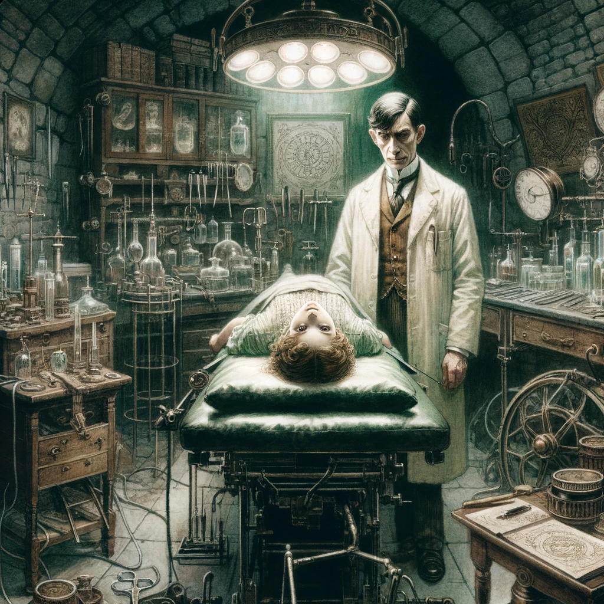

# The Great God Pan, Arthur Machen

## Story Synopsis

"The Great God Pan" by Arthur Machen is a chilling tale that explores the thin veil between the natural world and the supernatural, invoking ancient pagan deities and the mysteries of the human psyche. The story begins with an experimental surgery performed by Dr. Raymond on a young woman named Mary, aiming to allow her to see the god Pan. This experiment results in tragedy, leading to Mary's eventual madness and death. As the narrative unfolds, a series of mysterious and unsettling events occur, linking various characters to the initial experiment through a complex web of relationships and coincidences. Central to these events is the enigmatic figure of Helen Vaughan, whose malevolent influence and true nature gradually reveal the horrifying consequences of Raymond's experiment. Machen masterfully weaves a narrative that delves into themes of forbidden knowledge, the interplay between pagan mythology and Victorian morality, and the dark undercurrents lurking beneath the surface of reality, culminating in a haunting conclusion that underscores the peril of meddling with forces beyond human comprehension.

Style: Victorian-era watercolor paintings with muted, earthy tones, perfectly capturing the story's haunting atmosphere and intricate details.

A haunting depiction of Helen Vaughan standing at the threshold of an ancient forest, with the shadowy figure of Pan looming behind her, embodying the story's themes of the unknown and the supernatural. This Victorian-era watercolor should capture Helen in the foreground, her expression enigmatic and alluring, dressed in a period-appropriate gown that merges with the forest floor, suggesting her connection to the natural and the unnatural. The forest should be rendered in deep, lush greens and browns, with ancient trees framing the scene, their branches stretching towards the sky and subtly morphing into the barely visible, imposing silhouette of Pan, whose features are hinted at but not fully defined, evoking a sense of mystery and dread. The background should transition from the dense, dark woods to a lighter, more ethereal glow at the horizon, symbolizing the thin veil between reality and the mythical realm. The overall palette should be rich and earthy, with touches of surreal colors to highlight the mystical aspects, ensuring the image is both beautiful and unsettling, drawing the viewer into the story's eerie atmosphere.

## Scenes

### The Experiment

In a secluded laboratory, Dr. Raymond explains his revolutionary theory to a friend, Clarke, that there exists a realm beyond human perception. He believes he can grant a person the ability to see this realm by performing a risky brain surgery. The scene shows Dr. Raymond preparing the young woman, Mary, for the procedure amidst the cluttered, ominous interior filled with surgical tools, ancient texts, and arcane symbols, highlighting the blend of science and mysticism.

Dr. Raymond prepares Mary for a groundbreaking surgery in a dim, cluttered laboratory. This Victorian-era watercolor should emphasize the contrast between the dimly lit, shadow-filled room and the focal point where Mary lies on a surgical table, her expression one of innocent trust and apprehension. Dr. Raymond, depicted with sharp, intelligent features and a determined gaze, leans over her, surrounded by a chaotic assortment of surgical tools, arcane books, and mysterious symbols etched into equipment and walls. The colors should be muted, with a focus on browns, greens, and grays, highlighting the blend of science and the occult.

### The Consequence

After the experiment, Mary is found in a state of shock, her eyes wide with terror, unable to articulate her experience. The room is dimly lit, with Mary seated, looking vacantly into the distance, surrounded by the concerned figures of Dr. Raymond and Clarke. The atmosphere is heavy with the realization that something profound and unsettling has occurred.

Mary sits in shock, her gaze lost and haunted, in the aftermath of the experiment. The scene should be painted with a focus on her pale, distressed face under a harsh light, contrasting with the surrounding darkness of the room. Dr. Raymond and Clarke are present, their expressions filled with concern and horror. The room's details, such as scattered papers, dimly glowing lamps, and the shadowy corners filled with scientific paraphernalia, should enhance the eerie atmosphere. The overall color palette should remain subdued, with touches of warmer colors on the characters' faces to draw attention to their emotional states.

### A Mysterious Child

Years later, in a tranquil rural setting, a young girl named Helen Vaughan is introduced, playing alone in the woods with an unsettling air of independence and mystery. The scene captures Helen amidst ancient trees, with a hint of otherworldly presence in the air, suggesting her connection to the experiment and the unseen world.

Helen Vaughan plays alone in a vibrant, yet somehow unsettling, forest. This watercolor scene should capture the bright greens and earth tones of the woods, with Helen at the center, her hair dark against her light dress, giving her an ethereal quality. The forest around her should appear almost alive, with twisted tree shapes and shadows suggesting hidden eyes or figures. Helen's expression should be enigmatic, hinting at her unnatural origins and the dark secrets she harbors. The use of light and shadow should create a sense of depth and mystery, inviting the viewer to look closer.

### Unexplained Tragedies

A series of tragic events unfold involving individuals who encounter Helen, now grown. Each scene depicts a moment of horror or madness that strikes those around her, such as a man glimpsing something horrifying in his final moments or a society gathering turned grim, with Helen at the center, her enigmatic smile hinting at her involvement.

Illustrate a sequence of incidents linked to Helen, now an adult, her sinister influence manifesting. Each tragedy should be depicted with a focus on the victim's horror-stricken face, with Helen in the background or shadows, her presence barely noticeable yet palpably ominous. Use muted, darker shades to convey the mood of fear and despair, with occasional stark highlights to draw attention to key elements like a terrified gaze or Helen's enigmatic smile. The composition should balance the depiction of ordinary Victorian settings turned nightmarish by the subtle intrusion of the supernatural.

### The Investigation

Clarke, now deeply involved in unraveling the mystery, examines documents and letters in his study, piecing together the connections between Dr. Raymond's experiment, Mary, and the subsequent tragedies. The scene is cluttered with papers, photographs, and artifacts, with Clarke's focused expression illuminated by lamp light, indicating the depth of the unfolding mystery.

Clarke studies documents and artifacts in his study, the room bathed in the soft glow of a lamp. The scene should be rich in detail, with papers, letters, and photographs spread out before him, each piece hinting at the deeper mystery. Clarke's figure, consistently depicted with a thoughtful expression, leans into the light, highlighting his determination to uncover the truth. The background should be filled with shelves of books and curiosities, painted in warm, muted tones to contrast with the cooler shadows, emphasizing the depth of the room and the isolation of the solitary figure within.

### Revelation in the Woods

A pivotal moment occurs in a dense forest, where a witness encounters Helen Vaughan in a clearing, transforming into a grotesque, otherworldly figure before disappearing. The forest is depicted as ancient and alive, with Helen at its heart, embodying the primeval and terrifying aspect of Pan, surrounded by eerie light and shadow.

Depict a witness's encounter with Helen transforming in a forest clearing. This scene should be dramatic, with the clearing acting as a stage for Helen's transformation under a beam of moonlight, casting long, eerie shadows. The forest should be painted in deep greens and blues, with hints of unnatural colors to suggest otherworldliness. Helen, in the midst of transformation, should be at once beautiful and terrifying, her features shifting, blurring the line between human and divine terror. The witness's figure, small and overwhelmed, should be positioned to emphasize the magnitude of the revelation.

### Helen Vaughan's Demise

Confronted by her true nature and the havoc she has wrought, Helen Vaughan, in a secluded room, takes her own life, transforming into a series of increasingly horrific forms before vanishing. The room is sparse and shadowy, with Helen's figure caught in the act of transformation, capturing the climax of her tragic and mysterious existence.

In a sparsely furnished room, Helen has taken her life, her body undergoing grotesque transformations. The focus should be on Helen's form, captured in a series of dissolving shapes and eerie colors that defy natural law, suggesting her connection to Pan and the unnatural. The room's simplicity, with bare walls and minimal furniture, should contrast starkly with the complexity of her transformation, highlighting the tragedy of her existence. The palette should be darker, with sudden flashes of unnatural colors to emphasize the supernatural aspect of her end.

n/a (content policy)

### Aftermath

The final scene shows Clarke and a few others who have been touched by the events, gathered in a somber setting, perhaps a study or a quiet pub, reflecting on the story's events. The mood is reflective and subdued, with the characters portrayed in a state of contemplation, surrounded by reminders of their ordeal, such as documents, a portrait of Helen, and natural elements like leaves or branches, symbolizing the enduring mystery and impact of their encounter with the great god Pan.

The survivors reflect on their experiences in a subdued, contemplative setting. This final scene should bring the characters together in a Victorian parlor or study, their expressions weary yet enlightened by their ordeal. The room should be filled with mementos of their journey—open books, letters, perhaps a portrait of Helen—and windows showing the first light of dawn to symbolize hope and closure. The watercolor technique should blend soft light with the room's rich details, using a palette that suggests warmth and recovery, contrasting with the darker tones of the previous scenes.

## References

* [The Great God Pan, Wikipedia](https://en.wikipedia.org/wiki/The_Great_God_Pan)
