# The Haunter of the Dark, H. P. Lovecraft

## Summary

"The Haunter of the Dark" by H. P. Lovecraft tells the chilling tale of Robert Blake, a young writer with a fascination for the occult, who discovers the sinister Church of the Starry Wisdom in Providence, Rhode Island. Compelled by morbid curiosity, Blake investigates the church and uncovers an ancient, evil artifact known as the Shining Trapezohedron—a window to other dimensions and a summoning tool for a malevolent entity called the Haunter of the Dark. The Haunter, which thrives in darkness and fears the light, becomes fixated on Blake, stalking him from the shadows. As a storm plunges the city into darkness, Blake's fears escalate, culminating in a terrifying finale where he is besieged by the unseen horror, ultimately leading to his mysterious death. His last writings, frantic and disjointed, hint at the unspeakable terror that engulfed him, leaving a legacy of dread intertwined with the malevolent presence that lurks in darkness, ever waiting for the lights to go out.

* Style: Expressive ink wash with digital color overlays, capturing the story's ethereal horror and contrasting darkness with bursts of ominous light.

Robert Blake stands at the entrance of the Church of the Starry Wisdom, clutching the Shining Trapezohedron, as the Haunter looms ominously behind him. For this cover image, the composition should be both grand and evocative, capturing the essence of fear, curiosity, and the unknown. Blake is positioned in the foreground, facing the viewer, with the glowing Trapezohedron in his hands casting unsettling light on his face—showing a mix of fear, awe, and determination. The church, depicted in expressive ink wash, rises majestically and menacingly in the background, its architecture exaggerated to enhance its gothic horror, with shadows and textures highlighted using digital color overlays in shades of dark blues, purples, and ominous greens. The Haunter, an imposing presence of shadows and eyes, looms over the church and Blake, its form barely discernible but unmistakably terrifying, blending with the stormy sky to suggest its otherworldly nature. This image combines the key elements of the story—the curiosity that leads to darkness, the ancient and malevolent force that lurks behind, and the thin veil between our world and the horrors beyond—using the artistic style of expressive ink wash with digital color overlays to create a visual that is both captivating and chilling.

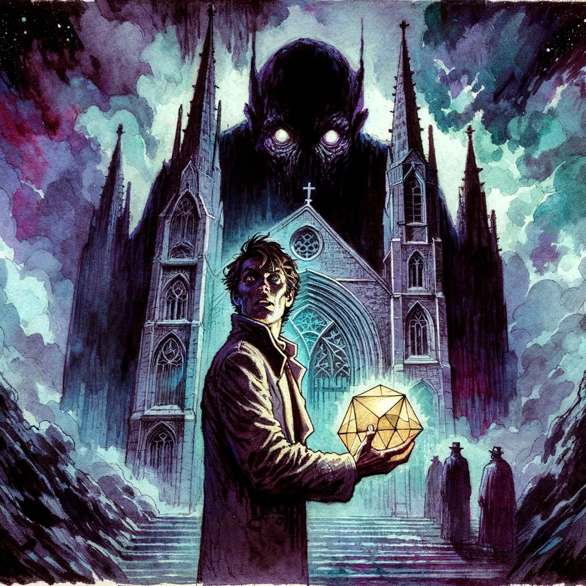
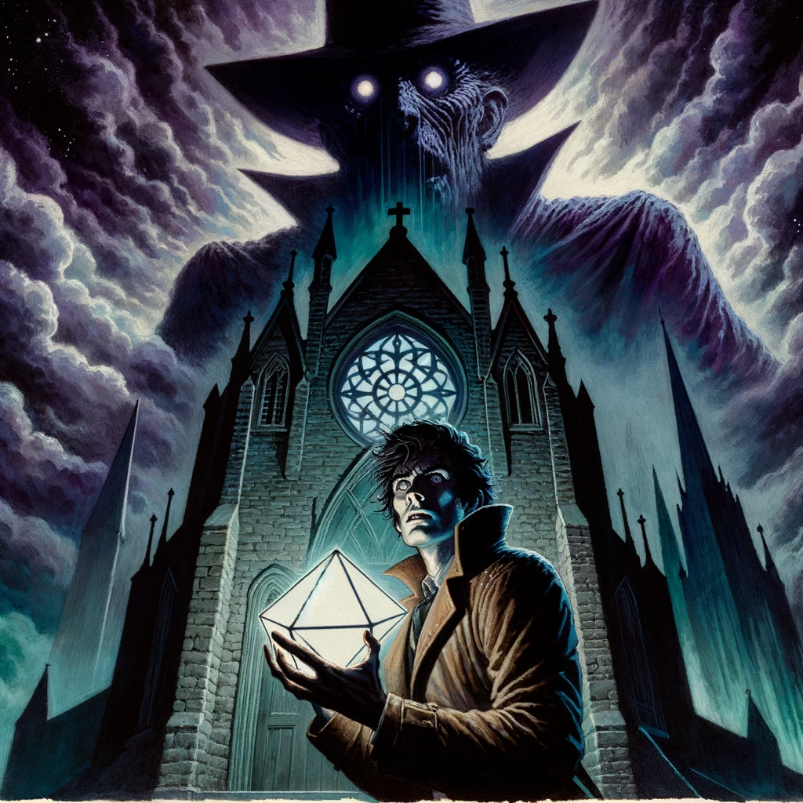

## Scenes

### 1. Discovery of the Church of the Starry Wisdom

Robert Blake, a curious writer with an interest in the occult, stands at the threshold of the abandoned Church of the Starry Wisdom in Providence, Rhode Island. The scene captures Blake’s silhouette against the decaying gothic architecture of the church, his face illuminated by a mixture of fear and fascination. The ominous church looms under a stormy sky, its broken windows like dark eyes and the door ajar, as if inviting him into its secrets. Shadows cling to the corners, suggesting the presence of something unseen.

Robert Blake stands before the imposing, dilapidated Church of the Starry Wisdom under a tumultuous sky. This scene should be composed with Blake in the foreground, looking small and vulnerable against the massive, foreboding structure of the church. The church should be depicted with exaggerated gothic features, its broken windows and open door inviting yet menacing, using expressive ink wash to create deep shadows and digital color overlays to highlight the eerie, unsettling atmosphere with shades of dark blues and purples. Blake, depicted with a mix of curiosity and fear, wears a coat that flutters slightly in the wind, his hair a mess from the breeze, his face showing a complex emotion of fascination and dread.

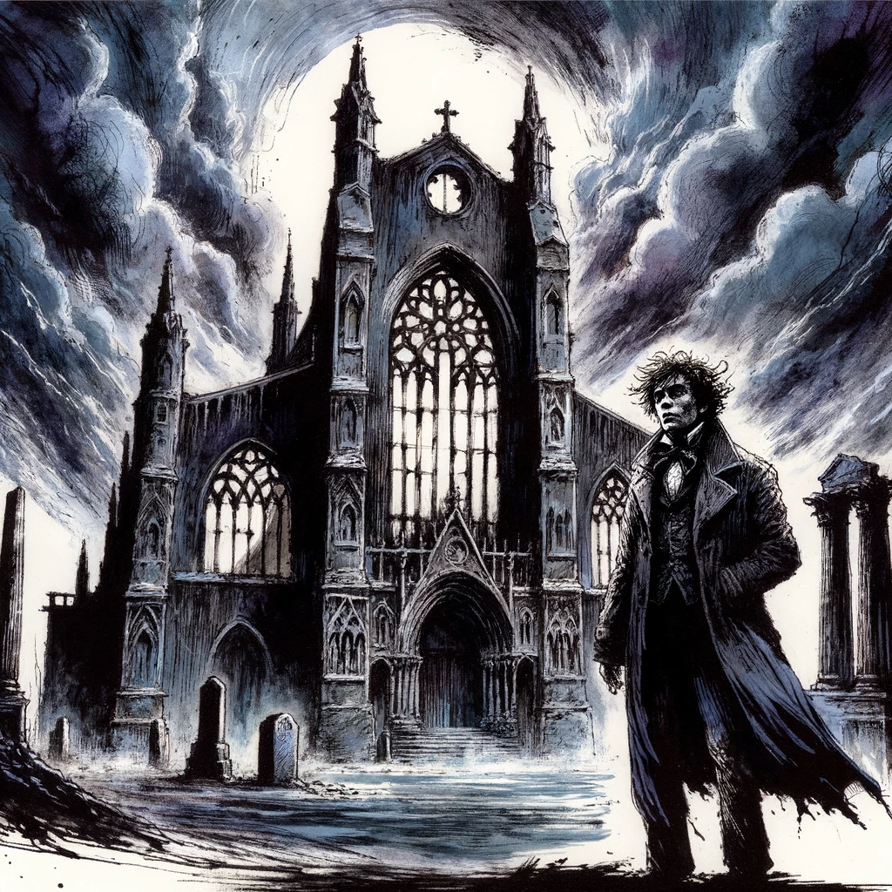
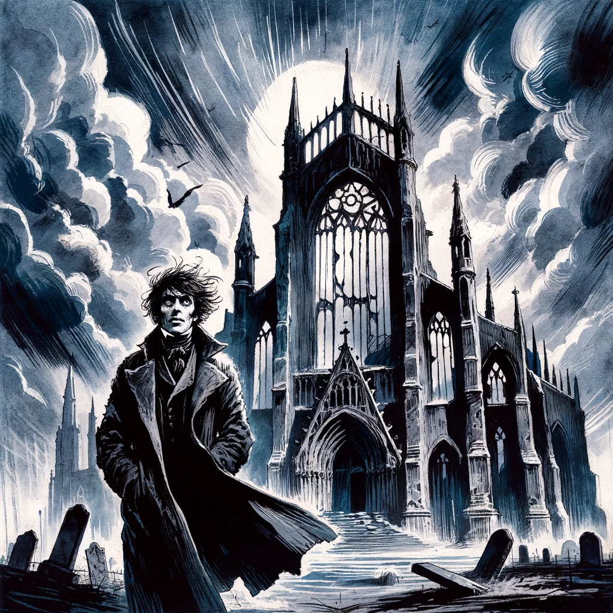

### 2. Blake Finds the Shining Trapezohedron

Inside the church, Blake discovers a hidden, dust-laden room that houses the ancient, mysterious artifact known as the Shining Trapezohedron. The artifact glows ominously in an otherwise dark, cluttered room filled with arcane books and symbols. Blake, his back to the viewer, leans over the artifact, his shadow stretched long behind him. The glow from the Trapezohedron casts unsettling lights and shadows, hinting at the alien dimensions and the malevolent presence it can summon.

Inside the church's hidden room, surrounded by arcane relics and books, Blake discovers the glowing Shining Trapezohedron. The composition focuses on the contrast between the artifact's ominous glow and the surrounding darkness. The room is cluttered with esoteric symbols and ancient texts, painted in expressive ink wash to emphasize the textures and shadows, while digital color overlays enhance the glow of the Trapezohedron with unsettling shades of green and yellow. Blake should be shown from behind, leaning towards the artifact, his shadow extended and distorted on the walls, suggesting the danger of his curiosity.

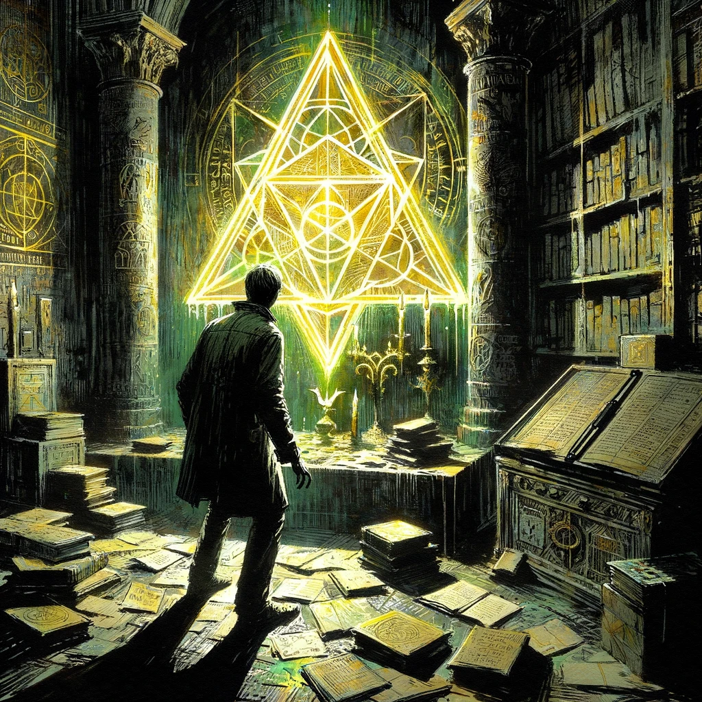
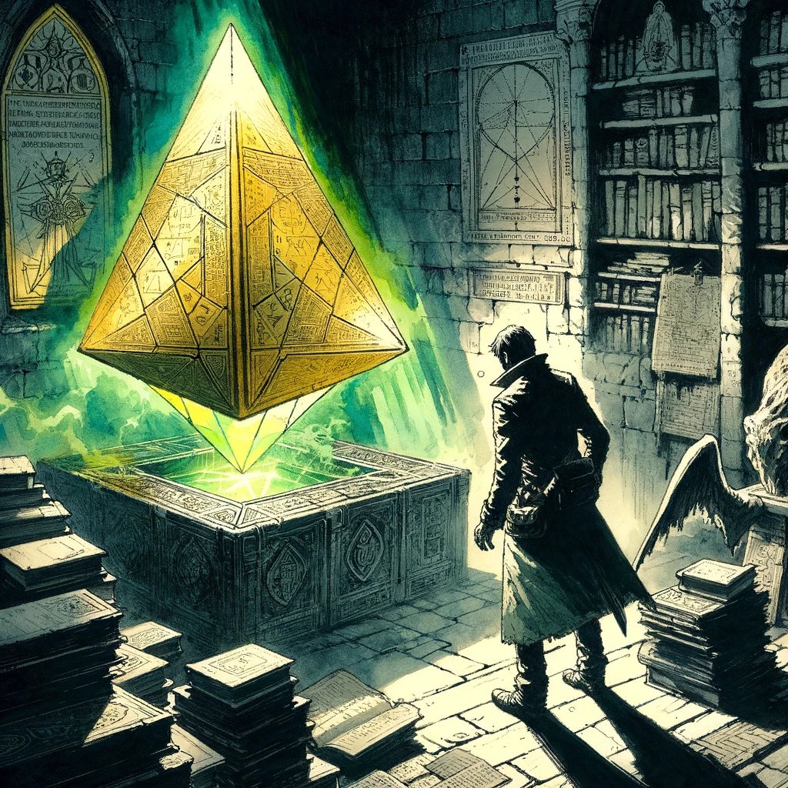

### 3. Summoning of the Haunter of the Dark

The scene is a chilling tableau of the moment the Haunter is unwittingly summoned by Blake’s curiosity. The room is now swallowed in shadow, except for the eerie glow of the Shining Trapezohedron. Outside, the storm intensifies, lightning briefly illuminates the room, revealing a fleeting glimpse of the Haunter’s terrifying visage—a mass of darkness with glimmering, malevolent eyes that seem to stare directly at the viewer, embodying pure, ancient evil.

This scene captures the moment of the Haunter's summoning, with the room plunged into darkness except for the artifact's eerie glow. Lightning from the storm outside momentarily illuminates the scene, revealing a fleeting, horrifying glimpse of the Haunter—a formless shadow with piercing, luminous eyes. Use expressive ink wash for the shadows to create a fluid, menacing appearance for the Haunter, while digital color overlays highlight the lightning and the artifact's glow, casting everything in a sharp contrast of light and utter darkness. The emphasis is on the Haunter's eyes and the artifact, creating a focal point of horror.

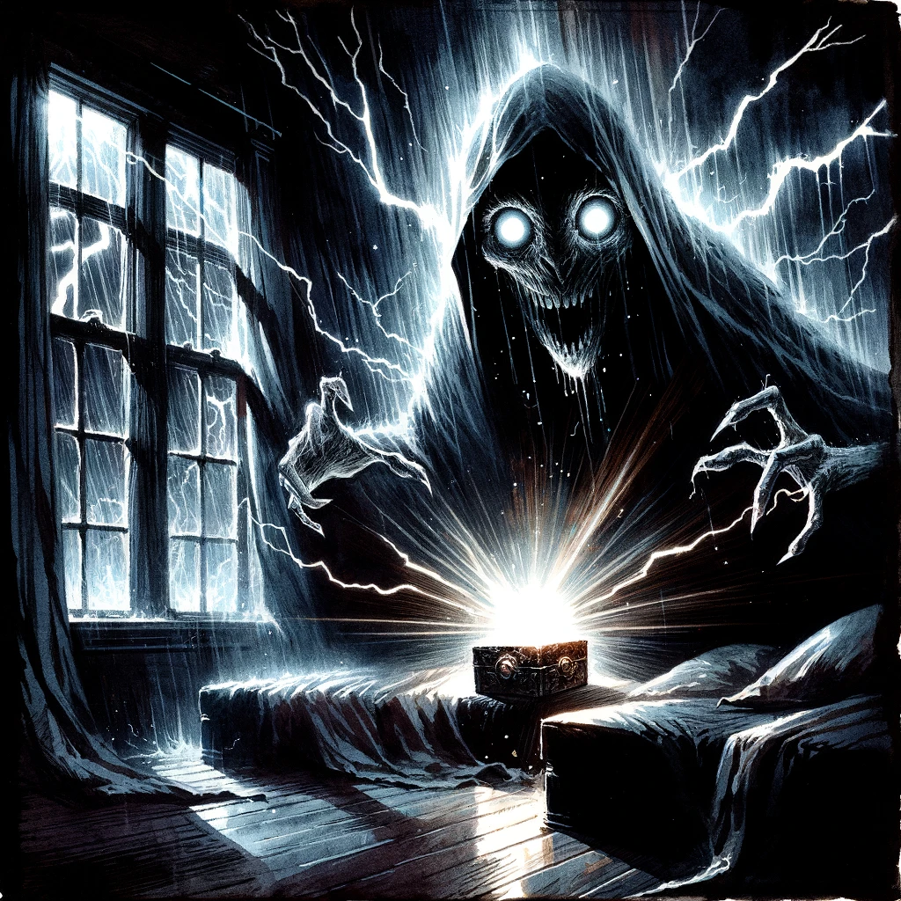
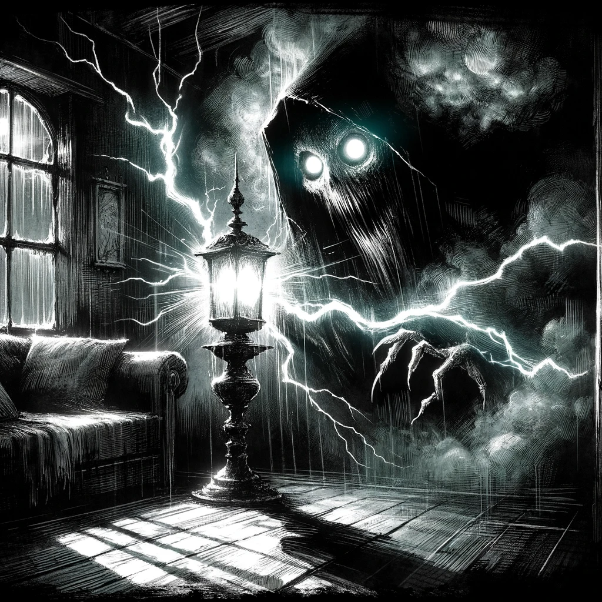

### 4. Blake's Growing Paranoia and Fear

Blake, now back in his study, is surrounded by his notes and books about the occult, but his attention is fixed on the storm outside. The room is bathed in the soft, safe glow of his lamp, contrasting with the darkness beyond his window. His expression is one of deep fear and paranoia, as if he feels the eyes of the Haunter upon him. Shadows cast by the lamp seem to morph into sinister shapes, suggesting the encroaching presence of the Haunter, blurring the line between reality and Blake’s fear-induced hallucinations.

Depict Blake in his study, surrounded by occult notes and books, as he stares apprehensively at the storm outside. The room is warmly lit by a lamp, creating a safe haven against the dark storm depicted through the window. Utilize expressive ink wash to detail Blake’s cluttered study and his frazzled appearance, emphasizing his growing paranoia with exaggerated shadows that seem to morph into sinister shapes. Digital color overlays should be used to create a stark contrast between the warm interior and the cold, blue-black of the storm outside, highlighting the boundary between safety and the unknown terrors lurking in the darkness.

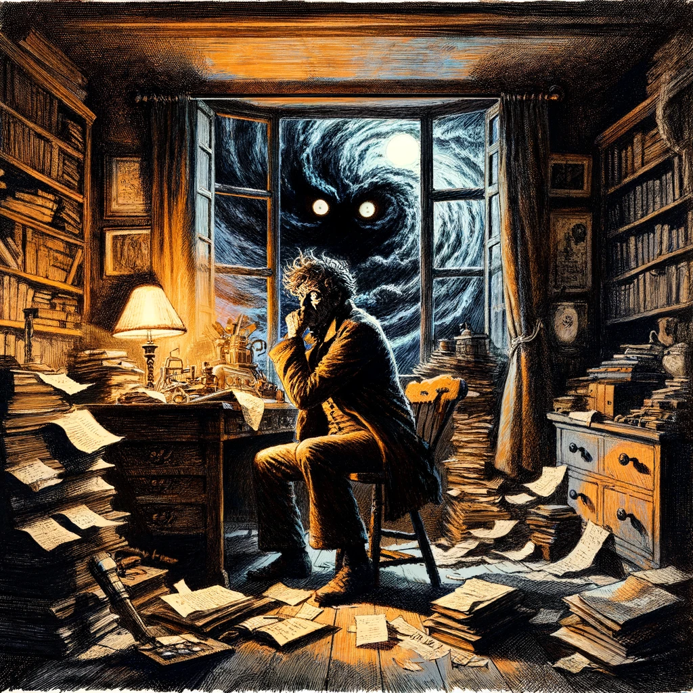
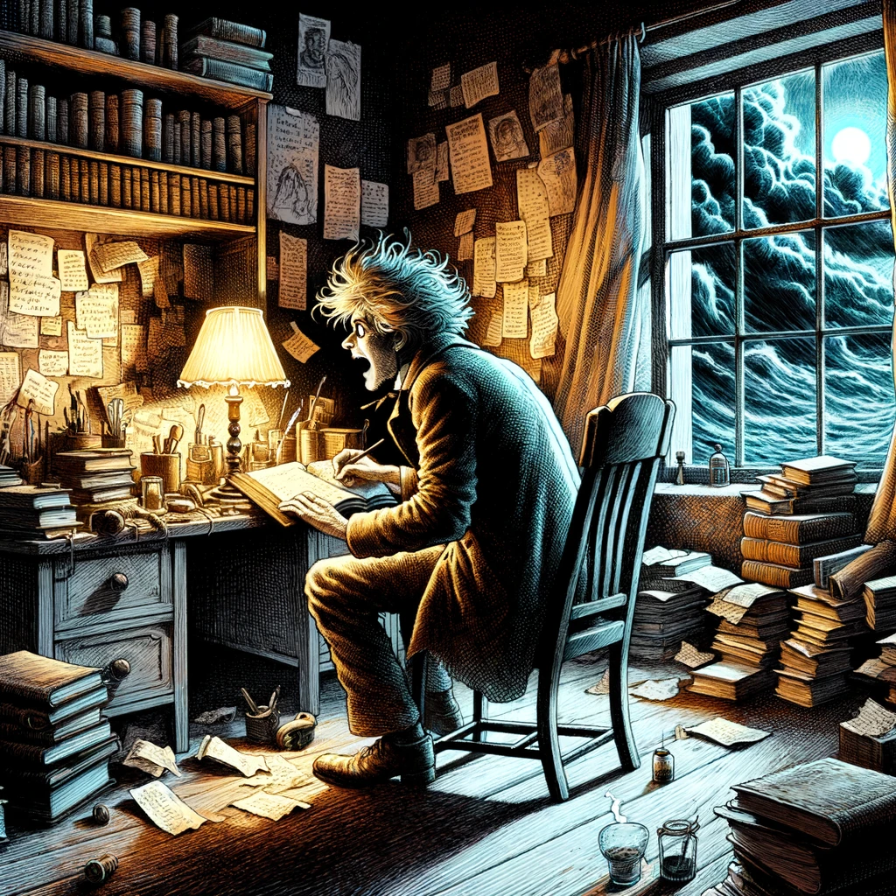

### 5. The Final Night

The ultimate confrontation with the Haunter of the Dark. Blake’s room is plunged into darkness, the only light coming from his frantic scribbling as he attempts to document his terror in the final moments of his life. The ominous, almost palpable presence of the Haunter fills the room, suggested by a deeper darkness creeping towards Blake from all sides. His face is a mask of absolute terror, his hands trembling as he writes, the storm outside mirroring the chaos within. Lightning flashes intermittently, illuminating the encroaching shadows, hinting at the formless horror that is the Haunter, now nearly upon him.

Capture the climax of Blake's terror as he is enveloped by darkness, the only light coming from his desperate attempt to document his fear. The room should be almost entirely dark, with expressive ink wash creating an overwhelming sense of encroaching shadow. Digital color overlays can be used to illuminate the scene with intermittent lightning flashes, revealing the horror of Blake’s final moments. His face should be depicted with an expression of absolute terror, the shadows around him almost alive, suggesting the presence of the Haunter. This scene is about the palpable, visceral fear of the unknown.

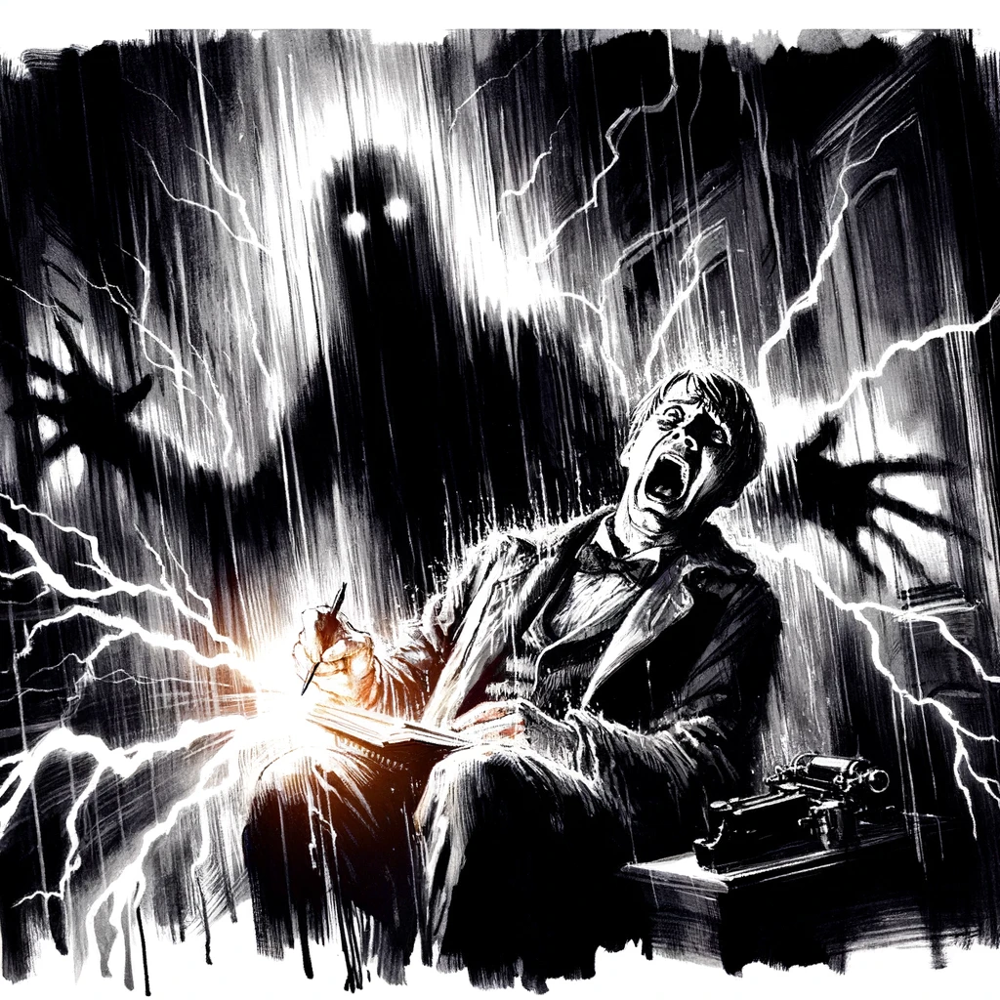
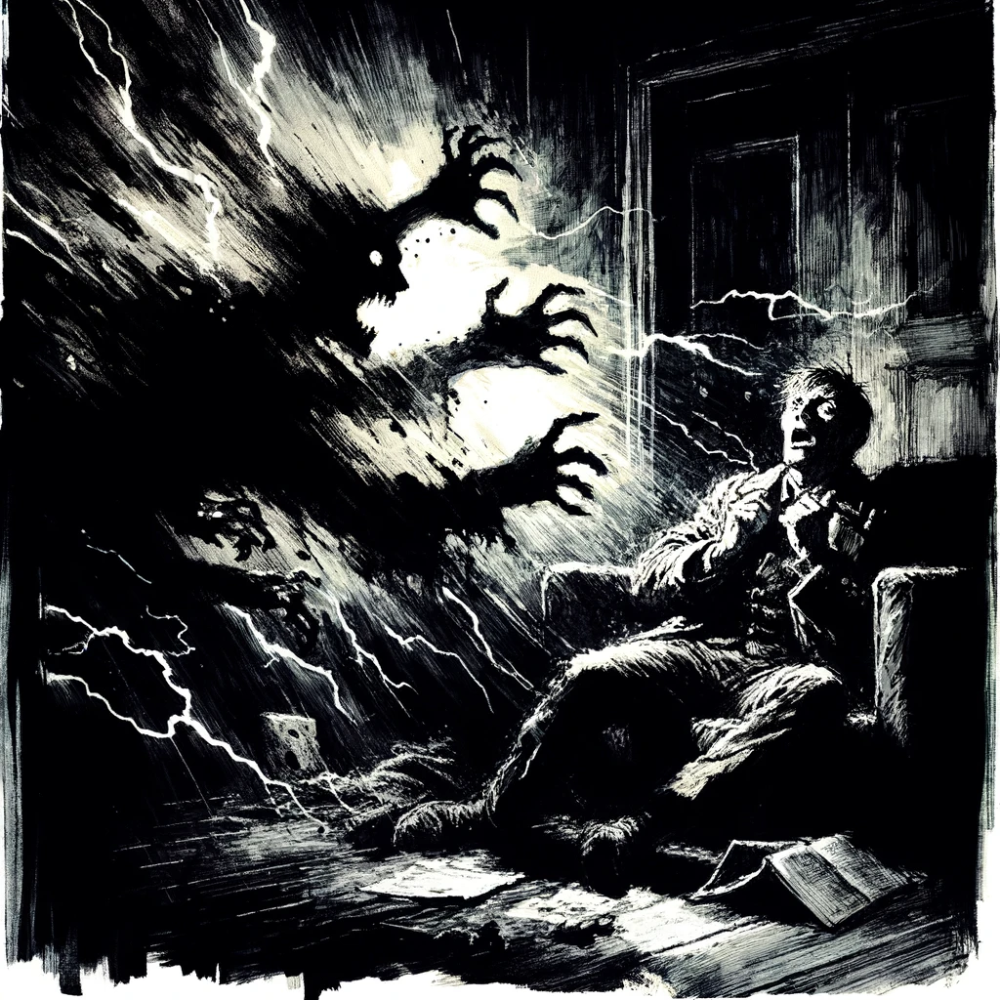

### 6. Blake's Mysterious Death

The aftermath is seen through the eyes of the discoverers of Blake’s body. His room is shown in disarray, with his notes scattered about—a testament to his final moments of madness and terror. Blake is slumped over his desk, his hand still clutching a pen, his face frozen in an expression of horror. The window is wide open, suggesting the path through which the Haunter might have entered, or perhaps an attempt by Blake to let in the light that could repel the darkness. The storm has passed, leaving a deceptive calm that belies the horrific events of the night.

In the aftermath, Blake is found slumped over his desk in a room showing signs of his last desperate moments. The scene should be calm after the storm, with morning light filtering through the window, contrasting the horror of the night. Use expressive ink wash to detail the disarray of Blake’s study and his lifeless form, with digital color overlays providing a somber light to the scene. His face, still frozen in horror, and the open window suggest the supernatural terror that overtook him. The scene is a quiet, chilling testament to the unseen horror that claimed Blake.

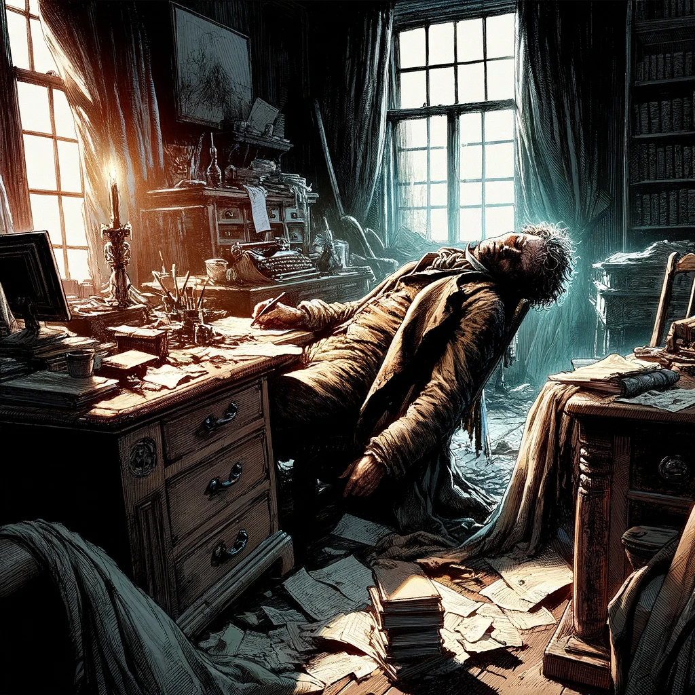
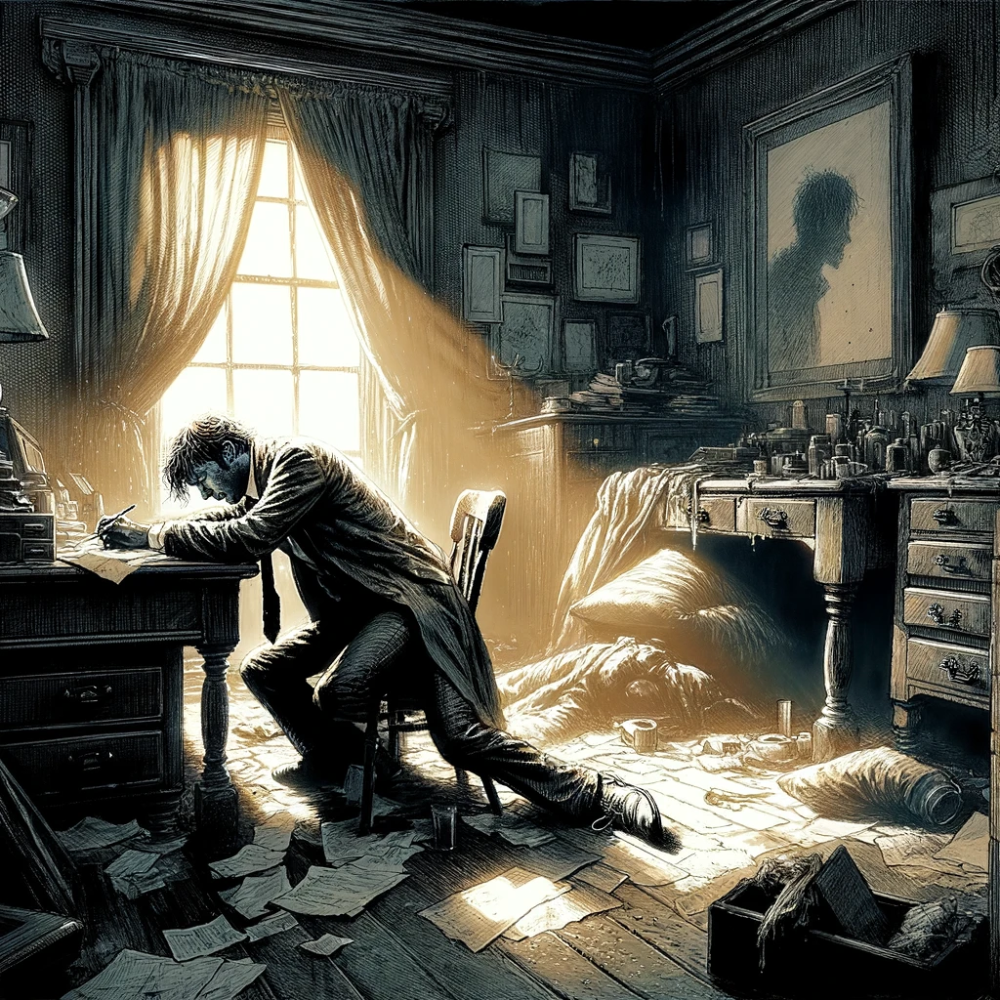

