# The Shadow Over Innsmouth, H. P. Lovecraft

## Summary

"The Shadow Over Innsmouth" unfolds as a chilling narrative of Robert Olmstead's visit to the decaying, shunned seaport of Innsmouth. Intrigued by tales of the town's alienage and decay, Olmstead's exploratory journey quickly descends into a horrifying discovery of Innsmouth's dark secret: the town's inhabitants have engaged in a pact with deep-sea creatures, the Deep Ones, exchanging human sacrifices for gold and fish, leading to a hybrid offspring that blurs the line between human and aquatic entity. As Olmstead delves deeper, he uncovers his own ancestral connection to these beings, culminating in a terrifying realization of his inevitable transformation and a destiny intertwined with the fate of Innsmouth itself. His escape from the town is marred by harrowing encounters with its grotesque residents and the eldritch truth of his lineage, leaving him haunted by the prospect of his own metamorphosis into one of the Deep Ones.

* Style: Expressive digital painting with a chiaroscuro technique to emphasize the stark contrasts between light and dark, enhancing the eerie and mysterious mood of the story.

Olmstead stands on the desolate shoreline of Innsmouth, gazing out at a tumultuous sea under a stormy sky, with shadowy figures of townsfolk and Deep Ones emerging from the water and town behind him. This expressive digital painting should employ chiaroscuro to dramatically illuminate Olmstead from behind, casting his shadow long and mixing with those of the approaching hybrids, blending human and aquatic features. The turbulent sea and ominous clouds are rendered with dynamic, swirling brushstrokes, contrasting with the sharp, menacing silhouettes of the town and its half-seen inhabitants. Olmstead's figure, caught between the land and sea, town and abyss, should embody a moment of tragic realization, his posture one of both defiance and resignation. This powerful image, encapsulating the story's themes of identity, horror, and inevitability, will be both grand and emotionally evocative, perfect for the cover.

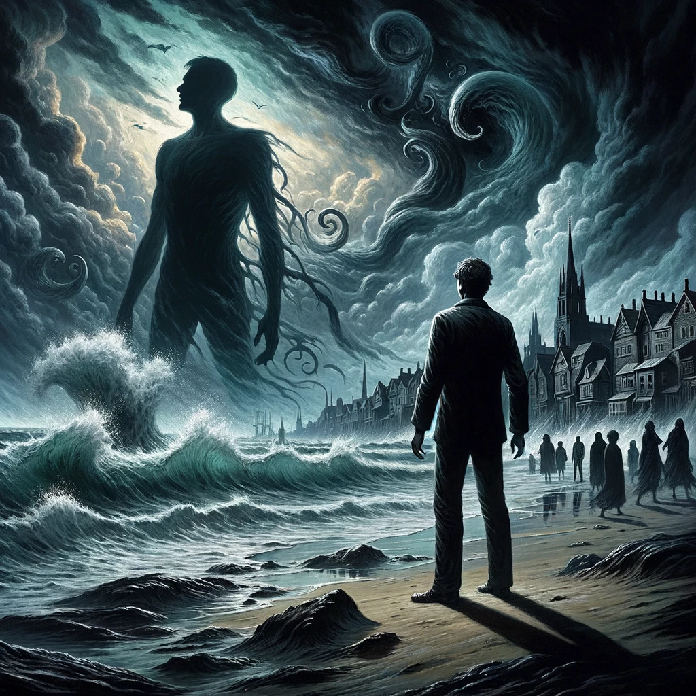

## Scenes

### Arrival in Innsmouth

Robert Olmstead arrives at the decrepit seaside town of Innsmouth, observing its dilapidated buildings, deserted streets, and the mysterious, unfriendly glares of the townspeople. The air is heavy with the scent of the sea and decay. Olmstead, carrying a small suitcase, stands at the town's entrance, a sign reading "Welcome to Innsmouth" barely visible through the overgrowth. The town's architecture is a mix of crumbling Georgian and Federal style, with a pervasive, unexplained sense of unease hanging over the scene.

Robert Olmstead stands at the decrepit entrance of Innsmouth, overshadowed by the decaying architecture. The expressive digital painting should capture Olmstead, a figure of curiosity and trepidation, against the backdrop of crumbling Georgian and Federal style buildings under a heavy, overcast sky. Utilize chiaroscuro to highlight his face and suitcase, contrasting sharply with the deep shadows of the alleyways and the foreboding welcome sign. The emphasis on light and dark will underscore the mystery and unease of this first encounter with Innsmouth.

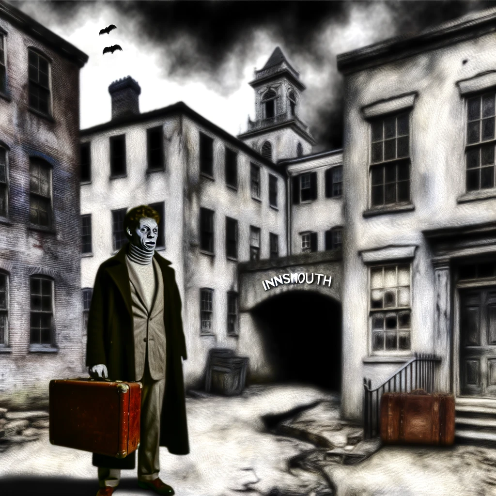
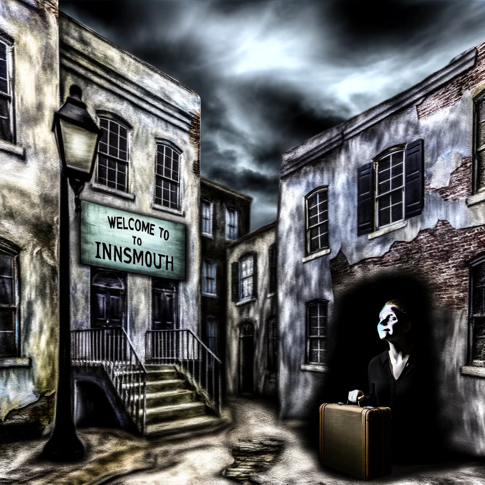

### Encounter with Zadok Allen

Olmstead meets Zadok Allen, the town drunk, in a neglected, weed-overgrown park. Zadok, an old man with wild eyes and tattered clothes, shares the horrifying history of Innsmouth's pact with the Deep Ones in exchange for prosperity, revealing the gradual transformation of the townsfolk into these aquatic beings. The setting is dim, under the shadow of twisted trees, with Zadok animatedly whispering secrets, a bottle clutched in his hand, while Olmstead listens, a mix of fascination and horror on his face.

In a neglected park, Olmstead meets Zadok Allen, whose wild, despairing eyes and disheveled appearance are illuminated by a sliver of moonlight. This expressive digital painting scene should focus on the intense exchange between Olmstead and Zadok, using chiaroscuro to enhance the contrast between Zadok's animated gestures and the dark, oppressive environment. Surround them with overgrown weeds and the silhouettes of twisted trees, creating a sense of isolation and foreboding as the secrets of Innsmouth are whispered in the shadows.

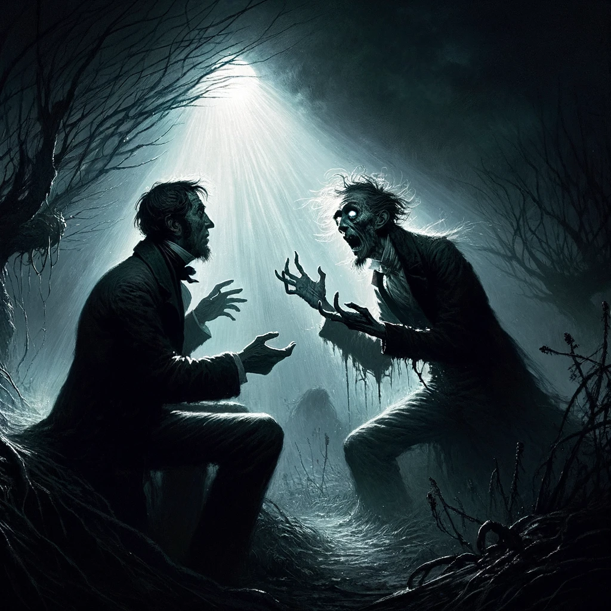
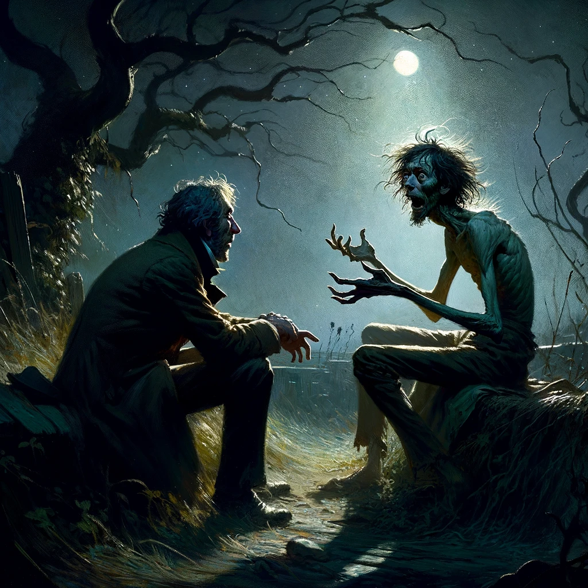

### The Gilman Hotel Experience

Olmstead spends a night at the Gilman Hotel, a once-grand but now decaying establishment. His room is stark, with peeling wallpaper and an air of neglect. The scene is tense as Olmstead, lying in bed, hears disturbing, non-human sounds from the neighboring rooms and the corridors. Shadows loom large as the moonlight filters through the grimy window, casting eerie patterns on the floor. Olmstead looks terrified, clutching a makeshift weapon, as the sounds grow closer.

Olmstead lies in a stark, dilapidated hotel room, moonlight casting eerie shadows across peeling wallpaper. The scene, rendered in expressive digital painting, should employ chiaroscuro to dramatize the contrast between the moonlit window and the engulfing darkness, with Olmstead's wide-eyed, tense expression caught in a beam of light as he grips a makeshift weapon. The surrounding shadows should seem almost alive, hinting at the unseen horrors lurking just beyond his room, embodying the palpable tension and fear of the unknown.

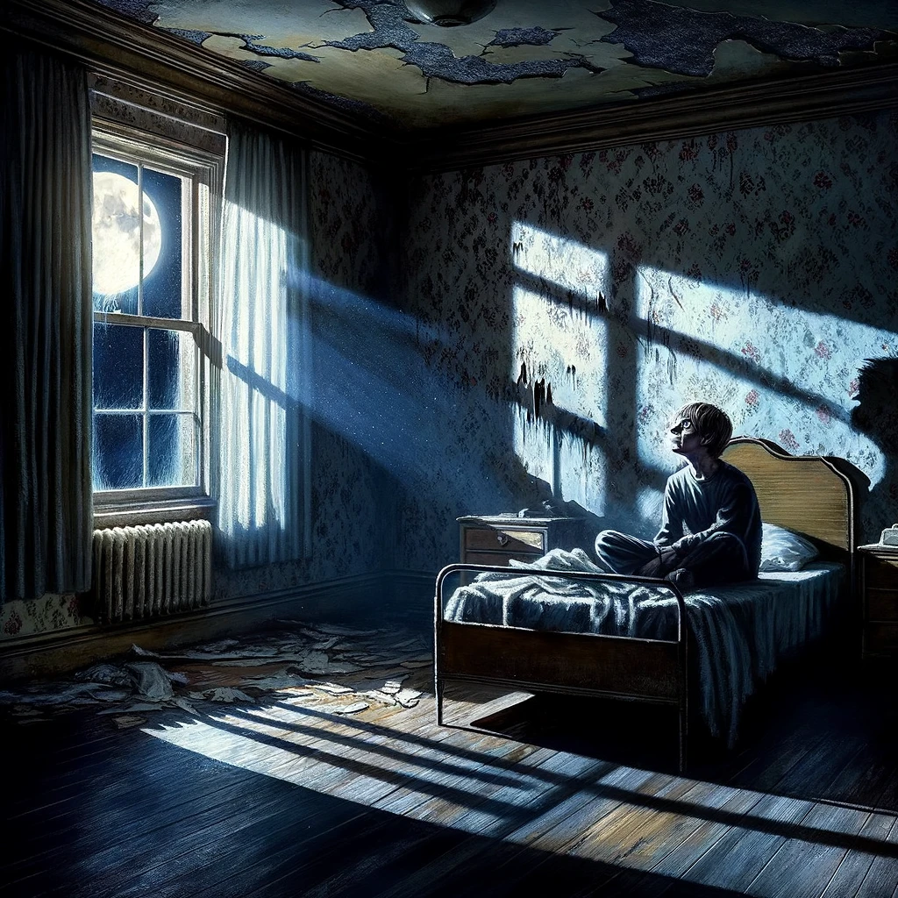
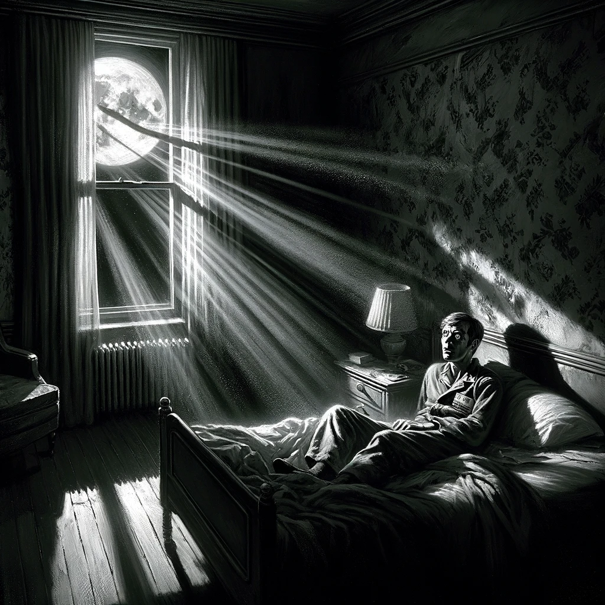

### Chase Through Innsmouth

Realizing the danger he is in, Olmstead flees the hotel and is pursued through the labyrinthine streets of Innsmouth by a mob of townsfolk and Deep Ones hybrids. The chase is a blur of movement, with Olmstead sprinting desperately, glancing back at his grotesque pursuers. The narrow, twisting streets form a claustrophobic maze, with decaying buildings leaning in, as if to swallow him whole. The sense of speed and panic is palpable, with the monstrous forms of his pursuers always just a step behind.

Olmstead's desperate flight from his pursuers is a blur of motion through Innsmouth's labyrinthine streets. The expressive digital painting for this scene should capture the frenetic energy of the chase, with chiaroscuro used to starkly differentiate Olmstead, illuminated by fleeting sources of light, from the deep shadows cast by his monstrous pursuers and the decaying urban maze. The composition should convey claustrophobia and panic, with the architecture of Innsmouth pressing in and the figures almost tumbling out of the frame, emphasizing the inescapability of the chase.

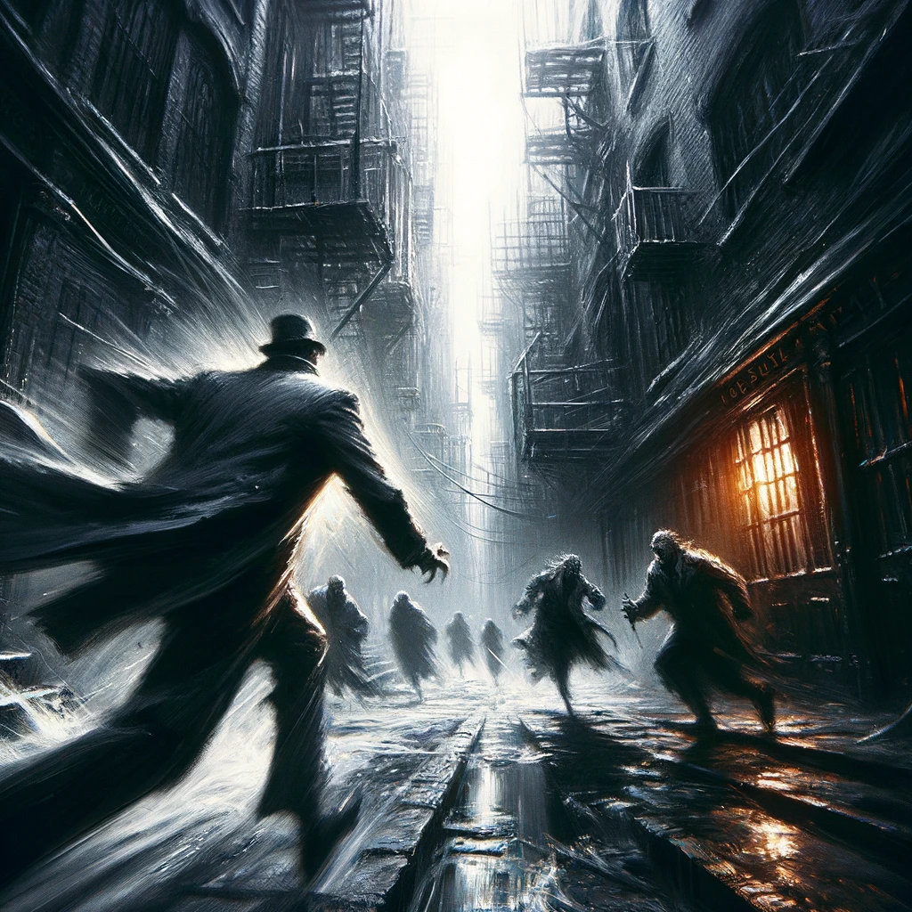
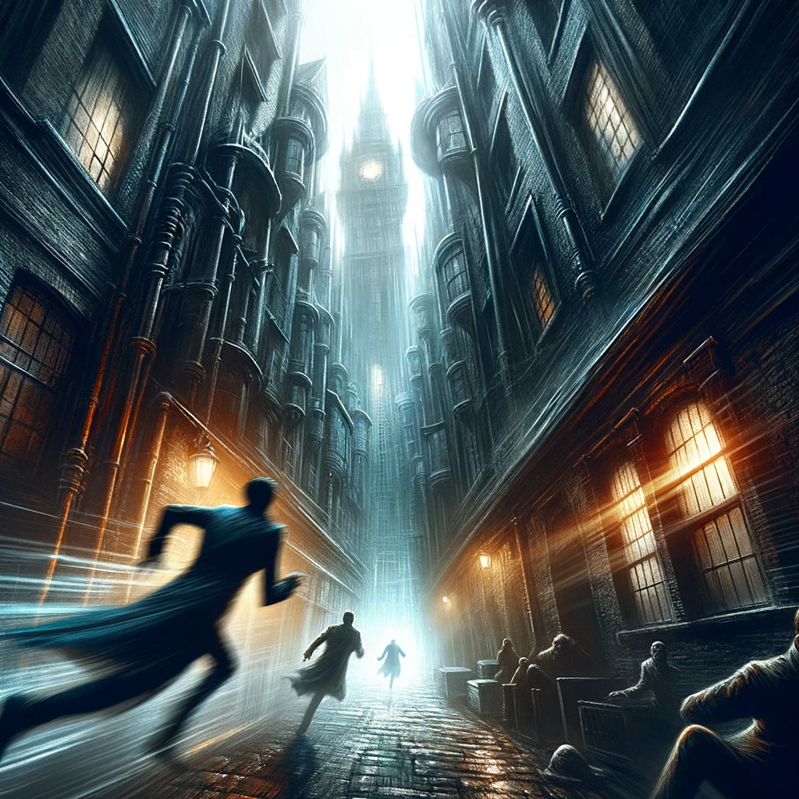

### Escape and Revelation

Olmstead manages to escape Innsmouth and reports his findings to the federal authorities, leading to a secretive government raid on the town. The scene shifts to Olmstead in a sparse, bureaucratic office, recounting his story to disbelieving officials under the harsh light of a single lamp. He looks weary but determined. The aftermath is hinted at with newspaper clippings and documents scattered across the desk, hinting at a cover-up of the true horrors of Innsmouth.

Olmstead, weary but resolved, recounts his harrowing experience in a sparse, bureaucratic office. The expressive digital painting here should focus on Olmstead's face, lit by the harsh overhead lamp, surrounded by shadows that engulf the indifferent officials and the clutter of paperwork and newspaper clippings on the desk. Use chiaroscuro to highlight his determined expression and the stark reality of his story against the dark, secretive atmosphere of the room, suggesting the depth of the conspiracy and cover-up surrounding Innsmouth.

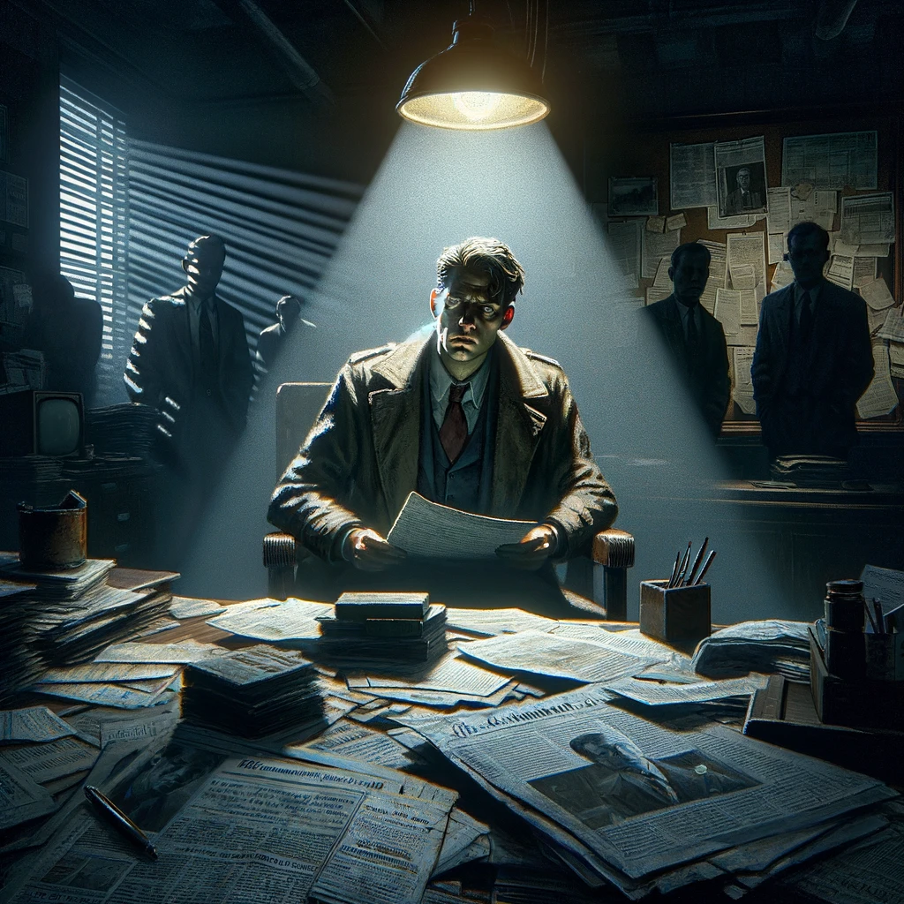
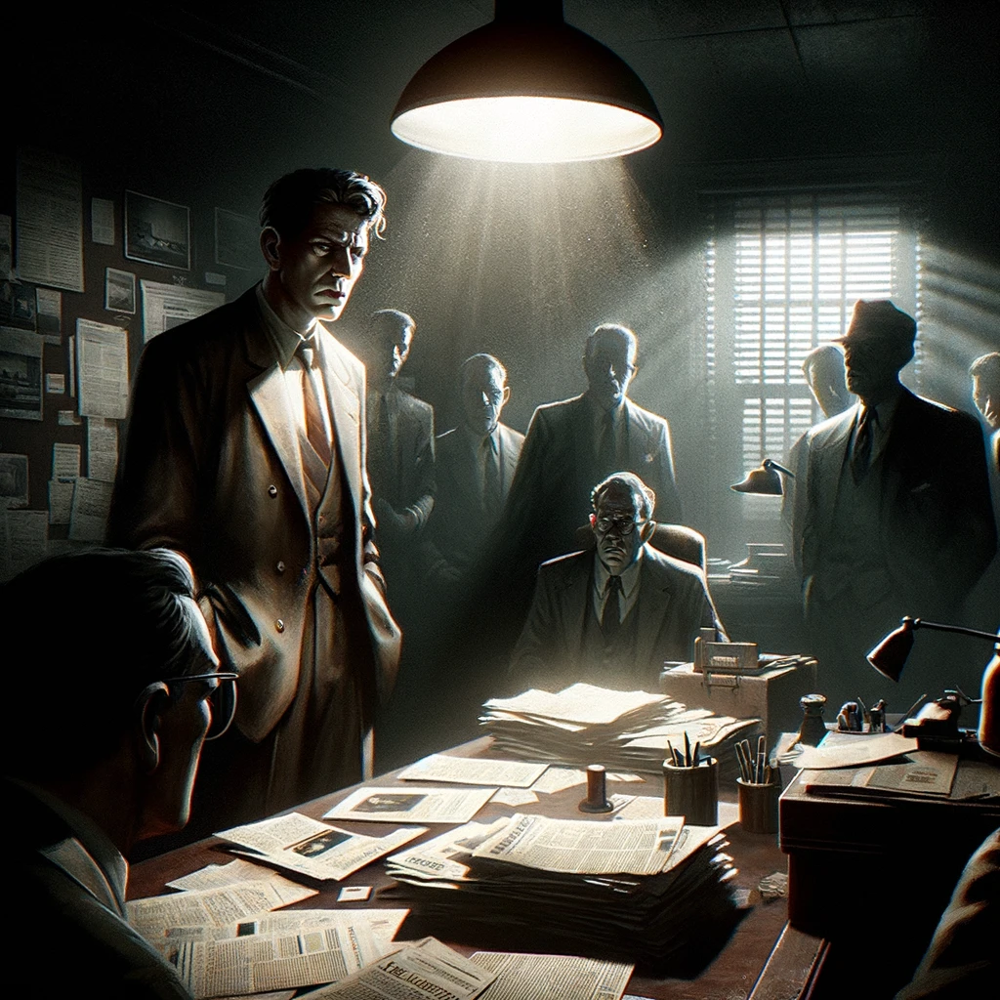

### Olmstead's Transformation

In the final scene, Olmstead confronts his own heritage and the inevitability of his transformation into one of the Deep Ones. He stands before a mirror in a dimly lit room, the first signs of his change visible in his reflection. His expression is one of horror mixed with a resigned acceptance. The room around him is filled with nautical charts and ancient, sea-related artifacts, symbolizing his inexorable draw to the sea and his deep-sea ancestors calling him home.

Facing his reflection in a dimly lit room, Olmstead confronts the early signs of his transformation. This scene, captured in expressive digital painting, should use chiaroscuro to emphasize the light falling on Olmstead's changing features in the mirror, contrasting with the dark, sea-themed artifacts around him. His expression of horror and acceptance should be the focal point, with the reflected light revealing the unsettling beginnings of his metamorphosis. The surrounding room, filled with nautical charts and ancient relics, should be rendered in deep shadows, symbolizing his inevitable pull towards his dark heritage.

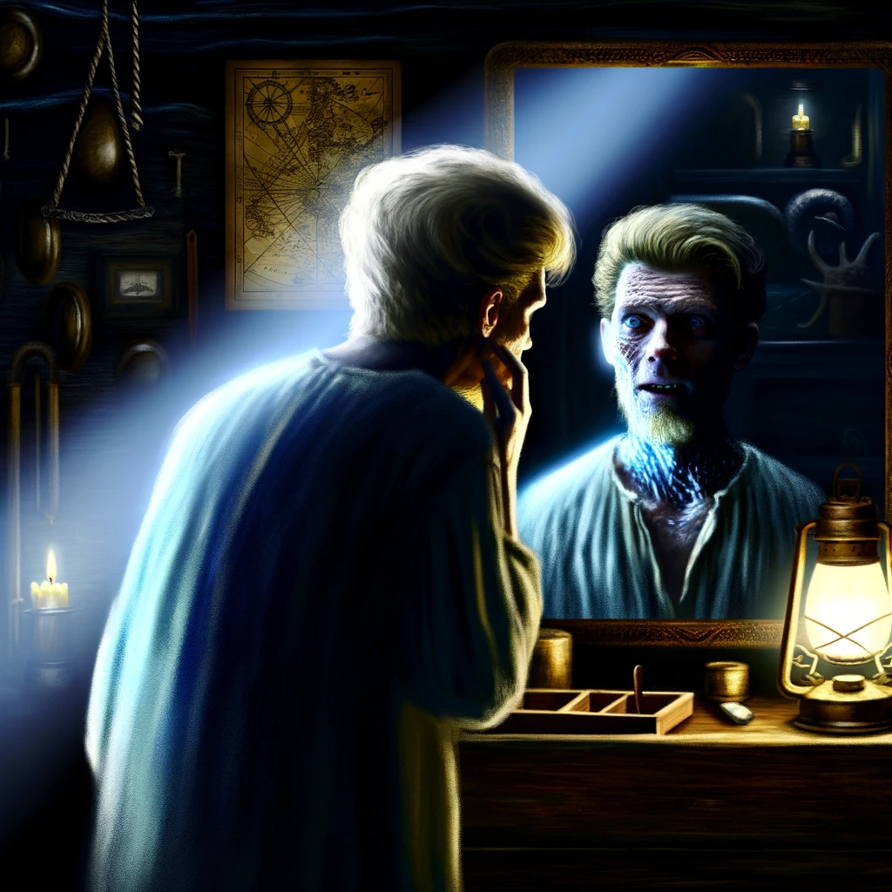
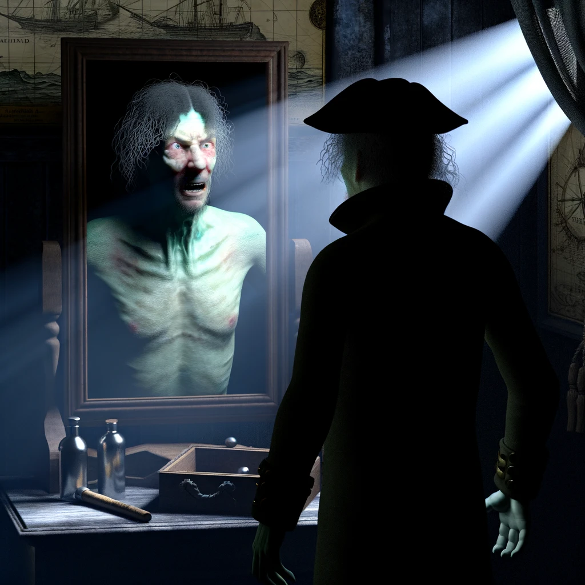
