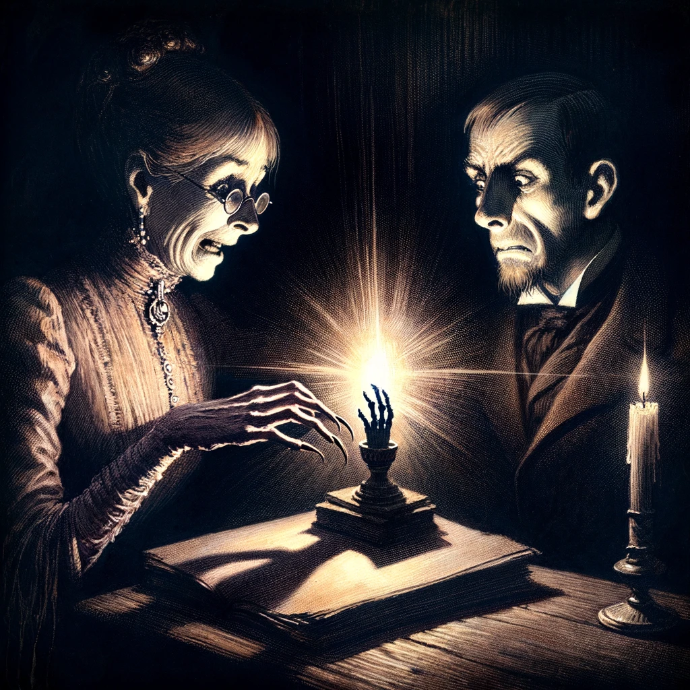

# The Monkey's Paw

## Story Synopsis

"The Monkey's Paw" is a chilling tale by W. W. Jacobs that explores the dark side of wish fulfillment and the unforeseen consequences of tampering with fate. The story centers around the White family, who come into possession of a mysterious mummified monkey's paw, said to grant three wishes to its holder. Despite warnings about the dangerous powers of the paw, Mr. White is persuaded to wish for money, which leads to the tragic death of their son, Herbert, as a twisted form of wish fulfillment. In their grief, Mrs. White convinces her husband to use the second wish to bring their son back to life, not considering the horrifying condition in which he might return. As a figure approaches their home, presumably the resurrected Herbert, Mr. White, in a panic, uses the final wish to reverse the second wish, leaving the story to conclude with the knocking ceasing and the tragic realization of the consequences of their desires. The tale masterfully weaves themes of greed, fate, and the inevitable sorrow that comes from attempting to alter one's destiny.

Style: Gothic ink illustrations with muted watercolor washes on aged paper, adding depth and a haunting ambiance to the eerie narrative.

Envision a grand, evocative cover image for "The Monkey's Paw" in the gothic ink and muted watercolor style: the White family's home stands under a tumultuous sky, its silhouette casting an imposing shadow across the foreground. In the center, a dramatically oversized, mummified monkey's paw, detailed in ink with sinister precision, dominates the scene, glowing ominously with a spectral light rendered in watercolors. Around it, ghostly, subtle watercolor images of the key moments—Mr. White making the wish, the solemn visit from Maw and Meggins, and the shadowy figure at the door—merge into the background, suggesting the story's tragic progression. The overall atmosphere is heavy with foreboding, the stormy sky in watercolors hinting at the supernatural forces at play and the tragic fate that befalls those who tamper with destiny. This powerful image captures the essence of the story: the allure of desires, the irreversible consequences of meddling with fate, and the indelible shadow cast by grief and loss.

## Scenes

### The White Family's Evening at Home

The White family—Mr. and Mrs. White, along with their adult son, Herbert—are spending a cozy evening in their small, but comfortable living room. They play chess by the fire, illustrating a serene domestic scene that contrasts sharply with the story's later events. The warmth of the fire and the familial closeness set the stage, with details like the flickering shadows and the comfortable, lived-in nature of the room hinting at their simple life.

In a gothic-style living room, the White family gathers close by a crackling fireplace. The scene is rendered in ink with muted watercolor washes, emphasizing the warm glow of the fire against the room's darker corners. Shadows dance on the walls, cast by the chess pieces and the family's engaged expressions. The room is filled with aged furniture, suggesting comfort and years of use, with the watercolors adding a sense of warmth and homeliness amidst the gothic ambiance.

### Sergeant-Major Morris's Visit

Sergeant-Major Morris, a family friend and a seasoned soldier, visits the Whites. He is depicted as a world-weary man with a mysterious aura, sharing tales of his exotic travels. The focus is on Morris pulling out the mummified monkey’s paw from his pocket, intriguing the family with its dark, mystical appearance and its legend of granting three wishes, while he looks on with a mix of solemnity and warning.

Sergeant-Major Morris, depicted in detailed ink with a wearied but intriguing face, shares tales of his travels, the mummified monkey’s paw held tightly in his grasp. The room around them is dimly lit, the shadows cast by the fireplace highlighting the paw's eerie texture and the fascinated yet apprehensive expressions of the White family. The watercolors provide a muted palette, with the paw itself given a slightly ominous hue, standing out against the darker background.

### The First Wish

The scene captures the moment Mr. White, half-skeptically and half in jest, makes the first wish for two hundred pounds, urged on by his family and despite Morris’s grave warnings. The room is tense, with the family gathered around the paw, which sits ominously on the table. The candlelight flickers, casting long shadows, as Mr. White hesitantly articulates his wish, the expressions of hope and skepticism mingling on the family members' faces.

This scene is set in the same living room, now cast in deeper shadows with the family huddled around the monkey’s paw on the table. The moment of the wish is marked by a subtle glow from the paw, rendered in watercolor to suggest an otherworldly energy. The family's faces are a mix of skepticism and hopeful anticipation, detailed in ink, with the room around them filled with the heavy, expectant atmosphere of the moment, enhanced by the shadowy watercolor washes.

### The Tragic News

A representative from Maw and Meggins, where Herbert works, visits the Whites to inform them of Herbert’s fatal accident. This scene is heavy with grief and shock; the representative stands awkwardly in the doorway, hat in hand, as Mr. and Mrs. White, devastated, receive the news of their son's death and the compensation of two hundred pounds—exactly the amount wished for. The room feels colder, darker, and more oppressive, reflecting the sudden shift in the family's fortune.

The representative from Maw and Meggins stands at the open door, a silhouette against the dim light outside. The interior is depicted in ink with watercolor shadows deepening the mood of sorrow. The grief-stricken faces of Mr. and Mrs. White are detailed, capturing their devastation. The envelope containing the compensation, a stark, almost glowing object in the scene, symbolizes the tragic irony of the wish fulfilled.

### The Second Wish

Late at night, in their grief-stricken living room, Mrs. White, driven by desperation and maternal grief, convinces Mr. White to use the monkey’s paw to wish Herbert back to life. The scene is charged with emotional tension, showing Mrs. White, frantic and tearful, clutching the paw, while Mr. White, pale and reluctant, utters the wish. The atmosphere is thick with anticipation and fear, illuminated only by a single lamp, casting long shadows around the room.

The scene is set in the darkest hour of night, with only a lamp casting light on Mrs. White clutching the monkey’s paw and Mr. White, his face a portrait of reluctance and dread. The ink outlines their desperate emotions, while the watercolors cast long shadows and create a glow around the paw, highlighting the tension and the supernatural element at play. The surrounding room fades into darkness, focusing all attention on the critical, foreboding moment.

### The Knock at the Door

An eerie, suspenseful scene where the Whites, now terrified, hear a persistent knocking at their door in the dead of night. The couple is frozen in fear, with Mrs. White rushing towards the door, eager yet afraid, while Mr. White attempts to hold her back, dreading who—or what—might enter. The knocking is almost a character in itself, relentless and foreboding, as shadows loom large in their dimly lit hallway.

The knocking at the door is captured by the rhythmic shadows it casts, with Mrs. White moving towards the door, her figure illuminated by a pale, ghostly watercolor light. Mr. White is depicted trying to restrain her, the desperation in their movements detailed in ink. The door itself is an imposing figure in the scene, detailed with gothic elements, standing between the known and the unknown, with the shadows suggesting the ominous nature of what lies beyond.

### The Frantic Search for the Paw

In a panic, with Mrs. White nearing the door to their son, Mr. White frantically searches for the monkey's paw to make the final wish. This scene is chaotic, with Mr. White turning over items, rummaging through drawers, and the looming fear that he might not find it in time. The urgency is palpable, with every second counting as the knocking continues, growing ever more desperate.

The chaos of the search is depicted with scattered objects around Mr. White, inked in fine detail, showing the urgency and disorder. The shadows created by the watercolor washes enhance the sense of desperation and the fleeting time as Mr. White searches. The room is a whirl of motion, objects detailed to show their hasty displacement in the frantic search, with the dim light adding to the scene’s intensity.

### The Final Wish

The climax of the story, Mr. White, having found the paw in the nick of time, makes the final wish just as Mrs. White opens the front door. The scene captures the moment of intense emotion—relief, fear, and the desperate hope that he has acted in time to prevent their son's horrific return. The open door reveals nothing but the quiet, empty night, a stark contrast to the emotional turmoil inside.

This climax scene captures Mr. White, the monkey’s paw in hand, against the backdrop of the open door revealing nothing but the empty, quiet night. The contrast between the detailed ink figures of the Whites and the watercolor emptiness outside heightens the tension. The paw is given a sinister glow with watercolor, emphasizing its power and the gravity of the moment, with the rest of the scene in shadows, focusing on the dramatic decision.

### The Morning After

The final scene shows the White couple in the aftermath, a somber, reflective moment as they grapple with their losses and the consequences of their wishes. The room is bright with morning light, symbolizing a return to reality but also highlighting the emptiness left in Herbert’s absence. The monkey’s paw lies discarded, a potent reminder of their folly and the price of meddling with fate.

The morning light streams through the window, rendered in watercolors to contrast the darkness of the previous scenes. The White couple is shown in a state of somber reflection, the details of their faces inked to show the depth of their loss. The monkey’s paw, discarded on the table, is detailed with ink and shadowed in watercolor, symbolizing the end of its influence. The brighter, yet subdued colors reflect a new day but one filled with sorrow and regret, capturing the story's poignant conclusion.

## References

* [The Monkey's Paw, Wikipedia](https://en.wikipedia.org/wiki/The_Monkey%27s_Paw).
* [The Monkey's Paw by W. W. Jacobs, Project Gutenberg](https://gutenberg.org/ebooks/12122)
