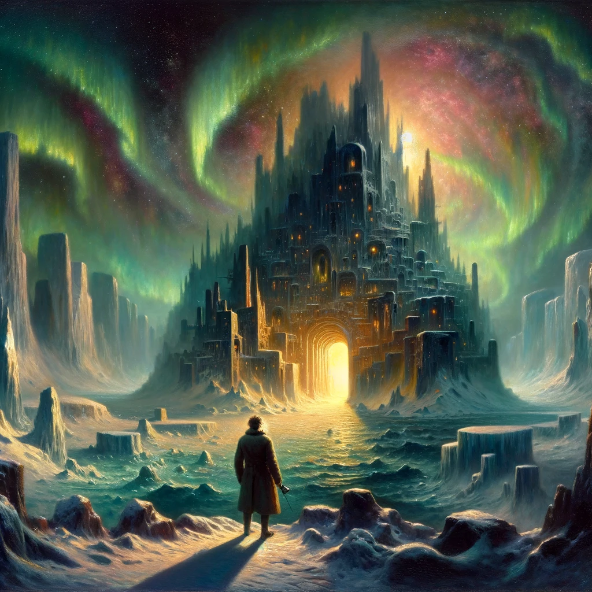
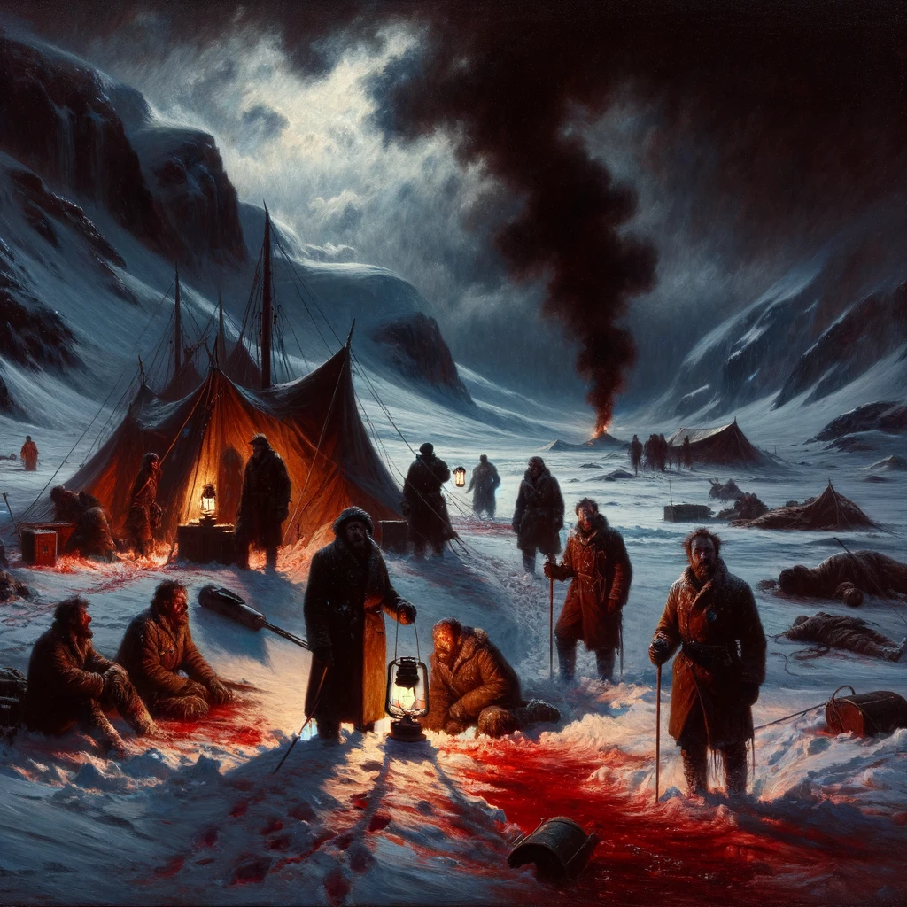

# At the Mountains of Madness, H. P. Lovecraft

## Summary

"At the Mountains of Madness" is a seminal work of horror by H.P. Lovecraft, chronicling the harrowing expedition of a group of Antarctic explorers from Miskatonic University. The narrative, delivered through the fevered recounting of geologist William Dyer, unveils the discovery of ancient, alien ruins buried beneath the ice, predating humanity by millions of years. As the expedition delves deeper into the mysteries of the frozen continent, they encounter the remnants of the Elder Things, a civilization of extraterrestrial origin, whose advanced technology and tragic history are preserved in the icy crypts. The story reaches its climax with the revelation of still-living specimens and the monstrous Shoggoths, leading to a desperate struggle for survival and sanity. Lovecraft masterfully weaves themes of forbidden knowledge, the insignificance of humanity in the cosmos, and the thin veil between discovery and terror, leaving a lasting impression of dread and awe.

* Style: Expressive oil painting with a focus on chiaroscuro to emphasize the contrast between the unknown darkness and the fleeting light of discovery.

William Dyer stands at the threshold of the ancient, alien city under the aurora-lit Antarctic sky, embodying the story's themes of discovery, horror, and the unknown. In this expressive oil painting with a focus on chiaroscuro, Dyer is depicted in the foreground, his back to the viewer, looking into the heart of the unearthly city that extends into the distance, its bizarre, non-Euclidean architecture sprawling under the swirling, vivid colors of the auroras. The contrast between the dark, ominous ruins and the ethereal light from above highlights the duality of fear and fascination. Dyer, dressed in early 20th-century expedition gear, is illuminated from behind, casting a long shadow that merges with the city's intricate, shadowy entrances, suggesting the blending of human curiosity with the ancient, alien world. The scene is framed by the stark, icy landscape of Antarctica, its vastness accentuated by the diminishing light, evoking a sense of isolation and the overwhelming presence of the unknown. The overall composition is grand and evocative, capturing the emotional power and the core essence of "At the Mountains of Madness."

## Scenes

### 1. The Discovery of Ancient Ruins

The scene unfolds on the stark, ice-covered landscape of Antarctica, where the Miskatonic University expedition team, led by geologist William Dyer, discovers the tip of a bizarre stone structure protruding from the snow. As they excavate, a vast, alien cityscape is revealed, composed of non-Euclidean geometries and strange carvings that hint at an ancient civilization. The team, dwarfed by the monumental ruins, stands at the edge of the newly uncovered city, their faces a mix of awe and apprehension under the eerie, aurora-lit sky.

The team, led by William Dyer, a middle-aged man with a determined expression, discovers the tip of an alien structure in Antarctica's icy landscape. This expressive oil painting captures the moment of discovery with a focus on chiaroscuro, contrasting the dark, shadowy ruins against the bright, reflective snow. Dyer and his team, dressed in early 20th-century expedition gear, are depicted with faces illuminated by a soft, eerie glow from the auroras above, highlighting their mixed feelings of awe and fear. The ruins' non-Euclidean geometry and strange carvings are rendered in intricate detail, inviting the viewer to ponder their alien origins.

### 2. The Camp Massacre

A tense, somber mood pervades the campsite scene, now in disarray with tents torn and equipment scattered. In the aftermath of a horrific attack, the bodies of team members are found mutilated, with no sign of the perpetrators. The snow is stained with blood, and amidst the chaos, a sense of unseen dread looms. The survivors, led by Dyer, gather to examine the scene, their lanterns casting long shadows, as they decide to venture into the city for answers, fear and determination etched on their faces.

A somber scene where the aftermath of a horrific attack is visible in the disarray of the campsite. The chiaroscuro technique emphasizes the contrast between the dark, blood-stained snow and the stark, cold light of lanterns held by the survivors. The focus is on the expressions of horror and determination on the faces of Dyer and his companions as they survey the scene, their bodies casting long shadows on the snow. The tents are torn, equipment is scattered, and the distant, shadowy outlines of the mountains stand ominously against the night sky, adding a sense of isolation and impending doom.

### 3. Inside the Alien City

This scene is set within the cavernous interiors of the alien city, where the architecture defies human understanding, and walls are adorned with hieroglyphs depicting the history of the Elder Things. The explorers, with flashlights in hand, uncover murals that tell stories of cosmic wars, strange beings, and the creation of life on Earth. The scale of the chambers dwarfs the humans, emphasizing their insignificance. A mixture of wonder and horror reflects in their eyes as they piece together the city's dark past.

The explorers, including Dyer, navigate the cavernous interiors of the alien city, with walls adorned with bizarre hieroglyphs. The expressive oil painting style uses chiaroscuro to highlight the play of flashlight beams against the dark, vast chambers, creating a sense of depth and the unknown. The explorers are dwarfed by the immense scale of the architecture, emphasizing their vulnerability. The detailed hieroglyphs tell a story of cosmic wars and alien beings, rendered in vibrant, unsettling colors to draw the viewer into the ancient history of the Elder Things.

### 4. Encounter with the Elder Thing

In a dimly lit, icy chamber, the team comes face to face with a preserved specimen of an Elder Thing, a creature of otherworldly anatomy, partially dissected and laid out on a slab. The scene is charged with a macabre fascination; the dissected creature, with its star-shaped head, wings, and tentacles, offers a grotesque yet mesmerizing spectacle. The explorers, equipped with scientific instruments, study the being, their expressions a complex blend of scientific curiosity and creeping dread.

In this scene, the team examines a preserved Elder Thing, employing chiaroscuro to dramatize the grotesque beauty of the creature under the artificial light. The focus is on the creature’s intricate anatomy, with star-shaped head, wings, and tentacles, rendered in vivid detail and color to capture its alien essence. Dyer and his team's expressions blend curiosity with horror, their features highlighted by the sharp contrast between light and shadow. The backdrop of icy walls adds to the chilling atmosphere, making the scene both captivating and eerie.

### 5. The Chase by Shoggoths

A heart-pounding scene of chaos and terror as the survivors are pursued through the labyrinthine corridors of the city by Shoggoths—amorphous, protoplasmic entities. The Shoggoths fill the tunnel with their eerie, echoing calls, a cacophony of sounds that seem almost mocking. The explorers flee in panic, their paths illuminated by flickering torchlight, casting monstrous shadows on the walls. The palpable fear of being consumed by the pursuing horror drives them toward a desperate escape.

A dynamic scene of the survivors' frantic escape from pursuing Shoggoths through the city's corridors. The chiaroscuro in this expressive oil painting heightens the tension, with the explorers' torchlight cutting through the overwhelming darkness, casting long, menacing shadows. The Shoggoths are depicted as amorphous, shadowy masses, their forms barely discernible but for the terrifying eyes and mouths that seem to emerge from the darkness. The explorers, including a clearly terrified Dyer, are rendered with vivid expressions of fear, their movements suggesting desperation and haste.

### 6. The Final Escape

The climactic scene depicts Dyer and the remaining survivor, Danforth, in their harrowing escape across the Antarctic wasteland. Behind them, the alien city looms ominously, a silent sentinel to the horrors it conceals. The two men, visibly shaken and looking back in terror, push their sled dogs forward, away from the mountains that hold secrets too terrible to comprehend. The vast, desolate expanse of snow and ice stretches out before them, under a sky that offers no comfort, only the haunting reminder of their ordeal.

Dyer and Danforth's desperate sled ride away from the alien city is captured in the twilight of the Antarctic landscape. The chiaroscuro technique is used to striking effect, contrasting the dimming light of the horizon with the deep shadows of the sled, dogs, and characters. The vast, empty snowfields are rendered in cold hues, with the alien city lurking ominously in the background, its dark silhouette barely visible against the sky. The faces of Dyer and Danforth, illuminated by a fleeting glimmer of light, are marked by relief and terror, their eyes fixed on the horizon, symbolizing their fragile escape from the darkness.

