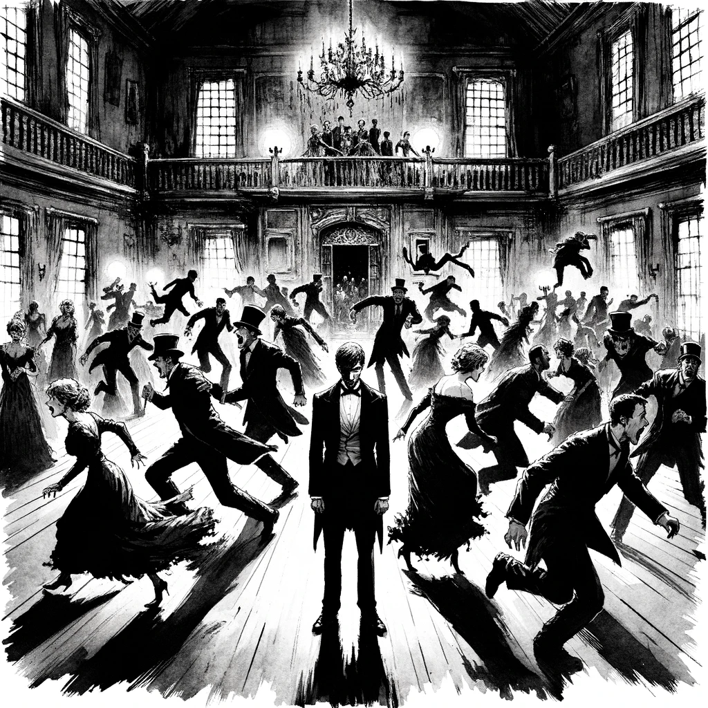
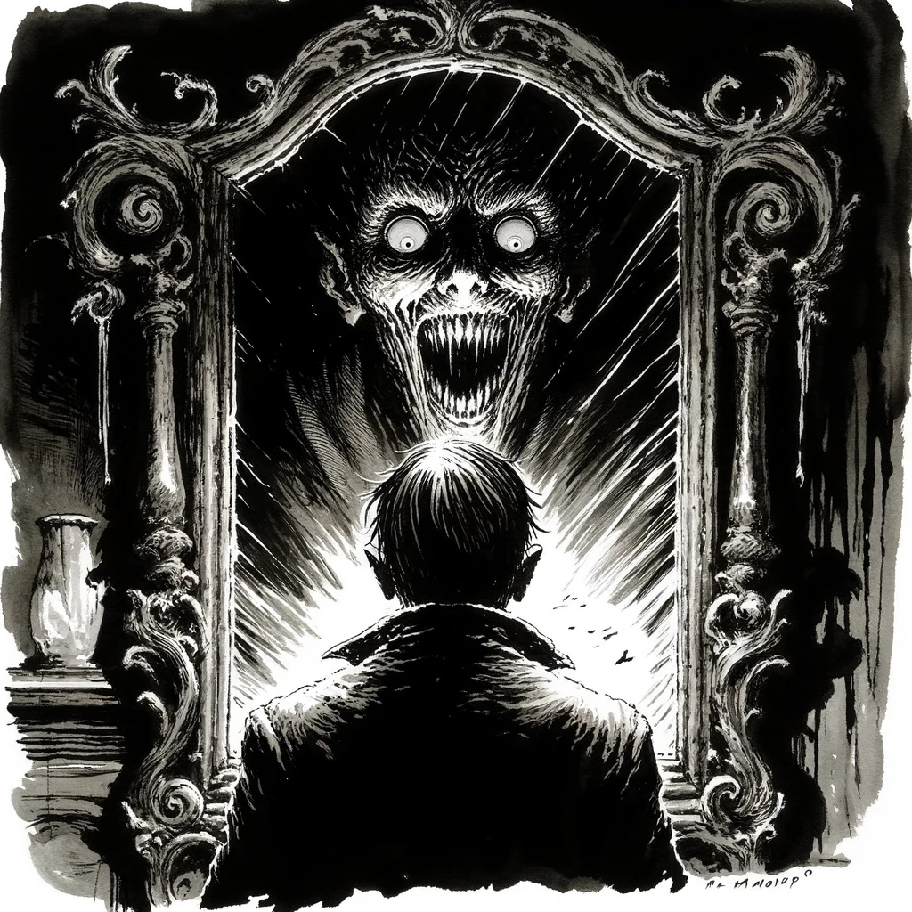

# The Outsider

## Story Synopsis

"The Outsider" by H.P. Lovecraft is a haunting narrative that follows the eerie journey of an unnamed protagonist who, after living a solitary existence in a dark, decrepit castle, decides to escape the only home they've ever known. The story unfolds as the protagonist climbs out of the subterranean depths into the outside world, driven by an innate longing for light and human connection. Upon reaching the surface, they venture into a nearby party, only to incite horror and revulsion in the attendees. The protagonist discovers their own monstrous form upon seeing their reflection in a mirror, realizing they are the very embodiment of the otherness they feared. This chilling tale is a profound exploration of loneliness, the unknown, and the horror of discovering one's true nature, culminating in the protagonist's tragic realization of their own ghastly appearance and eternal isolation.

Style: Gothic ink wash painting, capturing the story's haunting atmosphere and depth of emotion through shadow and light.

The cover image depicts the protagonist standing at the threshold of the ancient crypt, half-emerged into the moonlit night, with the sprawling, decrepit castle in the background and the vast, mysterious forest stretching out before them. The composition is balanced between the dark, imposing structure of the castle and the inviting, ethereal glow of the moon over the forest, symbolizing the protagonist's transition from darkness to the unknown. The protagonist is centered, caught in a moment of hesitation, their silhouette a blend of human and monstrous features that encapsulate their dual nature and the story's themes of isolation, longing, and self-discovery. The ink wash technique should emphasize stark contrasts—using deep, rich blacks and soft grays to create a sense of depth and texture in the castle and forest, while the protagonist and the crypt's entrance are detailed enough to draw the eye, yet vague enough to maintain an air of mystery. The moonlight not only illuminates the scene but also casts dramatic shadows, enhancing the mood of solemnity and the poignant beauty of the protagonist's plight.

## Scenes

### The Castle's Lowest Depths

The story begins in the gloomy, ancient castle where the protagonist has spent their entire life, isolated in dark, subterranean rooms filled with ancient books and remnants of a bygone era. The atmosphere is heavy with dust and decay, hinting at centuries of abandonment. The protagonist's longing gaze towards the faint, unreachable light above sets the scene's mood of desperation and confinement.

A solitary figure stands in a vast, dimly lit underground chamber, surrounded by ancient, cobweb-laden books and decaying furniture. The scene is composed with the figure off-center, highlighting the oppressive vastness of the room and the smallness of the individual. The faint light source from above casts long, dramatic shadows, accentuating the depth and texture of the Gothic architecture and the accumulated layers of dust. The ink wash should employ gradations of darkness to depict the weight of centuries and the isolation of the protagonist, whose appearance is vague yet suggestive of weariness and longing.

### The Ascent Begins

Driven by an insatiable desire for companionship and the outside world, the protagonist discovers a hidden staircase leading upwards. This scene captures the moment of hopeful ascent, with the protagonist navigating the crumbling, moss-covered steps that spiral into darkness, the faint light from above beckoning them forward.

The protagonist is depicted climbing a narrow, spiraling staircase, their body leaning into the climb, hands gripping the ancient, moss-covered stone. The composition should draw the eye upwards, following the staircase as it disappears into a pinprick of light at the top. The heavy use of shadow and light contrast in the ink wash technique emphasizes the texture of the stone and the precariousness of the ascent. The protagonist’s expression, though partially obscured, mirrors the determination and hope of reaching the unknown.

### The Exit to the Outside World

After a long, treacherous climb, the protagonist emerges from an ancient crypt into the moonlit night, experiencing the outside world for the first time. The scene is one of awe and disorientation, showing the protagonist silhouetted against the moon, surrounded by a forgotten graveyard that marks the boundary between their past and the unknown future.

Emerging from a small, decrepit crypt, the protagonist stands at its entrance, silhouetted against the moonlit sky. The graveyard around them is a tangle of overgrown vegetation and forgotten tombstones, suggesting neglect and time's passage. The scene’s composition should balance the dark foreground against the brighter, open sky, with the protagonist positioned as a bridge between two worlds. The ink wash creates a stark contrast between the dark, detailed foreground and the ethereal, more lightly washed sky, emphasizing the protagonist's transition from darkness into light.

### The Encounter with Nature

Overwhelmed by the beauty of the natural world, the protagonist wanders through a dense, misty forest. The scene should depict the contrast between the dark, oppressive life below ground and the freedom of the open woods, with the protagonist curiously touching the trees and plants, marveling at the moon and the stars.

This scene captures the protagonist amidst a dense forest, their hand gently touching the bark of a tree, with a look of wonder on their face. The moonlight filters through the leaves, creating patterns of light and shadow on the forest floor. The composition focuses on the intimate connection between the protagonist and the natural world, with the trees bending slightly towards them, as if in welcome. The ink wash technique should be used to create a soft, almost ethereal quality to the light, contrasting with the detailed textures of the forest and the protagonist's curious, gentle demeanor.

### The Discovery of the Party

Drawn by the sound of laughter and music, the protagonist stumbles upon a magnificent, illuminated mansion hosting a lively party. From a distance, the protagonist observes the joy and lightness of the party-goers, contrasting sharply with their own solitude and darkness.

Viewed from a distance, the protagonist observes a grand mansion, its windows aglow with light and the silhouettes of people dancing inside. The mansion should appear as an island of warmth and life amidst the surrounding darkness, drawing the protagonist (and the viewer's eye) towards it. The composition juxtaposes the large, welcoming mansion against the small, solitary figure of the protagonist, highlighting their separation from the joy inside. The ink wash should create a luminous effect around the mansion, with softer, darker tones used to portray the protagonist's isolation.

### The Moment of Horror

Entering the mansion, the protagonist's presence causes immediate panic and terror among the guests. This scene captures the chaos of the party turning into a nightmare, with guests screaming and fleeing in horror, while the protagonist stands bewildered in the center, not understanding the cause of their fear.

Inside the mansion, the protagonist stands at the center of a room where party-goers are in the midst of fleeing in terror. The composition should be chaotic, with the guests' movements directed away from the protagonist, who remains a still point in the turmoil. The use of shadow and fragmented light in the ink wash technique should heighten the dramatic intensity, focusing on the shocked and horrified expressions of the guests contrasted with the protagonist's confused and hurt demeanor.

### The Revelation in the Mirror

In the midst of the chaos, the protagonist encounters a mirror for the first time and sees their own reflection. This pivotal scene is one of shock and self-realization, showing the protagonist's ghastly, monstrous appearance that explains the guests' terror.

The protagonist gazes into a large, ornate mirror, seeing their monstrous reflection for the first time. The scene is tightly framed, focusing on the protagonist’s reflection and their reaction. The mirror acts as the scene's focal point, with the protagonist's horrified expression mirrored back at them. The ink wash should be utilized to create a stark contrast between the dark, shadowy figure of the protagonist and the brighter, reflective surface of the mirror, emphasizing the shock and self-realization of the moment.

### The Return to Solitude

The final scene brings the protagonist back to the graveyard, now fully aware of their otherness and the impossibility of human connection. They stand alone under the moonlight, looking at the castle from which they emerged, resigned to their eternal isolation. The mood is one of tragic acceptance, with the protagonist's silhouette merging with the darkness of the night.

The protagonist stands alone in the moonlit graveyard, looking back towards the dark silhouette of the castle. The composition should be wide, placing the protagonist small in the frame to emphasize their solitude. The castle looms in the background, its architecture rendered in detailed ink wash to suggest both its imposing presence and the protagonist's inescapable connection to it. The scene should be rendered in shades of darkness, with the moonlight providing the only source of illumination, highlighting the protagonist's resigned acceptance of their fate.

## References

* [The Outsider (short story), Wikipedia](https://en.wikipedia.org/wiki/The_Outsider_(short_story))

