# The Rats in the Walls

## Story Synopsis

In "The Rats in the Walls," H.P. Lovecraft tells the chilling tale of Delapore, a descendent of an ancient family who decides to restore his ancestral estate, Exham Priory, in England. Despite local superstitions and tales of horror surrounding the estate, Delapore moves in, only to be tormented by the incessant sound of rats scurrying within the walls. His investigations lead to a horrifying discovery beneath the priory: a vast subterranean city filled with evidence of unspeakable rituals and cannibalism practiced by his ancestors for generations. As Delapore ventures deeper, he uncovers the ghastly truth of his family's past and is driven to madness by the revelations, culminating in a tragic finale where the boundary between man and beast blurs, and he finds himself implicated in acts of primal horror, echoing the barbaric practices of his lineage.

Style: Gothic-style ink drawings on parchment, capturing the story's dark, ominous atmosphere and intricate details with dramatic contrasts and shadows.

The cover image, rendered in the same detailed Gothic-style ink on parchment, presents a haunting, composite vision of Exham Priory as it looms ominously over the figure of Delapore, who stands at the threshold between the decaying grandeur of the ancient estate and the dark, gaping maw of the underground city beneath. The Priory itself is intricately detailed, its architecture a blend of Gothic spires and Norman solidity, shrouded in creeping vines and shadows, symbolizing the weight of ancestral sins. Delapore is depicted with his back to the viewer, his posture reflecting both determination and dread, as he peers into the abyss below, where faint, ghostly outlines of the cyclopean structures and skeletal remains hint at the unspeakable horrors within. Above, the sky is a tumult of swirling clouds, from which vague, rat-like shapes seem to emerge, blending the story's themes of madness, ancestral legacy, and the inescapable past into a single, powerful image that invites the viewer into Lovecraft's chilling narrative. The contrast of light and shadow is used to dramatic effect, highlighting the foreboding atmosphere and the thin line between the known and the unknowable, making it a compelling and evocative cover for "The Rats in the Walls."

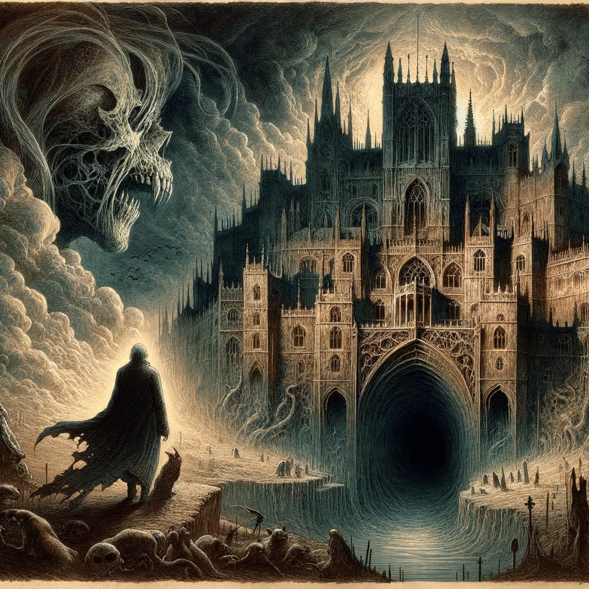
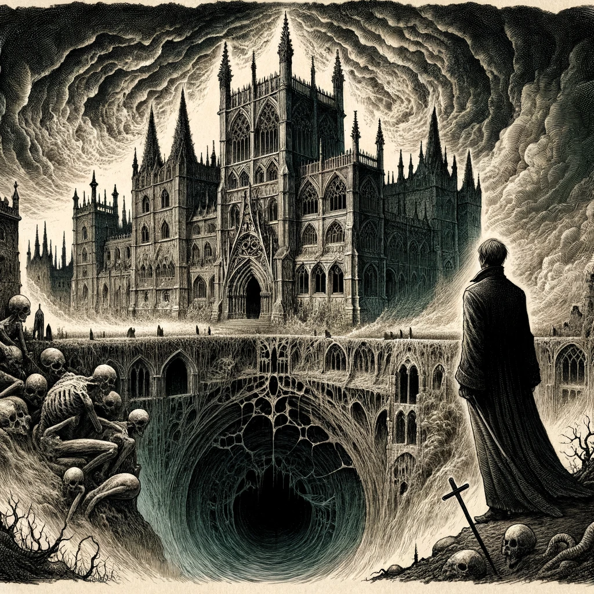

## Scenes

### Delapore's Arrival at Exham Priory

Delapore stands before the imposing, ancient ruins of Exham Priory, his newly inherited estate set against a bleak, overcast sky. The estate, a mix of Gothic and Norman architectural remnants, looks both majestic and malevolent, surrounded by untamed vegetation and perched on a cliff overlooking a dark valley. Local villagers, visibly distressed and fearful, watch from a distance, their expressions filled with superstition and dread. Delapore, undeterred by the ominous atmosphere and local legends, gazes at the priory with a mixture of resolve and curiosity, symbolizing his determination to reclaim his ancestral legacy.

The scene is captured in a detailed Gothic-style ink drawing on parchment, emphasizing the eerie majesty of Exham Priory set against a stark, cloudy sky. Delapore is depicted at the forefront, his figure outlined with fine, sharp lines to denote his determination and the beginning of his ominous journey. The priory is rendered with an abundance of intricate architectural details—crumbling Gothic arches, foreboding Norman towers, and tangled vegetation encroaching upon the stone. The expressions of the distant villagers are sketched with minimal yet effective strokes, capturing their mix of fear and superstition. The overall composition uses dramatic contrasts between the dark shadows of the priory and the lighter, yet still ominous sky, enhancing the scene's menacing ambiance.

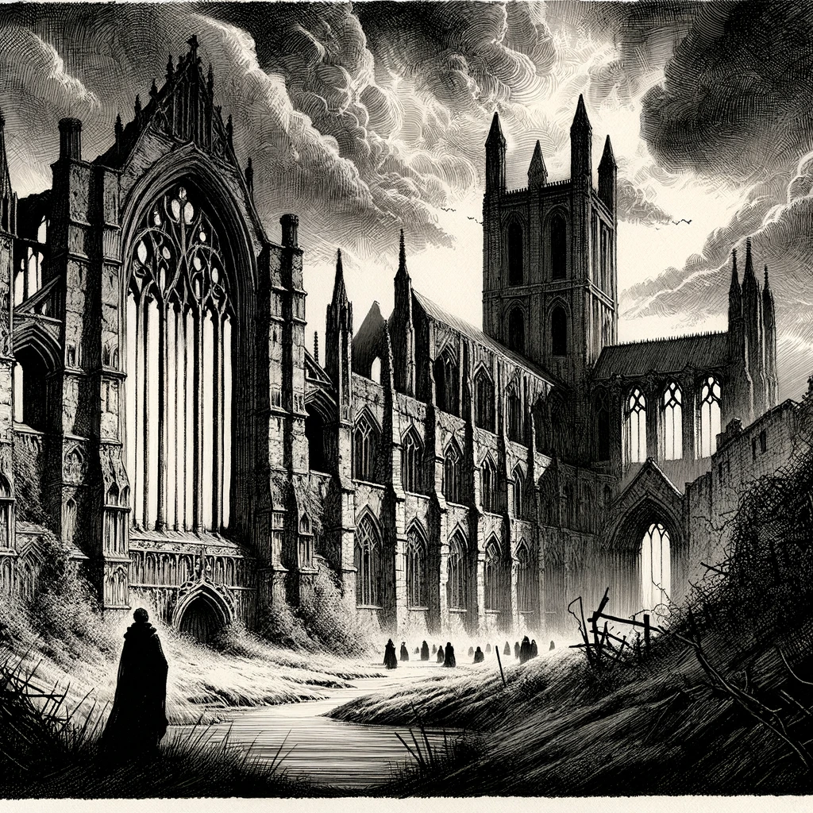
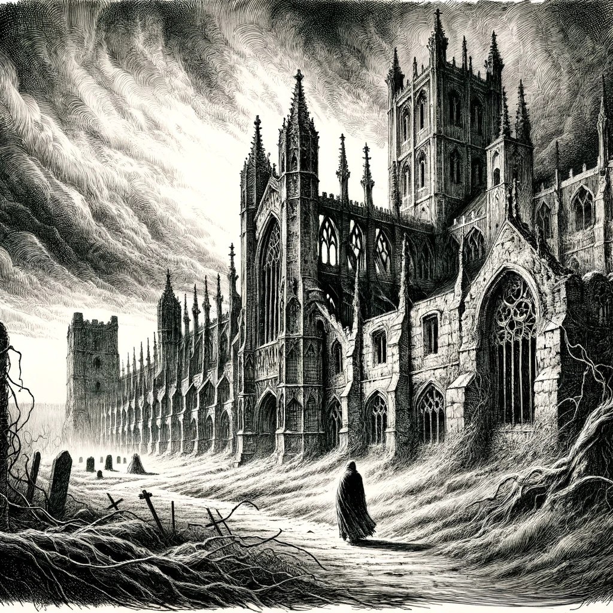

### Hearing the Rats in the Walls

Night falls, and Delapore is in his study, a room filled with ancient books and artifacts, trying to ignore the persistent, unsettling sounds of scurrying and scratching within the walls. The room is lit by candlelight, casting long shadows that seem to dance with the sounds. His dog, a loyal and sensitive companion, reacts nervously to the noises, growling and staring at the walls, as if sensing an unseen menace. Delapore’s face is a mix of frustration and intrigue, hinting at the beginning of his descent into obsession with uncovering the source of the sounds.

This scene is meticulously illustrated with deep, shadowy contrasts, highlighting the flickering candlelight casting long, dancing shadows across Delapore's study. The room is filled with objects of antiquity, each detailed with fine lines to show their age and mystery. Delapore is seated, his posture tense, as he tries to discern the source of the scurrying sounds, with his dog beside him, depicted with fur bristled in alertness. The walls are shown with subtle, unsettling lines suggesting movement within, embodying the invisible menace. The interplay of light and shadow creates a palpable tension, emphasizing the unseen horror lurking within the walls.

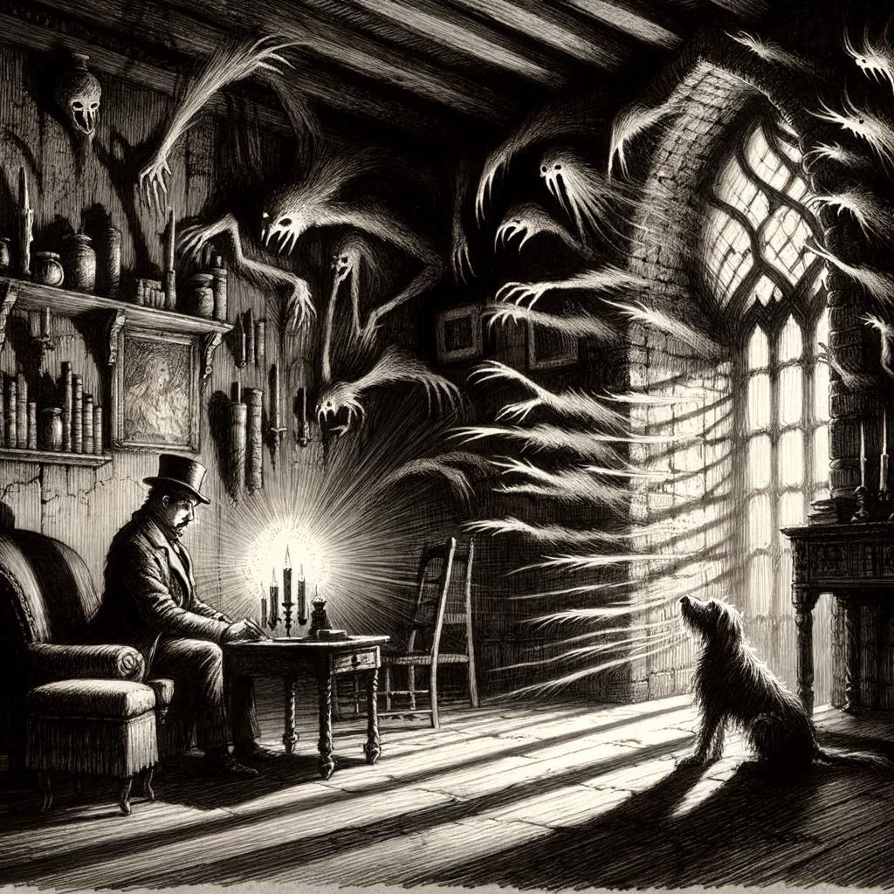
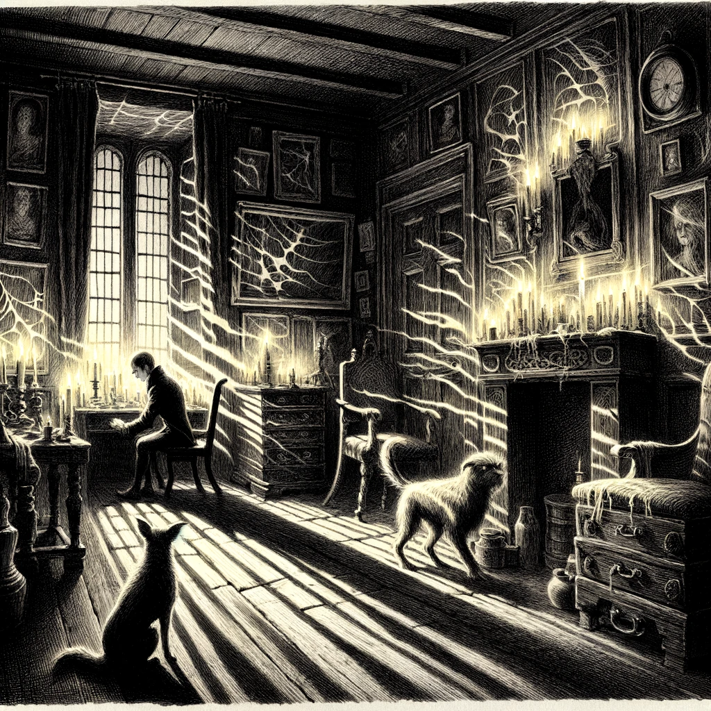

### The Discovery of the Underground City

Armed with lanterns and followed by a group of hesitant servants and his dog, Delapore descends into a newly discovered, vast underground city beneath the priory. The architecture is a nightmare landscape of cyclopean stone structures, non-Euclidean geometry, and dark, endless passages. Bones and remnants of ancient, barbaric rituals litter the ground. The group moves cautiously, their faces illuminated by the flickering lantern light, revealing a mix of horror and fascination as they traverse the ancient, forbidden city.

The vast underground city is depicted in an expansive composition, utilizing the ink's full range to define the eerie, cyclopean structures and non-Euclidean geometries that challenge the sanity of the viewer. Delapore and his group are shown as small figures amidst the immense scale of the ancient city, their lanterns casting small pools of light that pierce the overwhelming darkness. The detailed stonework of the ruins is accentuated with fine hatching, suggesting both their ancient origin and the oppressive atmosphere. Bones and ritualistic remnants are scattered throughout, drawn with precise lines to evoke a sense of dread and the weight of untold horrors.

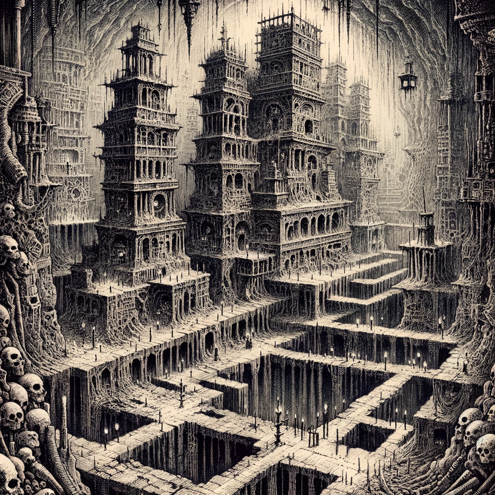
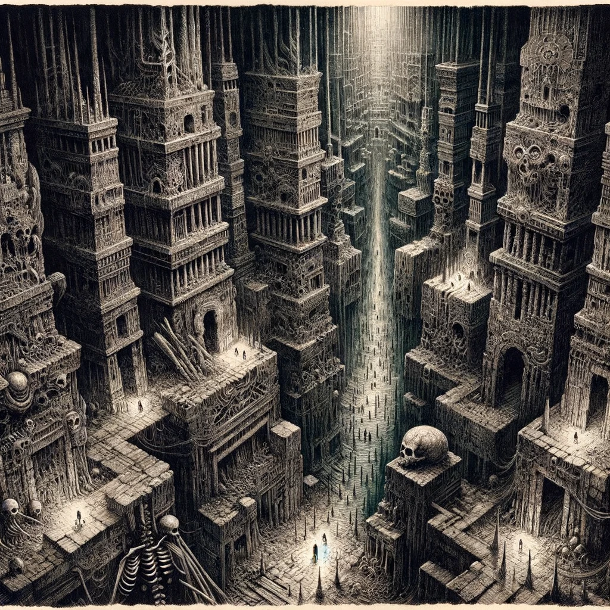

### The Revelation of the Ancestral Practices

In a vast, subterranean chamber, Delapore uncovers horrifying murals and artifacts that depict the ghastly, cannibalistic rites of his ancestors. The chamber is filled with grotesque carvings, sacrificial altars, and piles of human bones, evidence of centuries of unspeakable practices. Delapore, alone and holding a torch, stands in the center of the chamber, his face aghast as he realizes the depth of his family's depravity. The walls seem to close in on him, the shadows cast by the torchlight creating an oppressive atmosphere of encroaching madness.

The chamber's interior is a masterpiece of Gothic ink drawing, with every inch of parchment used to depict the horrifying murals and artifacts of cannibalistic rites. Delapore stands alone in the center, his figure illuminated by a single torch, surrounded by the dark, detailed carvings of his ancestors' unspeakable acts. The walls are adorned with intricate, grotesque imagery, each line meticulously drawn to convey the depth of the depravity. The chamber's oppressive atmosphere is achieved through dense, overlapping shadows, with the light from Delapore's torch casting stark, revealing illumination on the macabre scene.

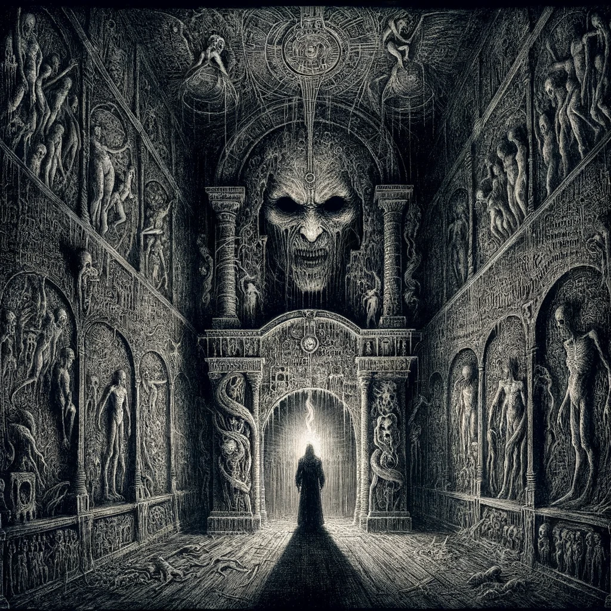
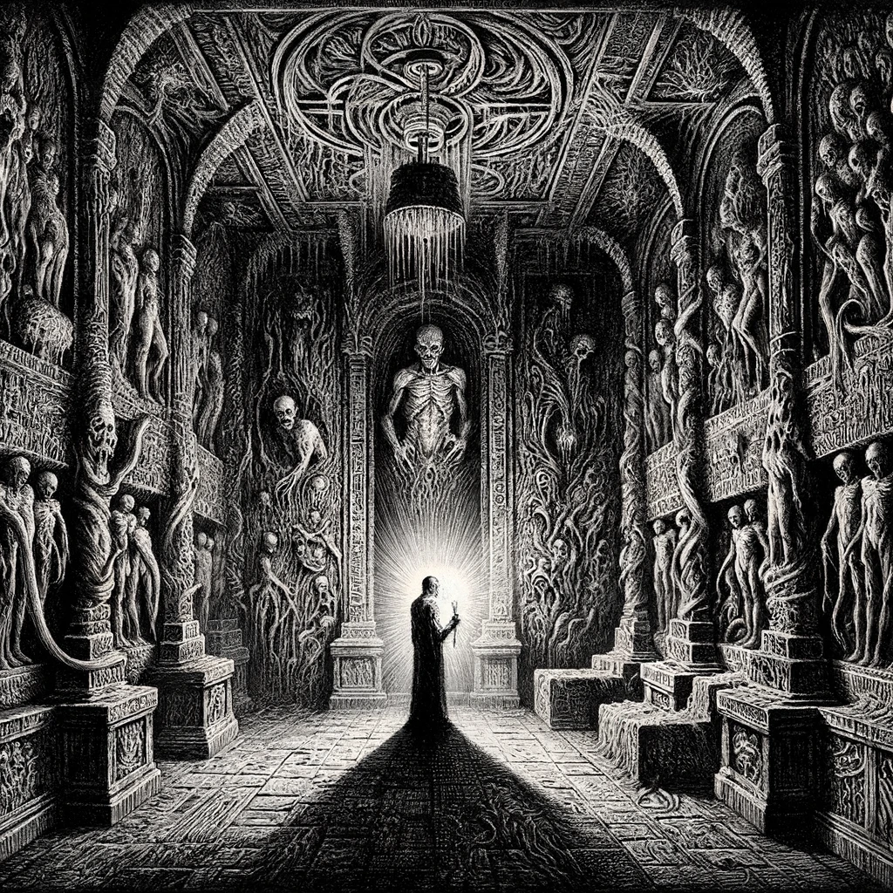

### Delapore's Descent into Madness

In the climax, Delapore is found in the aftermath of a frenzied, violent act, evidence of his complete surrender to the ancestral madness that plagued his family. The scene is chaotic and bloodied, set in the dimly lit ruins of the underground city. Delapore is disheveled, his clothing torn, and his hands bloodied, surrounded by the bodies of his servants and his loyal dog, all victims of his madness. The expression on his face is one of horror and realization, as he understands the irreversible nature of his actions and the true legacy of his bloodline. The background is filled with the oppressive, ancient architecture, symbolizing the inescapable curse of his heritage.

The final scene is a chaotic, blood-stained tableau, where Delapore is depicted in the aftermath of his frenzied violence. The Gothic ink style lends itself to the depiction of his disheveled appearance, with every line contributing to the sense of his complete breakdown. The surrounding architecture of the underground city looms over him, its oppressive presence rendered with dark, heavy strokes that frame the scene. The bodies of his servants and his dog are drawn with a haunting realism, their still forms contrasting with the dynamic, frenetic energy of Delapore's madness. The use of stark contrasts between light and dark areas highlights the tragic climax of the story, capturing the horror and despair of Delapore's realization of his inherited curse.

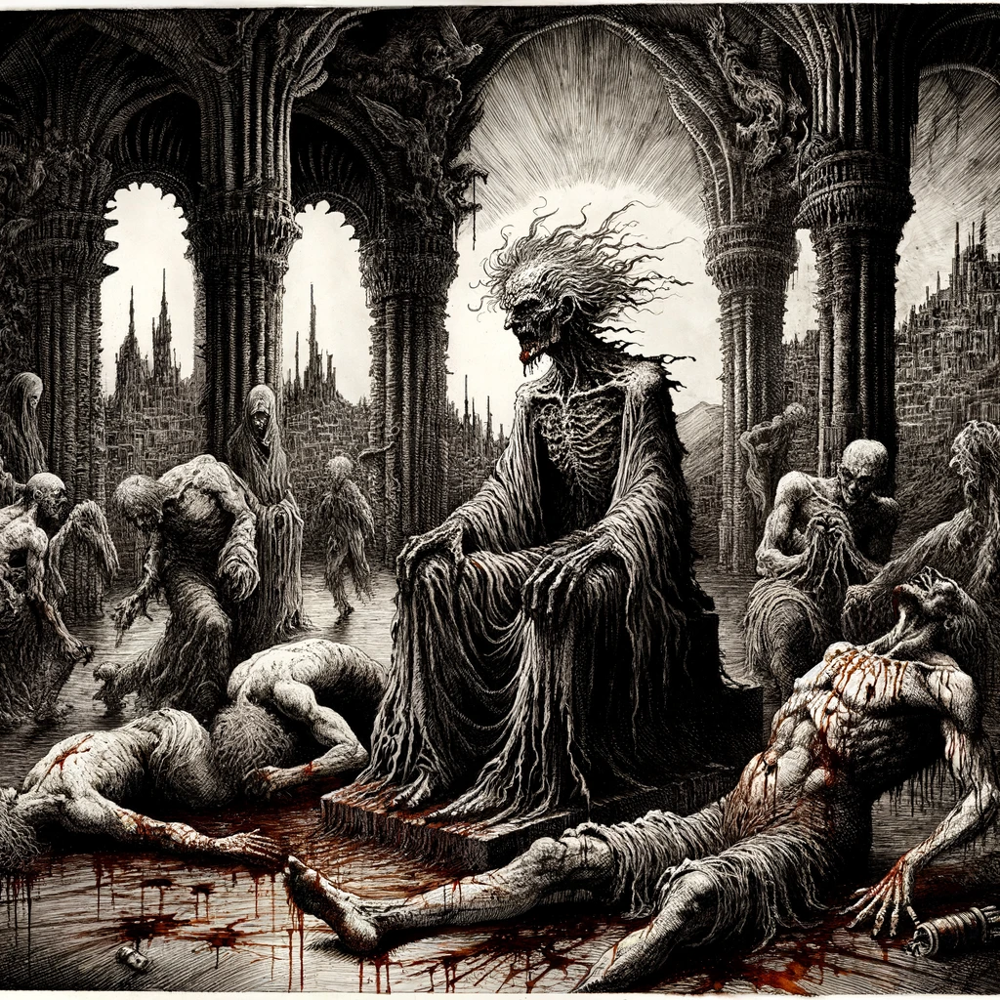

## References

* [The Rats in the Walls, Wikipedia](https://en.wikipedia.org/wiki/The_Rats_in_the_Walls).
* [Collected Stories, H. P. Lovecraft, Project Gutenberg Australia](https://gutenberg.net.au/ebooks21/2100541h.html).

