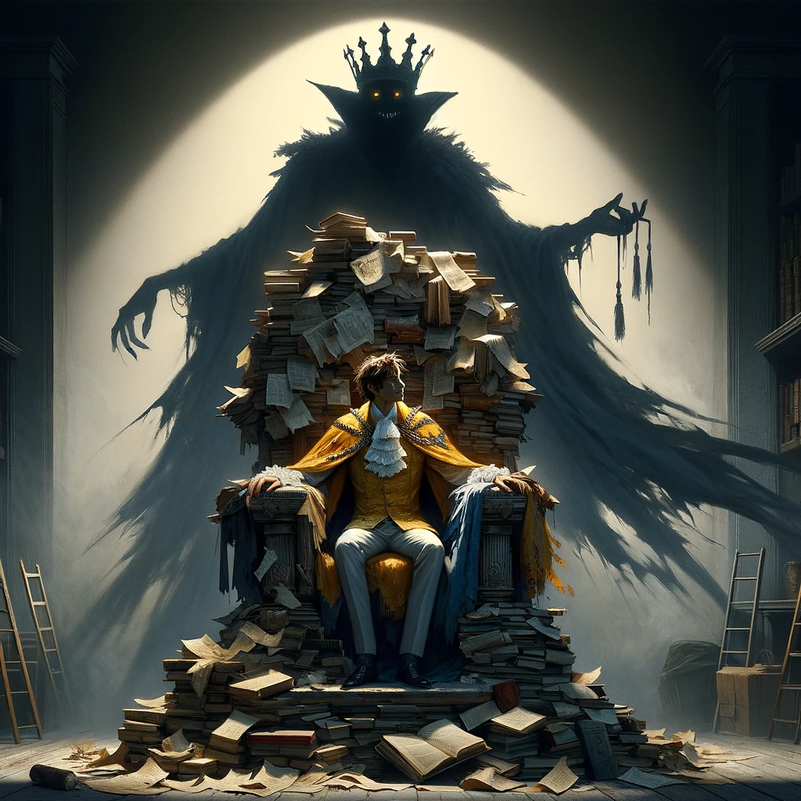
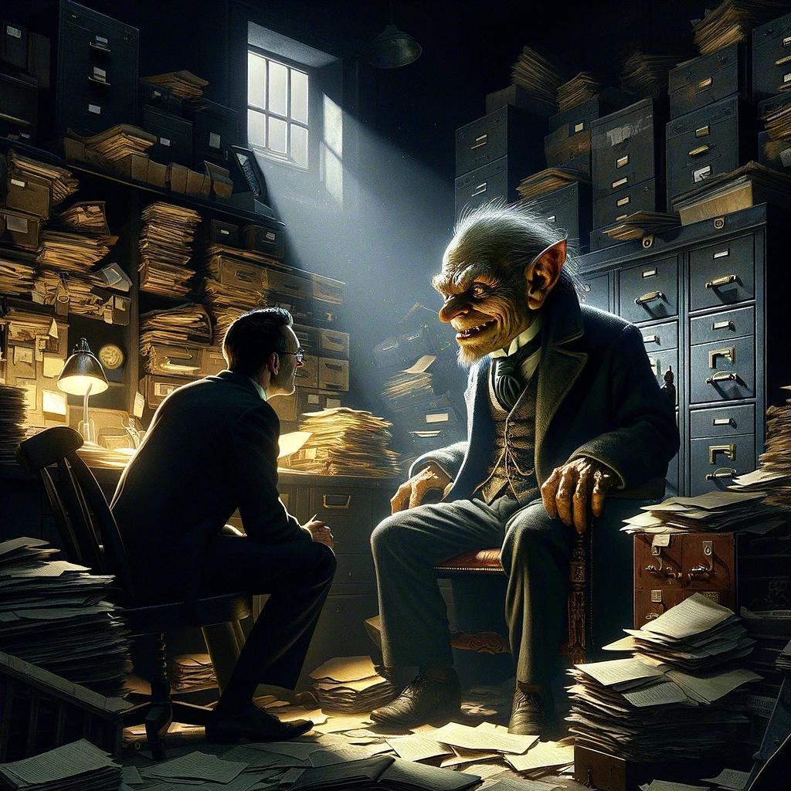

# The Repairer of Reputations, Robert W. Chambers

## Story Synopsis

"The Repairer of Reputations" is a chilling tale set in a fictional 1920s America, part of Robert W. Chambers' "The King in Yellow" collection. The story unfolds through the eyes of Hildred Castaigne, an unreliable narrator who, after suffering a head injury, becomes obsessed with a mysterious and malevolent play called "The King in Yellow," which drives its readers mad. Hildred is drawn into a delusional world where he believes he is destined to become the heir to a new imperial dynasty, guided by the sinister figure Mr. Wilde, who claims to repair reputations for a living. Amidst a backdrop of societal upheaval and the ominous influence of the play, Hildred's descent into madness and his manipulative schemes culminate in a tragic and eerie conclusion, blurring the lines between sanity, obsession, and the dark influence of the supernatural.

* Style: As a visual artist aiming to evoke the eerie, unsettling atmosphere of "The Repairer of Reputations," I would select the style of Chiaroscuro with a modern digital painting medium, using a palette of muted, almost monochromatic colors punctuated by stark contrasts of light and shadow to highlight moments of madness and the supernatural.

The cover image encapsulates the essence of "The Repairer of Reputations" by depicting Hildred, adorned in tattered regalia, sitting upon a throne of books and papers under a looming, shadowy figure of The King in Yellow, with the eerie silhouette of Mr. Wilde lurking in the background. This grand and evocative scene is rendered in chiaroscuro with a modern digital painting medium, using a palette of muted, almost monochromatic colors with sharp contrasts of light and shadow to emphasize the descent into madness and the influence of dark forces. The throne, constructed from the chaotic accumulation of books and documents, symbolizes Hildred's obsession and madness, while the crown-shaped shadow cast upon his head by the light, hints at his delusional grandeur. The King in Yellow, an imposing figure draped in tattered robes, casts a long, dark shadow over Hildred, symbolizing the play's malevolent influence. Mr. Wilde's figure, partially hidden in shadow, adds a layer of intrigue and manipulation. This powerful image, with its intricate play of light and darkness, captures the story's themes of obsession, madness, and the unseen forces that shape our destinies.

## Scenes

### Hildred's Accident and Obsession

The story opens with Hildred Castaigne having recently recovered from a serious head injury, which results in a dramatic change in his personality and interests. He becomes obsessively involved with the dark and mysterious play, "The King in Yellow," which is rumored to induce madness in those who read it. This scene could be illustrated with Hildred in a dimly lit room, poring over the accursed book, surrounded by chaotic notes and symbols related to the play, highlighting his descent into obsession.

Hildred, engrossed in "The King in Yellow," is surrounded by chaos and madness. The room is dimly lit, with only a single source of light illuminating Hildred and the accursed book, creating deep shadows that envelop the room's corners. Books, papers, and cryptic symbols scatter around him, suggesting his deep dive into madness. In this chiaroscuro scene with a modern digital painting medium, Hildred should be depicted with a gaunt face, wide, obsessed eyes, and unkempt hair, highlighting his transformation post-accident. The muted color palette, with occasional sharp contrasts, accentuates his isolation and the eerie obsession consuming him.

### Introduction to Mr. Wilde and the Imperial Dynasty

Hildred visits the peculiar and grotesque character, Mr. Wilde, in his cluttered, archive-like office. Mr. Wilde, a self-proclaimed "Repairer of Reputations," is surrounded by files and documents, claiming to control the destinies of the wealthy and influential. He talks of a grand plan to establish a new Imperial Dynasty in America with Hildred as its head. The scene should show the eerie and cramped conditions of Wilde's office, with Wilde himself appearing almost goblin-like amid his secretive work.

In Mr. Wilde's cluttered, dim office, he appears almost goblin-like amid piles of documents and mysterious files. The chiaroscuro effect emphasizes the contrast between the dark shadows of the room and the few shafts of light that highlight Wilde's grotesque features and the chaotic order of his domain. Wilde's office, filled with stacks of papers, open drawers, and an oversized, ominous safe, reflects his complex and manipulative nature. Hildred, consistent in appearance with scene 1, listens intently, his face illuminated by the glow of a desk lamp, casting long shadows behind him, enhancing the scene's mysterious and foreboding atmosphere.

### Hildred's Break with Louis

Hildred's relationship with his cousin Louis, a military officer, deteriorates due to Hildred's madness and his disdain for Louis's engagement to Constance Hawberk. In this scene, Hildred coldly informs Louis that they are no longer brothers and that he should stay away from Constance, marking a pivotal moment of conflict. The visual could capture the tension between the two, with Hildred's face showing a mix of madness and resolve, while Louis appears confused and concerned.

The tension between Hildred and Louis under a flickering street lamp creates a dramatic chiaroscuro effect, with the stark light casting deep shadows on their faces, emphasizing the emotional divide. Hildred, maintaining his gaunt, obsessed appearance, confronts a robust, uniformed Louis, whose confusion and concern are illuminated in the harsh light. The surrounding darkness envelops them, symbolizing the growing rift. The muted color scheme focuses on their faces, highlighting the contrast between Hildred's madness and Louis's rationality.

### The Cat and the Safe

Hildred visits Hawberk's armory, where he admires ancient weapons and discusses his delusional plans for the future. The scene shifts to a bizarre moment where Mr. Wilde's cat, vicious and almost supernatural, jumps onto a safe, hinting at the hidden crown inside. An illustration could focus on Hildred's fascinated expression as he handles the antique armors, with the menacing cat in the foreground, adding a surreal touch to the scene.

Inside Hawberk's armory, Hildred admires ancient weapons under the subtle glow of overhead lights, creating a soft chiaroscuro effect. The menacing cat, perched on the safe, casts a sinister shadow, hinting at the hidden dangers within. The armory is detailed with armor stands, swords, and shields, bathed in shadows, focusing on the cat's glowing eyes and the intrigued expression on Hildred's face. This scene uses sharp contrasts to hint at the lurking madness and the dark secrets yet to unfold.

### The Conspiracy

Hildred and Mr. Wilde discuss their scheme to remove Louis from the path to the throne, showcasing their twisted belief in the imperial dynasty. Wilde introduces Hildred to a safe containing a diabolical device intended for Louis. The scene could be illustrated with both characters in shadowy profile, plotting over the sinister device, emphasizing the dark conspiracy.

In the shadowy confines of Wilde's office, he and Hildred plot over the sinister device intended for Louis. The chiaroscuro technique is used to create a concentrated beam of light that illuminates their faces and the device on the table, leaving everything else in deep shadow. This stark lighting emphasizes their malevolent intent and the ominous nature of the device. The muted, almost monochromatic color palette accentuates the tension and the dark undercurrent of their scheme.

### The Madness of Constance

Hildred attempts to convince Constance to marry him, revealing his grandiose delusions of their future together as royalty. Constance, however, sees through his madness. This scene should illustrate the stark contrast between Hildred's delusional fervor and Constance's horror and pity, perhaps in a drawing room that accentuates the gulf between reality and Hildred's madness.

Constance, standing in a well-lit drawing room, confronts Hildred, whose back is partly in shadow, symbolizing his detachment from reality. The chiaroscuro style highlights the contrast between Constance's clarity and Hildred's delusion, with the room's elegant decor casting intricate shadows that mirror the complexity of their situation. Constance's expression is one of horror and pity, while Hildred, consistent in appearance, is depicted with an earnest, yet mad gaze, his delusions painted clearly across his face.

### The Tragic Climax

In a dramatic turn of events, Hildred confronts Louis, attempting to use the device from the safe but ultimately failing. The confrontation leads to Hildred's realization of his own failure and madness. The illustration could capture the moment of confrontation, with the device ominously present and the expressions of shock, betrayal, and realization on Hildred's face.

The confrontation scene is dramatically lit, with chiaroscuro lighting emphasizing the shock and betrayal on Hildred's face as he attempts to use the device on Louis. The shadows cast are long and distorted, symbolizing the twisted path Hildred has taken. The room is sparse, focusing the viewer's attention on the intense standoff between the two, with the device casting an ominous shadow, suggesting the potential for disaster. The muted color scheme is broken by the sharp contrast of the device, drawing the eye to the focal point of their confrontation.

### Hildred's Final Descent into Madness

The story culminates with Hildred in a state asylum, fully succumbed to his delusions of grandeur and defeat. He believes he is in his imperial palace, tragically unable to distinguish between his imagined empire and his grim reality. The final scene could be portrayed with Hildred alone in his cell, adorned with makeshift regalia, as he stares out a barred window, with the shadows casting a crown upon his head, symbolizing his complete break from reality.

Hildred, alone in his asylum cell, is adorned with makeshift regalia, with a single beam of light casting a shadow that forms a crown upon his head. The chiaroscuro effect here is poignant, emphasizing the stark contrast between his imagined grandeur and the bleak reality of his surroundings. The cell is bare, with stark walls and a small window, focusing on Hildred's face, which reflects a tragic blend of nobility and madness. The muted colors of the scene are highlighted by the stark light, symbolizing the finality of his descent into madness.

