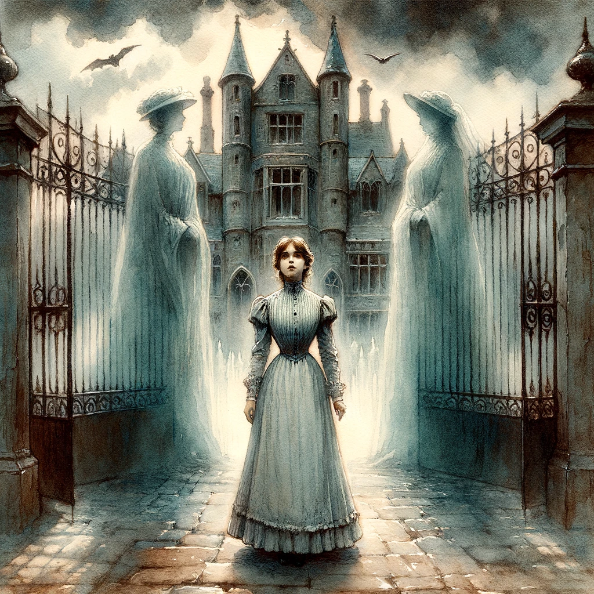

# The Turn of the Screw, Henry James

## Summary

"The Turn of the Screw" by Henry James is a gripping Gothic horror tale set in a remote English country house, where a young, inexperienced governess is hired to care for two orphaned children, Flora and Miles. As she becomes accustomed to her new role, the governess soon encounters a series of eerie apparitions that she becomes convinced are the ghosts of a former valet, Peter Quint, and a previous governess, Miss Jessel, who both had troubled relationships with the children. Convinced that these spirits are intent on corrupting the innocence of her charges, the governess becomes increasingly obsessed with protecting Flora and Miles. The story unfolds through her anxious and unreliable narration, blurring the lines between reality and imagination, leading to a climactic and ambiguous confrontation that leaves the ultimate truth of the events open to interpretation. The novella is renowned for its complex narrative, eerie atmosphere, and its exploration of themes such as innocence, corruption, and the power of suggestion.

* Style: I choose the style of Symbolist painting, utilizing watercolor to capture and evoke the mood of "The Turn of the Screw," focusing on emotional truth and the mysterious through a palette of muted, ethereal colors.

The governess stands at the threshold of Bly, flanked by ghostly apparitions, under a foreboding sky, capturing the essence of mystery, protection, and supernatural intrigue of "The Turn of the Screw." In the style of Symbolist painting with watercolors, the cover should feature the young governess at the center, poised between the grand, open gates of Bly, which loom ominously in the background. Her figure should embody both determination and apprehension, with her gaze inviting yet wary, drawing the viewer into the story's heart. Flanking her on either side, but slightly blurred to emphasize their ethereal nature, are the spectral figures of Peter Quint and Miss Jessel, their appearances elegant yet sinister, embodying the story's haunting elements. Above, the sky should be rendered in dramatic shades of grey and blue, suggesting a storm brewing, symbolizing the tumultuous events within. The governess's Victorian attire, the detailed, Gothic architecture of Bly, and the surrounding landscape should be depicted with muted, ethereal colors, creating a sense of timeless suspense and emotional depth, encapsulating the novella's themes of innocence, corruption, and the unseen forces that shape our lives.

## Scenes

### Arrival at Bly

The young governess arrives at the grand, isolated estate of Bly, full of optimism and naiveté. She is greeted by the housekeeper, Mrs. Grose, and meets the two charming children, Flora and Miles, for the first time. The sprawling, beautiful estate radiates a serene yet haunting atmosphere, with its vast gardens, ancient architecture, and the serene lake, setting the stage for the eerie occurrences that follow.

The young, optimistic governess arrives at the sprawling estate of Bly, greeted by Mrs. Grose and the children. In the style of Symbolist painting with watercolors, capture the governess's arrival with a sense of eerie anticipation. The composition should center on the governess, characterized by her youthful appearance and hopeful expression, standing at the gate of Bly. The estate should loom in the background, its architecture grand yet slightly foreboding, with creeping shadows and a hint of mist. Mrs. Grose, warm yet cautious, and the children, Flora and Miles, innocent and beautifully dressed, should be welcoming her. Emphasize the contrast between the brightness of their greeting and the shadowy, mysterious mansion.

### First Apparition of Peter Quint

On a late, tranquil evening, while the governess strolls the grounds of Bly, she spots a mysterious man observing her from atop the estate's old tower. His appearance is striking with a sinister aura; he is pale, with piercing eyes, and dressed inappropriately for a man of his presumed station. This figure, later revealed to be the ghost of Peter Quint, the former valet, fills the governess with an overwhelming sense of dread and foreboding, marking the beginning of the supernatural encounters.

The governess sees the ghost of Peter Quint on the old tower. Utilizing Symbolist painting with watercolors, depict the governess on a peaceful walk, suddenly frozen as she spots Quint atop the tower. Quint should appear almost ethereal, with a sinister elegance, his gaze intense and unsettling. The governess should be in the foreground, her face a mix of curiosity and fear, dressed in her simple, Victorian attire. The tower should seem to stretch unnaturally tall, with Quint perched precariously, highlighting the supernatural element. Use muted colors to evoke a chilling atmosphere, with the fading light of dusk adding to the scene's eerie quality.

### Encounter with Miss Jessel

In the dim, oppressive atmosphere of the schoolroom, the governess encounters the spectral figure of Miss Jessel, the children's former governess, sitting at the teacher's desk, her head bowed in sorrow. The room is filled with a thick, palpable tension, with books and papers strewn about, suggesting a sudden departure. Miss Jessel's appearance is mournful, dressed in black, her face pale and eyes filled with an unspeakable sadness, hinting at the tragic past events that led to her demise.

The governess discovers the ghost of Miss Jessel in the schoolroom. In this scene, employ the Symbolist style with watercolors to create a somber mood. Miss Jessel should be seated at the desk, her figure blurred and shadowy, embodying sorrow and despair. Her Victorian dress, in shades of black and grey, should contrast with the brighter, yet muted, colors of the room. The governess, depicted from behind, observes the scene, her posture tense and apprehensive. The cluttered desk, scattered books, and dimly lit room should add to the sense of abandonment and melancholy.

### The Governess's Growing Obsession

Night has fallen, and the governess sits by a candlelit table, pouring over old letters and documents, trying to piece together the histories of Quint and Jessel and their relationships with the children. The room is cast in shadow, save for the circle of light from the candle, highlighting the governess's intense, worried expression as she becomes increasingly convinced of the children's corruption and her desperate duty to save them. The heavy curtains billow slightly with the night wind, adding a sense of isolation and the weight of her solitary struggle.

The governess is consumed by her research into the estate's past. Use the Symbolism approach with watercolors to depict the governess by candlelight, surrounded by papers and artifacts of Bly's history. The room should be cast in shadows, with the candle's glow emphasizing her determined, yet increasingly obsessed, expression. Details like the Victorian furniture, heavy drapes, and the singular source of light should enhance the scene's intimacy and sense of isolation. The governess's attire remains simple and period-appropriate, reflecting her unchanged, but internally turbulent, character.

### Confrontation by the Lake

On a gloomy, overcast day, the governess discovers Flora by the lake, seemingly communicating with an invisible presence. The setting is tense, with the lake's still waters reflecting the grey skies, creating a mirror image that blurs the boundaries between the real and the supernatural. The governess confronts Flora, demanding she reveal whom she is speaking to, but the child's denial and subsequent hysteria hint at the invisible forces at play, further driving the wedge between reality and the governess's perceptions.

Confrontation by the Lake: The governess confronts Flora by the lakeside about her supernatural interactions. Capture this tense moment in Symbolist painting style with watercolors, focusing on the dramatic confrontation. The governess, anxious and protective, should be facing Flora, who appears disturbed yet defiant. The lake should mirror the grey, overcast sky, blurring the line between the natural and the supernatural. Incorporate elements of nature, like the bleak landscape and still waters, to underscore the scene's eerie silence and the hidden tensions. The governess's and Flora's expressions and body language are key, conveying a complex mix of fear, confusion, and confrontation.

### The Final Confrontation with Miles

In the dimly lit main hall of Bly, the governess confronts Miles about his expulsion from school and his involvement with the ghosts. The atmosphere is charged with tension, the room's grandeur turned ominous under the flickering candlelight, casting long shadows. Miles, under pressure, finally acknowledges the presence of Quint, just as the ghost appears at the window. The moment is electric, a culmination of the governess's fears and desires to protect the children, leading to Miles's tragic collapse and the ambiguous resolution of the supernatural intrusion.

Miles acknowledges the ghost of Peter Quint in the presence of the governess, leading to a tragic outcome. This climactic scene should be rendered in the Symbolist painting style using watercolors, focusing on the emotional intensity between the governess and Miles in the dimly lit hall of Bly. The governess, depicted with a mix of desperation and resolve, confronts Miles, who is at once vulnerable and revealing an unnerving maturity beyond his years. Quint's ghostly figure should be subtly visible outside the window, a spectral observer to the scene's climax. The grandeur of the hall, with its heavy shadows and flickering candlelight, adds to the drama, highlighting the isolation and the pivotal moment of revelation.

