# The Shadow Out of Time, H. P. Lovecraft

## Summary

"The Shadow Out of Time" by H.P. Lovecraft unfolds the eerie tale of Nathaniel Wingate Peaslee, a professor who experiences a sudden, unexplainable mental collapse and then recovers five years later with no memory of the time lost. As he attempts to piece together the events of those missing years through dreams and research, Peaslee uncovers a chilling revelation: his consciousness had been exchanged with that of an entity from the vast and ancient Yithian race, beings capable of traversing time and space to exchange minds with hosts from other eras. The Yithians, driven by the desire to amass knowledge from various epochs, had temporarily inhabited Peaslee's body to explore human civilization. The story climaxes with Peaslee's expedition to the Australian desert, where he discovers the remnants of the Yithians' library city, revealing the horrifying truth of their fate and the cyclical nature of civilizations doomed to fall to their own shadows out of time, hinting at the eventual demise of humanity itself.

* Style: Expressive digital painting with a focus on surrealism and chiaroscuro to accentuate the eerie and otherworldly atmosphere of the story.

A towering, ancient Yithian library emerges from the shadows, with Nathaniel Wingate Peaslee standing at its entrance, caught between the worlds of humanity and the unfathomable depths of cosmic knowledge. In this expressive digital painting, the library is rendered with surreal proportions and architecture, bathed in an eerie, otherworldly light that accentuates its vastness and mystery. Peaslee, depicted in the foreground, is a bridge between the viewer and the alien world, his human form silhouetted against the light, embodying his dual existence and the story's themes of time, memory, and the unknown. The chiaroscuro technique dramatically contrasts the darkness of the unknown with the light of discovery, while swirling patterns and textures in the sky and sand hint at the fluidity of time and the cyclical nature of civilizations. This cover image encapsulates the grandeur, horror, and emotional depth of "The Shadow Out of Time," inviting the viewer into a story that explores the limits of human understanding and the eerie allure of the cosmos.

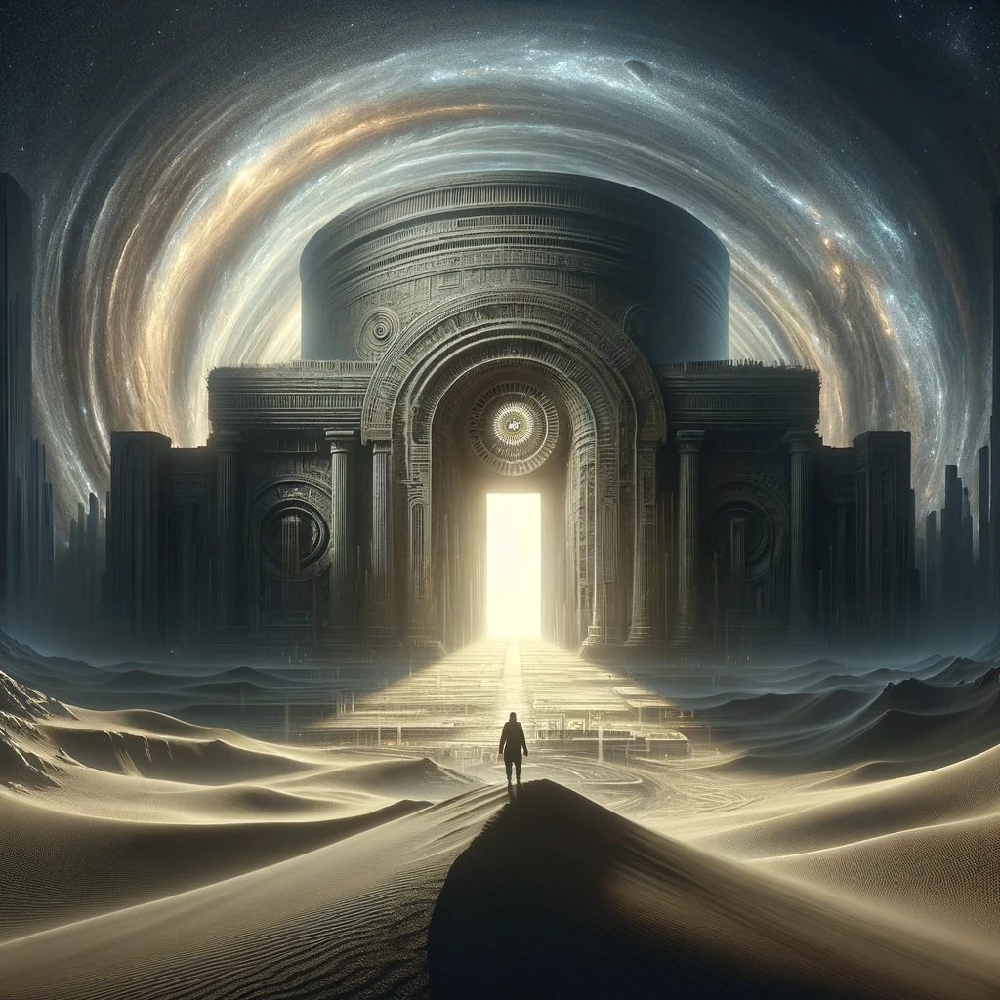
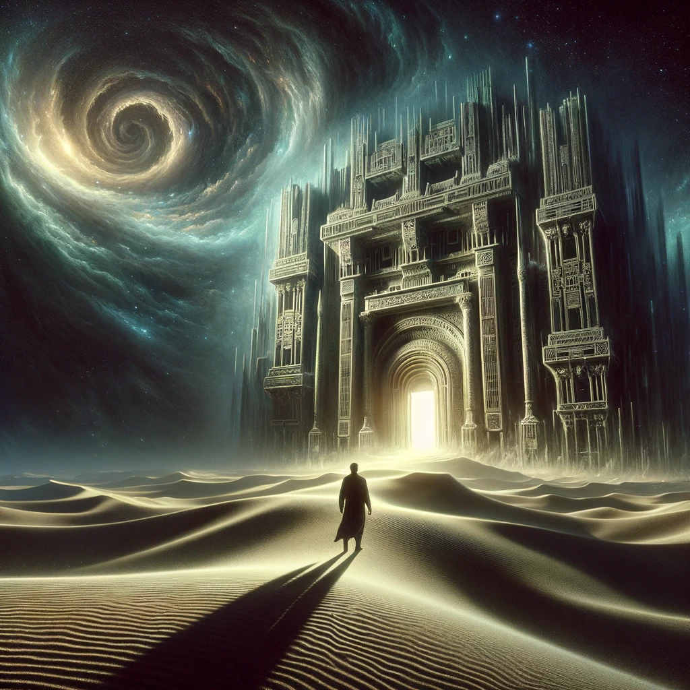

## Scenes

### 1. Peaslee's Collapse at the Lecture

Nathaniel Wingate Peaslee stands before a university class, delivering a lecture on an unspecified topic. Suddenly, his demeanor changes drastically; his speech becomes disjointed, and he appears deeply confused and terrified. This moment signifies the beginning of Peaslee's five-year amnesia. The scene is chaotic, with concerned students and colleagues rushing to assist him as he collapses, his face contorted in inexplicable fear, hinting at an unseen force taking hold of him.

Nathaniel Wingate Peaslee, a middle-aged professor with sharp features and a look of profound distress, stands disoriented at the podium of a dimly lit lecture hall, his shadow stretching ominously across the students' desks. In this expressive digital painting, the surrealism technique emphasizes the chaotic emotions of the moment, with exaggerated expressions of concern among the students and colleagues. Chiaroscuro highlights the contrast between Peaslee's sudden moment of darkness and the mundane brightness of the academic setting. The composition focuses on Peaslee's face, capturing the exact moment of his breakdown, with swirling colors around him suggesting the invisible force taking over.

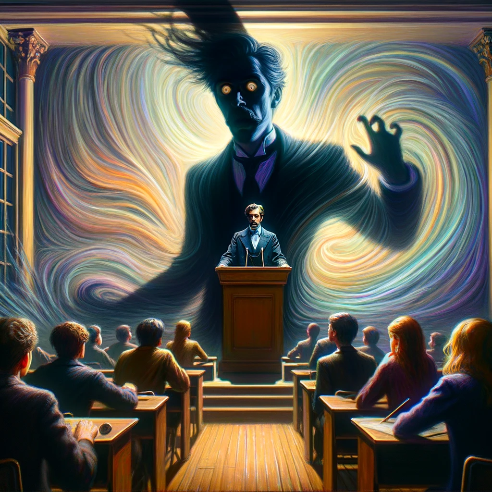
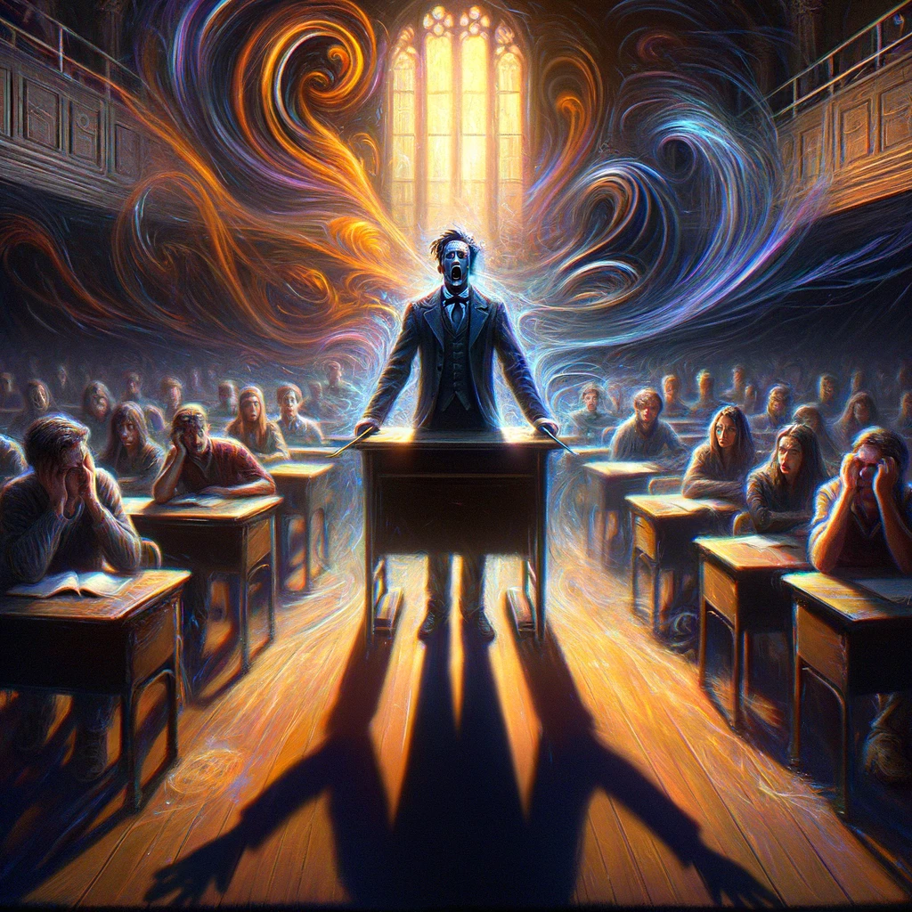

### 2. Awakening with Lost Time

After five years, Peaslee "awakens" in his study, surrounded by unfamiliar books and notes in his handwriting that suggest a deep involvement in obscure and arcane subjects. The room is dimly lit, filled with the dust of neglect, and the walls are lined with bookshelves that contain strange tomes and artifacts. Peaslee sits at his desk, bewildered, holding a letter in his own handwriting that he cannot recall composing, reflecting his profound disorientation and the horror of lost time.

In a cluttered, shadow-filled study, Peaslee awakens, his face marked by confusion and fear. The room is a treasure trove of arcane objects, books with strange symbols, and papers scattered about, lit by a single source of light that casts deep shadows, accentuating the chiaroscuro effect. Through expressive digital painting, surreal elements like the exaggerated size of the books and an ethereal glow emanating from some unknown source in the room suggest the otherworldly knowledge Peaslee has been exposed to. The composition is centered on Peaslee, with his eyes wide in realization of his missing time.

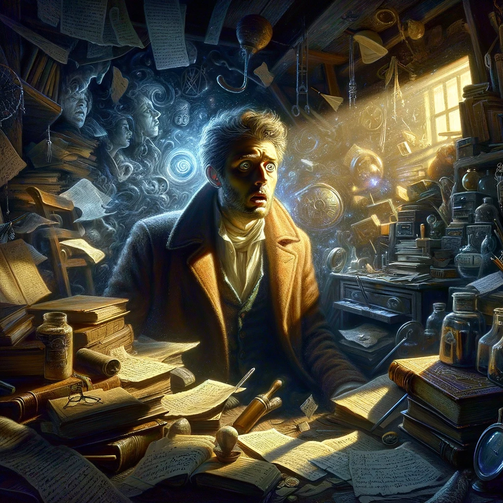
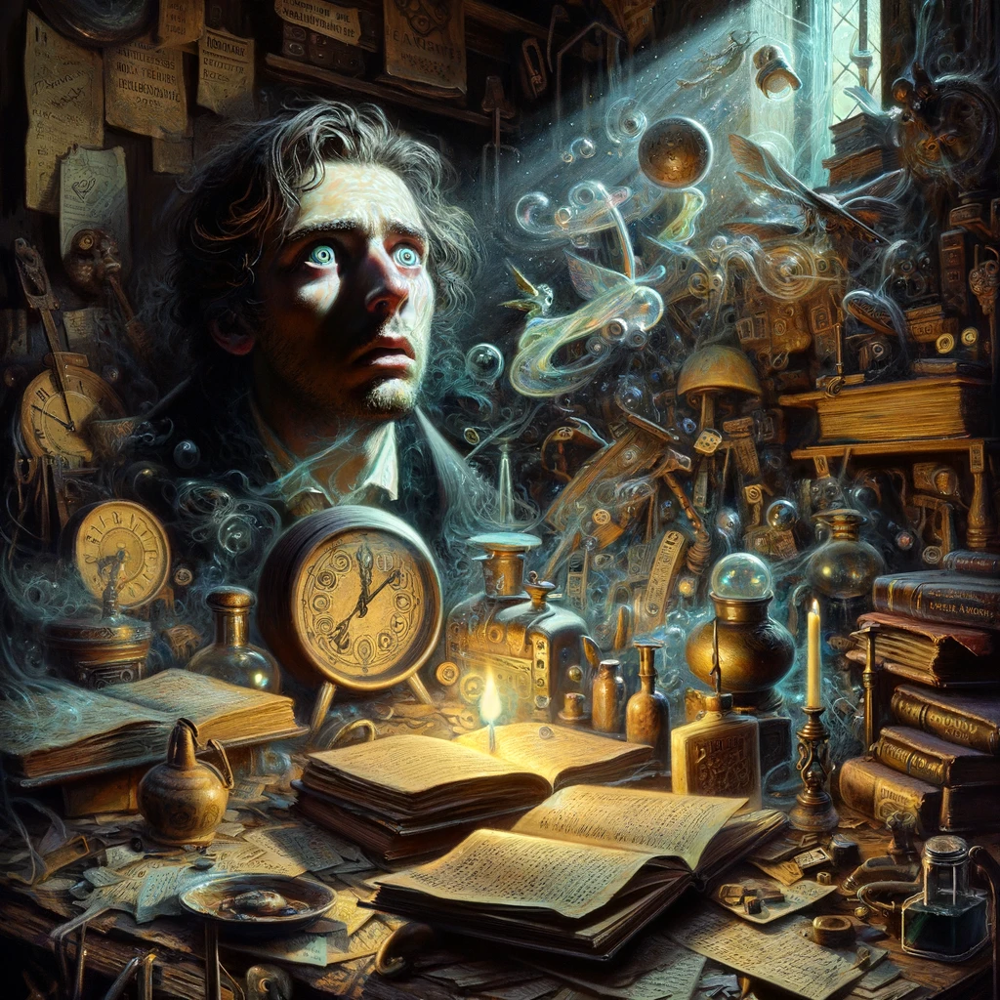

### 3. Visions of the Yithian Library

Peaslee experiences vivid, unsettling dreams of a vast, alien library city inhabited by the Yithians—a race of conical beings with tentacles, eyes on stalks, and wings. The library is an immense, labyrinthine structure, filled with books and artifacts from countless civilizations, illuminated by a strange, eerie light. The Yithians are shown studying and exchanging knowledge, with Peaslee (in a Yithian body) among them, hinting at the cosmic scale of their intellect and the disturbing reality of his mind exchange.

This scene depicts a vast alien library, with towering shelves and strange, geometric architecture bathed in an eerie light. Peaslee, now in a Yithian body characterized by its conical shape, tentacles, and eyes on stalks, is central in the composition, surrounded by other Yithians in a setting that merges the familiar with the bizarre. The use of expressive digital painting enhances the surreal, dream-like quality of the library, with chiaroscuro emphasizing the stark differences between the known and the alien. The library is filled with artifacts and books that are both fascinating and horrifying, inviting the viewer to ponder the vastness of cosmic knowledge.

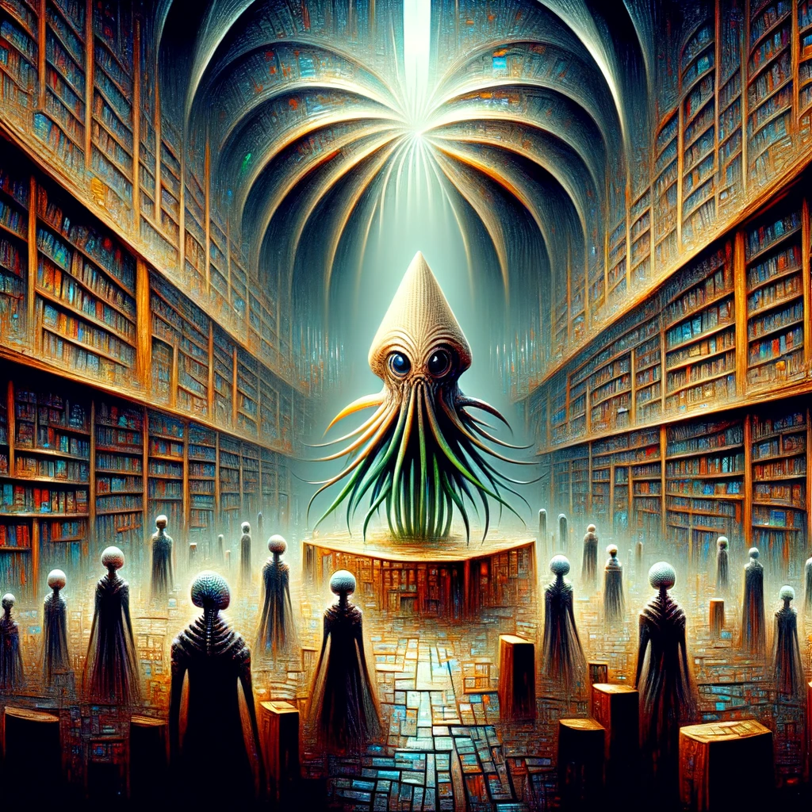
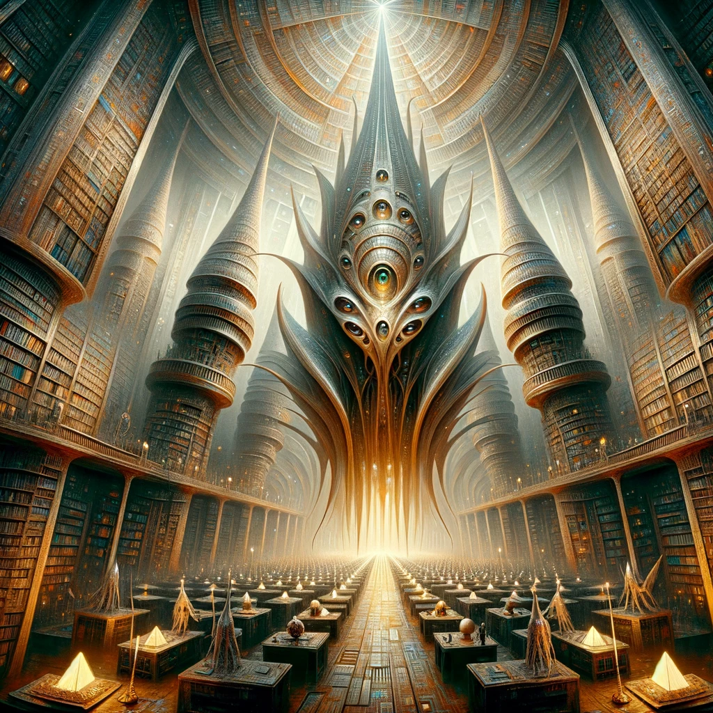

### 4. Encounter with the Yithian Consciousness

In a dream or a trance, Peaslee comes face to face with a Yithian, communicating mind-to-mind in a surreal, ethereal space that transcends physical boundaries. The scene is charged with a mix of awe and horror as Peaslee realizes the extent of the Yithians' power and their method of ensuring their civilization's survival by swapping consciousness across time. The Yithian's form is alien and intimidating, casting an ominous shadow over Peaslee, who is both fascinated and horrified by the encounter.

The scene is an ethereal, dream-like space where Peaslee, still human in appearance to maintain consistency and allow viewer connection, communicates mind-to-mind with a Yithian, whose imposing, alien form towers over him. The surrealism and chiaroscuro techniques are used to blur the boundaries between reality and imagination, with stark contrasts of light and dark highlighting the moment of communication. The Yithian's form is illuminated in such a way that emphasizes its strange anatomy while casting an ominous shadow over Peaslee, symbolizing the overwhelming nature of the encounter.

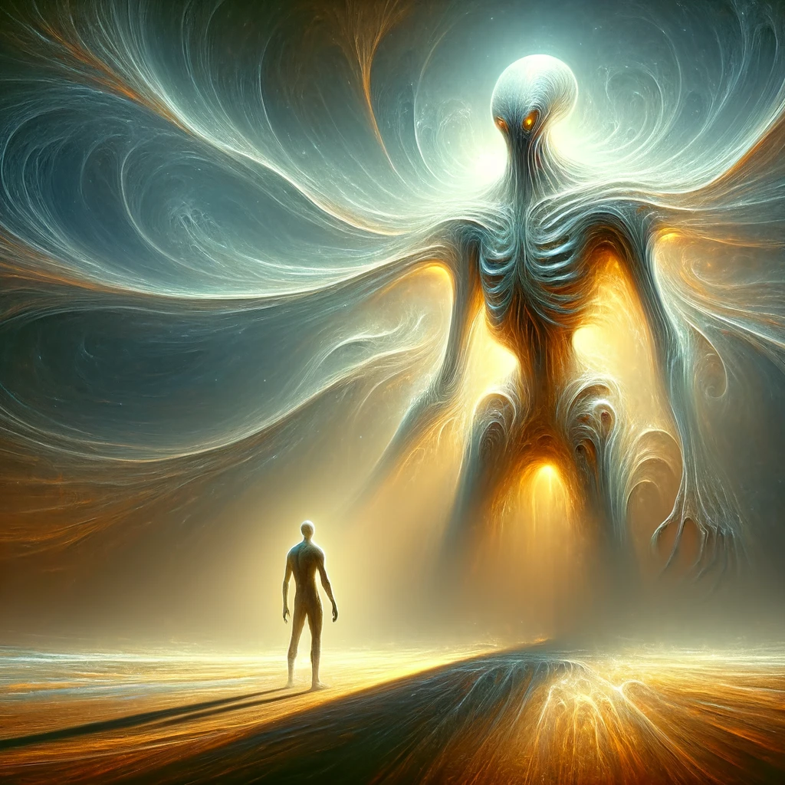
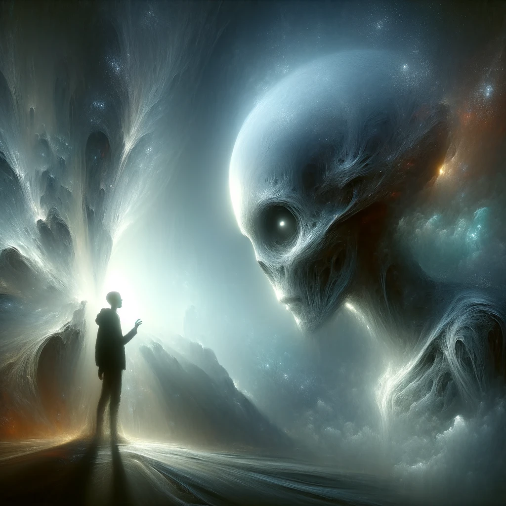

### 5. Discovery in the Australian Desert

The climax unfolds as Peaslee, accompanied by a small expedition, discovers the ruins of the Yithian city buried in the Australian desert. The scene is desolate and foreboding, with vast, ancient stone structures emerging from the sand, worn by time but still bearing the unmistakable marks of the Yithian civilization. Peaslee stands at the edge of an excavated site, looking down at carvings that tell the story of the Yithians' eventual downfall, the realization dawning on him of the cyclical doom awaiting all civilizations, including humanity.

Peaslee stands at the forefront of a desolate, sandy landscape, with the sun setting behind the ruins of the ancient Yithian city, casting long shadows and creating a dramatic chiaroscuro effect. The ruins are rendered in a style that blends realistic decay with surreal proportions, suggesting the grandeur and alienness of the Yithian civilization. The composition leads the viewer's eye from Peaslee, who is depicted with a mix of awe and horror on his face, toward the ruins, emphasizing the scale and the mystery of the discovery through expressive digital painting techniques.

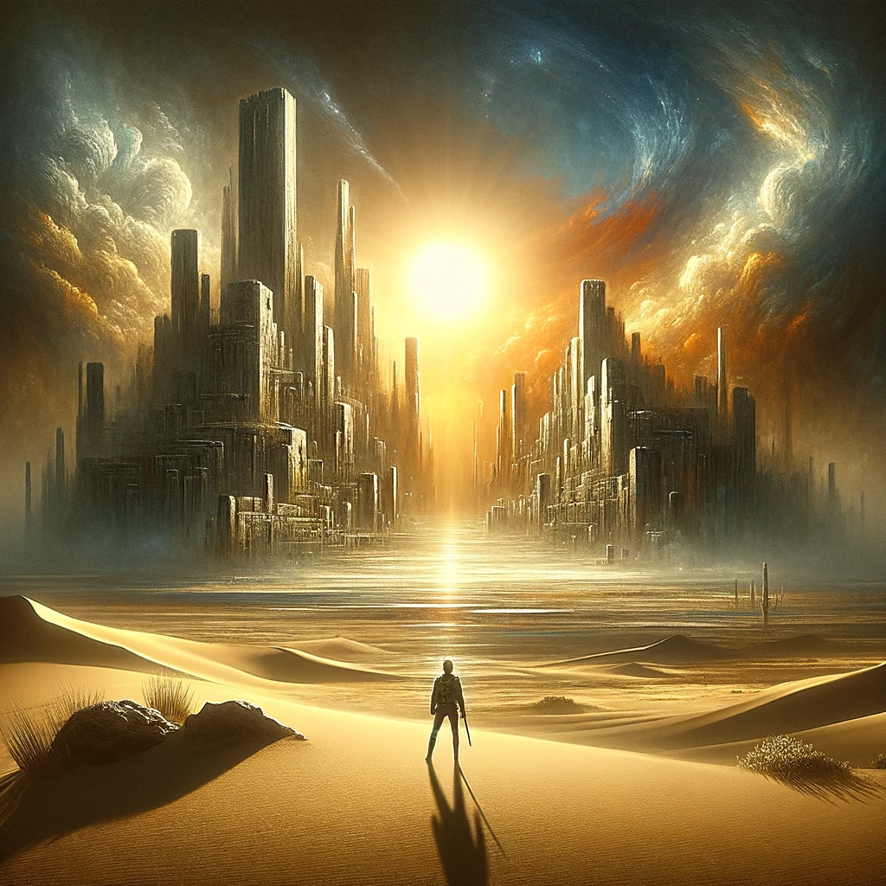
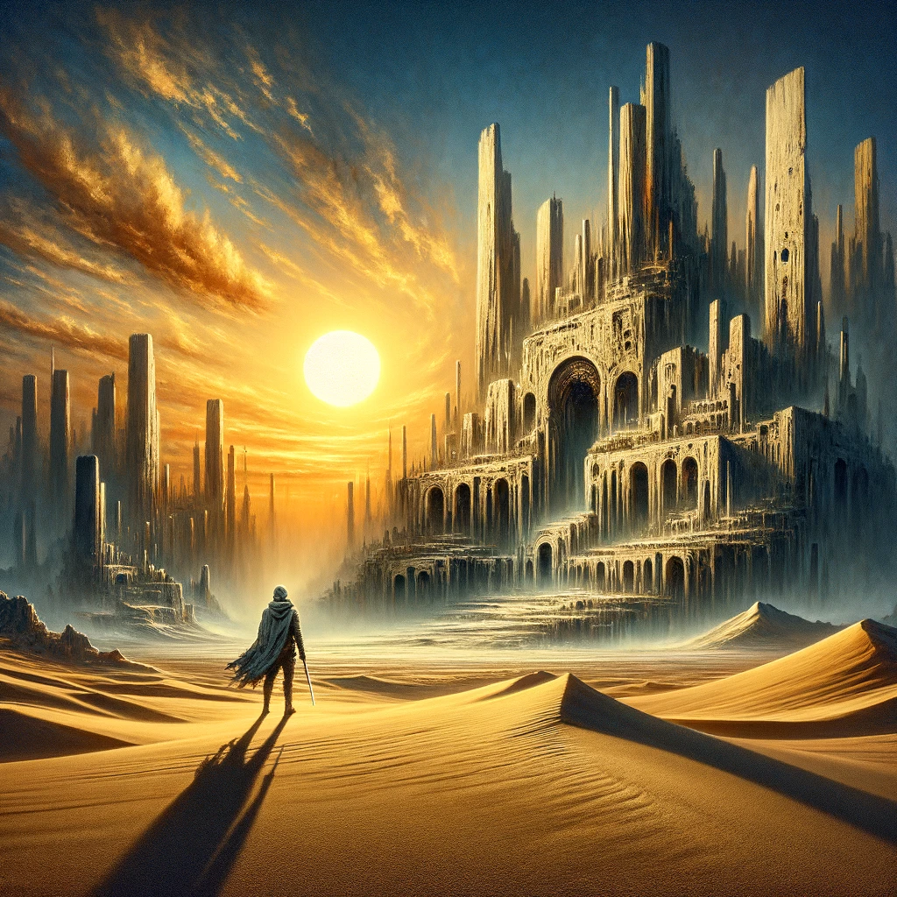

### 6. Final Revelation and the Shadow

The story concludes with Peaslee haunted by the implications of his experiences. One night, he is drawn to his study, where he senses an oppressive, otherworldly presence. As he pores over his notes, the shadows in the room seem to grow unnaturally dense, hinting at the presence of a Yithian or perhaps something even more ancient and malevolent. This moment captures Peaslee's isolation and dread, the cost of the knowledge he has gained, and the looming, inscrutable threat of a universe far more complex and horrifying than mankind can comprehend.

In Peaslee's study, now filled with an overwhelming sense of dread, shadows dominate the scene, crafted through chiaroscuro to create a palpable sense of encroaching darkness. Peaslee, looking weary and haunted, is illuminated by a single lamp, with the shadows around him taking on almost tangible forms, suggestive of unseen horrors. The surrealism aspect is enhanced by subtle, unnerving distortions in the room's geometry and the shadows, implying the presence of something beyond human comprehension. The expressive digital painting style brings a visceral intensity to the scene, encapsulating the story's climactic emotional and psychological horror.

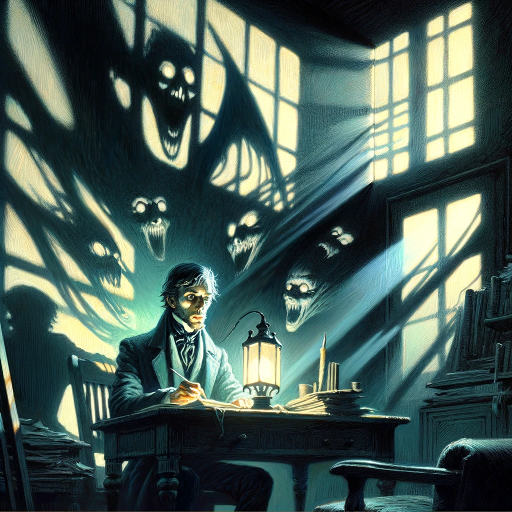
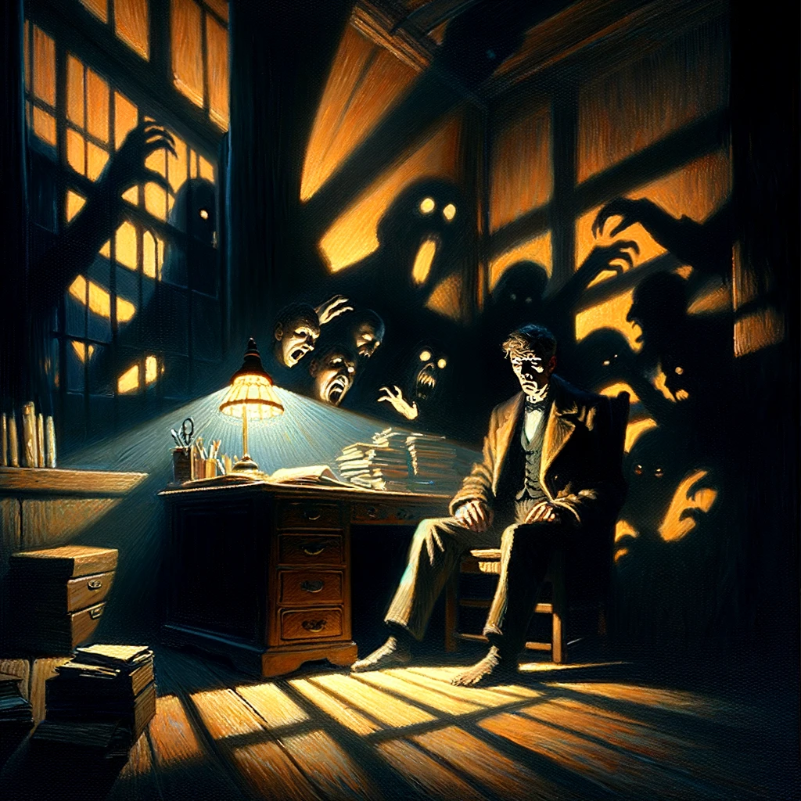

