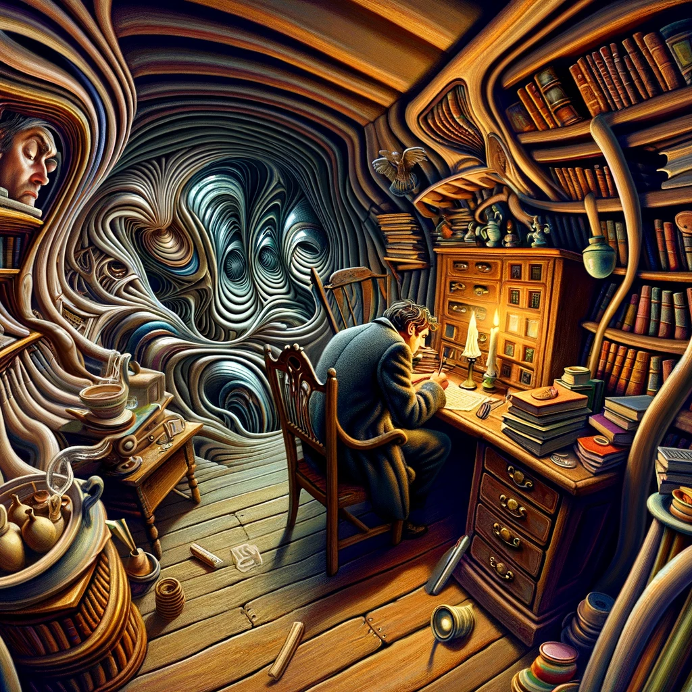

# The Tomb, H. P. Lovecraft

## Story Synopsis

"The Tomb" by H.P. Lovecraft tells the story of Jervas Dudley, a recluse drawn to an ancient tomb after discovering it in the woods near his home. Obsessed with the crypt, Dudley unearths the history of the Hyde family buried there and becomes increasingly detached from reality, convinced he is connected to the deceased occupants. He finds an old key and dreams of entering the tomb, where he experiences a profound connection with the dead. As his obsession deepens, Dudley's sanity frays, and his narrations become unreliable, culminating in his confinement to an asylum. The story blurs the lines between the psychological and supernatural, exploring themes of ancestral obsession, the thin veil between life and death, and the descent into madness.

Style: Surrealist digital art, using surreal landscapes and distorted figures to visualize the story's blend of reality and dream, and its exploration of the subconscious.

In Surrealist digital art style, the cover image depicts Jervas Dudley standing at the threshold of the ancient tomb, key in hand, with the door ajar revealing a luminous, otherworldly light that spills onto the dark forest around him. The composition combines elements of reality and surrealism, with the forest and tomb rendered in exaggerated, dreamlike details that bend and twist, suggesting the blurring of boundaries between the tangible world and the realm of madness. The ground is littered with open books, ancient manuscripts, and a lantern casting long, eerie shadows. Dudley is at the center, portrayed with an intense gaze that conveys both his obsession and the impending descent into madness, his figure casting two shadows—one leading into the tomb and the other stretching back into the forest, symbolizing the dual paths of his fate. The background swirls with a mix of foreboding and enchanting colors, encapsulating the story's themes of curiosity, obsession, and the thin veil between life and death.

## Scenes

### Jervas Dudley Discovers the Tomb

Jervas Dudley, a young man with a penchant for the solitary and macabre, stumbles upon a dilapidated tomb in the ancient woods near his home. The tomb, obscured by overgrown vegetation, bears the inscription of the Hyde family. Dudley's initial fascination is captured as he stands before the weathered door, peering curiously into the shadows that lie beyond.

In a Surrealist digital art style, depict Jervas Dudley, a young man with an intense gaze and disheveled hair, standing before an ancient, overgrown tomb. The tomb door is adorned with cryptic, barely discernible inscriptions and partially hidden by twisted vines. The composition should tilt slightly, creating a disorienting effect, with exaggerated, dreamlike colors highlighting the contrast between the dark entrance and the surrounding eerie forest. Dudley's expression is a mix of curiosity and apprehension, hinting at the obsession that will consume him.

### Dudley's Growing Obsession

Dudley returns to the tomb repeatedly, drawn by an irresistible allure. He is depicted sitting before the tomb at dusk, reading from an old tome he believes resonates with the spirits of the Hyde family, his face illuminated by the eerie light of a lantern, suggesting a deepening obsession with the crypt.

Using Surrealist digital art, illustrate Dudley sitting on the ground in front of the tomb at twilight. The scene is bathed in an unnatural, deep blue light, emphasizing his isolation. Books, ancient manuscripts, and a lantern are scattered around him, casting long, distorted shadows that seem to merge with the darkness of the tomb. Dudley's face is illuminated from below, creating dramatic contrasts and emphasizing his growing obsession with the crypt.

### The Discovery of the Key

A pivotal moment where Dudley finds an ancient, rusted key in a hidden compartment of his father's library. The scene shows Dudley holding the key up to the light, the realization dawning on his face that this key might unlock the Hyde tomb, symbolizing the unlocking of forbidden knowledge.

In this Surrealist digital art scene, capture the moment Dudley finds the ancient key. The composition should focus on Dudley's hands, holding the rusted key up to the light of a dimly lit, cluttered study, with shadows playing across his face, revealing a mix of triumph and foreboding. The background should blur into abstraction, symbolizing the key's power to unlock not just the physical tomb but also the mysteries and madness that lie beyond.

### Dudley's First Entry into the Tomb

Under the cloak of night, Dudley uses the key to enter the tomb. This scene captures the moment the ancient door creaks open, revealing the darkness within. Dudley steps inside, his expression one of awe and terror, as he crosses the threshold into the unknown.

Depict Dudley using the key to open the tomb's ancient door in Surrealist digital art style. The door should swing open into pitch blackness, with Dudley silhouetted against the eerie glow from outside. The scene should be framed to create a sense of Dudley stepping into another world, with the boundaries of the tomb entrance warping like a portal. His posture indicates both determination and a hint of fear, encapsulating the moment of crossing into the unknown.

### The Dream Sequences

Dudley experiences vivid dreams where he attends ghostly gatherings with the deceased Hydes. These scenes are surreal and ethereal, with Dudley, dressed in antiquated clothing, dancing among shadows and specters in the grand hall of a phantom mansion, blurring the lines between reality and the supernatural.

Illustrate Dudley's dreams of ghostly gatherings with the deceased Hydes in a Surrealist digital art manner. The scene is set in a grand, impossible architecture blending elements of the tomb with a lavish, decaying mansion. Spectral figures dance around Dudley, who is dressed in period attire that blends seamlessly with the ghosts. The colors should be vivid yet translucent, creating a sense of otherworldliness and the fluidity between dream and reality.

### Dudley's Isolation

As Dudley's obsession deepens, he becomes more isolated from society. A scene shows him sitting alone in his room, surrounded by old books and artifacts related to the Hyde family, the room lit only by the ghostly glow of a candle, symbolizing his detachment from the living world.

Show Dudley in his study, surrounded by artifacts and books related to the Hyde family, in Surrealist digital art style. The room is distorted, with walls that seem to curve and stretch, encapsulating his detachment from reality. A single candle casts bizarre shadows, hinting at the encroaching madness. Dudley's focus is intense, oblivious to the surreal transformation of his surroundings, highlighting his complete isolation from the world.

### The Confrontation with His Father

Dudley's father, concerned by his son's behavior, confronts him. This scene depicts a tense moment between Dudley, clutching his diary filled with ramblings about the tomb and his dreams, and his father, whose expression is a mix of anger, concern, and disbelief.

Capture a tense moment between Dudley and his father in Surrealist digital art. The father is depicted in stark, realistic detail, symbolizing the reality confronting Dudley's delusions, which are represented by the distorted, dreamlike room around them. Dudley clutches his diary defensively, his expression a mix of defiance and madness, while his father stands firm, a beacon of concern and disbelief amidst the chaos.

### Dudley's Descent into Madness

A powerful scene showing Dudley in the tomb, laughing maniacally as he realizes he can no longer distinguish between reality and his dream world. The shadows of the tomb seem to dance around him, reflecting his descent into madness.

Illustrate Dudley's laughter in the tomb, surrounded by dancing shadows that seem alive, in a Surrealist digital art style. The shadows twist and turn, merging with Dudley's form, symbolizing his descent into madness. The tomb around him should be rendered with impossible perspectives, enhancing the sense of disorientation and loss of reality. Dudley's expression is one of ecstasy and terror, capturing the moment of his ultimate break from sanity.

### The Discovery by the Villagers

Villagers, led by Dudley's father, find Dudley in a state of delirium in front of the tomb. The scene captures their horror and Dudley's wild, unkempt appearance as he rants about the Hydes and his experiences, illustrating his complete break from reality.

In Surrealist digital art, depict the villagers' discovery of Dudley in a frenzied state outside the tomb. The villagers are rendered with elements of fear and confusion, their forms slightly distorted to reflect their intrusion into Dudley's surreal world. The scene contrasts the mundane reality of the villagers with the chaotic, distorted environment surrounding Dudley, who is at the center, wild-eyed and disheveled, ranting about his experiences.

### Dudley Confined to the Asylum

The final scene shows Dudley confined to a room in an asylum, staring out of a barred window at the moonlight. His diary lies forgotten on the floor, and he is depicted as a shadow of his former self, trapped in his madness, the outside world unreachable.

Finally, portray Dudley in an asylum room, looking out of a barred window at the moon, in Surrealist digital art. The room bends around him, with the bars of the window melting into surreal shapes, symbolizing his trapped mind. Outside, the landscape should blend elements of the forest, the tomb, and the moon into a dreamlike vista that Dudley can never reach. His diary, open and forgotten on the floor, serves as a poignant reminder of his journey into madness.

