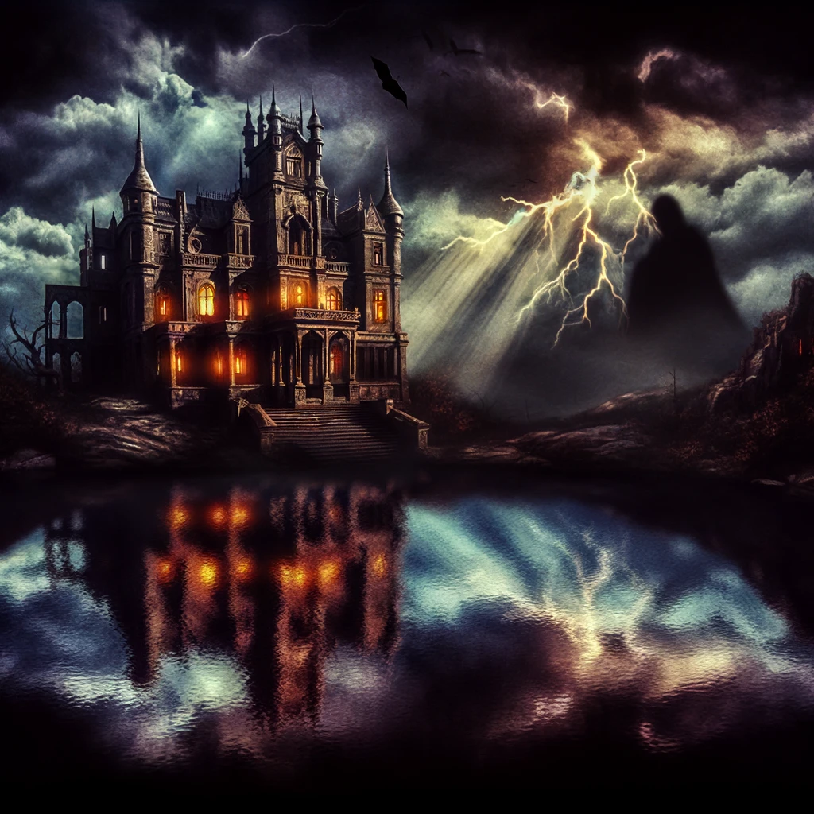
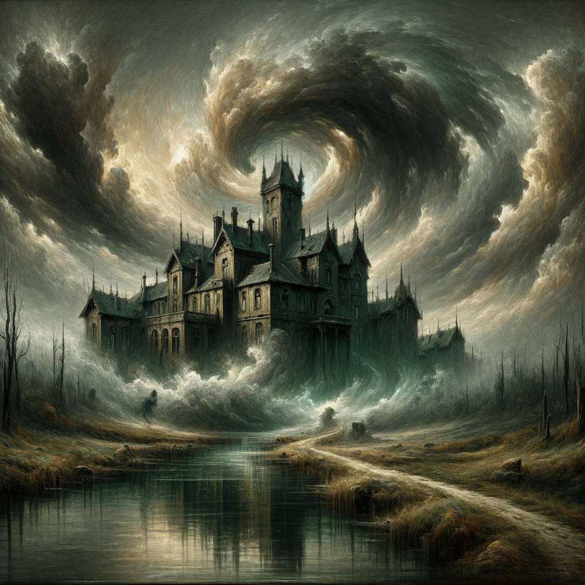
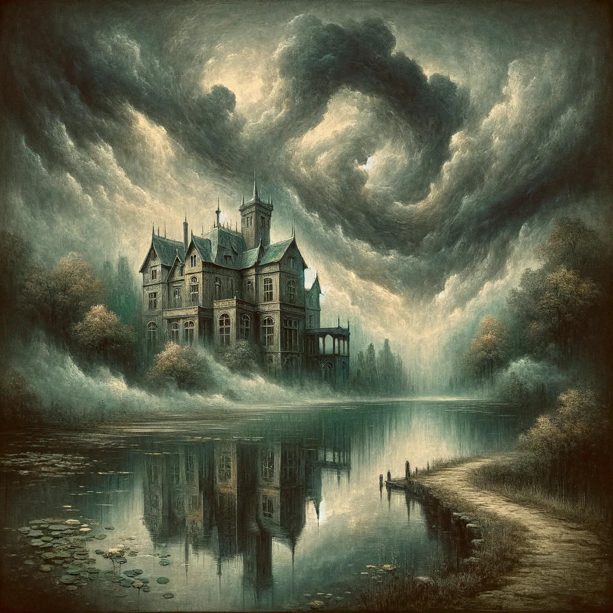
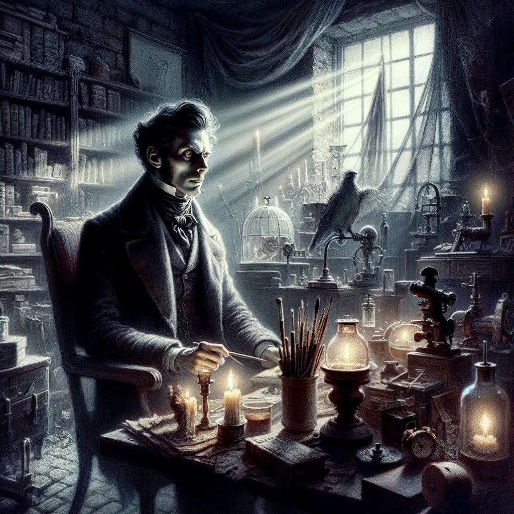
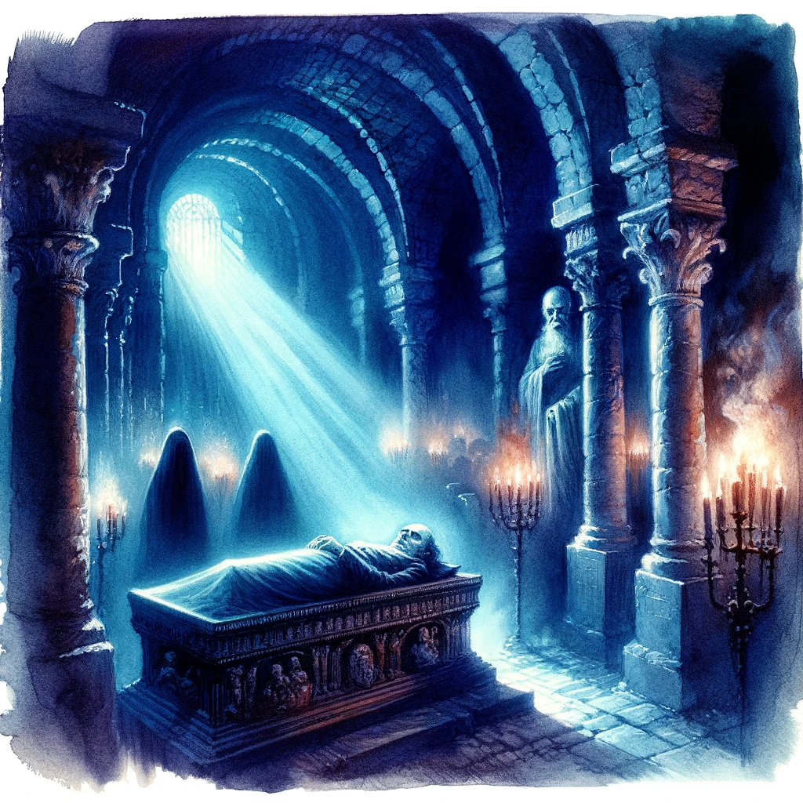
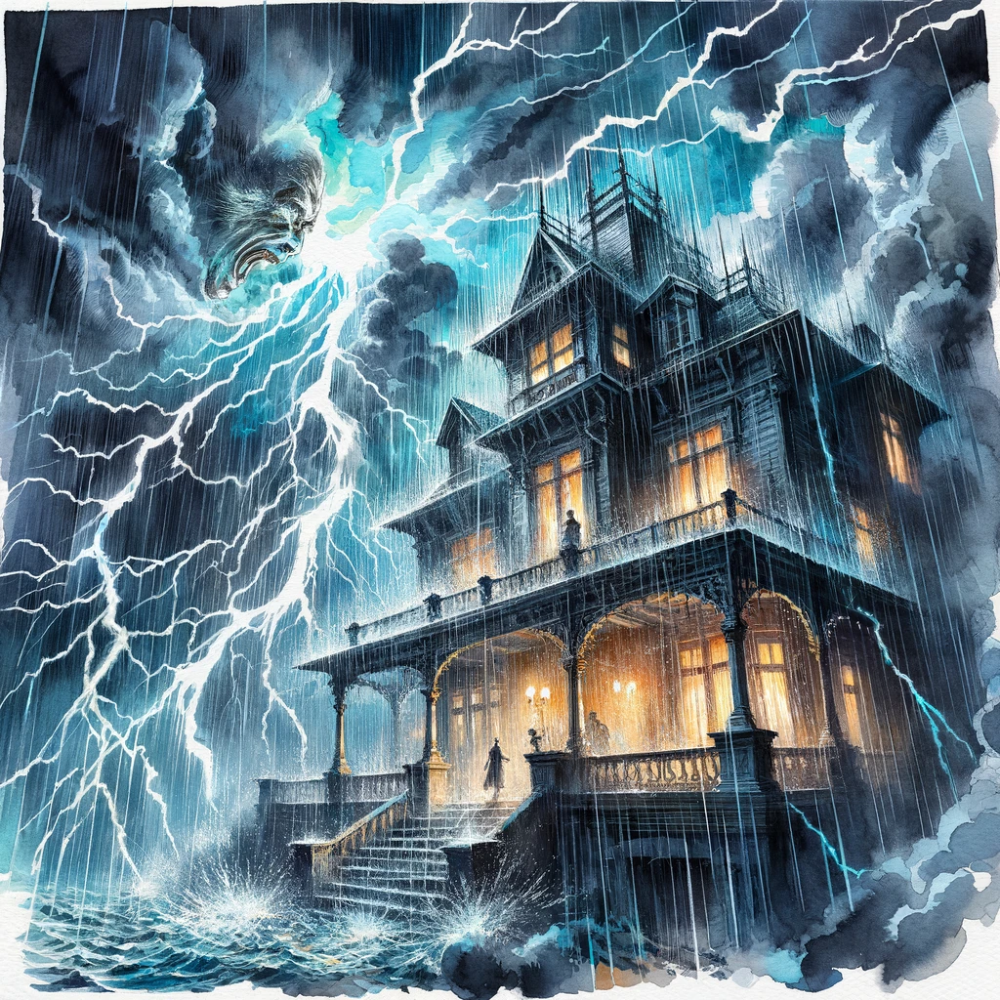
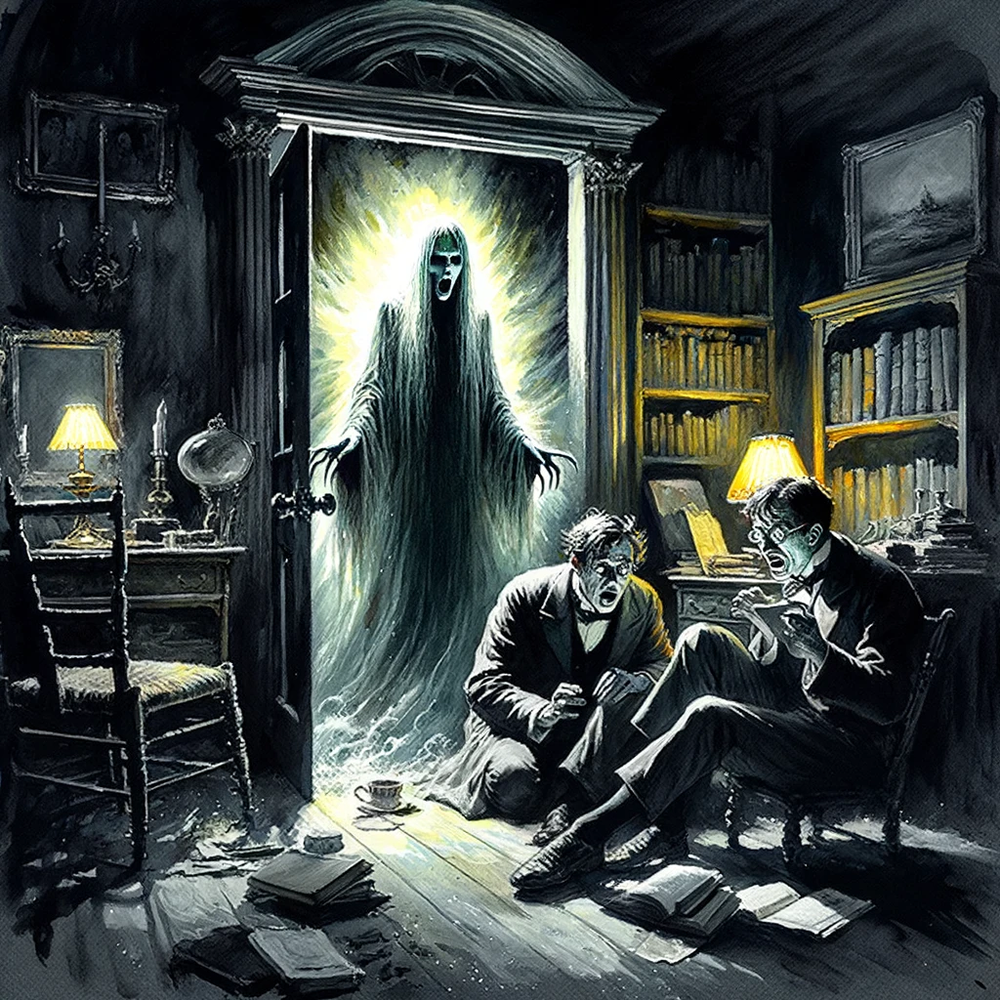
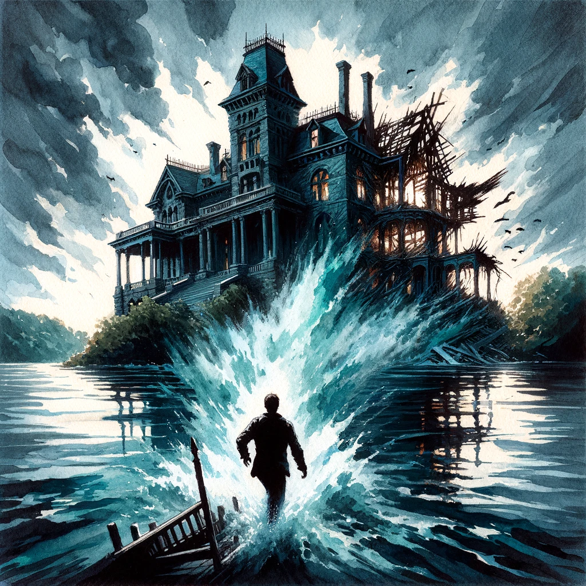
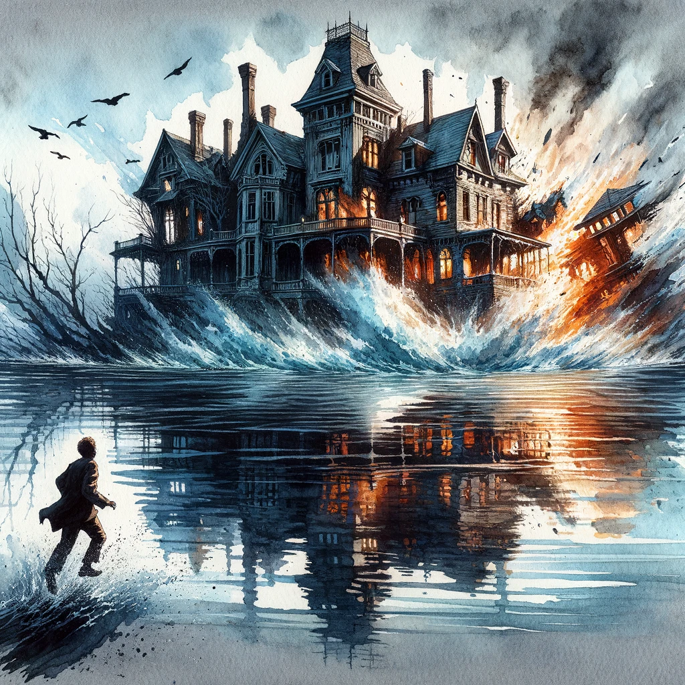

# The Fall of the House of Usher

## Story Synopsis

"The Fall of the House of Usher" is a gothic tale that delves into themes of decay, madness, and supernatural influences, narrated by an unnamed protagonist who visits his childhood friend, Roderick Usher, at his ancestral mansion. Roderick, suffering from a mysterious illness that makes him hypersensitive to stimuli and deeply morose, reveals that his twin sister, Madeline, is also ill and soon dies, or so it seems. They entomb her in the family crypt, but eerie events and a sense of foreboding soon engulf the mansion. The narrator and Roderick become increasingly agitated as a storm rages outside. Eventually, Madeline, alive and having escaped her coffin, confronts them, leading to Roderick's death from terror. The narrator flees, witnessing the literal collapse of the Usher mansion into the tarn it overlooked, symbolizing the end of the Usher family and the fulfillment of a morbid prophecy. The story masterfully intertwines the psychological with the supernatural, encapsulating Poe's fascination with the macabre and the fragile boundaries of sanity.

For a cover image that encapsulates the essence of "The Fall of the House of Usher," envision a grand, atmospheric composition in the style of Romanticism, executed with the intricate detail and depth of oil painting. This medium allows for a rich palette and texture, perfectly suited to convey the story's mood of decay, despair, and supernatural horror. The image is dominated by the Usher mansion at the moment of its collapse, its architecture rendered in painstaking detail to showcase the gothic beauty and the simultaneous destruction. The mansion is perched precariously at the edge of the dark, mirror-like tarn, under a tumultuous sky where the clouds seem to mimic the chaos of the storm and the emotional turmoil of the story. Lightning forks over the scene, illuminating the mansion and its reflection in the water, creating a sense of duality and foreboding. In the foreground, the silhouetted figure of the narrator escapes, casting a long shadow that leads the viewer's eye towards the doomed mansion. This scene captures the essence of Poe's narrative: the inevitable decline and fall of the house, the intertwined fates of its inhabitants, and the haunting beauty of their tragic story. The use of oil painting enhances the visual impact of the scene, making it a powerful and memorable representation of the story, ideal for a book cover or mounted artwork.

## Scenes

### Arrival at the Usher Mansion

The scene is set with a gloomy, oppressive atmosphere as the narrator approaches the dilapidated Usher mansion. The sky is overcast, casting the landscape in a monochrome palette, with the mansion itself emerging as a decrepit, haunting structure beside a dark, still tarn. The mansion’s reflection in the tarn adds to the eerie symmetry and sense of foreboding. Bare, twisted trees and a sense of utter isolation surround the estate, emphasizing its detachment from the outside world.

The scene is painted with a somber palette of grays and dark greens, showcasing the mansion under a tumultuous sky, where the clouds seem to swirl in a foreboding dance. The mansion itself is rendered with fine, almost decaying lines to emphasize its state of disrepair, while its reflection in the tarn adds a spectral quality, suggesting a duality between reality and reflection. The approach is narrow, leading the viewer's eye directly to the mansion, enveloped in a mist that blurs the boundaries between water and land, enhancing the scene's mystery.

### Roderick Usher's Condition

Inside the mansion, Roderick Usher is portrayed in a dimly lit, cluttered study filled with books, musical instruments, and paintings that reflect his eclectic and morbid tastes. Roderick himself is pale, with a haunted look in his eyes, dressed in a robe that seems too large for his weakened frame. The room’s windows are draped, allowing only slivers of light, accentuating his hypersensitivity to light and sound. His intense, nervous demeanor contrasts sharply with the somber decor, suggesting his deep psychological distress.

This interior scene focuses on Roderick, seated in a shadow-filled study surrounded by objects that reflect his intellectual and morbid curiosities. The watercolor medium allows for a soft blending of shadows and light, creating a sense of depth and claustrophobia. Roderick is depicted with exaggerated features: pale skin, deep-set eyes, and an air of desolation, surrounded by the blurred outlines of books and instruments, suggesting his blurred grip on reality. The dim light filtering through the curtained windows casts dramatic shadows, heightening the scene's intensity and Roderick's isolation.

### Madeline's "Death"

This scene captures the solemn and macabre ceremony of entombing Madeline in the family crypt, which lies beneath the mansion. The crypt is depicted as ancient and filled with the coffins of Usher ancestors, shrouded in shadows and cobwebs. Madeline’s coffin is shown being placed among them, with Roderick and the narrator standing by, their faces illuminated by the flickering torchlight. The air is heavy with the sense of a profound, unsettling finality, yet Madeline’s face bears a troubling hint of serenity that suggests her death may not be as it seems.

The crypt scene is bathed in cool, eerie tones, with the blue and violet hues of the shadows contrasting with the warmer light of the torches, casting a ghostly glow on Madeline's coffin and the surrounding ancestral tombs. The watercolor's fluidity enhances the stone textures of the crypt and the ethereal appearance of Madeline, who is painted with a serene, almost lifelike quality that hints at her uncertain fate. The expressions of Roderick and the narrator are captured in the flickering torchlight, reflecting their complex emotions of grief and dread.

### The Storm

A tumultuous storm scene captures the climax of the narrative’s tension, with lightning illuminating the Usher mansion and its surrounding landscape in stark, brief flashes. Inside, the narrator and Roderick are seen in the study, with shadows playing across their anxious faces as the wind howls and rain lashes against the windows. The atmosphere is charged with a mix of fear and anticipation, mirroring the psychological turmoil of the characters as they sense an impending, undefinable doom.

Capturing the fury of the storm, this scene employs a dynamic composition, with jagged lines representing lightning strikes that illuminate the mansion and its surroundings. The watercolors are applied in layers to create the tumultuous clouds and the torrential rain, with the mansion appearing almost as a ship at sea, battered by the elements. The interior scene shows Roderick and the narrator in a tight frame, their faces illuminated intermittently by the storm's lightning, encapsulating a moment of psychological turmoil amid the natural chaos.

### Madeline's Return

The most dramatic scene unfolds as Madeline, bloodied and disheveled from her escape from the crypt, confronts Roderick and the narrator in the study. The door to the room slowly opens to reveal her ghastly figure, standing with an otherworldly determination. The room is thrown into chaos, with Roderick’s face showing sheer terror, while the narrator recoils in horror. The scene captures the moment of supernatural horror and the culmination of the story’s gothic elements.

This climactic scene uses stark contrasts, with the ghastly figure of Madeline emerging into the study's dimly lit interior. The doorframe around Madeline serves as a portal between the world of the living and the dead, her figure painted with a spectral glow against the dark, shadowy room. The expressions of horror on Roderick and the narrator's faces are accentuated, with the watercolor medium allowing for the blending of colors and shadows to create a tangible sense of fear and supernatural intrusion.

### The Collapse of the House

The final scene depicts the narrator’s escape from the mansion as he looks back to witness its destruction. The mansion is shown fracturing and sinking into the tarn, with its structure crumbling under the weight of its own decay and the violent storm. This apocalyptic scene symbolizes the end of the Usher lineage and the physical manifestation of the family’s curse. The tarn swallowing the remnants of the mansion serves as a mirror reflecting the ultimate fall of the House of Usher, leaving nothing but ripples on the water’s surface under a clearing sky.

The destruction of the Usher mansion is depicted with a dramatic interplay of light and darkness, as the structure itself dissolves into the tumultuous waters of the tarn. The watercolor technique allows for the mansion's reflection and its actual form to merge in the swirling waters, creating a visual metaphor for the fall of the Usher family. The scene is framed from the perspective of the fleeing narrator, with the foreground showing his silhouette against the backdrop of destruction, emphasizing the theme of escape and the transient nature of human constructs against the forces of nature and fate.

## References

* [The Fall of the House of Usher, Wikipedia](https://en.wikipedia.org/wiki/The_Fall_of_the_House_of_Usher)
* [The Fall of the House of Usher by Edgar Allan Poe, Project Gutenberg](https://gutenberg.org/ebooks/932)

