# The Whisperer in Darkness, H. P. Lovecraft

## Summary

"The Whisperer in Darkness" by H.P. Lovecraft is a chilling narrative that unfolds in the remote hills of Vermont, where the protagonist, Albert N. Wilmarth, an instructor of literature at Miskatonic University, becomes entangled in a terrifying conspiracy following a series of floods that reveal grotesque, alien bodies. His correspondence with Henry Akeley, a local recluse who claims the creatures are part of an advanced extraterrestrial race that seeks to establish communication with humanity, draws Wilmarth into a deepening mystery. Despite initial skepticism, Wilmarth's journey to Akeley's secluded farmhouse reveals horrifying truths about the aliens' intentions and the existence of otherworldly technologies capable of transporting humans across galaxies. The story reaches its climax as Wilmarth uncovers a sinister plot involving body snatching and realizes the grave danger he is in, culminating in a desperate escape from the eerie silence of the Vermont wilderness, leaving the reader questioning the reality of the events and the fate of the characters involved.

* Style: I choose the style of German Expressionism, utilizing oil on canvas, known for its bold use of color and dramatic contrasts to evoke the story's mood of unease and horror.

The cover image depicts Wilmarth standing at the threshold of Akeley's farmhouse, peering into the darkness within, as alien shapes lurk in the shadows behind him and the eerie Vermont hills stretch into the distance. In this single, powerful image, the essence of "The Whisperer in Darkness" is captured: the intersection of the unknown and the terror of the cosmos. Adopting the German Expressionist style, utilizing oil on canvas, the composition should be dramatic, with the farmhouse door acting as a portal between the known world and the unimaginable horrors that lie beyond. Wilmarth is centered, his figure painted with stark contrasts, embodying the human caught in the midst of cosmic horror. The alien shapes behind him are suggested rather than fully depicted, with vibrant, unsettling colors bleeding into the dark, to evoke the presence of the unseen and the otherworldly. The background is dominated by the oppressive, twisted shapes of the Vermont hills under a tumultuous sky, using exaggerated forms and intense colors to convey a sense of dread and awe. This cover is meant to draw the viewer into the mystery and terror that defines the story, making them feel the weight of the unknown that lies just beyond the light.

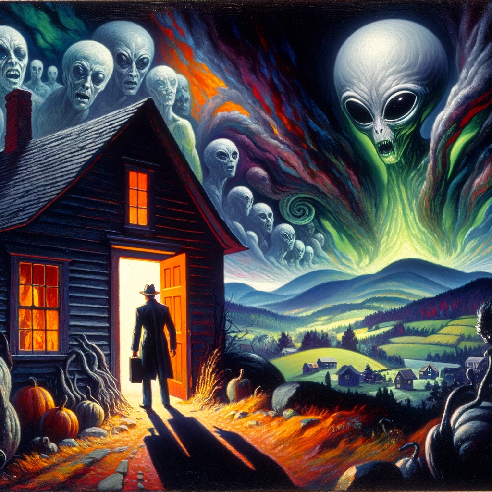
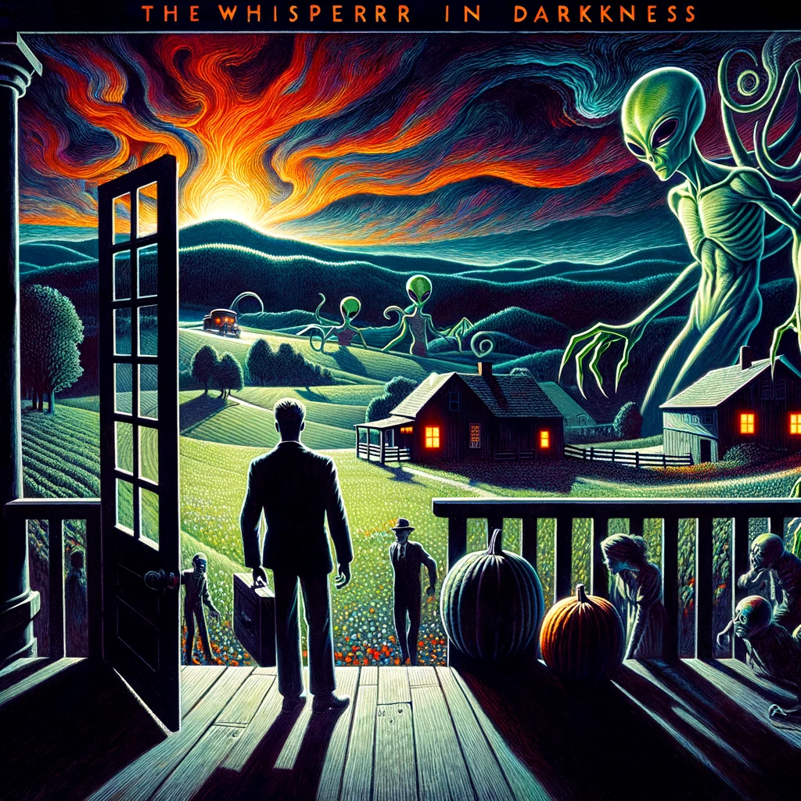

## Scenes

### Floods in Vermont and Discovery of Alien Bodies

After a series of unprecedented floods ravage the Vermont countryside, grotesque, unknown bodies are discovered among the debris. The scene is one of chaos and horror, as the local inhabitants and scientists from Miskatonic University gather around the strange, alien corpses. The atmosphere is heavy with a mix of curiosity and fear, the landscape littered with the aftermath of the flood, and the eerie, misshapen bodies are examined under the harsh, unforgiving light of portable lamps, casting long, monstrous shadows.

The scene captures the chaotic aftermath of a flood in Vermont, where local inhabitants and scientists discover alien bodies. The composition should emphasize the dramatic contrast between the dark, swollen riverbanks and the brightly illuminated area where the bodies are laid out, drawing the viewer's eye to the grotesque forms of the unearthed aliens. The use of bold, unnatural colors typical of German Expressionism, utilizing oil on canvas, should heighten the alienness of the bodies against the rural landscape. Figures should be depicted with exaggerated expressions of horror and fascination, capturing the emotional intensity of the scene.

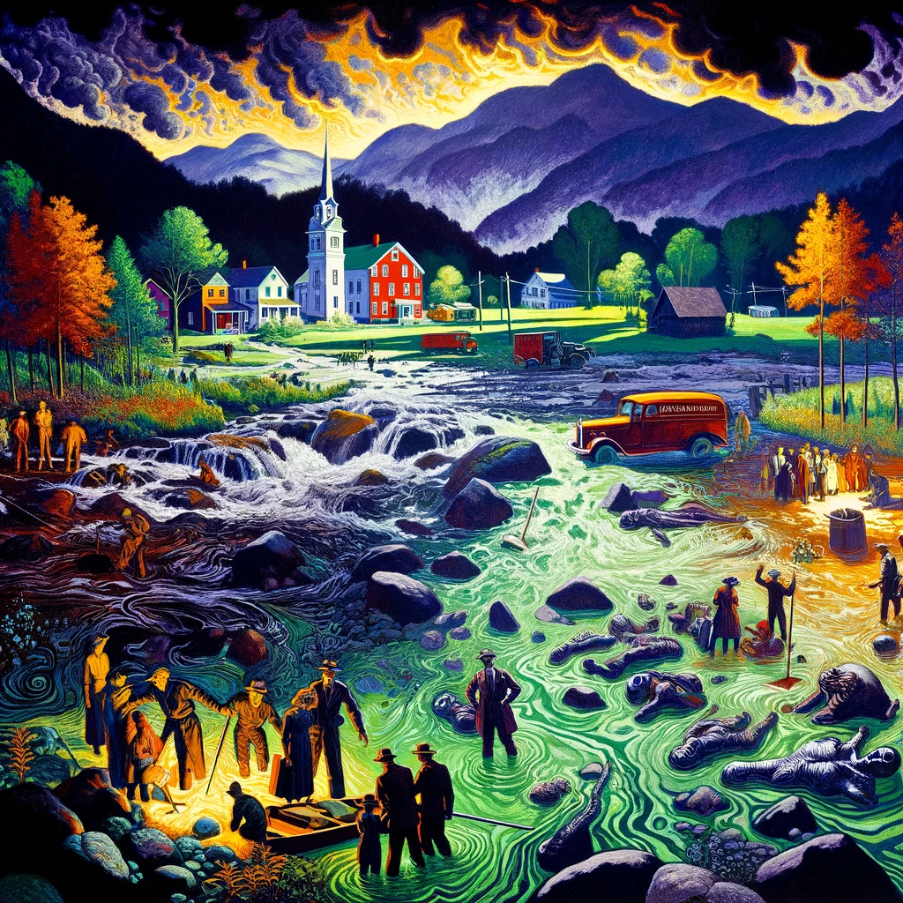
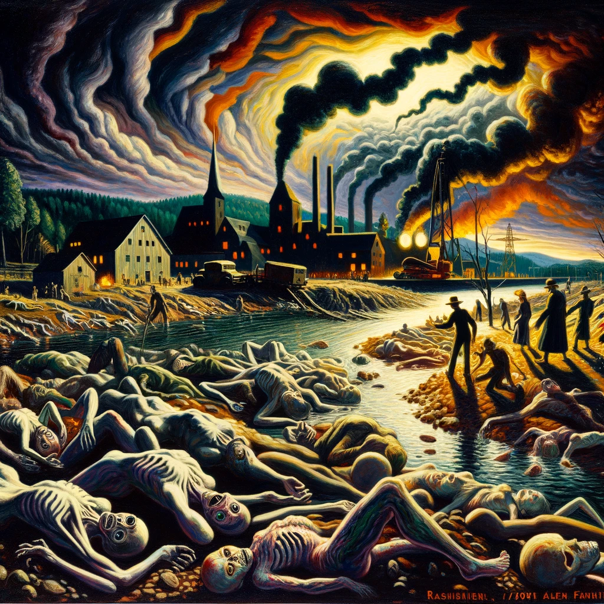

### Wilmarth's Correspondence with Akeley

In a dimly lit study filled with books and papers, Albert N. Wilmarth reads a letter from Henry Akeley, a local recluse claiming knowledge about the alien race. The room is cluttered with evidence of Wilmarth's research into folklore and the occult, including photographs of the unearthed bodies. The expression on Wilmarth's face is one of skepticism mixed with intrigue as he holds Akeley's detailed letters and photographs, hinting at the beginning of his involvement in the mystery.

This scene is set in Wilmarth's cluttered study, lit by a single, stark lamp that casts deep shadows, highlighting his face as he reads a letter from Akeley. The composition should focus on Wilmarth’s intense expression and the surrounding piles of books and papers, with alien photographs and artifacts scattered around, suggesting the depth of his research. German Expressionist techniques should be used to distort the perspective, making the room seem almost to close in on him, enhancing the feeling of obsession and encroaching darkness. The colors should be muted, with sudden accents to emphasize key objects, such as the letter and the photographs.

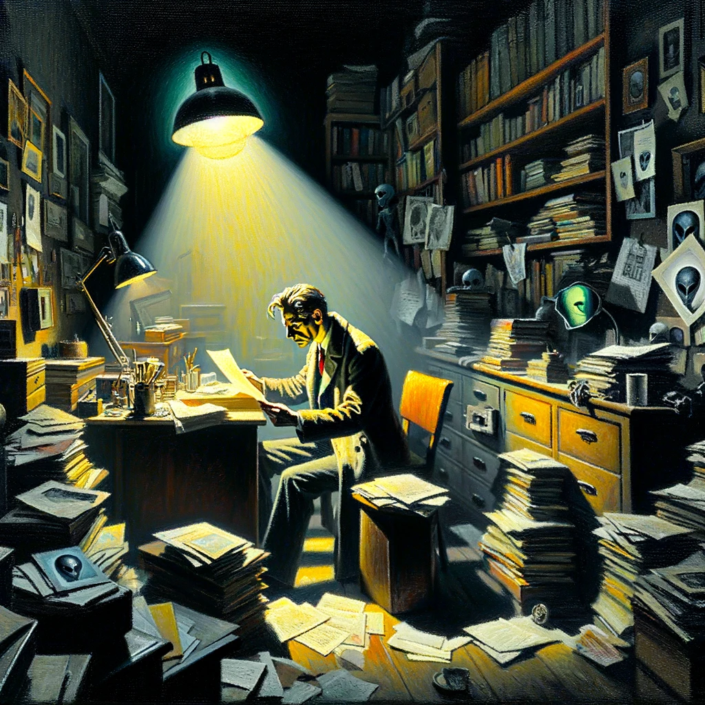
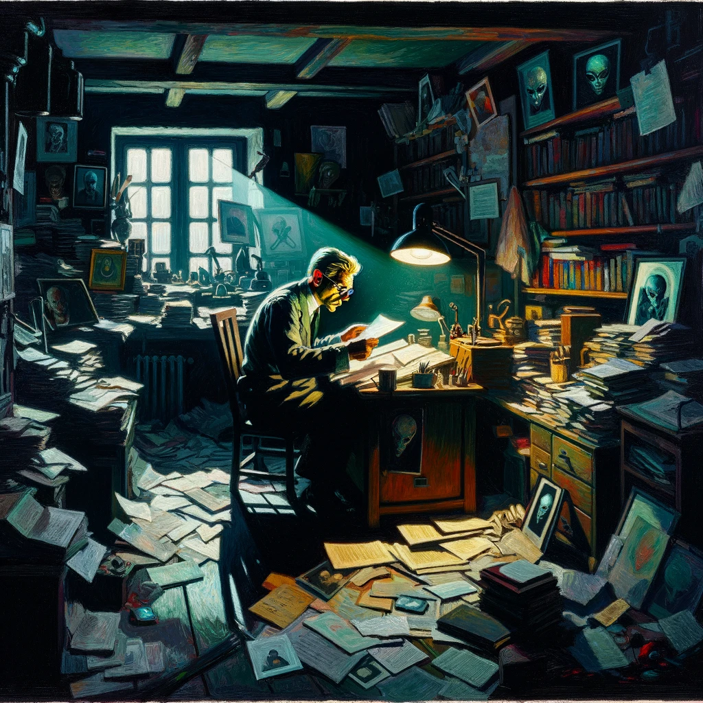

### Encounter in the Vermont Hills

Wilmarth arrives at Akeley's secluded farmhouse, nestled in the shadowy, mist-covered hills of Vermont. The scene is tense and foreboding, with Wilmarth standing at the threshold, hesitant to enter. The farmhouse appears almost alive, with its windows like watching eyes, and the surrounding woods emit unsettling sounds. The gloom of the evening and the isolation of the location set a chilling backdrop to Wilmarth's impending encounter with the unknown.

Wilmarth stands hesitantly outside Akeley's farmhouse, enveloped by the misty, dark Vermont hills. The composition should draw the viewer’s eye from Wilmarth in the foreground, up the path to the ominously lit farmhouse, using exaggerated, angular lines and a stark contrast between light and shadow to create a sense of foreboding. The surrounding woods should seem almost alive, with trees twisted into menacing shapes. Employ German Expressionism's characteristic use of vibrant, discordant colors to paint the scene, emphasizing the natural world's intrusion into this moment of dread.

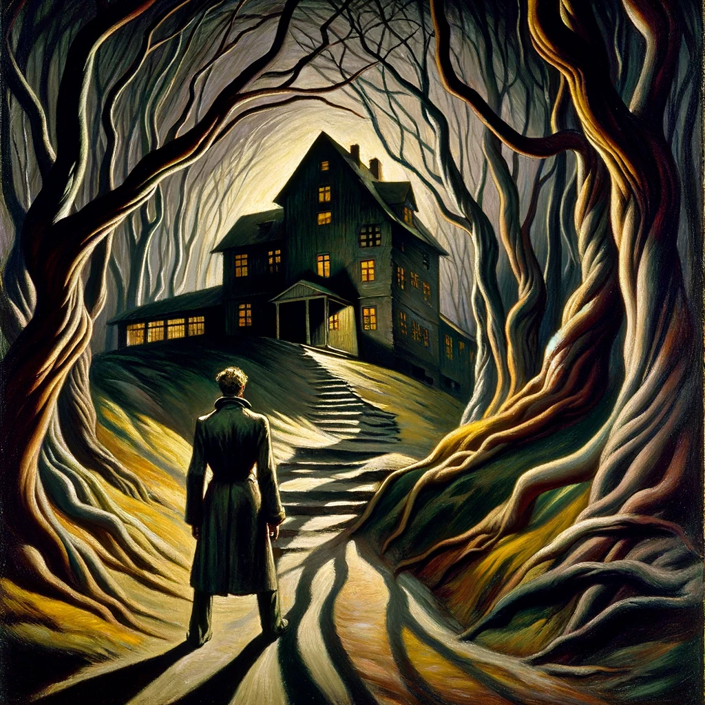
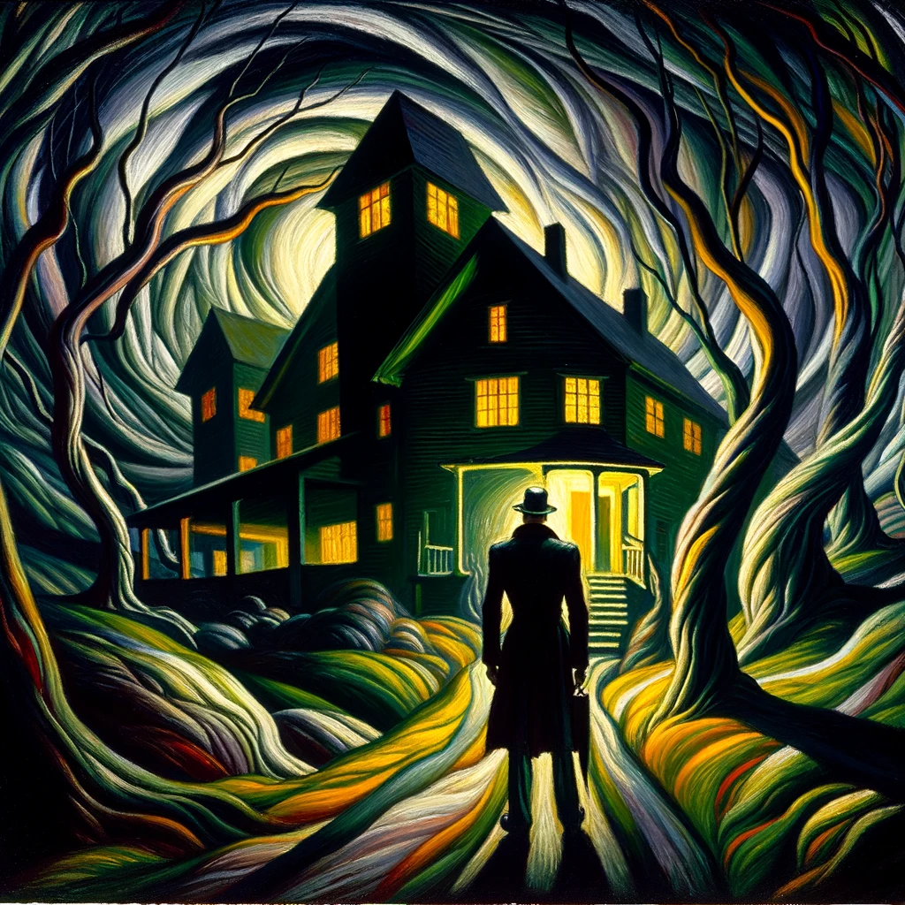

### Revelation of the Alien Conspiracy

Inside Akeley's home, a horrific scene unfolds as Wilmarth is shown evidence of the extraterrestrial beings' existence and their ghastly pacts with humans. The room is filled with alien artifacts, strange machinery, and unsettling recordings of alien speech. The centerpiece is a table displaying otherworldly devices capable of human mind transfer, under the ghastly illumination of lamps that cast deep shadows, enhancing the grotesque and surreal nature of the objects.

Inside Akeley's home, the room is crammed with alien artifacts and machinery, under a harsh light that casts deep shadows. The focus should be on the central table with devices and recordings, using a distorted perspective to exaggerate the objects' strangeness and the room's crampedness. The expressions on Wilmarth’s face, reflecting shock and horror, should be exaggerated, with German Expressionist techniques employed to use vibrant, unsettling colors and sharp contrasts, highlighting the surreal and grotesque nature of the evidence presented to him.

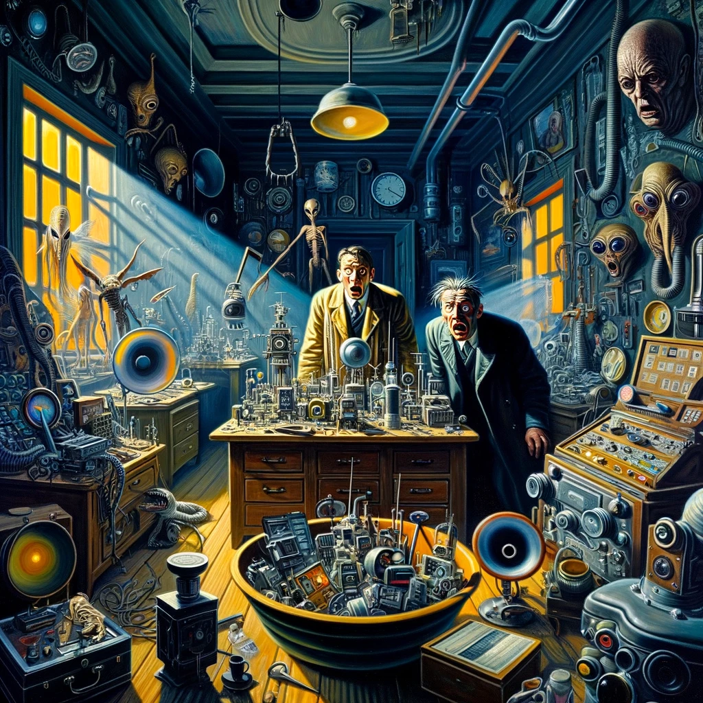
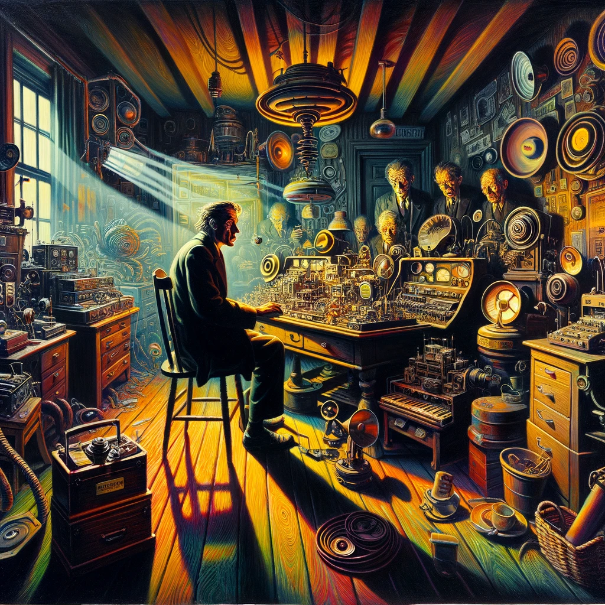

### The Climactic Escape

The climax is a heart-pounding scene where Wilmarth discovers the true horror of Akeley's fate and the full extent of the alien plot, leading to a desperate escape through the dark, whispering forests of Vermont. It's a moonless night, and the dense trees seem to close in on him as he flees. Behind him, the sounds of unseen creatures stir, adding to the terror of the chase. The path ahead is uncertain, lit only by Wilmarth's lantern, swinging wildly as he runs, casting eerie shadows that seem to dance and chase him through the woods.

Wilmarth is depicted fleeing through the dark, whispering forests, with the path ahead illuminated only by his wildly swinging lantern. The composition should emphasize the motion and panic of the escape, with the trees around him painted in twisted, threatening shapes and the darkness behind him alive with the suggestion of pursuing creatures. The use of German Expressionism here should focus on the stark contrast between the light of the lantern and the oppressive darkness of the forest, using a palette of intense, fearful colors to convey the terror of the chase. Wilmarth’s expression should be one of pure terror, consistent with his appearance in earlier scenes, as he glances back towards the unseen horrors.

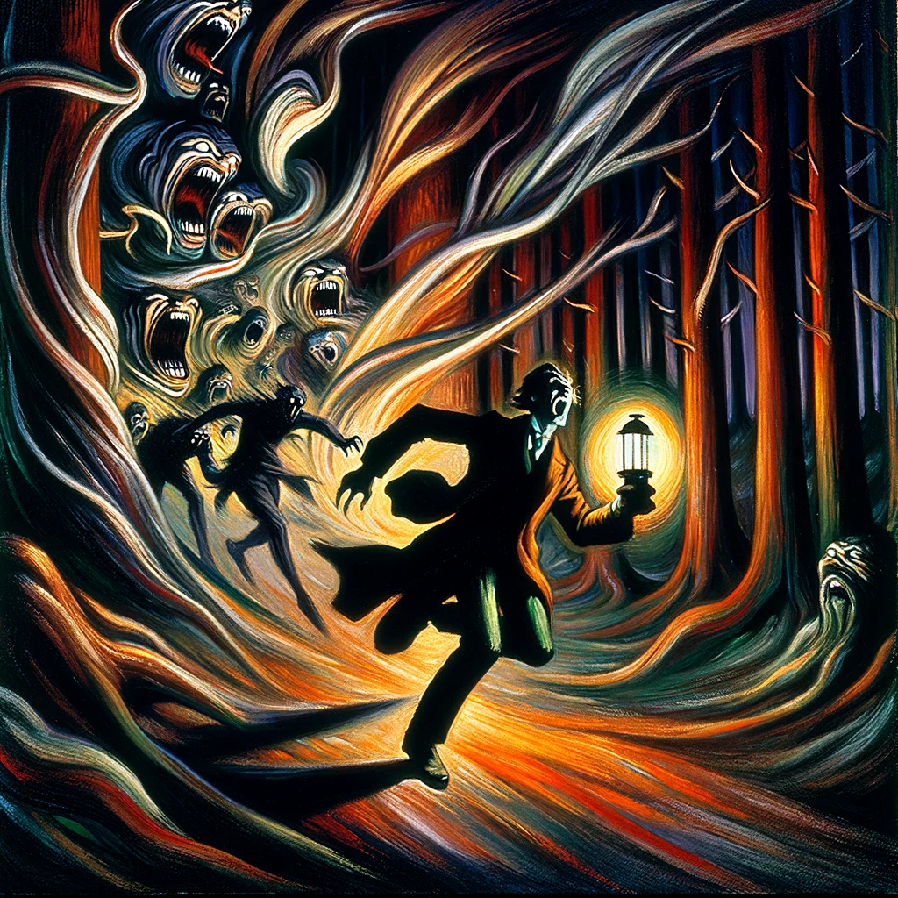
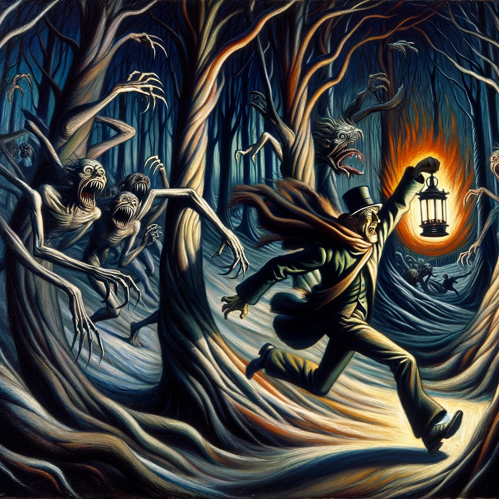

