# The White People, Arthur Machen

## Summary

"The White People" by Arthur Machen is a haunting narrative that delves into the arcane and the occult through the diary of a young girl, revealing her encounters with the mystical and sinister forces of ancient Britain. The story begins with a framing prologue, where two gentlemen, Cotgrave and Ambrose, discuss the nature of sin, leading Ambrose to introduce the diary as an example of true sin, born out of innocence and curiosity. As the girl's entries unfold, readers are drawn into her explorations of mysterious rituals, enchanted locales, and the enigmatic "White People," beings connected to the old magic of the land. Her journey becomes increasingly entwined with dark magic and forbidden knowledge, hinting at her eventual doom. Machen masterfully weaves a narrative that is both enchanting and unsettling, challenging the boundaries between innocence and corruption, and inviting readers into a world where the ancient and the mystical pervade the very fabric of existence.

* Style: Expressive Symbolism in watercolor and ink.

The cover image captures the essence of "The White People" through a symbolic representation of the young girl at the threshold of the mystical and the known world, surrounded by the arcane and the natural. In the style of Expressive Symbolism in watercolor and ink, the cover features the young girl standing at the edge of an ancient, moonlit forest that borders on a shadowy, mysterious glade. Behind her, the dimly lit study with an open diary on a table suggests the bridge between her world and ours. The forest and glade are alive with ethereal figures of the White People, barely visible, blending into the trees and stones, their forms suggested by the interplay of light and shadow. The girl is depicted in a moment of awe and trepidation, looking back towards the viewer, inviting them into her journey. The moon above casts a soft, otherworldly glow, illuminating the scene with a dreamlike quality. Watercolors provide a rich, layered texture to the natural elements and the mystical, with ink detailing the intricate symbols and the girl's expressive features. This image, grand and evocative, encapsulates the allure of the unknown, the beauty of the forbidden, and the eternal dance between light and darkness, beckoning the viewer into the heart of the story.

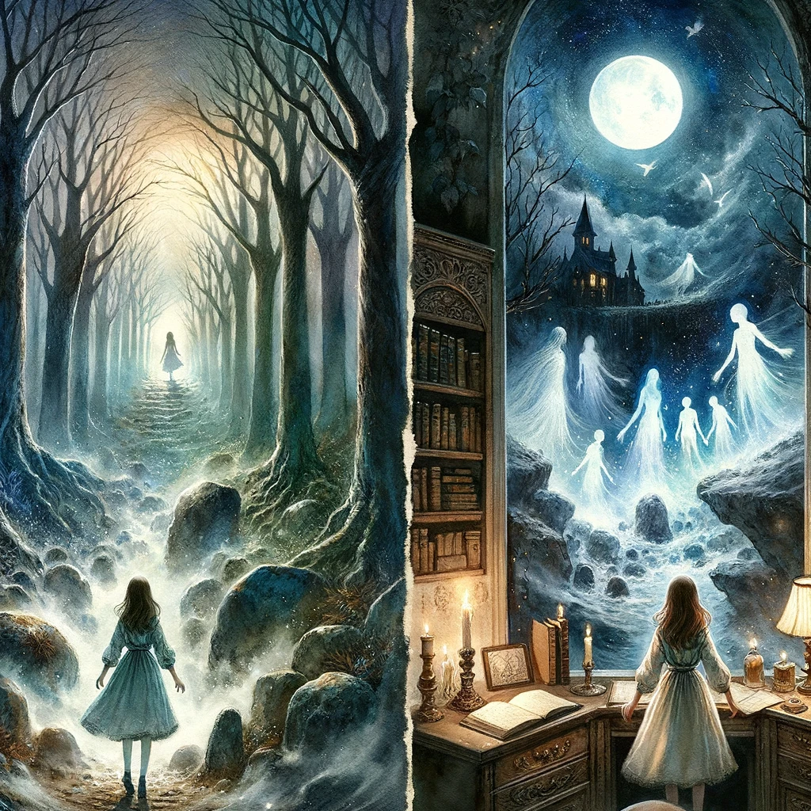

## Scenes

### The Philosophical Conversation

The opening scene is set in a dimly lit study, filled with books and artifacts of ancient lore. Two gentlemen, Cotgrave and Ambrose, are engaged in a deep, philosophical conversation about the nature of sin. Ambrose, an older, more knowledgeable figure, is explaining to Cotgrave, a younger man with a curious and open demeanor, that true sin is much different from what is commonly understood. The room is rich with the ambiance of intellectual pursuit, with a large window that looks out onto a shadowy garden, suggesting both the safety of their surroundings and the dangerous ideas they are discussing.

Two gentlemen, Cotgrave and Ambrose, engage in a deep conversation about sin in a dimly lit study.
Using Expressive Symbolism in watercolor and ink, depict a richly textured study room with shelves of ancient books and mystical artifacts casting elongated shadows across the walls. Ambrose, with a face marked by wisdom and age, leans forward, his hands animated as he speaks, while Cotgrave listens intently, his younger, more open face illuminated by the soft glow of a lamp. The outside garden seen through a window is hinted at with silhouettes of trees, adding a layer of mystery. The use of contrasting light and shadow should evoke the tension between known and unknown realms.

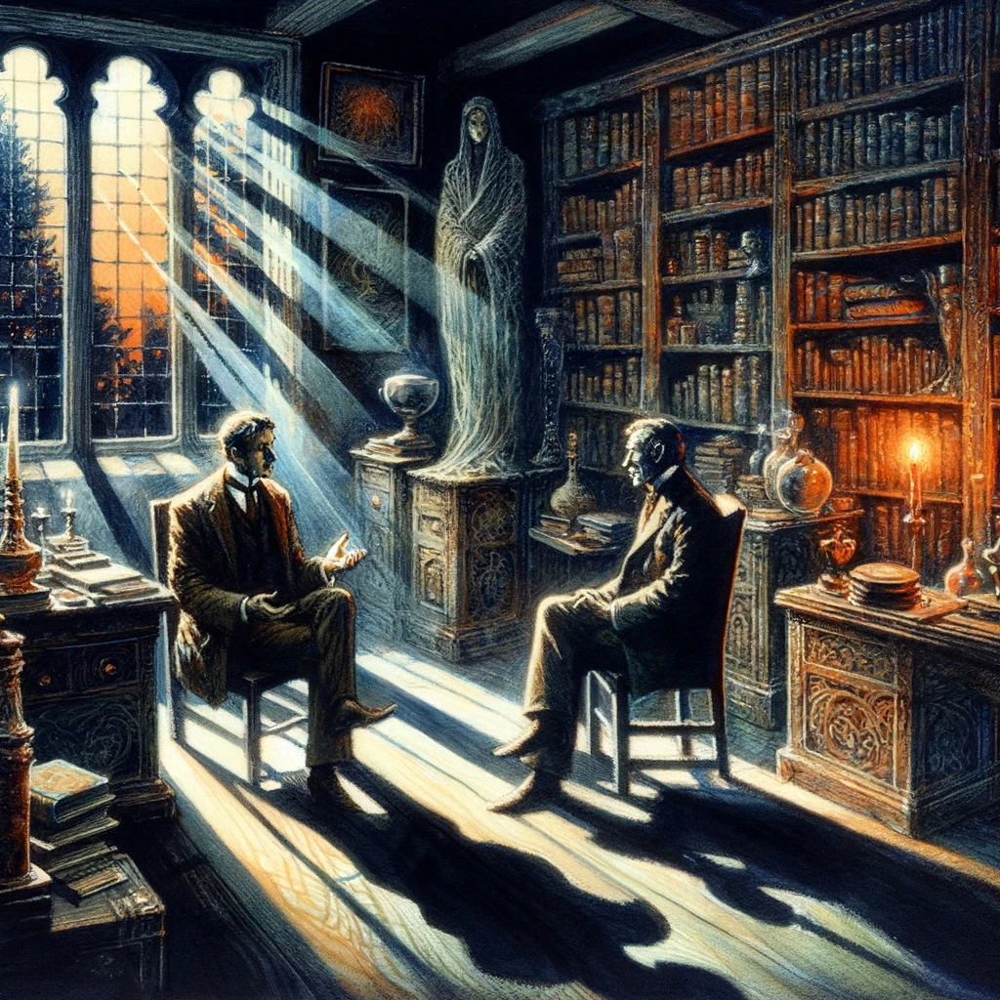
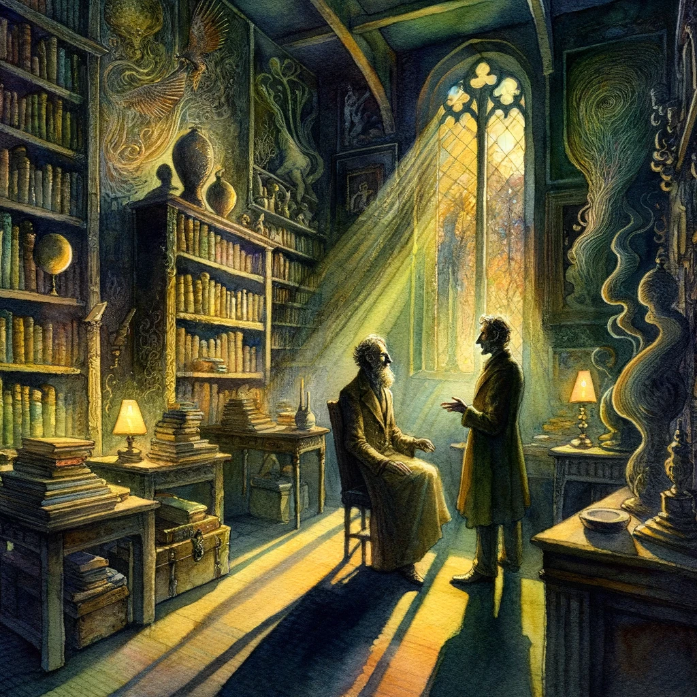

### The Discovery of the Diary

This scene transitions to a moment of quiet anticipation as Cotgrave begins to read the diary, a small, ancient-looking book given to him by Ambrose. The diary is open on a table that is now the focal point of the room, illuminated by a lamp in an otherwise dim setting, symbolizing the entrance into a hidden world. The diary's pages are filled with cramped, flowing handwriting, sketches of arcane symbols, and drawings of mysterious landscapes, inviting the reader into the secret world of its author.

Cotgrave begins to read the ancient diary, bridging into the girl's mystical world.
Center the scene around the diary on a wooden table, its pages filled with mysterious symbols and sketches, under the focused light of a lamp in an otherwise shadowy room. Highlight the textures of the diary's aged paper and the intricate detail of the handwriting and drawings with the vibrant yet subtle hues of watercolor, contrasted by the sharpness of ink outlines. Cotgrave's face, shown in profile, reflects a mix of curiosity and awe, bathed in the warm light that suggests a doorway to another dimension. Emphasize the isolation and focus of this moment, using symbolic elements like a single key or a candle nearing its end to represent the unlocking of secrets.

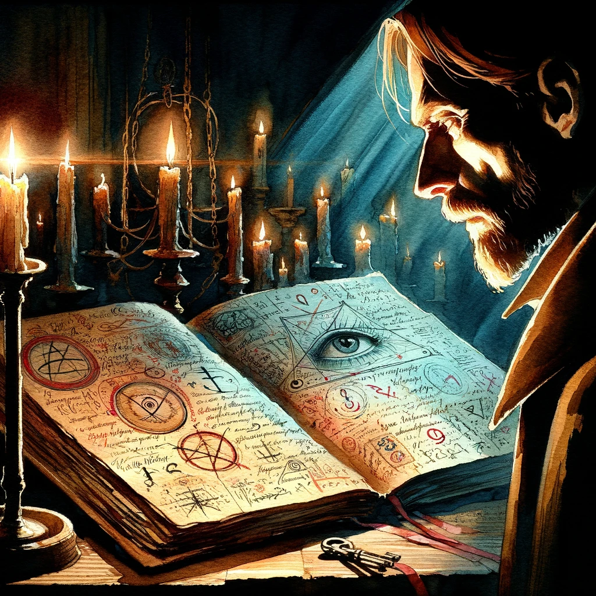
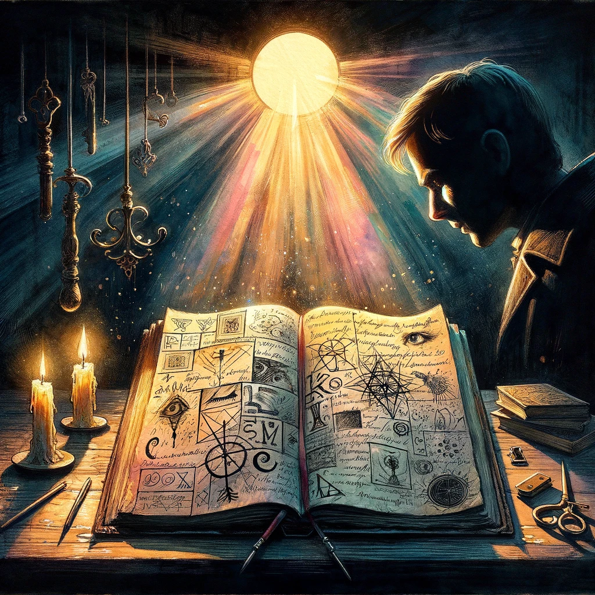

### Enchanted Woods and the Old Nurse's Tales

Here, the young girl, the diary's author, is wandering through a lush, ancient forest, her expression one of wonder and curiosity. The forest is alive with a sense of magic and hidden eyes watching from the shadows. She is listening intently to an old nurse, a character who looks both kindly and mysterious, as she tells tales of the old folk and the secrets of the woods. This scene is rich with the colors of nature, imbued with a sense of enchantment and danger lurking just beneath the surface.

The young girl explores a lush, ancient forest, guided by the tales of her old nurse.
Capture the girl and the old nurse walking through a dense, enchanted forest, where the trees are alive with mystical energy, their forms twisting and turning in expressive, symbolic shapes. The girl, depicted with an aura of youthful curiosity, looks around in wonder, while the nurse, cloaked in tales and wisdom, gestures towards the unseen. Use vibrant greens and earth tones to bring the forest to life, with splashes of ethereal colors suggesting magic at the edges of perception. The interaction between the characters and their environment should be rich with symbolic elements like hidden faces in the tree barks or faint glimmers of light, inviting the viewer to look closer.

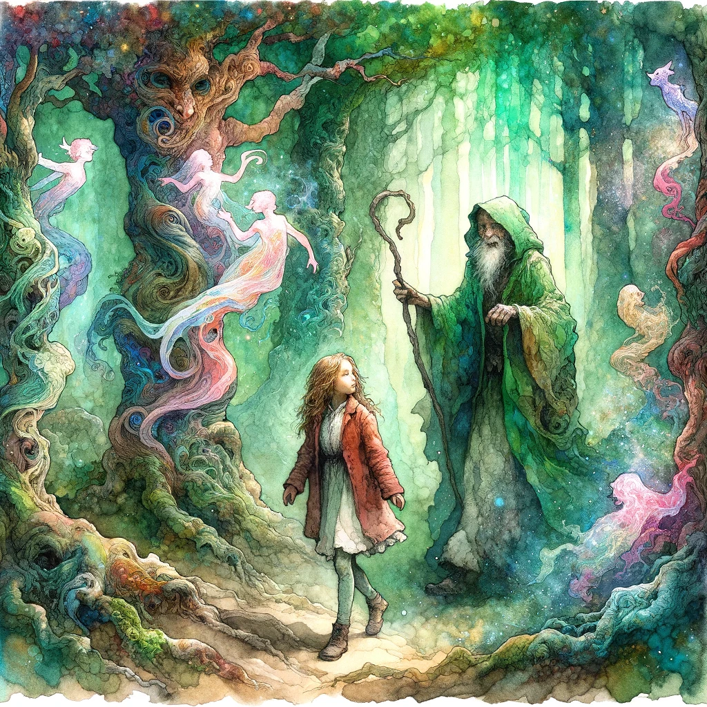
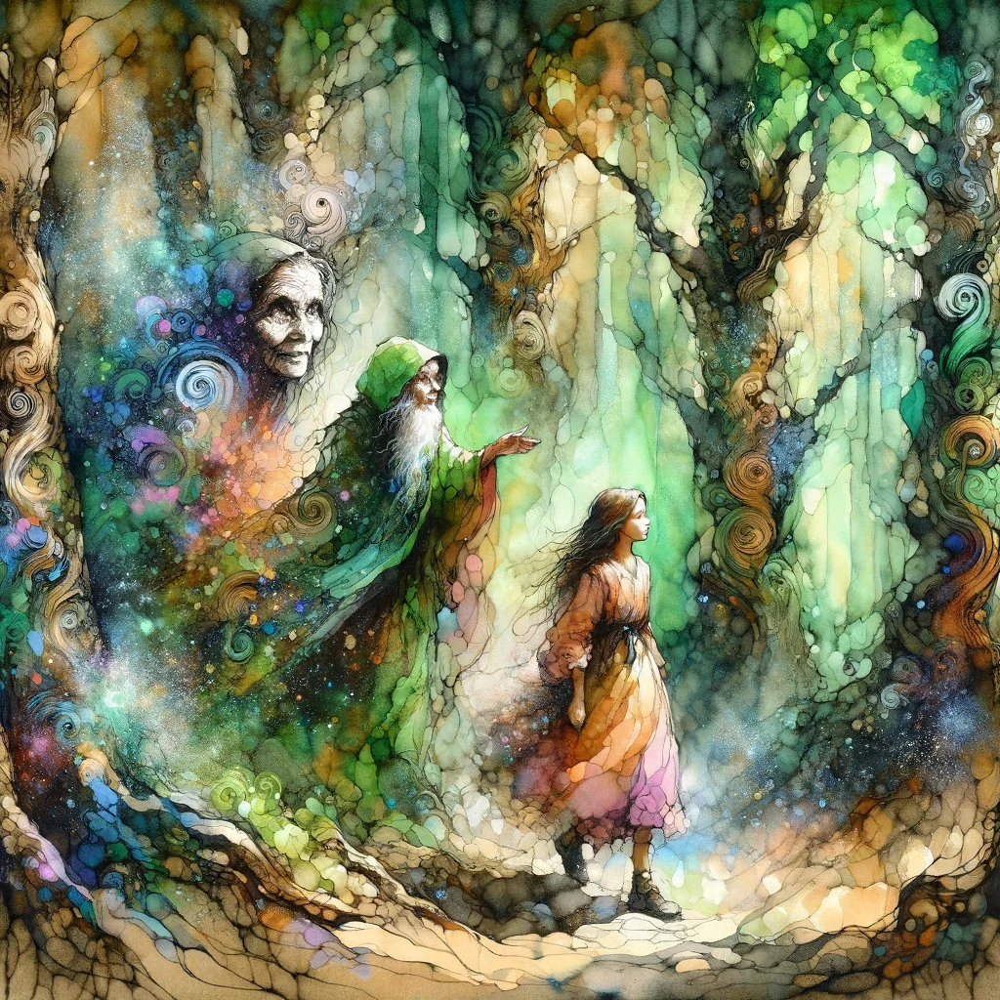

### Rituals and the White People

In a secretive glade, surrounded by ancient stones, the young girl participates in arcane rituals, surrounded by ethereal figures—the White People. These beings are depicted as neither wholly benevolent nor malevolent, with an otherworldly beauty that is both attractive and unsettling. The girl, depicted with an aura of innocence and growing knowledge, stands at the center of a circle, engaging in rites that blur the lines between worlds. The scene is charged with a sense of power, mystery, and the thin veil between the mundane and the magical.

The girl participates in arcane rituals with the ethereal White People in a secret glade.
This scene is set in a secretive, moonlit glade encircled by ancient stones. The White People, ethereal and almost translucent, are shown in flowing robes, with their faces serene yet inscrutable, participating in mysterious rituals with the girl at the center. The girl, her innocence tinged with a growing knowledge, is depicted with a mix of fear and fascination. Use watercolor to create a dreamlike quality, with ink adding definition to the figures and the ritualistic symbols they form. The moonlight should cast an otherworldly glow, with shadows and light playing across the scene to emphasize the thin veil between worlds.

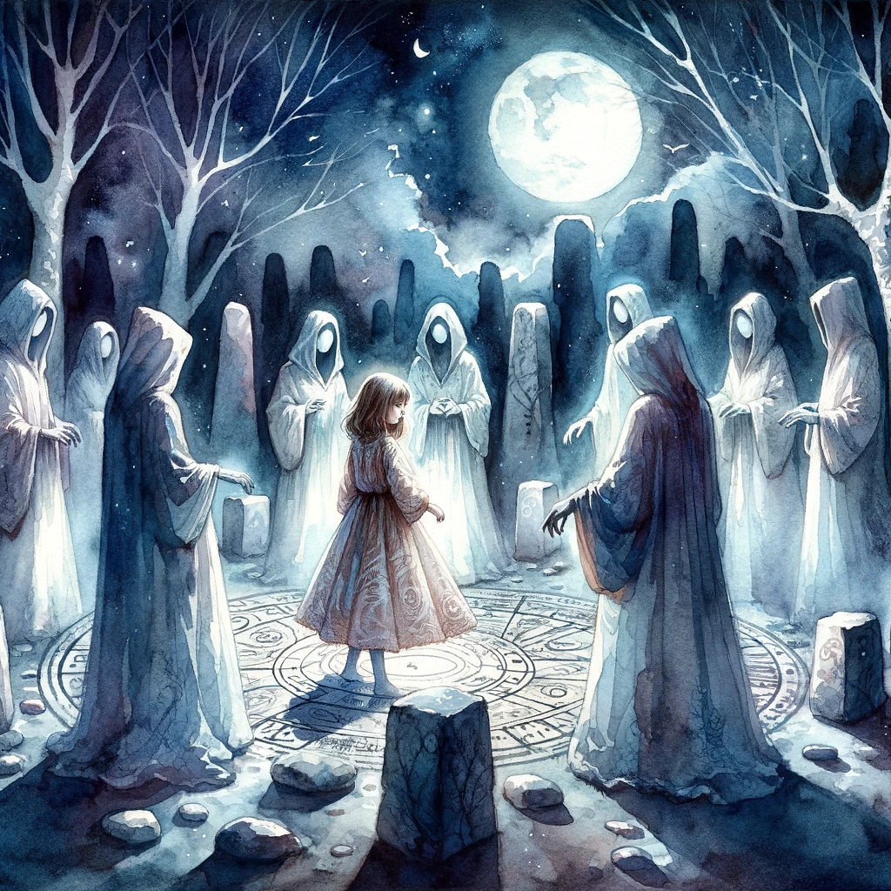
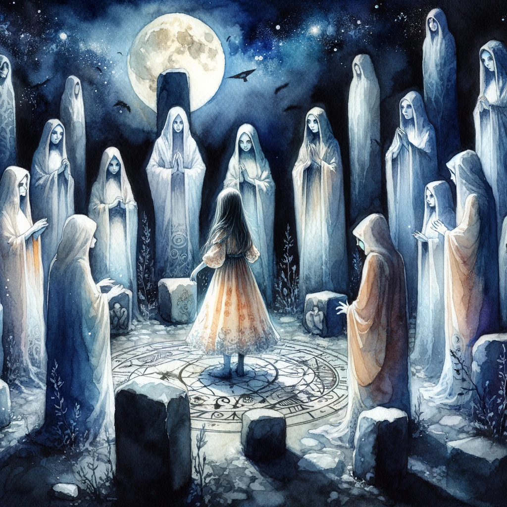

### The Encounter with the Sinister Forces

A climactic scene where the girl faces the consequences of her delve into forbidden knowledge. She is in a dark, cavernous space, facing a malevolent entity or presence, its form obscured but its threat palpable. The atmosphere is tense, with the girl's face showing a mix of fear, realization, and determination. This moment represents the turning point, where the allure of the unknown meets its inherent danger, and the price of her curiosity becomes apparent.

The girl confronts the consequences of her curiosity in a dark, threatening space.
Illustrate a tense confrontation in a cavernous, shadow-filled space where the girl stands alone, facing an obscured, malevolent presence. The atmosphere is charged with danger, the shadows around her forming into threatening shapes and symbols. The girl's expression combines fear with resolve, her figure lit by an unseen source of light that suggests both the danger she faces and her inner strength. The expressive use of watercolor should create a sense of fluidity and uncertainty, while ink defines the sharp edges of fear and the tangible elements of the scene, like the girl's determined stance.

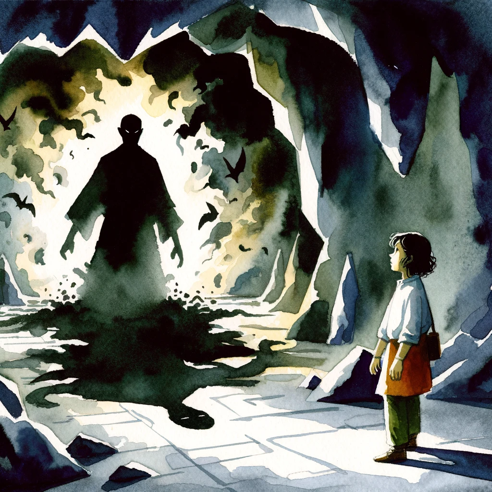
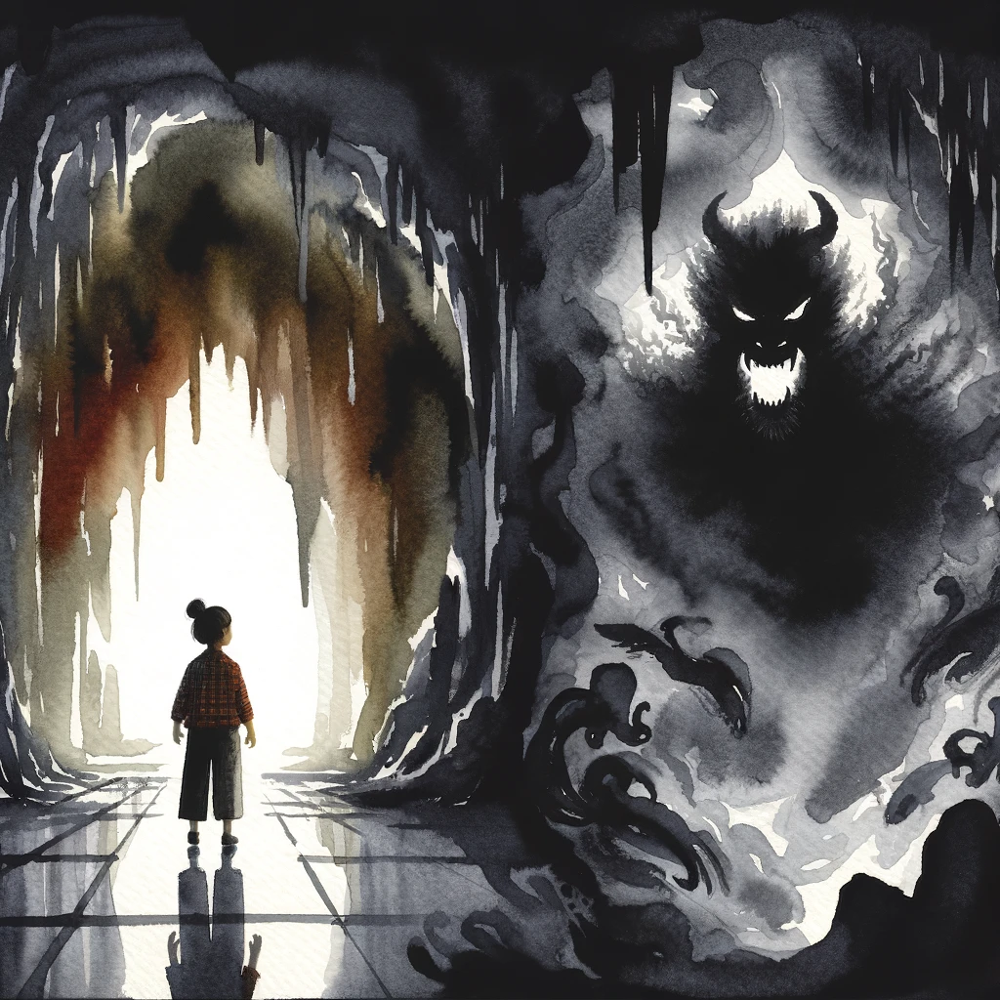

### The Return to the Study and Reflection

The final scene brings us back to the study, where Cotgrave has finished reading the diary, and the room is now in twilight, symbolizing the end of the journey into the girl's world. Cotgrave and Ambrose are in a reflective mood, with the diary now closed between them on the table. The weight of the story lingers in the air, as they ponder the nature of innocence, knowledge, and the unseen forces that shape our destinies. The room, filled with shadows and the remnants of their earlier discussion, now seems to hold a deeper, more profound silence, suggesting the impact of the girl's story on the present.

Cotgrave and Ambrose reflect on the diary's story in the twilight of their study.
Bring the viewer back to the study, now in the soft, reflective light of twilight. The diary lies closed on the table between Cotgrave and Ambrose, who are shown in a moment of quiet contemplation. Ambrose's features are marked by a deeper understanding, while Cotgrave's reflect the impact of the story he has just read. The fading light through the window casts long shadows, symbolizing the transition from knowledge back to the unknown. The expressive symbolism here should focus on the interplay of light and shadow, using watercolor to soften the scene with a sense of ending and reflection, while ink defines the poignant details of their silent communication and the weight of the closed diary.

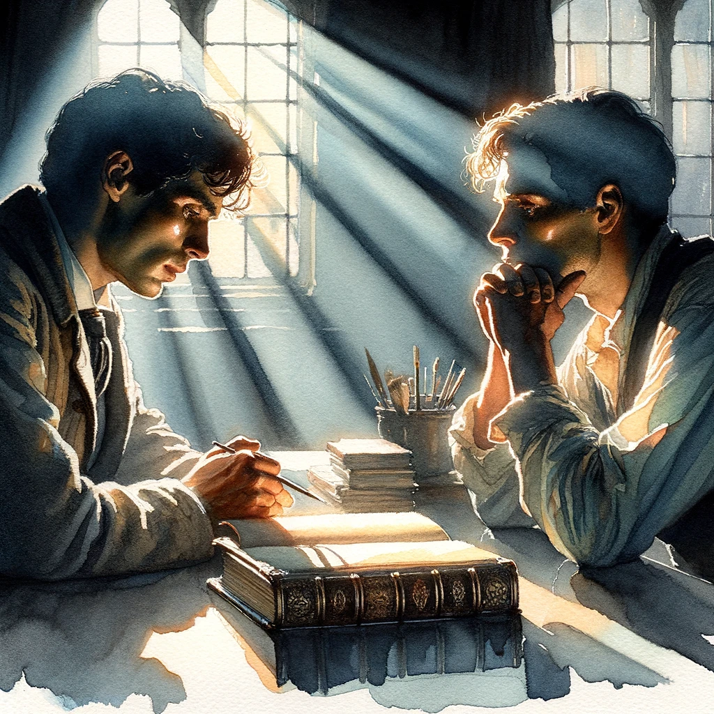
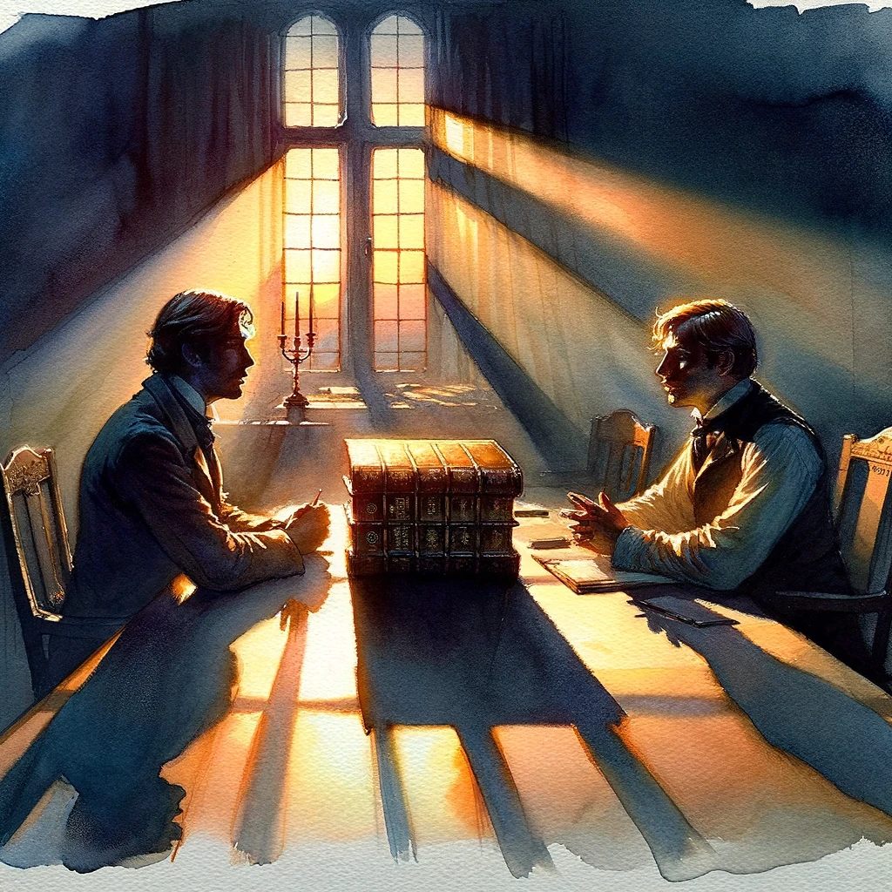

