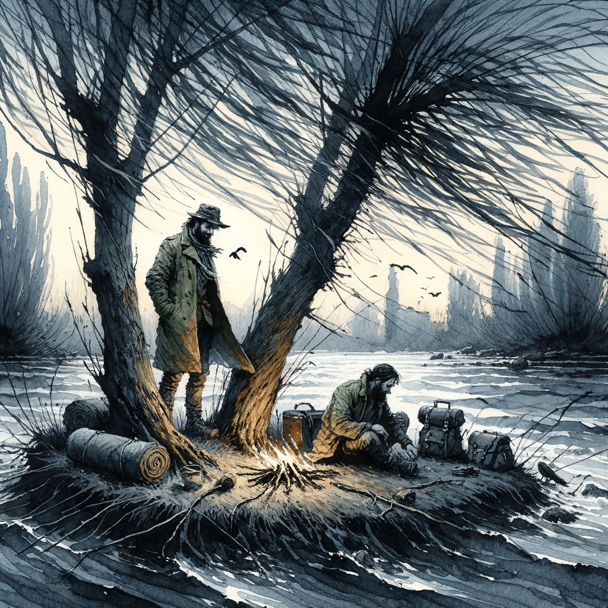

# The Willows, Algernon Blackwood

## Story Synopsis

"The Willows" by Algernon Blackwood is a masterful tale of supernatural horror that unfolds along the banks of the Danube River, where two friends embark on a canoeing trip only to find themselves in a landscape that grows increasingly eerie and menacing. Surrounded by the ominously whispering willows, the duo becomes aware of a mysterious and malevolent presence that seems to transcend the boundaries of the natural world. As they struggle to understand and cope with the inexplicable events that besiege them—unearthly sounds in the night, inexplicable movements in the wilderness, and a pervasive sense of being watched and threatened—their sanity and survival are tested. Blackwood expertly weaves a story of psychological dread and cosmic horror, highlighting the insignificance of humanity in the face of the unfathomable forces of the universe. The story culminates in a haunting climax that leaves the protagonists and readers alike questioning the nature of reality and the unseen forces that lurk beyond the veil of the known world.

* Style: Expressive Impressionism with watercolor and ink, leveraging the fluidity and unpredictability of the medium to capture the story's ethereal and ominous atmosphere.

A lone figure stands at the edge of the tumultuous Danube River, gazing into a dense thicket of ominously whispering willows under a twilight sky, embodying the story's haunting blend of nature's beauty and supernatural dread. In the style of Expressive Impressionism with watercolor and ink, this cover image should capture the grandeur and eeriness of the story. The river, rendered with swirling watercolor blues and grays, conveys the story's undercurrent of fear and the unknown, while the willows, detailed in ink, seem to reach towards the sky and the figure, creating a sense of entrapment and foreboding. The figure, depicted in silhouette, stands as a symbol of humanity's vulnerability amidst the incomprehensible forces of nature and the supernatural. The twilight sky, blending purples, blues, and hints of dark green, adds to the atmosphere of mystery and impending doom. This powerful image encapsulates the story's themes of isolation, the unknown, and the thin veil between the natural and the supernatural, inviting the viewer into the haunting world of "The Willows."

## Scenes

### Arrival at the Danube

The story begins with the protagonists, two friends, setting up camp on a small island in the Danube River, surrounded by a dense thicket of willows. The scene is serene yet subtly foreboding, with the river's gentle flow and the willows bending in the wind, casting long shadows as the sun sets. The vast, open landscape contrasts with the encroaching sense of confinement imposed by the surrounding wilderness.

Two friends set up camp on an island in the Danube, surrounded by whispering willows. In the style of Expressive Impressionism with watercolor and ink, capture the serene yet subtly foreboding atmosphere of the scene. The composition should focus on the two friends, one with a more cautious demeanor and the other with an air of adventurousness, amidst their camping gear with the river in the background. The willows should appear almost to bend towards the characters, with the ink adding depth and movement to the leaves, while watercolor washes suggest the fading light of sunset.

### The Discovery of Odd Markings

After settling in, the friends notice peculiar, large, and unexplained footprints near their campsite, along with other unsettling signs that suggest they are not alone. The atmosphere is one of growing unease, with the characters examining the mysterious markings, their faces etched with confusion and apprehension, the willows ominously whispering in the background.

The friends examine mysterious footprints near their campsite, their faces a mix of confusion and apprehension. Employ Expressive Impressionism with watercolor and ink to depict the scene with a focus on the contrast between the detailed, ominous markings in the foreground and the characters' expressions. The willows should frame the scene, their shadows adding to the unsettling mood. The watercolor's fluidity captures the eerie ambiance, while the ink defines the sharpness of the footprints and the characters’ intrigued yet worried faces.

### The Swelling of the Danube

Overnight, the river begins to rise dangerously, threatening to flood their campsite. This scene captures the chaos and panic as the friends hurriedly move their equipment to safer ground, the water reflecting the moonlight and the willows appearing to lean closer, as if watching the scene unfold.

The river threatens to flood the campsite, illustrating chaos and panic. In this scene, utilize Expressive Impressionism with watercolor and ink to convey the dynamic movement of rushing water and the frantic actions of the friends moving their gear. The moonlit water should be depicted with swirling watercolor blends, reflecting the urgency and the looming danger, while ink highlights the desperation on the characters' faces and the menacing lean of the willows against the dark sky.

### A Night of Unsettling Noises

During the night, the protagonists are tormented by strange sounds: unidentifiable whispers, cries, and laughter that seem to emanate from the surrounding wilderness. The scene is tense, with one of the friends wide-eyed and staring into the dark void beyond the campfire, while the other attempts to dismiss their fears, the shadows cast by the fire dancing eerily on their faces.

Tormented by strange sounds, one friend stares into the darkness, while the other tries to dismiss their fears. This scene should be rendered in Expressive Impressionism with watercolor and ink, focusing on the contrast between the warm glow of the campfire and the cool, ominous shadows beyond. The friends' expressions should capture the essence of fear and denial, respectively, with the ink detailing their features and the watercolor creating a blurred boundary between the known and the unknown.

### The Discovery of a Second Island

As they explore their surroundings, the friends discover a second island, which seems to be the source of the unsettling phenomena. This scene would depict them in their canoe, approaching the densely wooded island, with a sense of dread permeating the air, the willows on the shore appearing almost sentient.

Approaching the densely wooded second island, dread permeates the air. Capture this moment in Expressive Impressionism with watercolor and ink, emphasizing the foreboding silhouette of the island against a stormy sky. The canoe should appear small and vulnerable in the vast, turbulent river, with the friends portrayed in a state of apprehension. Use watercolor to create a sense of impending doom with dark, swirling clouds, while ink adds sharpness to the willows' menacing forms.

### Encounters with the Supernatural

The friends experience increasingly bizarre and frightening phenomena that suggest the presence of a malevolent entity. Illustrate a scene where one of the friends witnesses an inexplicable, shadowy figure moving among the willows, his expression one of terror, while the natural world around him seems to warp and twist unnaturally.

A shadowy figure moves among the willows, witnessed by one terrified friend. This scene demands the use of Expressive Impressionism with watercolor and ink to blend reality with the surreal. The shadowy figure should be subtly defined with ink, merging with the willows, while the friend's terror is vividly captured in his wide-eyed expression. The background should blur the line between the natural and the supernatural, with watercolor washes creating an unsettling, dreamlike quality.

### The Offering

Realizing the gravity of their situation, the protagonists decide to make an offering to appease the unknown forces. This scene shows them by the river at dusk, placing objects into the water as a peace offering, their faces solemn and resigned, the willows looming over them, the river carrying their offerings away.

Making an offering to appease the unknown, the friends stand by the river at dusk. The scene should be depicted in Expressive Impressionism with watercolor and ink, focusing on the solemn ritual. The watercolor should capture the dusky light and the reflective surface of the water, while ink details the offerings and the resigned expressions of the friends. The willows should appear as silent witnesses, their forms blurred into the background, adding a sense of solemnity and suspense.

### A Frenzied Escape Attempt

In a desperate bid for safety, the friends attempt to flee the island. The scene is one of frantic action, with them paddling their canoe through the choppy waters of the Danube, the wind howling, and the willows on the bank seeming to reach out towards them as if trying to pull them back.

Paddling through choppy waters, the friends attempt a desperate escape. This dynamic scene should be rendered in Expressive Impressionism with watercolor and ink, capturing the motion of the canoe and the rough river. The friends should be depicted with determination and fear, their actions a flurry of movement. Use watercolor to convey the tumultuous environment, with ink adding clarity to their expressions and the aggressive reach of the willows.

### A Supernatural Revelation

At the climax, one of the friends has a profound and terrifying vision that reveals the true nature of the entity haunting them. This scene would be surreal, with the character standing amidst a swirling vortex of wind and leaves, the air filled with ghostly whispers, his face a mask of awe and horror, as he glimpses the incomprehensible otherness that dwells within the willows.

Amidst a swirling vortex, one friend faces a terrifying vision. Utilize Expressive Impressionism with watercolor and ink to create a surreal, vortex-like composition where reality seems to warp. The friend's awe and horror should be the focal point, with ink detailing his shocked expression. Watercolor swirls around him, blending colors and forms to suggest otherworldly presences and the chaotic energy of the revelation.

### The Departure

The final scene depicts the friends leaving the island, visibly shaken and forever changed by their experiences. The mood is somber, with the early morning light casting long shadows as they glance back at the willows, which now seem ordinary yet forever imbued with a sense of dread, the river flowing quietly as if nothing had happened.

Leaving the island, the friends are visibly shaken. This scene, rendered in Expressive Impressionism with watercolor and ink, should capture the early morning light casting long shadows, with the friends glancing back at the now ordinary but ominous willows.

