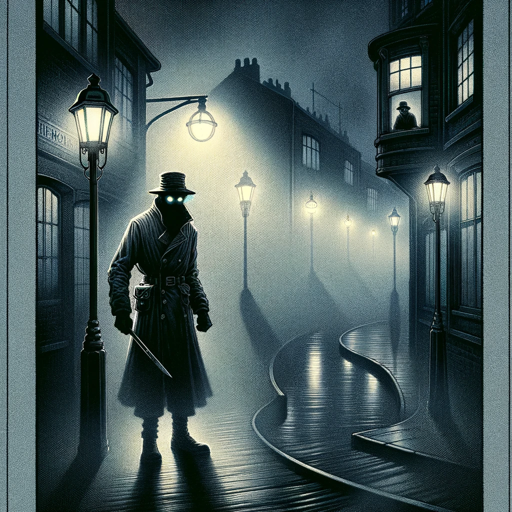
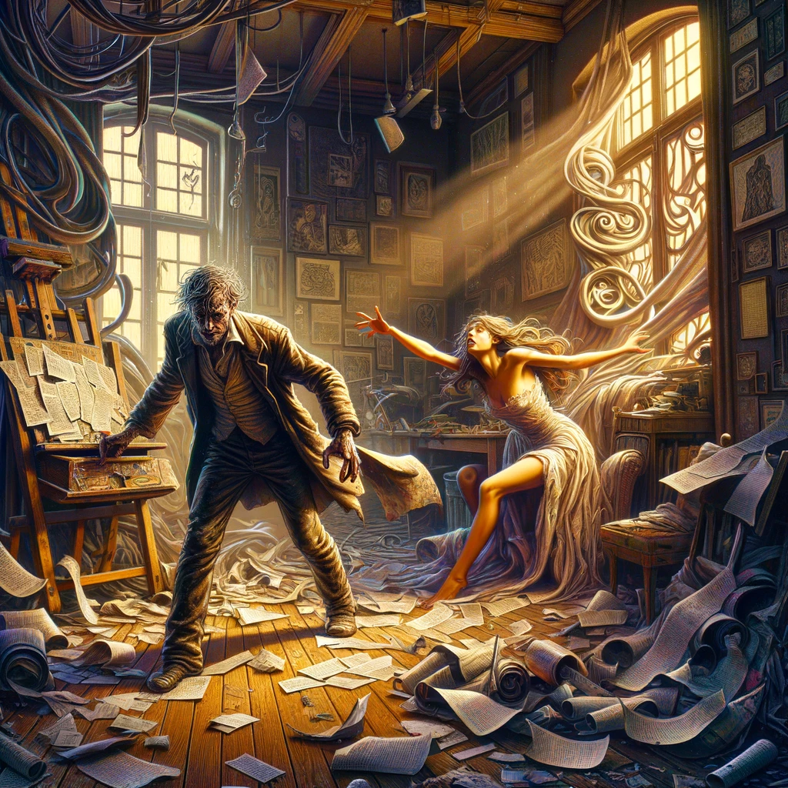

# The Yellow Sign

## Story Synopsis

"The Yellow Sign," a tale woven into the fabric of Robert W. Chambers' "The King in Yellow," unfolds in the late 19th century, primarily through the eyes of an artist in New York. It intricately blends elements of horror, forbidden knowledge, and inevitable doom, centered around an enigmatic and malignant symbol known as the Yellow Sign. This sign is linked to a mysterious and malevolent play, "The King in Yellow," which drives those who read it to madness. The narrative follows the artist and his model, who become ensnared by the sign's curse after the artist's curiosity leads him to acquire a sinister book. Their descent into horror is accelerated by the appearance of a repugnant and ominous churchyard watchman, who is revealed to be a harbinger of their doom, connected to the accursed Yellow Sign. Chambers masterfully uses suspense and the fear of the unknown to explore themes of fate, the influence of art, and the thin veil between sanity and madness, culminating in a chilling climax that leaves a lasting impact on the reader.

Envisioning a cover image that encapsulates the essence of "The Yellow Sign" by Robert W. Chambers, I propose a grand, haunting composition in the Art Nouveau style, executed with watercolor and ink to convey both delicacy and depth. The image features the silhouette of the artist and his model at the forefront, their forms intertwined and surrounded by a whirl of intricate, flowing lines that suggest both the elegance and the ensnaring nature of the story's themes. Behind them looms the ominous figure of the watchman, his form exaggerated and shadowy, with the Yellow Sign glowing ominously in his grasp, casting a sickly light that illuminates the scene. The background is a fusion of the eerie streets of New York and the abstract, symbolic representations of madness and despair, all under a sky tinged with an unsettling shade of yellow that bleeds into every element of the composition. The border of the image is adorned with Art Nouveau motifs that incorporate elements of the story—sinuous forms, eyes peering from hidden corners, and subtle references to the play "The King in Yellow"—creating a cover that is both beautiful and deeply unsettling, compelling the viewer to delve into the story's haunting depths.

## Scenes

### The Artist's Studio

The scene is set in a spacious, sunlit artist's studio, cluttered with canvases, some finished, others half-done. The artist, a young man with an intense gaze, is painting a portrait of a beautiful, somewhat melancholic model. The atmosphere is heavy with concentration, and the bond between artist and model is palpable, hinting at an unspoken depth in their relationship. Around the room, sketches and paintings hint at themes of beauty and decay, with a noticeable absence of any yellow hues.

This scene is drenched in natural light streaming through tall, arched windows, casting long shadows across the floor. The artist, a figure of focused intensity with sharp features, stands before an easel, his silhouette outlined against the light. His model, draped in a flowing gown that echoes the Art Nouveau love for natural forms, sits in a relaxed pose, her expression thoughtful and slightly melancholic. The studio is filled with the clutter of creativity—canvases of various sizes, some depicting abstract interpretations of decay and beauty, with a noticeable avoidance of yellow. The furniture and decor feature organic, flowing lines, and the scene is framed by a wallpaper with a subtle, intricate pattern that suggests the tendrils of fate entwining the characters.

### Discovery of the Book

In a dimly lit, cluttered antique shop, the artist stumbles upon a curious, worn book with a cover that unnervingly draws him in. The shop is a maze of shelves, each laden with ancient artifacts and books. The artist's hand hesitates before picking up the book, titled "The King in Yellow." The shopkeeper watches from the shadows, a mix of wariness and resignation in his eyes, as if he knows the book's malevolent nature and its inevitable finding by the artist.

Within the shadowy confines of an antique shop, shelves curve and twist in organic patterns, laden with artifacts that blur the line between natural and man made. The shop is a labyrinth of curiosity, with the book "The King in Yellow" placed centrally, its cover a mesmerizing pattern that seems to pulse with forbidden allure. The artist reaches out, his hand hesitating, the tension palpable. The shopkeeper, a figure shrouded in shadows, watches with an expression that blends resignation with a dark foreboding. The atmosphere is thick with anticipation, the very air seeming to hold its breath.

### The First Reading

Back in the studio, under the glow of a single lamp, the artist and his model pour over the pages of "The King in Yellow." Their faces are a mix of fascination and horror, unable to tear themselves away from the text. The room around them seems to darken, the shadows growing deeper as if the room itself reacts to the words they read. The atmosphere is thick with a growing sense of dread, the book acting as a portal to something sinister and unknown.

The studio is now seen under the artificial glow of a lamp, casting an intimate circle of light in the surrounding darkness. The artist and his model are huddled together, the book open between them, their faces a study in fascination and horror. The room beyond the lamp's reach fades into shadow, suggesting the encroaching darkness of their fate. The characters' expressions and body language convey their inability to escape the book's grip, with the air around them charged with a sense of impending doom.

### The Appearance of the Watchman

A foggy, eerie street outside the artist's apartment serves as the backdrop for the first sighting of the churchyard watchman. He is a grotesque figure, shrouded in a tattered uniform, his face hidden beneath the brim of his hat, save for the unsettling gleam of his eyes. The artist observes him from a window, a cold fear gripping his heart. The watchman's presence is menacing, a silent yet oppressive force that seems to watch the artist with an inexplicable malice.

A mist-enshrouded street, lit by a few dim, haloed streetlights, sets a scene of isolation. The watchman emerges from the fog, his form hunched and sinister, his uniform ragged. His hat casts his face in shadow, except for the ominous gleam of his eyes, creating a focal point of fear. The artist watches from a window above, his face a mask of terror. The street curves away, lost in fog, suggesting a world turned unfamiliar and threatening.

### The Descent into Madness

The artist's studio, once a place of creativity and life, is now a scene of chaos and despair. Paintings are slashed, canvases torn down, and the artist is in the throes of madness, haunted by visions of the Yellow Sign and the watchman. The model tries to comfort him, but her own face shows signs of the same creeping dread. The room is a visual representation of their fractured minds, the air thick with the palpable fear of impending doom.

Chaos reigns in the studio, now a visual representation of a mind unhinged. The artist, his appearance disheveled and wild-eyed, stands amidst the wreckage of his art, pieces of the torn book scattered around. The model, her beauty marred by fear, reaches out in a futile attempt to comfort. The room's decor, once harmonious, now seems to mock their plight with its beauty, the twisted shadows mimicking the swirling patterns of madness.

### The Final Confrontation

On a desolate street, under a sky that seems unnaturally dark, the artist and the model face the watchman, who now holds out the Yellow Sign. The confrontation is charged with a terrifying energy, the sign glowing with a malevolent light. The artist and model are visibly aged by fear, their resolve melting away in the face of this eldritch horror. The watchman's face, revealed at last, is a visage of death and decay, a mirror to the fate awaiting those who've seen the sign.

The confrontation takes place on an empty street that feels suspended outside of time, under a sky darkened with ominous clouds. The watchman stands before the artist and model, the Yellow Sign in his hands emitting a sickly glow. The characters are drawn with exaggerated expressions of fear and despair, their forms seeming to wither before the sign's power. The watchman's face, revealed in horrifying detail, is a ghastly visage of decay, embodying the story's themes of corruption and doom.

### The Aftermath

The artist's studio, bathed in the cold light of dawn, is silent and empty. The paintings, the torn pages of "The King in Yellow," and the scattered remnants of the artist's and model's life lie untouched. The window is open, curtains fluttering in the breeze, overlooking a city that moves on, oblivious to the tragedy within. The scene is one of desolation and loss, a stark reminder of the power of the Yellow Sign and the price of curiosity.

The final scene is depicted in the cold, early morning light, the studio abandoned. The detritus of their last night - torn canvases, scattered pages, and the remnants of their life together - is rendered in meticulous detail, each object telling a part of the story. The open window, with curtains billowing softly, offers a view of a city that continues unaware, the normalcy outside contrasting sharply with the tragedy within. The scene is framed with Art Nouveau motifs that, once beautiful, now seem to whisper of the fragility of sanity and the thin veil between our world and that of horror.

## References

* [The King in Yellow, Wikipedia](https://en.wikipedia.org/wiki/The_King_in_Yellow).
* [The King in Yellow, full text, Project Gutenberg](https://gutenberg.org/ebooks/8492).

